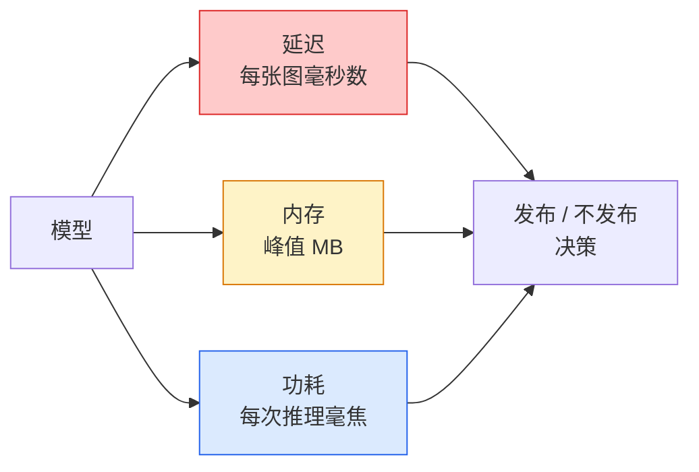

# 实时视觉——边缘部署（Real-Time Vision — Edge Deployment）

> 边缘推理（edge inference）是一门让准确率 90% 的模型在 2 GB 内存的设备上跑到 30 fps 的学问。准确率的每一个百分点，都要拿去换毫秒级的延迟。

**Type:** Learn + Build
**Languages:** Python
**Prerequisites:** Phase 4 Lesson 04 (Image Classification), Phase 10 Lesson 11 (Quantization)
**Time:** ~75 minutes

## 学习目标（Learning Objectives）

- 测量任意 PyTorch 模型的推理延迟、峰值内存和吞吐量，并读懂 FLOPs / 参数量 / 延迟之间的权衡
- 使用 PyTorch 的训练后量化（post-training quantisation）把视觉模型量化到 INT8，并验证准确率损失 < 1%
- 导出为 ONNX 并用 ONNX Runtime 或 TensorRT 编译；说出三种最常见的导出失败及其修复办法
- 说明在边缘约束下何时选择 MobileNetV3、EfficientNet-Lite、ConvNeXt-Tiny 或 MobileViT

## 问题所在（The Problem）

训练阶段的视觉模型是一头浮点怪兽：1 亿参数、每次前向传播 10 GFLOPs、2 GB 显存。这些在手机、车载信息娱乐单元、工业相机或无人机上都放不下。交付一个视觉系统，意味着把同样的预测塞进一个缩小 100 倍的预算里。

三个旋钮承担了大部分工作：模型选择（同一配方下的更小架构）、量化（用 INT8 替代 FP32）和推理运行时（ONNX Runtime、TensorRT、Core ML、TFLite）。把它们调对，就是“能在工作站上跑的 demo”与“装进 $30 摄像头模组出货的产品”之间的分水岭。

本课先建立测量纪律（测不了的东西就优化不了），再逐一走过这三个旋钮。目标不是学会每一个边缘运行时，而是知道有哪些杠杆存在，以及如何验证每个杠杆确实做到了你以为的事。

## 核心概念（The Concept）

### 三大预算（The three budgets）



- **延迟（latency）**：p50、p95、p99。只看 p50 的平均值，会掩盖对实时系统至关重要的尾部行为。
- **峰值内存（peak memory）**：设备实际经历过的最大值，而不是稳态平均值。这很重要，因为在嵌入式目标机上 OOM 是致命的。
- **功耗 / 能量（power / energy）**：电池供电设备上每次推理消耗的毫焦数。常用 CPU/GPU 利用率 * 时间来近似。

边缘决策就是从一张（模型, 延迟, 内存, 准确率）表格里做出来的。每个单元格都必须在目标设备上测量，而不是在工作站上。

### 测量纪律（Measurement discipline）

每一次边缘端性能剖析都应遵守的三条规则：

1. 测量前先用 5-10 次哑前向传播**预热**模型。冷缓存和 JIT 编译会让第一批数字不具代表性。
2. 在计时块前后用 `torch.cuda.synchronize()` **同步** GPU 工作负载。不这样做，你测到的就是内核派发，而不是内核执行。
3. 把**输入尺寸固定**为生产分辨率。224x224 上的延迟不等于 512x512 上的延迟。

### 用 FLOPs 作代理指标（FLOPs as a proxy）

FLOPs（每次推理的浮点运算数）是一个廉价、与设备无关的延迟代理指标。拿来比较架构很有用，当成绝对墙钟时间则会误导。一个 FLOPs 多 10% 的模型实际可能快 2 倍，因为它用的是对硬件友好的算子（depthwise 卷积编译效率高，大的 7x7 卷积则不然）。

规则：架构搜索用 FLOPs，部署决策用设备上的实测延迟。

### 一段话讲完量化（Quantisation in one paragraph）

用 INT8 替换 FP32 的权重和激活。模型体积缩小 4 倍，内存带宽占用减少 4 倍，在具备 INT8 内核的硬件上（所有现代移动 SoC、所有带 Tensor Core 的 NVIDIA GPU）计算量减少 2-4 倍。在视觉任务上，训练后静态量化带来的准确率损失通常只有 0.1-1 个百分点。

类型：

- **动态（dynamic）**——把权重量化为 INT8，激活仍用浮点计算。简单，加速有限。
- **静态（训练后，static）**——量化权重，并在一个小的校准集上校准激活范围。比动态量化快得多。
- **量化感知训练（quantisation-aware training, QAT）**——在训练期间模拟量化，让模型学会绕开它。准确率最好，但需要有标注数据。

对视觉任务而言，训练后静态量化用 5% 的投入换来 95% 的收益。只有当 PTQ 的准确率损失不可接受时才动用 QAT。

### 剪枝与蒸馏（Pruning and distillation）

- **剪枝（pruning）**——移除不重要的权重（按幅值）或通道（结构化）。在过参数化模型上效果好；对已经很紧凑的架构用处不大。
- **蒸馏（distillation）**——训练一个小模型去模仿大模型的 logits。通常能找回模型缩小后损失的大部分准确率。生产级边缘模型的标准做法。

### 推理运行时（The inference runtimes）

- **PyTorch eager**——慢，不适合部署。只在开发时用。
- **TorchScript**——遗留方案。已被 `torch.compile` 和 ONNX 导出取代。
- **ONNX Runtime**——中立运行时。CPU、CUDA、CoreML、TensorRT、OpenVINO 都有对应的 ONNX provider。从这里起步。
- **TensorRT**——NVIDIA 的编译器。在 NVIDIA GPU（工作站和 Jetson）上延迟最优。可与 ONNX Runtime 集成，也可独立使用。
- **Core ML**——Apple 面向 iOS/macOS 的运行时。需要 `.mlmodel` 或 `.mlpackage`。
- **TFLite**——Google 面向 Android/ARM 的运行时。需要 `.tflite`。
- **OpenVINO**——Intel 面向 CPU/VPU 的运行时。需要 `.xml` + `.bin`。

实践路径：PyTorch -> ONNX -> 按目标挑选运行时。ONNX 是通用语。

### 边缘架构选择器（Edge architecture picker）

| 预算 | 模型 | 理由 |
|------|------|------|
| < 3M 参数 | MobileNetV3-Small | 到处都能编译，是很好的基线 |
| 3-10M | EfficientNet-Lite-B0 | TFLite 上单位参数准确率最高 |
| 10-20M | ConvNeXt-Tiny | 单位参数准确率最高，对 CPU 友好 |
| 20-30M | MobileViT-S 或 EfficientViT | 兼具 Transformer 结构与 ImageNet 级准确率 |
| 30-80M | Swin-V2-Tiny | 前提是技术栈支持窗口注意力（window attention） |

除非有明确理由，否则把以上所有模型都量化到 INT8。

```figure
cnn-param-count
```

## 动手构建（Build It）

### 第 1 步：正确测量延迟（Step 1: Measure latency correctly）

```python
import time
import torch

def measure_latency(model, input_shape, device="cpu", warmup=10, iters=50):
    model = model.to(device).eval()
    x = torch.randn(input_shape, device=device)
    with torch.no_grad():
        for _ in range(warmup):
            model(x)
        if device == "cuda":
            torch.cuda.synchronize()
        times = []
        for _ in range(iters):
            if device == "cuda":
                torch.cuda.synchronize()
            t0 = time.perf_counter()
            model(x)
            if device == "cuda":
                torch.cuda.synchronize()
            times.append((time.perf_counter() - t0) * 1000)
    times.sort()
    return {
        "p50_ms": times[len(times) // 2],
        "p95_ms": times[int(len(times) * 0.95)],
        "p99_ms": times[int(len(times) * 0.99)],
        "mean_ms": sum(times) / len(times),
    }
```

预热、同步、使用 `time.perf_counter()`。报告分位数，而不只是平均值。

### 第 2 步：参数量与 FLOP 统计（Step 2: Parameter and FLOP counts）

```python
def parameter_count(model):
    return sum(p.numel() for p in model.parameters())

def flops_estimate(model, input_shape):
    """
    Rough FLOP count for a conv/linear-only model. For production use `fvcore` or `ptflops`.
    """
    total = 0
    def conv_hook(m, inp, out):
        nonlocal total
        c_out, c_in, kh, kw = m.weight.shape
        h, w = out.shape[-2:]
        total += 2 * c_in * c_out * kh * kw * h * w
    def linear_hook(m, inp, out):
        nonlocal total
        total += 2 * m.in_features * m.out_features
    hooks = []
    for m in model.modules():
        if isinstance(m, torch.nn.Conv2d):
            hooks.append(m.register_forward_hook(conv_hook))
        elif isinstance(m, torch.nn.Linear):
            hooks.append(m.register_forward_hook(linear_hook))
    model.eval()
    with torch.no_grad():
        model(torch.randn(input_shape))
    for h in hooks:
        h.remove()
    return total
```

真实项目请使用 `fvcore.nn.FlopCountAnalysis` 或 `ptflops`；它们能正确处理每一种模块类型。

### 第 3 步：训练后静态量化（Step 3: Post-training static quantisation）

```python
def quantise_ptq(model, calibration_loader, backend="x86"):
    import torch.ao.quantization as tq
    model = model.eval().cpu()
    model.qconfig = tq.get_default_qconfig(backend)
    tq.prepare(model, inplace=True)
    with torch.no_grad():
        for x, _ in calibration_loader:
            model(x)
    tq.convert(model, inplace=True)
    return model
```

三个步骤：配置，prepare（插入观察器），用真实数据校准，convert（融合 + 量化）。前提是模型已完成融合（`Conv -> BN -> ReLU` -> `ConvBnReLU`），这由 `torch.ao.quantization.fuse_modules` 负责。

### 第 4 步：导出为 ONNX（Step 4: Export to ONNX）

```python
def export_onnx(model, sample_input, path="model.onnx"):
    model = model.eval()
    torch.onnx.export(
        model,
        sample_input,
        path,
        input_names=["input"],
        output_names=["output"],
        dynamic_axes={"input": {0: "batch"}, "output": {0: "batch"}},
        opset_version=17,
    )
    return path
```

`opset_version=17` 是 2026 年的安全默认值。`dynamic_axes` 让你可以用任意 batch size 运行这个 ONNX 模型。

### 第 5 步：基准测试并比较各种方案（Step 5: Benchmark and compare regimes）

```python
import torch.nn as nn
from torchvision.models import mobilenet_v3_small

def compare_regimes():
    model = mobilenet_v3_small(weights=None, num_classes=10)
    params = parameter_count(model)
    flops = flops_estimate(model, (1, 3, 224, 224))
    lat_fp32 = measure_latency(model, (1, 3, 224, 224), device="cpu")
    print(f"FP32 MobileNetV3-Small: {params:,} params  {flops/1e9:.2f} GFLOPs  "
          f"p50={lat_fp32['p50_ms']:.2f}ms  p95={lat_fp32['p95_ms']:.2f}ms")
```

对 `resnet50`、`efficientnet_v2_s` 和 `convnext_tiny` 跑同一个函数，你就得到了部署决策所需的对比表。

## 实际使用（Use It）

生产技术栈最终都收敛到三条路径之一：

- **Web / 无服务器（serverless）**：PyTorch -> ONNX -> ONNX Runtime（CPU 或 CUDA provider）。最省事，对大多数场景足够。
- **NVIDIA 边缘端（Jetson、GPU 服务器）**：PyTorch -> ONNX -> TensorRT。延迟最优，工程量也最大。
- **移动端**：PyTorch -> ONNX -> Core ML（iOS）或 TFLite（Android）。导出前先量化。

测量方面，`torch-tb-profiler`、`nvprof` / `nsys` 以及 macOS 上的 Instruments 能给出逐层分解。`benchmark_app`（OpenVINO）和 `trtexec`（TensorRT）则提供独立的 CLI 数字。

## 交付成果（Ship It）

本课产出：

- `outputs/prompt-edge-deployment-planner.md` —— 一个提示词，根据目标设备和延迟 SLA 挑选骨干网络、量化策略和运行时。
- `outputs/skill-latency-profiler.md` —— 一个技能，编写带预热、同步、分位数和内存跟踪的完整延迟基准测试脚本。

## 练习（Exercises）

1. **（简单）** 在 CPU 上以 224x224 测量 `resnet18`、`mobilenet_v3_small`、`efficientnet_v2_s` 和 `convnext_tiny` 的 p50 延迟。报告表格，并指出哪个架构的每毫秒准确率最高。
2. **（中等）** 对 `mobilenet_v3_small` 应用训练后静态量化。报告 FP32 与 INT8 的延迟对比，以及在 CIFAR-10 或类似数据集留出子集上的准确率损失。
3. **（困难）** 把 `convnext_tiny` 导出为 ONNX，用 `onnxruntime` 的 `CPUExecutionProvider` 运行，并与 PyTorch eager 基线比较延迟。找出 ONNX Runtime 开始更快的第一层并解释原因。

## 关键术语（Key Terms）

| 术语 | 人们常说 | 实际含义 |
|------|----------|----------|
| 延迟（Latency） | “多快” | 从输入到输出的时间；用 p50/p95/p99 分位数衡量，而不是平均值 |
| FLOPs | “模型大小” | 每次前向传播的浮点运算数；计算成本的粗略代理 |
| INT8 量化 | “8 位” | 用 8 位整数替换 FP32 权重/激活；体积约缩小 4 倍，速度提升 2-4 倍 |
| PTQ | “训练后量化” | 不重新训练就量化训练好的模型；简单，通常够用 |
| QAT | “量化感知训练” | 在训练期间模拟量化；准确率最好，需要有标注数据 |
| ONNX | “中立格式” | 所有主流推理运行时都支持的模型交换格式 |
| TensorRT | “NVIDIA 编译器” | 把 ONNX 编译成面向 NVIDIA GPU 的优化引擎 |
| 蒸馏（Distillation） | “教师 -> 学生” | 训练小模型模仿大模型的 logits；找回大部分损失的准确率 |

## 延伸阅读（Further Reading）

- [EfficientNet (Tan & Le, 2019)](https://arxiv.org/abs/1905.11946) —— 面向高效架构的复合缩放
- [MobileNetV3 (Howard et al., 2019)](https://arxiv.org/abs/1905.02244) —— 移动优先的架构，带 h-swish 与 squeeze-excite
- [A Practical Guide to TensorRT Optimization (NVIDIA)](https://developer.nvidia.com/blog/accelerating-model-inference-with-tensorrt-tips-and-best-practices-for-pytorch-users/) —— 如何真正拿到论文里的吞吐量数字
- [ONNX Runtime docs](https://onnxruntime.ai/docs/) —— 量化、图优化、provider 选择
