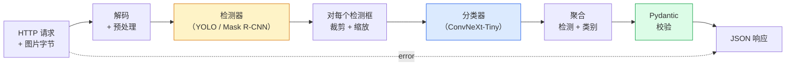

# 构建完整视觉流水线——综合实战（Build a Complete Vision Pipeline — Capstone）

> 生产级视觉系统是一条由数据契约缝合起来的模型与规则链条。各个部件本阶段都已备齐；综合实战把它们端到端地串在一起。

**Type:** Build
**Languages:** Python
**Prerequisites:** Phase 4 Lessons 01-15
**Time:** ~120 minutes

## 学习目标（Learning Objectives）

- 设计一条生产级视觉流水线：检测目标、分类目标、输出结构化 JSON——并处理每一条失败路径
- 把检测器（Mask R-CNN 或 YOLO）、分类器（ConvNeXt-Tiny）和数据契约（Pydantic）接进同一个服务
- 对端到端流水线做基准测试，找出第一个瓶颈（通常是预处理，其次才是检测器）
- 交付一个最小 FastAPI 服务：接收图片上传、运行流水线、返回带分类结果的检测

## 问题所在（The Problem）

单个视觉模型有用；视觉产品则是它们的链条。零售货架盘点是检测器加商品分类器加价格 OCR 流水线。自动驾驶是 2D 检测器加 3D 检测器加分割器加跟踪器加规划器。医疗预筛是分割器加区域分类器加临床医生界面。

把这些链条接起来，才是区分 ML 原型与产品的地方。模型之间的每个接口都是新的 bug 藏身处。每一次坐标变换、每一次归一化、每一次掩码缩放，都是静默失败的可疑点。流水线的强度取决于它最弱的那个接口。

本综合实战搭建的是最小可行流水线：检测 + 分类 + 结构化输出 + 一个服务层。第 4 阶段的其他内容都能插进这个骨架：把 Mask R-CNN 换成 YOLOv8、加一个 OCR 头、加一条分割分支、加一个跟踪器。架构保持稳定，部件可插拔。

## 核心概念（The Concept）

### 流水线（The pipeline）



七个阶段。两个模型阶段开销大；其余五个阶段才是 bug 的聚集地。

### 用 Pydantic 做数据契约（Data contracts with Pydantic）

每个模型边界都变成一个带类型的对象。这会把静默失败变成大声报错。

```
Detection(
    box: tuple[float, float, float, float],   # (x1, y1, x2, y2), absolute pixels
    score: float,                              # [0, 1]
    class_id: int,                             # from detector's label map
    mask: Optional[list[list[int]]],           # RLE-encoded if present
)

PipelineResult(
    image_id: str,
    detections: list[Detection],
    classifications: list[Classification],
    inference_ms: float,
)
```

当检测器返回的框是 `(cx, cy, w, h)` 而不是 `(x1, y1, x2, y2)` 时，Pydantic 的校验会在边界处直接失败，你立刻就能发现，而不必去调试一个静默返回空区域的下游裁剪。

### 延迟去哪了（Where latency goes）

几乎每条视觉流水线都成立的三个事实：

1. **预处理常常是最大的单一耗时块。**解码 JPEG、转换色彩空间、缩放——这些都受限于 CPU，而且最容易被忘记。
2. **检测器主导 GPU 时间。**GPU 时间的 70-90% 花在检测前向传播上。
3. **后处理（NMS、RLE 编解码）在 GPU 上便宜，在 CPU 上昂贵。**一定要在真实目标上剖析。

知道时间花在哪，才能把优化变成一份排好优先级的清单。

### 失败模式（Failure modes）

- **空检测**——返回空列表，不要崩溃。记日志。
- **越界框**——裁剪前先钳制到图像尺寸内。
- **过小的裁剪**——小于分类器最小输入的框跳过分类。
- **损坏的上传**——返回 400 加具体错误码，而不是 500。
- **模型加载失败**——在服务启动时失败，而不是在第一个请求时。

生产级流水线会逐项处理上述情况，而不是写一个掩盖失败的通用 `try/except`。每种失败都有具名的错误码和对应的响应。

### 批处理（Batching）

生产级服务要同时服务多个客户端。跨请求批量执行检测和分类能把吞吐量乘上去。代价：等待批次凑满带来的额外延迟。典型配置：收集请求至多 20ms，拼成一批，处理，再分发响应。`torchserve` 和 `triton` 原生支持这一点；负载可预测的小服务则自己写一个微批处理器。

```figure
v4-vision-pipeline
```

## 动手构建（Build It）

### 第 1 步：数据契约（Step 1: Data contracts）

```python
from pydantic import BaseModel, Field
from typing import List, Optional, Tuple

class Detection(BaseModel):
    box: Tuple[float, float, float, float]
    score: float = Field(ge=0, le=1)
    class_id: int = Field(ge=0)
    mask_rle: Optional[str] = None


class Classification(BaseModel):
    detection_index: int
    class_id: int
    class_name: str
    score: float = Field(ge=0, le=1)


class PipelineResult(BaseModel):
    image_id: str
    detections: List[Detection]
    classifications: List[Classification]
    inference_ms: float
```

五秒钟写下的代码，能在任何正经流水线上省出一个小时的调试时间。

### 第 2 步：一个最小的 Pipeline 类（Step 2: A minimal Pipeline class）

```python
import time
import numpy as np
import torch
from PIL import Image

class VisionPipeline:
    def __init__(self, detector, classifier, class_names,
                 device="cpu", min_crop=32):
        self.detector = detector.to(device).eval()
        self.classifier = classifier.to(device).eval()
        self.class_names = class_names
        self.device = device
        self.min_crop = min_crop

    def preprocess(self, image):
        """
        image: PIL.Image or np.ndarray (H, W, 3) uint8
        returns: CHW float tensor on device
        """
        if isinstance(image, Image.Image):
            image = np.asarray(image.convert("RGB"))
        tensor = torch.from_numpy(image).permute(2, 0, 1).float() / 255.0
        return tensor.to(self.device)

    @torch.no_grad()
    def detect(self, image_tensor):
        return self.detector([image_tensor])[0]

    @torch.no_grad()
    def classify(self, crops):
        if len(crops) == 0:
            return []
        batch = torch.stack(crops).to(self.device)
        logits = self.classifier(batch)
        probs = logits.softmax(-1)
        scores, cls = probs.max(-1)
        return list(zip(cls.tolist(), scores.tolist()))

    def run(self, image, image_id="anonymous"):
        t0 = time.perf_counter()
        tensor = self.preprocess(image)
        det = self.detect(tensor)

        crops = []
        detections = []
        valid_indices = []
        for i, (box, score, cls) in enumerate(zip(det["boxes"], det["scores"], det["labels"])):
            x1, y1, x2, y2 = [max(0, int(b)) for b in box.tolist()]
            x2 = min(x2, tensor.shape[-1])
            y2 = min(y2, tensor.shape[-2])
            detections.append(Detection(
                box=(x1, y1, x2, y2),
                score=float(score),
                class_id=int(cls),
            ))
            if (x2 - x1) < self.min_crop or (y2 - y1) < self.min_crop:
                continue
            crop = tensor[:, y1:y2, x1:x2]
            crop = torch.nn.functional.interpolate(
                crop.unsqueeze(0),
                size=(224, 224),
                mode="bilinear",
                align_corners=False,
            )[0]
            crops.append(crop)
            valid_indices.append(i)

        class_preds = self.classify(crops)

        classifications = []
        for valid_idx, (cls_id, cls_score) in zip(valid_indices, class_preds):
            classifications.append(Classification(
                detection_index=valid_idx,
                class_id=int(cls_id),
                class_name=self.class_names[cls_id],
                score=float(cls_score),
            ))

        return PipelineResult(
            image_id=image_id,
            detections=detections,
            classifications=classifications,
            inference_ms=(time.perf_counter() - t0) * 1000,
        )
```

每个接口都有类型。每条失败路径都有具体的处理决策。

### 第 3 步：接上检测器与分类器（Step 3: Wire a detector and a classifier）

```python
from torchvision.models.detection import maskrcnn_resnet50_fpn_v2
from torchvision.models import convnext_tiny

# Use ImageNet-pretrained weights for a realistic pipeline without training
detector = maskrcnn_resnet50_fpn_v2(weights="DEFAULT")
classifier = convnext_tiny(weights="DEFAULT")
class_names = [f"imagenet_class_{i}" for i in range(1000)]

pipe = VisionPipeline(detector, classifier, class_names)

# Smoke test with a synthetic image
test_image = (np.random.rand(400, 600, 3) * 255).astype(np.uint8)
result = pipe.run(test_image, image_id="demo")
print(result.model_dump_json(indent=2)[:500])
```

### 第 4 步：FastAPI 服务（Step 4: FastAPI service）

```python
from fastapi import FastAPI, UploadFile, HTTPException
from io import BytesIO

app = FastAPI()
pipe = None  # initialised on startup

@app.on_event("startup")
def load():
    global pipe
    detector = maskrcnn_resnet50_fpn_v2(weights="DEFAULT").eval()
    classifier = convnext_tiny(weights="DEFAULT").eval()
    pipe = VisionPipeline(detector, classifier, class_names=[f"c{i}" for i in range(1000)])

@app.post("/detect")
async def detect_endpoint(file: UploadFile):
    if file.content_type not in {"image/jpeg", "image/png", "image/webp"}:
        raise HTTPException(status_code=400, detail="unsupported image type")
    data = await file.read()
    try:
        img = Image.open(BytesIO(data)).convert("RGB")
    except Exception:
        raise HTTPException(status_code=400, detail="cannot decode image")
    result = pipe.run(img, image_id=file.filename or "upload")
    return result.model_dump()
```

用 `uvicorn main:app --host 0.0.0.0 --port 8000` 启动。用 `curl -F 'file=@dog.jpg' http://localhost:8000/detect` 测试。

### 第 5 步：对流水线做基准测试（Step 5: Benchmark the pipeline）

```python
import time

def benchmark(pipe, num_runs=20, image_size=(400, 600)):
    img = (np.random.rand(*image_size, 3) * 255).astype(np.uint8)
    pipe.run(img)  # warm up

    stages = {"preprocess": [], "detect": [], "classify": [], "total": []}
    for _ in range(num_runs):
        t0 = time.perf_counter()
        tensor = pipe.preprocess(img)
        t1 = time.perf_counter()
        det = pipe.detect(tensor)
        t2 = time.perf_counter()
        crops = []
        for box in det["boxes"]:
            x1, y1, x2, y2 = [max(0, int(b)) for b in box.tolist()]
            x2 = min(x2, tensor.shape[-1])
            y2 = min(y2, tensor.shape[-2])
            if (x2 - x1) >= pipe.min_crop and (y2 - y1) >= pipe.min_crop:
                crop = tensor[:, y1:y2, x1:x2]
                crop = torch.nn.functional.interpolate(
                    crop.unsqueeze(0), size=(224, 224), mode="bilinear", align_corners=False
                )[0]
                crops.append(crop)
        pipe.classify(crops)
        t3 = time.perf_counter()
        stages["preprocess"].append((t1 - t0) * 1000)
        stages["detect"].append((t2 - t1) * 1000)
        stages["classify"].append((t3 - t2) * 1000)
        stages["total"].append((t3 - t0) * 1000)

    for stage, times in stages.items():
        times.sort()
        print(f"{stage:12s}  p50={times[len(times)//2]:7.1f} ms  p95={times[int(len(times)*0.95)]:7.1f} ms")
```

CPU 上的典型输出：预处理 ~3 ms，检测 300-500 ms，分类 20-40 ms，总计 350-550 ms。在 GPU 上，检测只要 20-40 ms，预处理 + 分类在相对占比上开始变得更值得关注。

## 实际使用（Use It）

生产级模板都收敛到同一结构，另加上：

- **模型版本管理**——在响应里始终记录模型名称和权重哈希。
- **每请求 trace ID**——为每个请求记录每个阶段的耗时，慢响应就能与具体阶段关联起来。
- **降级路径**——分类器超时时，返回不带分类结果的检测，而不是让整个请求失败。
- **安全过滤**——NSFW / PII 过滤器在分类之后、响应离开服务之前运行。
- **批量端点**——一个接受图片 URL 列表做批量处理的 `/detect_batch`。

生产级部署方面，`torchserve`、`Triton Inference Server` 和 `BentoML` 开箱即用地提供批处理、版本管理、指标和健康检查。直接跑 `FastAPI` 对原型和小规模产品来说没问题。

## 交付成果（Ship It）

本课产出：

- `outputs/prompt-vision-service-shape-reviewer.md` —— 一个提示词，审查视觉服务代码里的契约/响应结构违规，并指出第一个致命 bug。
- `outputs/skill-pipeline-budget-planner.md` —— 一个技能，给定目标延迟和吞吐量，为每个流水线阶段分配时间预算，并标出哪个阶段会最先超支。

## 练习（Exercises）

1. **（简单）** 在任意开放数据集的 10 张图片上运行流水线。报告每个阶段的平均耗时，以及每张图片检测框数量的分布。
2. **（中等）** 给 `Detection` 增加一个掩码输出字段并编码为 RLE。验证即使一张图有 10 个目标，JSON 也保持在 1MB 以内。
3. **（困难）** 在分类器前面加一个微批处理器：收集裁剪至多 10 ms，用一次 GPU 调用全部分类，再按请求返回结果。测量每秒 5 个并发请求时的吞吐量提升和新增的延迟。

## 关键术语（Key Terms）

| 术语 | 人们常说 | 实际含义 |
|------|----------|----------|
| 流水线（Pipeline） | “那套系统” | 预处理、推理、后处理步骤的有序链条，相邻两步之间都有类型化接口 |
| 数据契约（Data contract） | “那份 schema” | 每个阶段的输入输出都必须符合的 Pydantic / dataclass 定义；在边界处捕获集成 bug |
| 预处理（Preprocessing） | “模型之前” | 解码、色彩转换、缩放、归一化；通常是最大的 CPU 时间黑洞 |
| 后处理（Postprocessing） | “模型之后” | NMS、掩码缩放、阈值、RLE 编码；GPU 上便宜，CPU 上昂贵 |
| 微批处理器（Microbatcher） | “先收集再前向” | 等待固定时间窗口聚合多个请求、然后跑一次批量前向的聚合器 |
| Trace ID | “请求 ID” | 每个阶段都会记录的每请求标识符，便于端到端追踪慢请求 |
| 失败码（Failure code） | “具名错误” | 每类失败对应具体错误码，而不是笼统的 500；让客户端可以写重试逻辑 |
| 健康检查（Health check） | “就绪探针” | 报告服务能否应答的廉价端点；负载均衡器依赖它 |

## 延伸阅读（Further Reading）

- [Full Stack Deep Learning — Deploying Models](https://fullstackdeeplearning.com/course/2022/lecture-5-deployment/) —— 生产级 ML 部署的经典综述
- [BentoML docs](https://docs.bentoml.com) —— 自带批处理、版本管理与指标的服务框架
- [torchserve docs](https://pytorch.org/serve/) —— PyTorch 官方服务库
- [NVIDIA Triton Inference Server](https://developer.nvidia.com/triton-inference-server) —— 支持批处理与多模型的高吞吐推理服务
