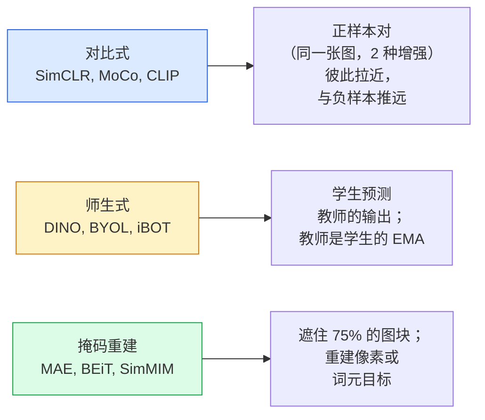

# 自监督视觉——SimCLR、DINO、MAE（Self-Supervised Vision — SimCLR, DINO, MAE）

> 标注是监督视觉的瓶颈。自监督预训练（self-supervised pretraining）摆脱了它：从 1 亿张无标注图片里学视觉特征，再用 1 万张有标注图片微调。

**Type:** Learn + Build
**Languages:** Python
**Prerequisites:** Phase 4 Lesson 04 (Image Classification), Phase 4 Lesson 14 (ViT)
**Time:** ~75 minutes

## 学习目标（Learning Objectives）

- 梳理三大自监督家族——对比式（SimCLR）、师生式（DINO）、掩码重建（MAE）——并说出各自在优化什么
- 从零实现 InfoNCE 损失，并解释为什么 batch 为 512 能奏效而 batch 为 32 会失败
- 解释 MAE 的 75% 掩码比例为什么不是随意定的，以及它与 BERT 在文本上用 15% 的差别
- 使用 DINOv2 或 MAE 的 ImageNet 检查点做线性探测（linear probing）与零样本检索

## 问题所在（The Problem）

监督式 ImageNet 有 130 万张标注图片，标注成本估计约 $10M。医疗和工业数据集更小，标注也更贵。每个视觉团队都在问：能不能先在便宜的无标注数据上预训练——YouTube 视频帧、网络爬取、网络摄像头画面、卫星扫描——然后在一小套有标注数据上微调？

自监督学习就是答案。在 LAION 或 JFT 上训练的现代自监督 ViT，微调后能达到甚至超过监督式 ImageNet 的准确率；迁移到下游任务（检测、分割、深度估计）时也优于监督预训练。DINOv2（Meta，2023）和 MAE（Meta，2022）是目前可迁移视觉特征的生产默认选择。

概念上的转变在于：代理任务（pretext task）——模型被训练去做的那件事——不必就是下游任务。关键在于它迫使模型学到有用的特征。预测灰度图的颜色、旋转图片再让模型分类旋转角、遮住图块再重建——这些都有效。能规模化的是三种做法：对比学习（contrastive learning）、师生蒸馏（teacher-student distillation）和掩码重建（masked reconstruction）。

## 核心概念（The Concept）

### 三大家族（Three families）



### 对比学习（Contrastive learning (SimCLR)）

取一张图片，施加两次随机数据增强，得到两个视图。把两个视图都送进同一个编码器加投影头。最小化一个损失函数，它要求“这两个嵌入应当接近”，同时“这个嵌入应当远离批次中其他所有图片的嵌入”。

```
Loss for positive pair (z_i, z_j) among 2N views per batch:

   L_ij = -log( exp(sim(z_i, z_j) / tau) / sum_k in batch \ {i} exp(sim(z_i, z_k) / tau) )

sim = cosine similarity
tau = temperature (0.1 standard)
```

这就是 InfoNCE 损失。它要求每个正样本配很多负样本，所以 batch size 很重要——SimCLR 需要 512-8192。MoCo 引入了由过去批次组成的动量队列，把负样本数量与 batch size 解耦。

### 师生式（Teacher-student (DINO)）

两个同架构网络：学生和教师。教师是学生权重的指数移动平均（EMA）。两者都看同一张图的增强视图。训练学生的输出去匹配教师的输出——没有显式负样本。

```
loss = CE( student_output(view_1),  teacher_output(view_2) )
     + CE( student_output(view_2),  teacher_output(view_1) )

teacher_weights = m * teacher_weights + (1 - m) * student_weights   (m ≈ 0.996)
```

为什么它不会塌缩成“预测一个常数”：教师的输出会被中心化（减去每个维度的均值）并锐化（除以一个较小的温度）。中心化防止某个维度一家独大；锐化防止输出塌缩成均匀分布。

DINOv2 放大的正是 DINO，用 1.42 亿张精选图片训练。所得特征是当前零样本视觉检索与密集预测的 SOTA。

### 掩码重建（Masked reconstruction (MAE)）

把 ViT 输入的 75% 图块遮住。只让可见的 25% 通过编码器。一个小解码器接收编码器的输出加上位于被遮位置的掩码词元（mask token），并被训练去重建被遮图块的像素。

```
Encoder:  visible 25% of patches -> features
Decoder:  features + mask tokens at masked positions -> reconstructed pixels
Loss:     MSE between reconstructed and original pixels on masked patches only
```

让 MAE 成立的关键设计选择：

- **75% 掩码比例**——很高。迫使编码器学习语义特征；只重建 25% 会近乎送分（相邻像素相关性太强，CNN 轻松搞定）。
- **非对称的编码器/解码器**——大的 ViT 编码器只看可见图块；一个小解码器（8 层、512 维）负责重建。比朴素的 BEiT 预训练快 3 倍。
- **像素空间的重建目标**——比 BEiT 的词元化目标更简单，在 ViT 上效果也更好。

预训练结束后，丢掉解码器。编码器就是特征提取器。

### 为什么是 75% 而不是 15%（Why 75% and not 15%）

BERT 遮 15% 的词元，MAE 遮 75%。差别在于信息密度。

- 自然语言每个词元的熵很高。预测 15% 的词元依然困难，因为每个被遮位置都有许多合理的补全。
- 图像图块的熵很低——未遮住的邻域往往几乎能精确确定被遮图块的像素。要让预测必须依赖语义理解，就得遮得足够狠。

75% 已经高到简单的空间外推解不了这个任务；编码器必须真正表示图像内容。

### 线性探测评估（Linear-probe evaluation）

自监督预训练之后，标准评估是**线性探测（linear probe）**：冻结编码器，在其上仅训练一个线性分类器（用 ImageNet 标签）。报告 top-1 准确率。

- SimCLR ResNet-50：~71%（2020）
- DINO ViT-S/16：~77%（2021）
- MAE ViT-L/16：~76%（2022）
- DINOv2 ViT-g/14：~86%（2023）

线性探测是对特征质量的纯度量；微调通常再涨 2-5 个点，但也会混入重训分类头带来的效果。

```figure
data-augmentation
```

## 动手构建（Build It）

### 第 1 步：双视图增强流水线（Step 1: Two-view augmentation pipeline）

```python
import torch
import torchvision.transforms as T

two_view_train = lambda: T.Compose([
    T.RandomResizedCrop(96, scale=(0.2, 1.0)),
    T.RandomHorizontalFlip(),
    T.ColorJitter(0.4, 0.4, 0.4, 0.1),
    T.RandomGrayscale(p=0.2),
    T.ToTensor(),
])


class TwoViewDataset(torch.utils.data.Dataset):
    def __init__(self, base):
        self.base = base
        self.aug = two_view_train()

    def __len__(self):
        return len(self.base)

    def __getitem__(self, i):
        img, _ = self.base[i]
        v1 = self.aug(img)
        v2 = self.aug(img)
        return v1, v2
```

每个 __getitem__ 返回同一张图片的两个增强视图；标签并不需要。

### 第 2 步：InfoNCE 损失（Step 2: InfoNCE loss）

```python
import torch.nn.functional as F

def info_nce(z1, z2, tau=0.1):
    """
    z1, z2: (N, D) L2-normalised embeddings of paired views
    """
    N, D = z1.shape
    z = torch.cat([z1, z2], dim=0)  # (2N, D)
    sim = z @ z.T / tau              # (2N, 2N)

    mask = torch.eye(2 * N, dtype=torch.bool, device=z.device)
    sim = sim.masked_fill(mask, float("-inf"))

    targets = torch.cat([torch.arange(N, 2 * N), torch.arange(0, N)]).to(z.device)
    return F.cross_entropy(sim, targets)
```

调用前先对嵌入做 L2 归一化。`tau=0.1` 是 SimCLR 的默认值；调低会让损失更尖锐，并需要更多负样本。

### 第 3 步：InfoNCE 合理性检查（Step 3: Sanity check InfoNCE）

```python
z1 = F.normalize(torch.randn(16, 32), dim=-1)
z2 = z1.clone()
loss_same = info_nce(z1, z2, tau=0.1).item()
z2_random = F.normalize(torch.randn(16, 32), dim=-1)
loss_random = info_nce(z1, z2_random, tau=0.1).item()
print(f"InfoNCE with identical pairs:  {loss_same:.3f}")
print(f"InfoNCE with random pairs:     {loss_random:.3f}")
```

完全相同的配对应给出很低的损失（大 batch 加低温度时接近 0）。随机配对在 16 对的 batch 下应给出 log(2N-1) = ~log(31) = ~3.4。

### 第 4 步：MAE 式掩码（Step 4: MAE-style masking）

```python
def random_mask_indices(num_patches, mask_ratio=0.75, seed=0):
    g = torch.Generator().manual_seed(seed)
    n_keep = int(num_patches * (1 - mask_ratio))
    perm = torch.randperm(num_patches, generator=g)
    visible = perm[:n_keep]
    masked = perm[n_keep:]
    return visible.sort().values, masked.sort().values


num_patches = 196
visible, masked = random_mask_indices(num_patches, mask_ratio=0.75)
print(f"visible: {len(visible)} / {num_patches}")
print(f"masked:  {len(masked)} / {num_patches}")
```

简单、快速，而且对给定种子是确定性的。真实的 MAE 实现会把它放进 batch，并为每个样本保留各自的掩码。

## 实际使用（Use It）

DINOv2 是 2026 年的生产标准：

```python
import torch
from transformers import AutoImageProcessor, AutoModel

processor = AutoImageProcessor.from_pretrained("facebook/dinov2-base")
model = AutoModel.from_pretrained("facebook/dinov2-base")
model.eval()

# Per-image embeddings for zero-shot retrieval
with torch.no_grad():
    inputs = processor(images=[pil_image], return_tensors="pt")
    outputs = model(**inputs)
    embedding = outputs.last_hidden_state[:, 0]  # CLS token
```

得到的 768 维嵌入是现代图像检索、密集对应与零样本迁移流水线的基石。下游任务的微调很少需要超出一个线性头。

图像-文本嵌入的对应物是 SigLIP 或 OpenCLIP；要做 MAE 式微调，`timm` 仓库收录了每一个 MAE 检查点。

## 交付成果（Ship It）

本课产出：

- `outputs/prompt-ssl-pretraining-picker.md` —— 一个提示词，根据数据集规模、算力和下游任务在 SimCLR / MAE / DINOv2 之间做选择。
- `outputs/skill-linear-probe-runner.md` —— 一个技能，为任意冻结编码器 + 有标注数据集编写线性探测评估。

## 练习（Exercises）

1. **（简单）** 验证：对对齐良好的嵌入，降低温度会让 InfoNCE 损失下降；而对随机嵌入，降低温度会让损失上升。画出 `tau in [0.05, 0.1, 0.2, 0.5]` 与损失的关系图。
2. **（中等）** 实现 DINO 式的中心缓冲。证明没有中心化时，学生会在几个 epoch 内塌缩成一个常向量。
3. **（困难）** 用第 10 课的 TinyUNet 当骨干，在 CIFAR-100 上训练 MAE。报告 10、50、200 epoch 时的线性探测准确率。证明 MAE 预训练的线性探测在同一个 1,000 张图片子集上胜过从零开始的监督式线性探测。

## 关键术语（Key Terms）

| 术语 | 人们常说 | 实际含义 |
|------|----------|----------|
| 自监督（Self-supervised） | “无标注” | 一种从无标注数据产生有用表示的代理任务 |
| 代理任务（Pretext task） | “那个假任务” | 自监督训练阶段使用的目标（重建图块、匹配视图）；预训练结束后即丢弃 |
| 线性探测（Linear probe） | “冻结编码器 + 线性头” | 标准 SSL 评估：只在冻结特征之上训练一个线性分类器 |
| InfoNCE | “对比损失” | 对余弦相似度做 softmax；正样本对是目标类，其余全是负样本 |
| EMA 教师（EMA teacher） | “移动平均教师” | 权重是学生权重指数移动平均的教师；BYOL、MoCo、DINO 都在用 |
| 掩码比例（Mask ratio） | “被遮图块的百分比” | MAE 期间被遮住的图块比例；视觉 75%，文本 15% |
| 表示塌缩（Representation collapse） | “输出常数” | 编码器对所有输入都输出同一个常向量的 SSL 失败；用中心化、锐化或负样本预防 |
| DINOv2 | “生产级 SSL 骨干” | Meta 2023 年的自监督 ViT；2026 年最强的通用图像特征 |

## 延伸阅读（Further Reading）

- [SimCLR (Chen et al., 2020)](https://arxiv.org/abs/2002.05709) —— 对比学习的参考文献
- [DINO (Caron et al., 2021)](https://arxiv.org/abs/2104.14294) —— 带动量、中心化、锐化的师生式方法
- [MAE (He et al., 2022)](https://arxiv.org/abs/2111.06377) —— 面向 ViT 的掩码自编码器预训练
- [DINOv2 (Oquab et al., 2023)](https://arxiv.org/abs/2304.07193) —— 把自监督 ViT 扩展到生产级特征
