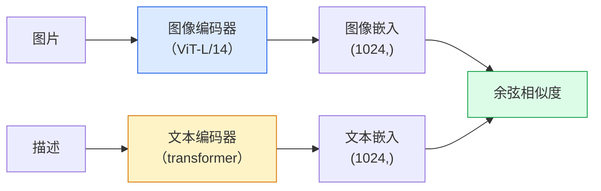

# 开放词汇视觉——CLIP（Open-Vocabulary Vision — CLIP）

> 把图像编码器和文本编码器放在一起训练，让匹配的（图片, 描述）对落进共享空间中的同一个点。全部诀窍就在这里。

**Type:** Build + Use
**Languages:** Python
**Prerequisites:** Phase 4 Lesson 14 (ViT), Phase 4 Lesson 17 (Self-Supervised)
**Time:** ~45 minutes

## 学习目标（Learning Objectives）

- 解释 CLIP 的双塔（two-tower）架构与对比训练目标
- 用预训练 CLIP（或 SigLIP）做零样本分类，不需要任何任务特定训练
- 从零实现零样本分类：编码类别提示、计算余弦相似度、取 argmax
- 分清 CLIP、SigLIP、OpenCLIP 和 LLaVA/LLaMA-vision 模型——2026 年各自用在哪

## 问题所在（The Problem）

传统分类器是封闭词汇表的：一个 1000 类的 ImageNet 模型只能预测这 1000 个标签。每加一个新类别，都要有标注数据并重训分类头。

CLIP（Radford 等，OpenAI 2021）证明：在网络爬取的 4 亿（图片, 描述）对上训练，得到的模型在推理时可以归类到任意一组类别，而类别只用自然语言描述。你写一句话，就等于给了它一个新类别。

这种能力——零样本迁移（zero-shot transfer）——正是每个现代视觉系统都从 CLIP 系检查点起步的原因。检测（Grounding DINO、OWL-ViT）、分割（CLIPSeg、SAM）、检索、内容审核、VLM 以及文生图，全都建立在 CLIP 式联合嵌入之上。

## 核心概念（The Concept）

### 双塔（Two towers）



两个编码器最后都接一层线性投影，投影到相同的嵌入维度（CLIP-B/32 为 512，CLIP-L/14 为 1024）。做 L2 归一化，再计算余弦相似度。

### 训练目标（The objective）

给定一个 batch 的 N 对（图片, 描述），构建一个 NxN 相似度矩阵。训练两个编码器，让对角线（匹配对）相似度高、非对角线（不匹配对）相似度低。

```
sim_matrix = image_embeddings @ text_embeddings.T / tau

loss_i2t = cross_entropy(sim_matrix,       targets=arange(N))
loss_t2i = cross_entropy(sim_matrix.T,     targets=arange(N))
loss = (loss_i2t + loss_t2i) / 2
```

之所以对称，是因为图到文和文到图的检索都必须好用。`tau`（温度）通常作为一个标量参数来学习，初始化为 0.07。

### SigLIP：更好的损失（SigLIP: a better loss）

SigLIP（Zhai 等，2023）把 softmax 换成了逐对 sigmoid：

```
loss = mean over pairs of log(1 + exp(-y_ij * sim_ij))
y_ij = +1 if matching, -1 otherwise
```

逐对损失去掉了 CLIP 必需的 batch 级归一化。SigLIP 在小 batch 下训练得更好，等数据量时持平或超过 CLIP。

### 零样本分类（Zero-shot classification）

给定一个训练好的 CLIP：

1. 为每个类别构造一个提示：“a photo of a {class}”。
2. 用文本编码器编码所有类别提示 -> `T`，形状 (C, d)。
3. 编码测试图片 -> `I`，形状 (1, d)。
4. 相似度 = `I @ T.T`，形状 (1, C)。
5. 取 argmax -> 得到预测类别。

提示工程（prompt engineering）很重要。OpenAI 为 ImageNet 公布了 80 个提示模板（“a photo of a {}”、“a blurry photo of a {}”、“a sketch of a {}”……）。把每个类别所有模板的嵌入取平均，top-1 准确率还能再涨 1-3%。

### 2026 年 CLIP 系模型用在哪里（Where CLIP-style models are used in 2026）

- **零样本分类**——直接使用。
- **图像检索**——所有图片只编码一次，推理时嵌入查询。
- **文本条件检测**——Grounding DINO、OWL-ViT 把 CLIP 文本塔接到检测器上。
- **文本条件分割**——CLIPSeg；SAM 通过 CLIP 接受文本提示输入。
- **VLM**——LLaVA、Qwen-VL、InternVL 把 CLIP 系视觉编码器接进一个 LLM。
- **文生图**——Stable Diffusion、DALL-E 3 以 CLIP 文本嵌入为条件。

一旦有了共享嵌入空间，每个视觉+语言任务都变成一次距离计算。

```figure
clip-contrastive
```

## 动手构建（Build It）

### 第 1 步：一个微型双塔模型（Step 1: A tiny two-tower model）

真实的 CLIP 是 ViT + transformer。本课的双塔是作用在预提取特征上的小 MLP，这样在 CPU 上就能看到训练信号。

```python
import torch
import torch.nn as nn
import torch.nn.functional as F


class TwoTower(nn.Module):
    def __init__(self, img_in=128, txt_in=64, emb=64):
        super().__init__()
        self.image_proj = nn.Sequential(nn.Linear(img_in, 128), nn.ReLU(), nn.Linear(128, emb))
        self.text_proj = nn.Sequential(nn.Linear(txt_in, 128), nn.ReLU(), nn.Linear(128, emb))
        self.logit_scale = nn.Parameter(torch.ones([]) * 2.6592)  # ln(1/0.07)

    def forward(self, img_feats, txt_feats):
        i = F.normalize(self.image_proj(img_feats), dim=-1)
        t = F.normalize(self.text_proj(txt_feats), dim=-1)
        return i, t, self.logit_scale.exp()
```

两个投影、同维输出、可学习的温度。与真实 CLIP API 的形状一致。

### 第 2 步：对比损失（Step 2: Contrastive loss）

```python
def clip_loss(image_emb, text_emb, logit_scale):
    N = image_emb.size(0)
    sim = logit_scale * image_emb @ text_emb.T
    targets = torch.arange(N, device=sim.device)
    l_i = F.cross_entropy(sim, targets)
    l_t = F.cross_entropy(sim.T, targets)
    return (l_i + l_t) / 2
```

对称。logit_scale 越高 = softmax 越尖锐 = 越自信，但有失稳的风险。

### 第 3 步：零样本分类器（Step 3: Zero-shot classifier）

```python
@torch.no_grad()
def zero_shot_classify(model, image_feats, class_text_feats, class_names):
    """
    image_feats:      (N, img_in)
    class_text_feats: (C, txt_in)   one averaged embedding per class
    """
    i = F.normalize(model.image_proj(image_feats), dim=-1)
    t = F.normalize(model.text_proj(class_text_feats), dim=-1)
    sim = i @ t.T
    pred = sim.argmax(dim=-1)
    return [class_names[p] for p in pred.tolist()]
```

每步一行。这与使用生产级 CLIP 检查点时的零样本流程完全一致。

### 第 4 步：合理性检查（Step 4: Sanity check）

```python
torch.manual_seed(0)
model = TwoTower()

img = torch.randn(8, 128)
txt = torch.randn(8, 64)
i, t, scale = model(img, txt)
loss = clip_loss(i, t, scale)
print(f"batch size: {i.size(0)}   loss: {loss.item():.3f}")
```

随机初始化的模型，损失应接近 `log(N) = log(8) = 2.08`——还没学到任何结构时，对称交叉熵的目标值。

## 实际使用（Use It）

OpenCLIP 是 2026 年的社区默认选择：

```python
import open_clip
import torch
from PIL import Image

model, _, preprocess = open_clip.create_model_and_transforms("ViT-B-32", pretrained="laion2b_s34b_b79k")
tokenizer = open_clip.get_tokenizer("ViT-B-32")

image = preprocess(Image.open("dog.jpg")).unsqueeze(0)
text = tokenizer(["a photo of a dog", "a photo of a cat", "a photo of a car"])

with torch.no_grad():
    image_features = model.encode_image(image)
    text_features = model.encode_text(text)
    image_features = image_features / image_features.norm(dim=-1, keepdim=True)
    text_features = text_features / text_features.norm(dim=-1, keepdim=True)
    probs = (100.0 * image_features @ text_features.T).softmax(dim=-1)

print(probs)
```

SigLIP 更新，在小规模下训练得更好，新项目优先选它：`google/siglip-base-patch16-224`。Hugging Face 两者都有。

## 交付成果（Ship It）

本课产出：

- `outputs/prompt-zero-shot-class-picker.md` —— 一个提示词，给定类别清单和领域，为零样本 CLIP 设计类别模板。
- `outputs/skill-image-text-retriever.md` —— 一个技能，用任意 CLIP 检查点构建图像嵌入索引，支持以文查图和以图查图。

## 练习（Exercises）

1. **（简单）** 用预训练 OpenCLIP ViT-B/32 在 CIFAR-10 上做零样本分类，使用 80 模板提示集。报告 top-1 准确率；应在 85-90% 左右。
2. **（中等）** 在同一个 CIFAR-10 任务上比较单模板（“a photo of a {}”）与 80 模板平均嵌入。量化差距，并解释模板为什么有帮助。
3. **（困难）** 构建一个零样本图像检索索引：用 CLIP 嵌入 1,000 张图片，建一个 FAISS 索引，用自然语言描述查询。对你手写的 20 个留出查询，报告检索 recall@5。

## 关键术语（Key Terms）

| 术语 | 人们常说 | 实际含义 |
|------|----------|----------|
| 双塔（Two-tower） | “双编码器” | 相互独立的图像与文本编码器，最后投影到共享维度 |
| 零样本（Zero-shot） | “无需任务特定训练” | 推理时对仅用文本描述的类别做分类；完全不碰标注 |
| 温度 / logit_scale | “tau” | 在 softmax 之前缩放相似度矩阵的可学习标量 |
| 提示模板（Prompt template） | “A photo of a {}” | 包在类别名外面的自然语言外壳；对多个模板取平均能提升零样本准确率 |
| CLIP | “图文模型” | OpenAI 2021 年的模型；2026 年已是这个领域的通用语言 |
| SigLIP | “Sigmoid 版 CLIP” | 把 softmax 换成逐对 sigmoid；小 batch 下训练更好 |
| OpenCLIP | “开源复现” | 社区在 LAION 上训练的 CLIP 变体；开源流水线的生产默认选择 |
| VLM | “视觉语言模型” | 一个 CLIP 系编码器加一个 LLM，训练来回答关于图片的问题 |

## 延伸阅读（Further Reading）

- [CLIP: Learning Transferable Visual Models from Natural Language Supervision (Radford et al., 2021)](https://arxiv.org/abs/2103.00020)
- [SigLIP: Sigmoid Loss for Language-Image Pre-Training (Zhai et al., 2023)](https://arxiv.org/abs/2303.15343)
- [OpenCLIP](https://github.com/mlfoundations/open_clip) —— 社区代码库
- [DINOv2 vs CLIP vs MAE: a features comparison](https://huggingface.co/blog/dinov2) —— Hugging Face 的并排用例指南
