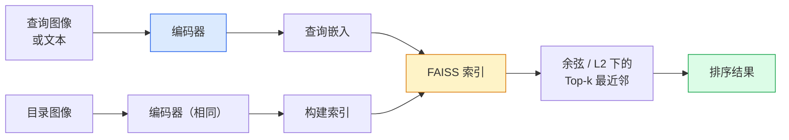

# 图像检索与度量学习（Image Retrieval & Metric Learning）

> 检索系统按嵌入空间中的距离对候选进行排序。度量学习是塑造该空间使距离符合你期望的学科。

**Type:** Build
**Languages:** Python
**Prerequisites:** Phase 4 Lesson 14 (ViT), Phase 4 Lesson 18 (CLIP)
**Time:** ~45 minutes

## 学习目标（Learning Objectives）

- 解释三元组损失（triplet loss）、对比损失（contrastive loss）和基于代理的度量学习损失（proxy-based metric learning losses），并为给定数据集选择最合适的损失
- 正确实现 L2 归一化（L2-normalisation）和余弦相似度（cosine similarity），并审计"相同项目"检索与"相同类别"检索之间的差异
- 构建 FAISS 索引，通过文本和图像查询，并在保留查询集上报告 recall@K
- 将 DINOv2、CLIP 和 SigLIP 作为现成嵌入主干使用，并了解各自适用的场景

## 问题（The Problem）

检索在生产视觉领域无处不在：重复检测、反向图像搜索、视觉搜索（"查找相似商品"）、人脸重新识别、监控场景中的人员重新识别、电商实例级匹配。产品问题始终相同："给定查询图像，为我的目录排序。"

两个设计决策决定了整个系统。嵌入——什么模型产生向量。索引——如何大规模查找最近邻。两者在 2026 年都已商品化（DINOv2 负责嵌入，FAISS 负责索引），这提高了门槛：最难的部分是为你的应用定义"什么算相似"，然后塑造嵌入空间使距离与之匹配。

这种塑造就是度量学习。它是一个小但高杠杆的学科。

## 概念（The Concept）

### 检索概览（Retrieval at a glance）



### 四种损失族（The four loss families）

| Loss | Requires | Pros | Cons |
|------|----------|------|------|
| **Contrastive** | (anchor, positive) + negatives | Simple, works with any pair label | Slow to converge without many negatives |
| **Triplet** | (anchor, positive, negative) | Intuitive; direct margin control | Hard-triplet mining is expensive |
| **NT-Xent / InfoNCE** | Pairs + batch-mined negatives | Scales to large batches | Needs big batch or momentum queue |
| **Proxy-based (ProxyNCA)** | Class labels only | Fast, stable, no mining | Can overfit to proxies on small datasets |

对于大多数生产用例，从预训练主干网络开始，仅当现成嵌入在你的测试集上表现不佳时，才添加度量学习微调。

### 三元组损失的形式化（Triplet loss formally）

```
L = max(0, ||f(a) - f(p)||^2 - ||f(a) - f(n)||^2 + margin)
```

将锚点 a 拉近正样本 p，推离负样本 n，`margin` 确保间距。三图结构可推广到任何相似性排序。

挖掘很重要：容易三元组（n 已经远离 a）贡献零损失；只有困难三元组才能教会网络。半难样本挖掘（n 比 p 远但仍在 margin 内）是 2016 年 FaceNet 的配方，至今仍占主导地位。

### 余弦相似度与 L2（Cosine similarity vs L2）

两个指标，两种约定：

- **余弦（Cosine）**：向量之间的夹角。需要 L2 归一化嵌入。
- **L2**：欧几里得距离。适用于原始或归一化嵌入，但通常与 L2 归一化 + 平方 L2 配对使用。

对于大多数现代网络，两者等价：||a - b||^2 = 2 - 2 cos(a, b) 当 ||a|| = ||b|| = 1。选择与嵌入训练匹配的约定；混合使用会静默改变"最近邻"的含义。

### Recall@K（Recall@K）

标准检索指标：

```
recall@K = fraction of queries where at least one correct match is in the top K results
```

并排报告 recall@1、@5、@10。recall@10 高于 0.95 但 recall@1 低于 0.5，意味着嵌入空间结构正确但排序嘈杂——尝试更长微调或重排序步骤。

对于重复检测，precision@K 更重要，因为每个误报都是用户可见的错误。对于视觉搜索，recall@K 是产品信号。

### 一文读懂 FAISS（FAISS in one paragraph）

Facebook AI Similarity Search。最近邻搜索的事实标准库。三种索引选择：

- `IndexFlatIP` / `IndexFlatL2` —— 暴力搜索，精确，无需训练。适用于最多约 100 万向量。
- `IndexIVFFlat` —— 划分为 K 个单元，仅搜索最近的几个单元。近似，快速，需要训练数据。
- `IndexHNSW` —— 基于图，多查询时最快，索引体积大。

对于 10 万向量，你可能想要基于余弦相似度的 `IndexFlatIP`。对于 1000 万，你想要 `IndexIVFFlat`。对于 1 亿以上结合乘积量化（`IndexIVFPQ`）。

### 实例级检索与类别级检索（Instance-level vs category-level retrieval）

同名的两个完全不同的问题：

- **类别级（Category-level）** —— "在我的目录中查找猫。" 类条件相似性；现成的 CLIP / DINOv2 嵌入效果良好。
- **实例级（Instance-level）** —— "在我的目录中查找*这个确切的产品*。" 需要对同类外观相似物体进行细粒度区分；现成嵌入表现不佳；度量学习微调很重要。

选择模型之前，始终先问自己在解决哪一种。

```figure
metric-embedding
```

## 构建它（Build It）

### 步骤 1：Triplet 损失（Triplet loss）

```python
import torch
import torch.nn.functional as F

def triplet_loss(anchor, positive, negative, margin=0.2):
    d_ap = F.pairwise_distance(anchor, positive, p=2)
    d_an = F.pairwise_distance(anchor, negative, p=2)
    return F.relu(d_ap - d_an + margin).mean()
```

一行代码。适用于 L2 归一化或原始嵌入。

### 步骤 2：半难样本挖掘（Semi-hard mining）

给定一批嵌入和标签，为每个锚点找到最难的半难负样本。

```python
def semi_hard_negatives(emb, labels, margin=0.2):
    dist = torch.cdist(emb, emb)
    same_class = labels[:, None] == labels[None, :]
    diff_class = ~same_class
    N = emb.size(0)

    positives = dist.clone()
    positives[~same_class] = float("-inf")
    positives.fill_diagonal_(float("-inf"))
    pos_idx = positives.argmax(dim=1)

    semi_hard = dist.clone()
    semi_hard[same_class] = float("inf")
    d_ap = dist[torch.arange(N), pos_idx].unsqueeze(1)
    semi_hard[dist <= d_ap] = float("inf")
    neg_idx = semi_hard.argmin(dim=1)

    fallback_mask = semi_hard[torch.arange(N), neg_idx] == float("inf")
    if fallback_mask.any():
        hardest = dist.clone()
        hardest[same_class] = float("inf")
        neg_idx = torch.where(fallback_mask, hardest.argmin(dim=1), neg_idx)
    return pos_idx, neg_idx
```

每个锚点获得类内最难正样本和一个比正样本远但仍在 margin 内的半难负样本。

### 步骤 3：Recall@K（Recall@K）

```python
def recall_at_k(query_emb, gallery_emb, query_labels, gallery_labels, k=1):
    sim = query_emb @ gallery_emb.T
    _, top_k = sim.topk(k, dim=-1)
    matches = (gallery_labels[top_k] == query_labels[:, None]).any(dim=-1)
    return matches.float().mean().item()
```

在 L2 归一化嵌入上通过内积进行 Top-k 排序等价于通过余弦进行 Top-k 排序。报告至少有一个正确近邻的查询的平均比例。

### 步骤 4：整合在一起（Putting it together）

```python
import torch
import torch.nn as nn
from torch.optim import Adam

class Encoder(nn.Module):
    def __init__(self, in_dim=128, emb_dim=64):
        super().__init__()
        self.net = nn.Sequential(
            nn.Linear(in_dim, 128), nn.ReLU(),
            nn.Linear(128, emb_dim),
        )

    def forward(self, x):
        return F.normalize(self.net(x), dim=-1)

torch.manual_seed(0)
num_classes = 6
protos = F.normalize(torch.randn(num_classes, 128), dim=-1)

def sample_batch(bs=32):
    labels = torch.randint(0, num_classes, (bs,))
    x = protos[labels] + 0.15 * torch.randn(bs, 128)
    return x, labels

enc = Encoder()
opt = Adam(enc.parameters(), lr=3e-3)

for step in range(200):
    x, y = sample_batch(32)
    emb = enc(x)
    pos_idx, neg_idx = semi_hard_negatives(emb, y)
    loss = triplet_loss(emb, emb[pos_idx], emb[neg_idx])
    opt.zero_grad(); loss.backward(); opt.step()
```

几百步之后，嵌入集群为每个类别形成一个集群。

## 使用它（Use It）

2026 年的生产栈：

- **DINOv2 + FAISS** —— 通用视觉检索。现成可用。
- **CLIP + FAISS** —— 当查询是文本时。
- **微调后的 DINOv2 + FAISS** —— 实例级检索、人脸重新识别、时尚、电商。
- **Milvus / Weaviate / Qdrant** —— FAISS 或 HNSW 的托管向量数据库封装。

对于 SOTA 实例检索，配方是：DINOv2 主干 + 嵌入头 + 在实例标注对上用三元组或 InfoNCE 损失微调 + 在 FAISS 中索引。

## 交付成果（Ship It）

本课产出：

- `outputs/prompt-retrieval-loss-picker.md` —— 根据给定检索问题选择三元组 / InfoNCE / ProxyNCA 的提示。
- `outputs/skill-recall-at-k-runner.md` —— 一个 skill，用于编写 recall@K 的整洁评估工具，包含训练/验证/画廊分割和正确的数据契约。

## 练习（Exercises）

1. **(Easy)** 运行上面的玩具示例。使用 PCA 绘制训练前后的嵌入，观察六个集群的形成。
2. **(Medium)** 添加 ProxyNCA 损失实现：每个类一个学习的"代理"，在余弦相似度上的标准交叉熵。与玩具数据上的三元组损失比较收敛速度。
3. **(Hard)** 取 1000 张 ImageNet 验证图像，通过 HuggingFace 使用 DINOv2 嵌入，构建 FAISS flat 索引，并报告 recall@{1, 5, 10}——对相同图像作为查询（应为 1.0）和使用 ImageNet 标签作为真实值的保留分割。

## 关键术语（Key Terms）

| Term | What people say | What it actually means |
|------|----------------|----------------------|
| Metric learning | "Shape the space" | Training an encoder so distances in its output space reflect a target similarity |
| Triplet loss | "Pull and push" | L = max(0, d(a, p) - d(a, n) + margin); the canonical metric-learning loss |
| Semi-hard mining | "Useful negatives" | Negatives further from the anchor than the positive but within margin; empirically the most informative |
| Proxy-based loss | "Class prototypes" | One learned proxy per class; cross-entropy over similarity-to-proxies; no pair mining |
| Recall@K | "Top-K hit rate" | Fraction of queries with at least one correct result in the top K |
| Instance retrieval | "Find this exact thing" | Fine-grained matching; off-the-shelf features usually underperform |
| FAISS | "The NN library" | Facebook's nearest-neighbour library; supports exact and approximate indexes |
| HNSW | "Graph index" | Hierarchical navigable small world; fast approximate NN with small memory overhead |

## 拓展阅读（Further Reading）

- [FaceNet: A Unified Embedding for Face Recognition (Schroff et al., 2015)](https://arxiv.org/abs/1503.03832) —— 三元组损失 / 半难样本挖掘论文
- [In Defense of the Triplet Loss for Person Re-Identification (Hermans et al., 2017)](https://arxiv.org/abs/1703.07737) —— 三元组微调实用指南
- [FAISS documentation](https://github.com/facebookresearch/faiss/wiki) —— 每种索引，每种权衡
- [SMoT: Metric Learning Taxonomy (Kim et al., 2021)](https://arxiv.org/abs/2010.06927) —— 现代损失及其联系的综述
