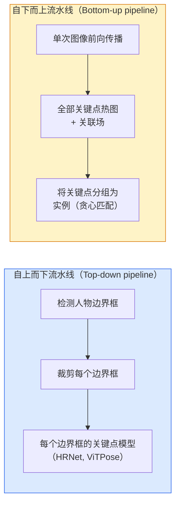

# 关键点检测与姿态估计（Keypoint Detection & Pose Estimation）

> 姿态是一组有序关键点。关键点检测器是一种热图回归器。其余都是簿记。

**Type:** Build
**Languages:** Python
**Prerequisites:** Phase 4 Lesson 06 (Detection), Phase 4 Lesson 07 (U-Net)
**Time:** ~45 minutes

## 学习目标（Learning Objectives）

- 区分自上而下和自下而上的姿态估计，并说明各自适用的场景
- 为 K 个关键点回归热图，使用每个关键点一个高斯目标，并在推理时提取关键点坐标
- 解释部分关联场（Part Affinity Fields, PAFs）以及自下而上流水线如何将关键点关联到实例
- 使用 MediaPipe Pose 或 MMPose 进行生产级关键点估计，并理解其输出格式

## 问题（The Problem）

关键点任务隐藏在许多名称之下：人体姿态（17 个身体关节）、面部 landmarks（68 或 478 个点）、手部（21 个点）、动物姿态、机器人物体姿态、医学解剖 landmarks。每一个都共享相同的结构：检测对象上的 K 个离散点，并输出它们的 (x, y) 坐标。

姿态估计是动作捕捉、健身应用、运动分析、手势控制、动画、AR 试穿和机器人抓取的基础。2D 情况已经成熟；3D 姿态（从单摄像头估计世界坐标系中的关节位置）是当前的研究前沿。

工程上的核心问题是规模。单图像、单人姿态是一个 20 ms 的问题。30 fps 下人群中的多人姿态则是另一个需要不同架构的问题。

## 概念（The Concept）

### 自上而下与自下而上（Top-down vs bottom-up）



- **自上而下（Top-down）** —— 先检测人，然后在每个裁剪框上运行单人关键点模型。精度最高；随人数线性扩展。
- **自下而上（Bottom-up）** —— 一次前向传播预测所有关键点加上关联场；然后分组。无论人群规模如何，时间复杂度恒定。

自上而下（HRNet, ViTPose）是精度领先者；自下而上（OpenPose, HigherHRNet）是拥挤场景下的吞吐量领先者。

### 热图回归（Heatmap regression）

不直接回归 `(x, y)`，而是为每个关键点预测一个 `H x W` 热图，以真实位置为中心的高斯 blob。

```
target[k, y, x] = exp(-((x - cx_k)^2 + (y - cy_k)^2) / (2 sigma^2))
```

推理时，每个热图的 argmax 就是预测的关键点位置。

热图比直接回归效果更好的原因：网络的卷积特征图与空间输出自然对齐。高斯目标也起到正则化作用——小的定位误差产生小的损失，而不是零。

### 亚像素定位（Sub-pixel localisation）

Argmax 给出整数坐标。为了实现亚像素精度，可以通过在 argmax 及其相邻像素之间拟合抛物线来细化，或者使用已知的方向偏移 `(dx, dy) = 0.25 * (heatmap[y, x+1] - heatmap[y, x-1], ...)`。

### 部分关联场（Part Affinity Fields, PAFs）

OpenPose 用于自下而上关联的技巧。对于每一对相连的关键点（例如左肩到左肘），预测一个 2 通道的场，该场编码从一个点指向另一个点的单位向量。要将肩部与肘部关联，沿着连接候选对的线积分 PAF；积分最高的对会被匹配。

```
For each connection (limb):
  PAF channels: 2 (unit vector x, y)
  Line integral: sum over sample points of (PAF . line_direction)
  Higher integral = stronger match
```

优雅且可扩展到任意人群大小，无需单人裁剪。

### COCO 关键点（COCO keypoints）

标准人体姿态数据集：每人 17 个关键点，使用 PCK（Percentage of Correct Keypoints）和 OKS（Object Keypoint Similarity）作为指标。OKS 是关键点版的 IoU，也是 COCO mAP@OKS 报告的内容。

### 2D 与 3D（2D vs 3D）

- **2D 姿态** —— 图像坐标；已解决到生产级质量（MediaPipe, HRNet, ViTPose）。
- **3D 姿态** —— 世界 / 相机坐标；仍是活跃研究领域。常见方法：
  - 使用小型 MLP 将 2D 预测提升到 3D（VideoPose3D）。
  - 直接从图像进行 3D 回归（PyMAF, MHFormer）。
  - 多视角设置（CMU Panoptic）用于获取真实值。

```figure
cv3-pose-heatmap
```

## 构建它（Build It）

### 步骤 1：高斯热图目标（Gaussian heatmap target）

```python
import numpy as np
import torch

def gaussian_heatmap(size, cx, cy, sigma=2.0):
    yy, xx = np.meshgrid(np.arange(size), np.arange(size), indexing="ij")
    return np.exp(-((xx - cx) ** 2 + (yy - cy) ** 2) / (2 * sigma ** 2)).astype(np.float32)

hm = gaussian_heatmap(64, 32, 32, sigma=2.0)
print(f"peak: {hm.max():.3f} at ({hm.argmax() % 64}, {hm.argmax() // 64})")
```

每个关键点的热图沿通道轴堆叠，构成完整的目标张量。

### 步骤 2：微型关键点头部（Tiny keypoint head）

一个输出 K 个热图通道的 U-Net 风格模型。

```python
import torch.nn as nn
import torch.nn.functional as F

class TinyKeypointNet(nn.Module):
    def __init__(self, num_keypoints=4, base=16):
        super().__init__()
        self.down1 = nn.Sequential(nn.Conv2d(3, base, 3, 2, 1), nn.ReLU(inplace=True))
        self.down2 = nn.Sequential(nn.Conv2d(base, base * 2, 3, 2, 1), nn.ReLU(inplace=True))
        self.mid = nn.Sequential(nn.Conv2d(base * 2, base * 2, 3, 1, 1), nn.ReLU(inplace=True))
        self.up1 = nn.ConvTranspose2d(base * 2, base, 2, 2)
        self.up2 = nn.ConvTranspose2d(base, num_keypoints, 2, 2)

    def forward(self, x):
        h1 = self.down1(x)
        h2 = self.down2(h1)
        h3 = self.mid(h2)
        u1 = self.up1(h3)
        return self.up2(u1)
```

输入 `(N, 3, H, W)`，输出 `(N, K, H, W)`。损失是对高斯目标的逐像素 MSE。

### 步骤 3：推理 —— 提取关键点坐标（Inference — extract keypoint coordinates）

```python
def heatmap_to_coords(heatmaps):
    """
    heatmaps: (N, K, H, W)
    returns:  (N, K, 2) float coordinates in image pixels
    """
    N, K, H, W = heatmaps.shape
    hm = heatmaps.reshape(N, K, -1)
    idx = hm.argmax(dim=-1)
    ys = (idx // W).float()
    xs = (idx % W).float()
    return torch.stack([xs, ys], dim=-1)

coords = heatmap_to_coords(torch.randn(2, 4, 32, 32))
print(f"coords: {coords.shape}")  # (2, 4, 2)
```

推理时只需一行代码。要实现亚像素细化，可在 argmax 周围进行插值。

### 步骤 4：合成关键点数据集（Synthetic keypoint dataset）

很简单：在白色画布上画四个点，然后学习预测它们。

```python
def make_synthetic_sample(size=64):
    img = np.ones((3, size, size), dtype=np.float32)
    rng = np.random.default_rng()
    kps = rng.integers(8, size - 8, size=(4, 2))
    for cx, cy in kps:
        img[:, cy - 2:cy + 2, cx - 2:cx + 2] = 0.0
    hms = np.stack([gaussian_heatmap(size, cx, cy) for cx, cy in kps])
    return img, hms, kps
```

小型模型在一分钟内就能学会。

### 步骤 5：训练（Training）

```python
model = TinyKeypointNet(num_keypoints=4)
opt = torch.optim.Adam(model.parameters(), lr=3e-3)

for step in range(200):
    batch = [make_synthetic_sample() for _ in range(16)]
    imgs = torch.from_numpy(np.stack([b[0] for b in batch]))
    hms = torch.from_numpy(np.stack([b[1] for b in batch]))
    pred = model(imgs)
    # Upsample pred to full resolution
    pred = F.interpolate(pred, size=hms.shape[-2:], mode="bilinear", align_corners=False)
    loss = F.mse_loss(pred, hms)
    opt.zero_grad(); loss.backward(); opt.step()
```

## 使用它（Use It）

- **MediaPipe Pose** —— Google 的生产级姿态估计器；提供 WebGL 和移动端运行时，延迟低于 10 ms。
- **MMPose**（OpenMMLab） —— 综合研究代码库；包含所有 SOTA 架构和预训练权重。
- **YOLOv8-pose** —— 最快的实时多人姿态估计，只需一次前向传播。
- **transformers HumanDPT / PoseAnything** —— 较新的视觉-语言方法，用于开放词汇姿态（任意物体，任意关键点集）。

## 交付它（Ship It）

本课产出：

- `outputs/prompt-pose-stack-picker.md` —— 一个提示词，根据延迟、人群大小和 2D 与 3D 需求，在 MediaPipe / YOLOv8-pose / HRNet / ViTPose 之间做出选择。
- `outputs/skill-heatmap-to-coords.md` —— 一个技能，编写每个生产级姿态模型使用的亚像素热图到坐标转换例程。

## 练习（Exercises）

1. **(Easy)** 在合成的 4 点数据集上训练微型关键点模型。报告 200 步后预测关键点与真实关键点之间的平均 L2 误差。
2. **(Medium)** 添加亚像素细化：给定 argmax 位置，从相邻像素沿 x 和 y 拟合一维抛物线。报告相比整数 argmax 的精度提升。
3. **(Hard)** 构建一个 2 人合成数据集，其中每张图像显示两个 4 关键点模式的实例。训练一个带 PAFs 的自下而上流水线，预测哪个关键点属于哪个实例，并评估 OKS。

## 关键术语（Key Terms）

| 术语（Term） | 人们常说的（What people say） | 实际含义（What it actually means） |
|------|----------------|----------------------|
| 关键点（Keypoint） | "A landmark" | 对象上的一个特定有序点（关节、角点、特征点） |
| 姿态（Pose） | "The skeleton" | 属于一个实例的有序关键点集合 |
| 自上而下（Top-down） | "Detect then pose" | 两阶段流水线：人物检测器 + 每个裁剪图的关键点模型；准确率最高 |
| 自下而上（Bottom-up） | "Pose first, group later" | 单次前向传播预测所有关键点 + 分组；人群大小下时间恒定 |
| 热图（Heatmap） | "Gaussian target" | 每个关键点一个 H x W 张量，峰值在真实位置处；首选的回归目标 |
| PAF | "Part Affinity Field" | 2 通道单位向量场，编码肢体方向；用于将关键点分组为实例 |
| OKS | "Keypoint IoU" | 物体关键点相似度；COCO 的姿态指标 |
| HRNet | "High-Resolution Net" | 主导性的自上而下关键点架构；全程保留高分辨率特征 |

## 延伸阅读（Further Reading）

- [OpenPose (Cao et al., 2017)](https://arxiv.org/abs/1812.08008) —— 带 PAFs 的自下而上方法；仍是该方法的绝佳文档
- [HRNet (Sun et al., 2019)](https://arxiv.org/abs/1902.09212) —— 自上而下的参考架构
- [ViTPose (Xu et al., 2022)](https://arxiv.org/abs/2204.12484) —— 将普通 ViT 用作姿态主干；在许多基准上达到当前 SOTA
- [MediaPipe Pose](https://developers.google.com/mediapipe/solutions/vision/pose_landmarker) —— 生产级实时姿态；2026 年部署最快的栈
