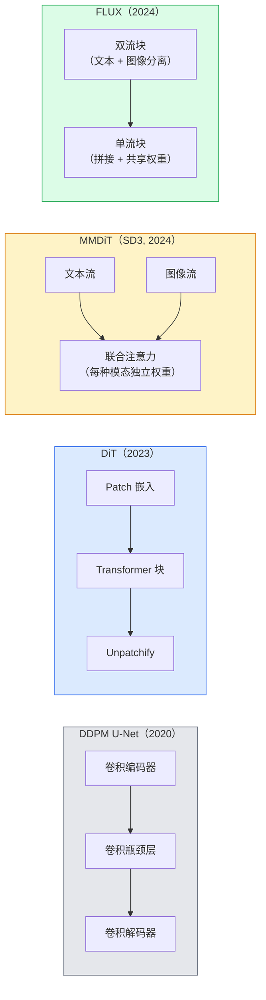

# 扩散 Transformer 与修正流（Diffusion Transformers & Rectified Flow）

> U-Net 不是扩散的秘密。用 transformer 替换它，将噪声调度换成直线流，突然间你就有了 SD3、FLUX 和每个 2026 年文生图模型。

**Type:** Learn + Build
**Languages:** Python
**Prerequisites:** Phase 4 Lesson 10 (Diffusion DDPM), Phase 4 Lesson 14 (ViT), Phase 7 Lesson 02 (Self-Attention)
**Time:** ~75 minutes

## 学习目标（Learning Objectives）

- 追溯从 U-Net DDPM（第 10 课）到扩散 Transformer（DiT）、MMDiT（SD3）和单流 + 双流 DiT（FLUX）的演进
- 解释修正流（rectified flow）：为什么噪声和数据之间的直线轨迹让模型能在 20 步而非 1000 步内采样
- 实现一个微型 DiT 块和修正流训练循环，两者都在 100 行以内
- 按架构、参数数量和许可证区分模型变体（SD3、FLUX.1-dev、FLUX.1-schnell、Z-Image、Qwen-Image）

## 问题（The Problem）

第 10 课用 U-Net 去噪器构建了 DDPM。这个配方主导了 2020-2023 年：U-Net + beta 调度 + 噪声预测损失。它产出了 Stable Diffusion 1.5 和 2.1 以及 DALL-E 2。

每个 2026 年 SOTA 文生图模型都已超越它。Stable Diffusion 3、FLUX、SD4、Z-Image、Qwen-Image、Hunyuan-Image —— 没有一个使用 U-Net。它们使用扩散 Transformer（DiT）。SD3 和 FLUX 还将 DDPM 噪声调度替换为修正流，它拉直了从噪声到数据的路径，并支持 1-4 步推理，结合一致性或蒸馏变体。

这个转变很重要，因为它是基于扩散的图像生成变得可控、提示准确（SD3/SD4 解决了文本渲染）和生产快速的原因。理解 DiT + 修正流就是理解 2026 年生成式图像栈。

## 概念（The Concept）

### 从 U-Net 到 Transformer（From U-Net to transformer）



- **DiT**（Peebles & Xie, 2023）—— 用类似 ViT 的 transformer 替换 U-Net 作为潜在 patch 上的扩散去噪器。通过自适应层 norm（AdaLN）进行条件注入。
- **MMDiT**（SD3，Esser et al., 2024）—— 两条流，文本和图像 token 独立权重，共享联合注意力。
- **FLUX**（Black Forest Labs, 2024）—— 前 N 个块像 SD3 一样双流，后面的块拼接并共享权重（单流），在更高深度实现效率。
- **Z-Image**（2025）—— 一个 60 亿参数的高效单流 DiT，挑战"不惜一切代价扩大规模"。

### 修正流简介（Rectified flow in one paragraph）

DDPM 将前向过程定义为 x_t 被逐渐破坏的噪声 SDE。学习的反向是第二个 SDE，通过 1000 个小步求解。

修正流定义干净数据和纯噪声之间的**直线**插值：

```
x_t = (1 - t) * x_0 + t * epsilon,     t in [0, 1]
```

训练网络预测速度 v_theta(x_t, t) = epsilon - x_0 —— 沿从干净数据到噪声的直线路径的正向方向（dx_t/dt）。采样时，你向后积分这个速度，从噪声逐步走向数据。得到的 ODE 更接近直线，因此需要少得多的积分步数。

SD3 称之为**修正流匹配（Rectified Flow Matching）**。FLUX、Z-Image 和大多数 2026 年模型使用相同目标。典型推理：20-30 个 Euler 步（确定性）对比旧 DDPM 时代的 50+ DDIM 步。蒸馏 / turbo / schnell / LCM 变体将其降低到 1-4 步。

### AdaLN 条件注入（AdaLN conditioning）

DiT 通过**自适应层 norm** 对时间步和类别 / 文本进行条件注入：从条件向量预测 `scale` 和 `shift`，在 LayerNorm 后应用它们。比 U-Net 中的 FiLM 风格调制更简洁，是每个现代 DiT 的默认设置。

```
cond -> MLP -> (scale, shift, gate)
norm(x) * (1 + scale) + shift, 然后残差相加 * gate
```

### SD3 与 FLUX 的文本编码器（Text encoders in SD3 and FLUX）

- **SD3** 使用三个文本编码器：两个 CLIP 模型 + T5-XXL。嵌入拼接后作为文本条件馈入图像流。
- **FLUX** 使用一个 CLIP-L + T5-XXL。
- **Qwen-Image / Z-Image** 变体使用与自身基础 LLM 对齐的自有文本编码器。

文本编码器是 SD3/FLUX 比 SD1.5 更好地理解提示的重要原因之一。仅 T5-XXL 就有 47 亿参数。

### 无分类器引导依然有效（Classifier-free guidance still holds）

修正流改变的是采样器，而非条件注入。无分类器引导（训练时以 10% 概率丢弃文本，推理时混合条件和无条件预测）与修正流的配合完全相同。大多数 2026 年模型使用引导尺度 3.5-5 —— 低于 SD1.5 的 7.5，因为修正流模型默认更严格地遵循提示。

### Consistency、Turbo、Schnell、LCM（Consistency, Turbo, Schnell, LCM）

四个名字代表同一个想法：将慢速多步模型蒸馏为快速少步模型。

- **LCM（Latent Consistency Model）** —— 训练一个学生模型，从任何中间 x_t 一步预测最终 x_0。
- **SDXL Turbo / FLUX schnell** —— 通过对抗扩散蒸馏训练的 1-4 步模型。
- **SD Turbo** —— 适用于潜在扩散的 OpenAI 风格一致性模型。

任何新模型的生产服务都同时提供"全质量"检查点和"turbo / schnell"变体。Schnell（德语中的"快"，Black Forest Labs 的约定）在 1-4 步内运行，适合实时流水线。

### 2026 年模型版图（Model landscape in 2026）

| Model | Size | Architecture | License |
|-------|------|--------------|---------|
| Stable Diffusion 3 Medium | 2B | MMDiT | SAI Community |
| Stable Diffusion 3.5 Large | 8B | MMDiT | SAI Community |
| FLUX.1-dev | 12B | Double + Single Stream DiT | non-commercial |
| FLUX.1-schnell | 12B | same, distilled | Apache 2.0 |
| FLUX.2 | — | iterated FLUX.1 | mixed |
| Z-Image | 6B | S3-DiT (Scalable Single-Stream) | permissive |
| Qwen-Image | ~20B | DiT + Qwen text tower | Apache 2.0 |
| Hunyuan-Image-3.0 | ~80B | DiT | research |
| SD4 Turbo | 3B | DiT + distillation | SAI Commercial |

FLUX.1-schnell 是 2026 年开源默认方案。Z-Image 是效率领导者。FLUX.2 和 SD4 是当前质量巅峰。

### 为何这个范式转移重要（Why this phase shift matters）

DDPM + U-Net 可行。DiT + 修正流效果**更好、更快、扩展更清晰**。这个转变平行于 NLP 中从 RNN 到 transformer 的过渡：两种架构解决了相同的问题，但 transformer 扩展性更好，现在占据主导地位。每个 2026 年图像、视频或 3D 生成论文都使用 DiT 形状的去噪器，通常还有修正流目标。U-Net DDPM 现在主要是教学用途（第 10 课）。

```figure
cv3-rectified-flow
```

## 构建它（Build It）

### 步骤 1：带 AdaLN 的 DiT 块（A DiT block with AdaLN）

```python
import torch
import torch.nn as nn


class AdaLNZero(nn.Module):
    """
    Adaptive LayerNorm with a gate. Predicts (scale, shift, gate) from the conditioning.
    Init such that the whole block starts as identity ("zero init").
    """

    def __init__(self, dim, cond_dim):
        super().__init__()
        self.norm = nn.LayerNorm(dim, elementwise_affine=False)
        self.mlp = nn.Linear(cond_dim, dim * 3)
        nn.init.zeros_(self.mlp.weight)
        nn.init.zeros_(self.mlp.bias)

    def forward(self, x, cond):
        scale, shift, gate = self.mlp(cond).chunk(3, dim=-1)
        h = self.norm(x) * (1 + scale.unsqueeze(1)) + shift.unsqueeze(1)
        return h, gate.unsqueeze(1)


class DiTBlock(nn.Module):
    def __init__(self, dim=192, heads=3, mlp_ratio=4, cond_dim=192):
        super().__init__()
        self.adaln1 = AdaLNZero(dim, cond_dim)
        self.attn = nn.MultiheadAttention(dim, heads, batch_first=True)
        self.adaln2 = AdaLNZero(dim, cond_dim)
        self.mlp = nn.Sequential(
            nn.Linear(dim, dim * mlp_ratio),
            nn.GELU(),
            nn.Linear(dim * mlp_ratio, dim),
        )

    def forward(self, x, cond):
        h, gate1 = self.adaln1(x, cond)
        a, _ = self.attn(h, h, h, need_weights=False)
        x = x + gate1 * a
        h, gate2 = self.adaln2(x, cond)
        x = x + gate2 * self.mlp(h)
        return x
```

`AdaLNZero` 从恒等映射开始，因为其 MLP 权重初始化为零。训练将块推离恒等；这显著稳定了深层 transformer 扩散模型。

### 步骤 2：一个微型 DiT（A tiny DiT）

```python
def timestep_embedding(t, dim):
    import math
    half = dim // 2
    freqs = torch.exp(-math.log(10000) * torch.arange(half, device=t.device) / half)
    args = t[:, None].float() * freqs[None]
    return torch.cat([args.sin(), args.cos()], dim=-1)


class TinyDiT(nn.Module):
    def __init__(self, image_size=16, patch_size=2, in_channels=3, dim=96, depth=4, heads=3):
        super().__init__()
        self.patch_size = patch_size
        self.num_patches = (image_size // patch_size) ** 2
        self.patch = nn.Conv2d(in_channels, dim, kernel_size=patch_size, stride=patch_size)
        self.pos = nn.Parameter(torch.zeros(1, self.num_patches, dim))
        self.time_mlp = nn.Sequential(
            nn.Linear(dim, dim * 2),
            nn.SiLU(),
            nn.Linear(dim * 2, dim),
        )
        self.blocks = nn.ModuleList([DiTBlock(dim, heads, cond_dim=dim) for _ in range(depth)])
        self.norm_out = nn.LayerNorm(dim, elementwise_affine=False)
        self.head = nn.Linear(dim, patch_size * patch_size * in_channels)

    def forward(self, x, t):
        n = x.size(0)
        x = self.patch(x)
        x = x.flatten(2).transpose(1, 2) + self.pos
        t_emb = self.time_mlp(timestep_embedding(t, self.pos.size(-1)))
        for blk in self.blocks:
            x = blk(x, t_emb)
        x = self.norm_out(x)
        x = self.head(x)
        return self._unpatchify(x, n)

    def _unpatchify(self, x, n):
        p = self.patch_size
        h = w = int(self.num_patches ** 0.5)
        x = x.view(n, h, w, p, p, -1).permute(0, 5, 1, 3, 2, 4).reshape(n, -1, h * p, w * p)
        return x
```

### 步骤 3：修正流训练（Rectified flow training）

```python
import torch.nn.functional as F

def rectified_flow_train_step(model, x0, optimizer, device):
    model.train()
    x0 = x0.to(device)
    n = x0.size(0)
    t = torch.rand(n, device=device)
    epsilon = torch.randn_like(x0)
    x_t = (1 - t[:, None, None, None]) * x0 + t[:, None, None, None] * epsilon

    target_velocity = epsilon - x0
    pred_velocity = model(x_t, t)

    loss = F.mse_loss(pred_velocity, target_velocity)
    optimizer.zero_grad()
    loss.backward()
    optimizer.step()
    return loss.item()
```

与 DDPM 的噪声预测损失（第 10 课）对比：结构相同，目标不同。不是预测噪声 epsilon，而是预测**速度** epsilon - x_0，它沿着从干净数据到噪声的直线插值方向。

### 步骤 4：Euler 采样器（Euler sampler）

修正流是一个 ODE。Euler 方法是最简单的，对于训练良好的修正流模型，在 20+ 步时几乎与高阶求解器一样准确。

```python
@torch.no_grad()
def rectified_flow_sample(model, shape, steps=20, device="cpu"):
    model.eval()
    x = torch.randn(shape, device=device)
    dt = 1.0 / steps
    t = torch.ones(shape[0], device=device)
    for _ in range(steps):
        v = model(x, t)
        x = x - dt * v
        t = t - dt
    return x
```

20 步。在训练好的模型上，产生的样本可与 1000 步 DDPM 媲美。

### 步骤 5：端到端冒烟测试（End-toend smoke test）

```python
import numpy as np

def synthetic_blobs(num=200, size=16, seed=0):
    rng = np.random.default_rng(seed)
    out = np.zeros((num, 3, size, size), dtype=np.float32)
    yy, xx = np.meshgrid(np.arange(size), np.arange(size), indexing="ij")
    for i in range(num):
        cx, cy = rng.uniform(4, size - 4, size=2)
        r = rng.uniform(2, 4)
        mask = (xx - cx) ** 2 + (yy - cy) ** 2 < r ** 2
        colour = rng.uniform(-1, 1, size=3)
        for c in range(3):
            out[i, c][mask] = colour[c]
    return torch.from_numpy(out)
```

用修正流在上面训练 `TinyDiT`。500 步后，采样输出应看起来像淡淡的彩色斑点。

## 使用它（Use It）

对于真正的 FLUX / SD3 / Z-Image 图像生成，`diffusers` 统一 API 提供了每一个：

```python
from diffusers import FluxPipeline, StableDiffusion3Pipeline
import torch

pipe = FluxPipeline.from_pretrained(
    "black-forest-labs/FLUX.1-schnell",
    torch_dtype=torch.bfloat16,
).to("cuda")

out = pipe(
    prompt="a golden retriever surfing a tsunami, hyperrealistic, studio lighting",
    guidance_scale=0.0,           # schnell was trained without CFG
    num_inference_steps=4,
    max_sequence_length=256,
).images[0]
out.save("surf.png")
```

三行代码。`FLUX.1-schnell` 四步出图。将模型 id 换成 `black-forest-labs/FLUX.1-dev`，在 20-30 步和 CFG 下获得更高质量。

对于 SD3：

```python
pipe = StableDiffusion3Pipeline.from_pretrained(
    "stabilityai/stable-diffusion-3.5-large",
    torch_dtype=torch.bfloat16,
).to("cuda")
out = pipe(prompt, guidance_scale=3.5, num_inference_steps=28).images[0]
```

## 交付成果（Ship It）

本课产出：

- `outputs/prompt-dit-model-picker.md` —— 在 SD3、FLUX.1-dev、FLUX.1-schnell、Z-Image、SD4 Turbo 之间，根据质量、延迟和许可证约束进行选择。
- `outputs/skill-rectified-flow-trainer.md` —— 编写带 AdaLN DiT 和 Euler 采样的修正流完整训练循环的 skill。

## 练习（Exercises）

1. **(Easy)** 在合成斑点数据集上训练上面的 TinyDiT 500 步。比较 10、20 和 50 个 Euler 步产生的样本。
2. **(Medium)** 通过将学习的类别嵌入与时间嵌入拼接来添加文本条件（10 个按颜色区分的斑点"类别"）。用类别 0、5 和 9 采样，并验证颜色匹配。
3. **(Hard)** 在相同数据相同步数下，比较修正流和 DDPM 相同大小网络生成的样本之间的 Fréchet 距离（FID 代理）。报告哪一个收敛更快。

## 关键术语（Key Terms）

| Term | What people say | What it actually means |
|------|----------------|----------------------|
| DiT | "Diffusion transformer" | Transformer that replaces the U-Net as the diffusion denoiser; operates on patchified latents |
| AdaLN | "Adaptive layer norm" | Timestep/text conditioning via learned scale, shift, gate applied after LayerNorm; standard in every modern DiT |
| MMDiT | "Multi-modal DiT (SD3)" | Separate weight streams for text and image tokens that share a joint self-attention |
| Single-stream / double-stream | "FLUX trick" | First N blocks double-stream (separate weights per modality), later blocks single-stream (concat + shared weights) for efficiency |
| Rectified flow | "Straight-line noise-to-data" | Linear interpolation between data and noise; network predicts velocity; fewer ODE steps needed at inference |
| Velocity target | "epsilon - x_0" | The regression target in rectified flow; points from clean data to noise |
| CFG guidance | "classifier-free guidance" | Mix conditional and unconditional predictions; still used in rectified-flow models |
| Schnell / turbo / LCM | "1-4 step distillation" | Small-step variants distilled from full-quality models; production real-time |

## 拓展阅读（Further Reading）

- [Scalable Diffusion Models with Transformers (Peebles & Xie, 2023)](https://arxiv.org/abs/2212.09748) —— DiT 论文
- [Scaling Rectified Flow Transformers (Esser et al., SD3 paper)](https://arxiv.org/abs/2403.03206) —— MMDiT 和规模化修正流
- [FLUX.1 model card and technical report (Black Forest Labs)](https://huggingface.co/black-forest-labs/FLUX.1-dev) —— 双流 + 单流细节
- [Z-Image: Efficient Image Generation Foundation Model (2025)](https://arxiv.org/html/2511.22699v1) —— 60 亿参数单流 DiT
- [Elucidating the Design Space of Diffusion (Karras et al., 2022)](https://arxiv.org/abs/2206.00364) —— 每个扩散设计权衡的参考
- [Latent Consistency Models (Luo et al., 2023)](https://arxiv.org/abs/2310.04378) —— LCM-LoRA 如何给你 4 步推理
