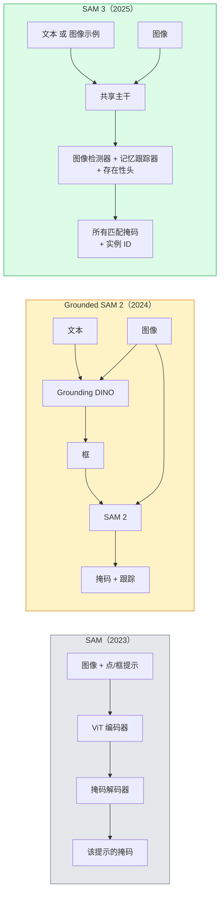

# SAM 3 与开放词汇分割（SAM 3 & Open-Vocab Segmentation）

> 给模型一个文本提示和一张图像，就能获得每个匹配对象的掩码。SAM 3 将这一切变成了一次前向传播。

**Type:** Use + Build
**Languages:** Python
**Prerequisites:** Phase 4 Lesson 07 (U-Net), Phase 4 Lesson 08 (Mask R-CNN), Phase 4 Lesson 18 (CLIP)
**Time:** ~60 minutes

## 学习目标（Learning Objectives）

- 区分 SAM（仅视觉提示）、Grounded SAM / SAM 2（检测器 + SAM）和 SAM 3（通过可提示概念分割实现原生文本提示）
- 解释 SAM 3 架构：共享主干 + 图像检测器 + 基于记忆的视频跟踪器 + 存在性头 + 解耦的检测器-跟踪器设计
- 使用 Hugging Face `transformers` SAM 3 集成进行文本提示检测、分割和视频跟踪
- 根据延迟、概念复杂性和部署目标，在 SAM 3、Grounded SAM 2、YOLO-World 和 SAM-MI 之间做出选择

## 问题（The Problem）

2023 年的 SAM 是一个仅视觉提示模型：你点击一个点或画一个框，它返回一个掩码。对于"给我这张照片中的所有橙子"，你需要一个检测器（Grounding DINO）来生成框，然后 SAM 对每个进行分割。Grounded SAM 将其变成了一个流水线，但这是两个冻结模型的级联，伴随不可避免的误差累积。

SAM 3（Meta，2025 年 11 月，ICLR 2026）折叠了这个级联。它接受一个简短短语或图像示例作为提示，并一次性返回所有匹配的掩码和实例 ID。这就是**可提示概念分割（Promptable Concept Segmentation, PCS）**。结合 2026 年 3 月的对象多路复用更新（SAM 3.1），它高效地通过视频跟踪同一概念的多个实例。

本课关注这个转变所代表的结构性变化。2D 分割、检测和文本-图像匹配已经合并为一个模型。生产问题不再是"我链接哪个流水线"，而是"哪个可提示模型端到端地处理我的用例"。

## 概念（The Concept）

### 三代演进（The three generations）



### 可提示概念分割（Promptable Concept Segmentation）

"概念提示"是一个简短短语（`"yellow school bus"`、`"striped red umbrella"`、`"hand holding a mug"`）或图像示例。模型返回图像中匹配该概念的每个实例的分割掩码，以及每个匹配的唯一实例 ID。

这与经典视觉提示 SAM 在三个方面不同：

1. 不需要逐实例提示——一个文本提示返回所有匹配。
2. 开放词汇——概念可以是自然语言描述的任何内容。
3. 一次返回多个实例，而非每个提示一个掩码。

### 核心架构组件（Key architectural pieces）

- **共享主干** —— 单个 ViT 处理图像。检测头和基于记忆的跟踪器都从它读取。
- **存在性头** —— 预测概念是否存在于图像中。将"它在这里吗？"与"它在哪里？"解耦。减少不存在概念上的误报。
- **解耦检测器-跟踪器** —— 图像级检测和视频级跟踪有独立头，因此它们不会互相干扰。
- **记忆库** —— 跨帧存储每个实例的特征用于视频跟踪（与 SAM 2 使用的机制相同）。

### 大规模训练（Training at scale）

SAM 3 在**400 万个唯一概念**上训练，这些概念由一个迭代注释和修正的数据引擎生成，使用 AI + 人工审核。新的 **SA-CO 基准**包含 27 万个唯一概念，比先前基准大 50 倍。SAM 3 在 SA-CO 上达到人类表现的 75-80%，并在图像 + 视频 PCS 上使现有系统翻倍。

### SAM 3.1 Object Multiplex（SAM 3.1 Object Multiplex）

2026 年 3 月更新：**Object Multiplex** 引入了共享记忆机制，用于同时跟踪同一概念的多个实例。以前，跟踪 N 个实例意味着 N 个独立的记忆库。多路复用将其折叠为一个带每个实例查询的共享记忆。结果：在不牺牲精度的情况下，多对象跟踪速度显著加快。

### 2026 年 Grounded SAM 仍有价值的场景（Where Grounded SAM still matters in 2026）

- 当你需要特定的开放词汇检测器可替换时（DINO-X、Florence-2）。
- 当 SAM 3 许可证（HF 上受限）成为障碍时。
- 当你需要比 SAM 3 暴露的更多检测器阈值控制时。
- 用于检测组件的研发 / 消融工作。

模块化流水线仍有其位置。对于大多数生产工作，SAM 3 是更简单的答案。

### YOLO-World 与 SAM 3 对比（YOLO-World vs SAM 3）

- **YOLO-World** —— 仅开放词汇检测器（无掩码）。实时。当你需要高 fps 的框时最佳。
- **SAM 3** —— 完整分割 + 跟踪。更慢但输出更丰富。

生产拆分：YOLO-World 用于快速仅检测流水线（机器人导航、快速仪表板），SAM 3 用于任何需要掩码或跟踪的场景。

### SAM-MI 的效率（SAM-MI efficiency）

SAM-MI（2025-2026）解决了 SAM 的解码器瓶颈。关键想法：

- **稀疏点提示** —— 使用几个精心选择的点而非密集提示；减少解码器调用 96%。
- **浅掩码聚合** —— 将粗略掩码预测合并为一个更清晰的掩码。
- **解耦掩码注入** —— 解码器接收预计算的掩码特征而非重新运行。

结果：在开放词汇基准上比 Grounded-SAM 快约 1.6 倍。

### 三个模型的输出格式（Output format for the three models）

都返回相同的一般结构（框 + 标签 + 分数 + 掩码 + ID），这很有帮助——你的下游流水线不需要根据运行了哪个模型进行分支。

```figure
cv3-open-vocab
```

## 构建它（Build It）

### 步骤 1：构建提示（Prompt construction）

构建一个辅助函数，将用户句子转换为 SAM 3 概念提示列表。这是"用户输入的内容"与"模型消耗的内容"的边界。

```python
def split_concepts(sentence):
    """
    Heuristic splitter for multi-concept prompts.
    Returns list of short noun phrases.
    """
    for sep in [",", ";", "and", "or", "&"]:
        if sep in sentence:
            parts = [p.strip() for p in sentence.replace("and ", ",").split(",")]
            return [p for p in parts if p]
    return [sentence.strip()]

print(split_concepts("cats, dogs and balloons"))
```

SAM 3 每次前向传播接受一个概念；对于多概念查询，循环或批量处理它们。

### 步骤 2：后处理辅助函数（Post-processing helpers）

将 SAM 3 的原始输出转换为符合我们第 4 课第 16 课流水线契约的整洁检测列表。

```python
from dataclasses import dataclass
from typing import List

@dataclass
class ConceptDetection:
    concept: str
    instance_id: int
    box: tuple          # (x1, y1, x2, y2)
    score: float
    mask_rle: str       # run-length encoded


def rle_encode(binary_mask):
    flat = binary_mask.flatten().astype("uint8")
    runs = []
    prev, count = flat[0], 0
    for v in flat:
        if v == prev:
            count += 1
        else:
            runs.append((int(prev), count))
            prev, count = v, 1
    runs.append((int(prev), count))
    return ";".join(f"{v}x{c}" for v, c in runs)
```

RLE 即使对于许多高分辨率掩码也能保持响应负载小。相同格式在 SAM 2、SAM 3、Grounded SAM 2 中通用。

### 步骤 3：统一的开放词汇分割接口（A unified open-vocab segmentation interface）

将你拥有的任何后端（SAM 3、Grounded SAM 2、YOLO-World + SAM 2）封装在单个方法后面。当后端改变时，你的下游代码不会改变。

```python
from abc import ABC, abstractmethod
import numpy as np

class OpenVocabSeg(ABC):
    @abstractmethod
    def detect(self, image: np.ndarray, concept: str) -> List[ConceptDetection]:
        ...


class StubOpenVocabSeg(OpenVocabSeg):
    """
    Deterministic stub used for pipeline testing when real models are not loaded.
    """
    def detect(self, image, concept):
        h, w = image.shape[:2]
        return [
            ConceptDetection(
                concept=concept,
                instance_id=0,
                box=(w * 0.2, h * 0.3, w * 0.5, h * 0.8),
                score=0.89,
                mask_rle="0x100;1x50;0x200",
            ),
            ConceptDetection(
                concept=concept,
                instance_id=1,
                box=(w * 0.55, h * 0.25, w * 0.85, h * 0.75),
                score=0.74,
                mask_rle="0x80;1x40;0x220",
            ),
        ]
```

真正的 `SAM3OpenVocabSeg` 子类将封装 `transformers.Sam3Model` 和 `Sam3Processor`。

### 步骤 4：Hugging Face SAM 3 使用（参考）（Hugging Face SAM 3 usage (reference)）

对于实际模型，`transformers` 集成：

```python
from transformers import Sam3Processor, Sam3Model
import torch

processor = Sam3Processor.from_pretrained("facebook/sam3")
model = Sam3Model.from_pretrained("facebook/sam3").eval()

inputs = processor(images=pil_image, return_tensors="pt")
inputs = processor.set_text_prompt(inputs, "yellow school bus")

with torch.no_grad():
    outputs = model(**inputs)

masks = processor.post_process_masks(
    outputs.masks, inputs.original_sizes, inputs.reshaped_input_sizes
)
boxes = outputs.boxes
scores = outputs.scores
```

一个提示，单次调用返回所有匹配。

### 步骤 5：衡量 Grounded SAM 2 免费给你的东西（Measure what Grounded SAM 2 gave you for free）

一个诚实的基准：在真实流水线中用 SAM 3 替换 Grounded SAM 2 会发生什么？

- 延迟：SAM 3 节省一次前向传播（无单独检测器），但模型本身更重；通常净中性或轻微加速。
- 精度：SAM 3 在罕见或组合概念（"striped red umbrella"）上明显更好。在常见单词概念上相似。
- 灵活性：Grounded SAM 2 允许你交换检测器（DINO-X、Florence-2、Grounding DINO 1.5）；SAM 3 是单体。

结论：SAM 3 是 2026 年开放词汇分割的默认方案。当你需要检测器灵活性或不同许可证条款时，Grounded SAM 2 仍然是正确答案。

## 使用它（Use It）

生产部署模式：

- **实时标注** —— SAM 3 + CVAT 的"将标签作为文本提示"功能。标注员选择一个标签名称；SAM 3 预标注每个匹配的实例。审核并纠正。
- **视频分析** —— SAM 3.1 Object Multiplex 用于多对象跟踪；将帧馈入基于记忆的跟踪器。
- **机器人** —— SAM 3 用于开放词汇操作（"拿起红色杯子"）；作为规划原语运行。
- **医学成像** —— 在医学概念上微调的 SAM 3；需要在 HF 上申请访问权限。

Ultralytics 在其 Python 包中封装了 SAM 3：

```python
from ultralytics import SAM

model = SAM("sam3.pt")
results = model(image_path, prompts="yellow school bus")
```

与 YOLO 和 SAM 2 相同的接口。

## 交付成果（Ship It）

本课产出：

- `outputs/prompt-open-vocab-stack-picker.md` —— 根据延迟、概念复杂性和许可证，在 SAM 3 / Grounded SAM 2 / YOLO-World / SAM-MI 之间选择。
- `outputs/skill-concept-prompt-designer.md` —— 将用户话语转换为格式良好的 SAM 3 概念提示（拆分、消歧、回退）的 skill。

## 练习（Exercises）

1. **(Easy)** 在 10 张图像上用你选择的概念提示运行 SAM 3。与 SAM 2 + Grounding DINO 1.5 在同一组图像上比较。报告每个模型遗漏了哪些概念。
2. **(Medium)** 在 SAM 3 之上构建一个"点击包含 / 点击排除"UI：文本提示返回候选实例；用户点击决定哪些算作正例。将最终概念集输出为 JSON。
3. **(Hard)** 在自定义概念集（例如 5 种电子元件）上微调 SAM 3，每种 20 张标注图像。与相同测试集上的零样本 SAM 3 比较；测量掩码 IoU 提升。

## 关键术语（Key Terms）

| Term | What people say | What it actually means |
|------|----------------|----------------------|
| Open-vocabulary segmentation | "Segment by text" | Produce masks for objects described in natural language, not a fixed label set |
| PCS | "Promptable Concept Segmentation" | SAM 3's core task — given a noun-phrase or image exemplar, segment all matching instances |
| Concept prompt | "The text input" | Short noun phrase or image exemplar; not a full sentence |
| Presence head | "Is it here?" | SAM 3 module that decides whether the concept exists in the image before localisation |
| SA-CO | "SAM 3 benchmark" | 270K-concept open-vocabulary segmentation benchmark; 50x larger than prior open-vocab benchmarks |
| Object Multiplex | "SAM 3.1 update" | Shared-memory multi-object tracking; fast joint tracking of many instances |
| Grounded SAM 2 | "Modular pipeline" | Detector + SAM 2 cascade; still relevant when detector swap matters |
| SAM-MI | "Efficient SAM variant" | Mask Injection for 1.6x speedup over Grounded-SAM |

## 拓展阅读（Further Reading）

- [SAM 3: Segment Anything with Concepts (arXiv 2511.16719)](https://arxiv.org/abs/2511.16719)
- [SAM 3.1 Object Multiplex (Meta AI, March 2026)](https://ai.meta.com/blog/segment-anything-model-3/)
- [SAM 3 model page on Hugging Face](https://huggingface.co/facebook/sam3)
- [Grounded SAM 2 tutorial (PyImageSearch)](https://pyimagesearch.com/2026/01/19/grounded-sam-2-from-open-set-detection-to-segmentation-and-tracking/)
- [Ultralytics SAM 3 docs](https://docs.ultralytics.com/models/sam-3/)
- [SAM3-I: Instruction-aware SAM (arXiv 2512.04585)](https://arxiv.org/abs/2512.04585)
