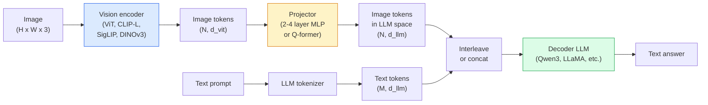

# 视觉语言模型——ViT-MLP-LLM 模式（Vision-Language Models — The ViT-MLP-LLM Pattern）

> 视觉编码器将图像转换为词元。MLP 投影器将这些词元映射到 LLM 的嵌入空间。语言模型完成剩余部分。这一模式——ViT-MLP-LLM——正是 2026 年所有生产级 VLM 的基础。

**Type:** Learn + Use
**Languages:** Python
**Prerequisites:** Phase 4 Lesson 14 (ViT), Phase 4 Lesson 18 (CLIP), Phase 7 Lesson 02 (Self-Attention)
**Time:** ~75 minutes

## 学习目标（Learning Objectives）

- 阐述 ViT-MLP-LLM 架构，并解释三个组件各自贡献了什么
- 比较 Qwen3-VL、InternVL3.5、LLaVA-Next 和 GLM-4.6V 在参数量、上下文长度和基准性能上的差异
- 解释 DeepStack：为什么多层级 ViT 特征比仅使用最后一层特征能更紧密地对齐视觉与语言
- 用跨模态错误率（Cross-Modal Error Rate, CMER）在生产环境中衡量 VLM 的幻觉现象，并据此采取行动

## 问题背景（The Problem）

CLIP（第 4 阶段第 18 课）为你提供了图像和文本的共享嵌入空间，这足以支持零样本分类和检索。但它无法回答"这张图里有多少辆红色汽车？"——因为 CLIP 不生成文本，它只计算相似度。

视觉语言模型（Vision-Language Models, VLMs）——Qwen3-VL、InternVL3.5、LLaVA-Next、GLM-4.6V——将 CLIP 家族的图像编码器与完整的语言模型拼接在一起。模型看到一张图像加一个问题，然后生成答案。2026 年，开源 VLM 在多模态基准测试（MMMU、MMBench、DocVQA、ChartQA、MathVista、OSWorld）上的表现已经匹敌甚至超越 GPT-5 和 Gemini-2.5-Pro。

这三个组件（ViT、投影器、LLM）是标准配置。模型之间的差异在于使用哪个 ViT、哪个投影器、哪个 LLM、训练数据以及对齐方法。一旦你理解了这一模式，替换任何组件都只是机械操作。

## 核心概念（The Concept）

### ViT-MLP-LLM 架构（The ViT-MLP-LLM architecture）



1. **视觉编码器（Vision encoder）** —— 预训练的 ViT（CLIP-L/14、SigLIP、DINOv3 或微调变体）。生成词块词元。
2. **投影器（Projector）** —— 小型模块（2-4 层 MLP，或 Q-former），将视觉词元映射到 LLM 的嵌入维度。大部分微调工作都在这里完成。
3. **LLM** —— 仅解码器语言模型（Qwen3、Llama、Mistral、GLM、InternLM）。按顺序读取视觉+文本词元，生成文本。

原则上三个组件都可以训练。实际上，视觉编码器和 LLM 通常保持冻结状态，只有投影器参与训练——用极低的成本获得数十亿参数级别的信号。

### DeepStack

普通投影只使用 ViT 的最后一层。DeepStack（Qwen3-VL）从多个 ViT 深度采样特征并将它们堆叠起来。更深的层携带高级语义；更浅的层携带细粒度的空间和纹理信息。将两者同时输入 LLM，可以缩小"图像里有什么"（语义）和"具体在哪里"（空间定位）之间的差距。

### 三阶段训练（Three training stages）

现代 VLM 分阶段训练：

1. **对齐（Alignment）** —— 冻结 ViT 和 LLM。仅在图像-标题对上训练投影器。教会投影器将视觉空间映射到语言空间。
2. **预训练（Pre-training）** —— 解冻所有组件。在大规模交错图像-文本数据（5 亿+对）上训练。构建模型的视觉知识。
3. **指令微调（Instruction tuning）** —— 在精心策划的（图像、问题、答案）三元组上微调。教会对话行为和任务格式。这就是将"视觉感知的 LM"转变为可用助手的步骤。

大多数 LoRA 微调都针对第 3 阶段，使用小规模标注数据集。

### 模型家族对比（2026 年初）（Model family comparison (early 2026)）

| 模型 | 参数量 | 视觉编码器 | LLM | 上下文 | 优势 |
|-------|--------|----------------|-----|---------|-----------|
| Qwen3-VL-235B-A22B (MoE) | 235B（22B 激活） | custom ViT + DeepStack | Qwen3 | 256K | 通用 SOTA，GUI 智能体 |
| Qwen3-VL-30B-A3B (MoE) | 30B（3B 激活） | custom ViT + DeepStack | Qwen3 | 256K | 更小的 MoE 替代方案 |
| Qwen3-VL-8B (dense) | 8B | custom ViT | Qwen3 | 128K | 生产级密集模型默认选择 |
| InternVL3.5-38B | 38B | InternViT-6B | Qwen3 + GPT-OSS | 128K | MMBench / MMVet 表现强劲 |
| InternVL3.5-241B-A28B | 241B（28B 激活） | InternViT-6B | Qwen3 | 128K | 与 GPT-4o 竞争 |
| LLaVA-Next 72B | 72B | SigLIP | Llama-3 | 32K | 开源，易于微调 |
| GLM-4.6V | ~70B | custom | GLM | 64K | 开源，OCR 能力强 |
| MiniCPM-V-2.6 | 8B | SigLIP | MiniCPM | 32K | 边缘友好 |

### 视觉智能体（Visual agents）

Qwen3-VL-235B 在 OSWorld 上达到全球顶级性能——这是一个用于操作 GUI（桌面、移动端、Web）的**视觉智能体**基准测试。模型看到一张屏幕截图，理解 UI，然后发出动作（点击、输入、滚动）。结合工具，它可以闭环完成常见的桌面任务。这正是大多数 2026 年"AI PC"演示背后的核心。

### 智能体能力与 RoPE 变体（Agentic capabilities + RoPE variants）

VLM 需要知道视频中的某一帧是**何时**出现的。Qwen3-VL 从 T-RoPE（时间旋转位置嵌入）演进为**基于文本的时间对齐**——在视频帧之间插入显式的时间戳文本词元。模型看到"`<timestamp 00:32>` 帧，提示词"并可以推理时间关系。

### 对齐问题（The alignment problem）

爬取的数据集中有 12% 的图像-文本对包含并非完全基于图像的描述。在这些数据上训练的 VLM 会悄无声息地学会产生幻觉——编造物体、误读数字、虚构关系。在生产环境中，这是主要的故障模式。

Skywork.ai 引入了**跨模态错误率（Cross-Modal Error Rate, CMER）**来追踪它：

```
CMER = 文本置信度高但图像-文本相似度（通过 CLIP 家族检查器）低的输出所占比例
```

高 CMER 意味着模型在自信地表达一些并非基于图像的内容。监控 CMER 并将其作为生产 KPI，在他们的部署中将幻觉率降低了约 35%。诀窍不是"修复模型"，而是"将高 CMER 的输出路由到人工审查。"

### 基于 LoRA / QLoRA 的微调（Fine-tuning with LoRA / QLoRA）

对 70B VLM 进行全量微调对大多数团队来说遥不可及。LoRA（rank 16-64）作用于注意力+投影器层，或使用 4-bit 基础权重的 QLoRA，可以放在单张 A100 / H100 上。成本：5,000-50,000 个示例，$100-$5,000 的计算费用，2-10 小时的训练。

### 空间推理仍然薄弱（Spatial reasoning is still weak）

当前 VLM 在空间推理基准测试（上下、左右、计数、距离）上的得分是 50-60%。如果你的用例依赖于"哪个物体在哪个物体上面"，请进行大量验证——通用 VLM 的性能低于人类。对于纯空间任务，优于 VLM 的替代方案包括：专门的关节点/姿态估计器、深度模型，或带有框几何后处理的检测模型。

```figure
v4-vlm-projector
```

## 动手实现（Build It）

### 步骤 1：投影器（The projector）

最常训练的部分。使用 GELU 的 2-4 层 MLP。

```python
import torch
import torch.nn as nn


class Projector(nn.Module):
    def __init__(self, vit_dim=768, llm_dim=4096, hidden=4096):
        super().__init__()
        self.net = nn.Sequential(
            nn.Linear(vit_dim, hidden),
            nn.GELU(),
            nn.Linear(hidden, llm_dim),
        )

    def forward(self, x):
        return self.net(x)
```

输入是 `(N_patches, d_vit)` 词元张量。输出是 `(N_patches, d_llm)`。LLM 将每个输出行视为另一个词元。

### 步骤 2：端到端组装 ViT-MLP-LLM（Assemble ViT-MLP-LLM end-to-end）

最小 VLM 前向传播骨架。实际代码使用 `transformers`；这是概念布局。

```python
class MinimalVLM(nn.Module):
    def __init__(self, vit, projector, llm, image_token_id):
        super().__init__()
        self.vit = vit
        self.projector = projector
        self.llm = llm
        self.image_token_id = image_token_id  # placeholder token in text prompt

    def forward(self, image, input_ids, attention_mask):
        # 1. vision features
        vision_tokens = self.vit(image)                     # (B, N_patches, d_vit)
        vision_embeds = self.projector(vision_tokens)       # (B, N_patches, d_llm)

        # 2. text embeddings
        text_embeds = self.llm.get_input_embeddings()(input_ids)  # (B, M, d_llm)

        # 3. replace image placeholder tokens with vision embeds
        merged = self._merge(text_embeds, vision_embeds, input_ids)

        # 4. run LLM
        return self.llm(inputs_embeds=merged, attention_mask=attention_mask)

    def _merge(self, text_embeds, vision_embeds, input_ids):
        out = text_embeds.clone()
        expected = vision_embeds.size(1)
        for b in range(input_ids.size(0)):
            positions = (input_ids[b] == self.image_token_id).nonzero(as_tuple=True)[0]
            if len(positions) != expected:
                raise ValueError(
                    f"batch item {b} has {len(positions)} image tokens but vision_embeds has {expected} patches."
                    " Every sample in the batch must be pre-padded to the same number of image placeholder tokens.")
            out[b, positions] = vision_embeds[b]
        return out
```

文本中的 `<image>` 占位符词元被替换为真实的图像嵌入——LLaVA、Qwen-VL 和 InternVL 使用的模式相同。

### 步骤 3：CMER 计算（CMER computation）

轻量级运行时检查。

```python
import torch.nn.functional as F


def cross_modal_error_rate(image_emb, text_emb, text_confidence, sim_threshold=0.25, conf_threshold=0.8):
    """
    image_emb, text_emb: embeddings of image and generated text (normalised internally)
    text_confidence:     mean per-token probability in [0, 1]
    Returns:             fraction of high-confidence outputs with low image-text alignment
    """
    image_emb = F.normalize(image_emb, dim=-1)
    text_emb = F.normalize(text_emb, dim=-1)
    sim = (image_emb * text_emb).sum(dim=-1)        # cosine similarity
    high_conf_low_sim = (text_confidence > conf_threshold) & (sim < sim_threshold)
    return high_conf_low_sim.float().mean().item()
```

将 CMER 视为生产 KPI。按端点、提示词类型、客户进行监控。CMER 上升表明模型开始在某些输入分布上产生幻觉。

### 步骤 4：玩具 VLM 分类器（可运行）（Toy VLM classifier (runnable)）

演示投影器可以训练。伪造的"ViT 特征"输入；一个极小的 LLM 风格词元预测一个类别。

```python
class ToyVLM(nn.Module):
    def __init__(self, vit_dim=32, llm_dim=64, num_classes=5):
        super().__init__()
        self.projector = Projector(vit_dim, llm_dim, hidden=64)
        self.head = nn.Linear(llm_dim, num_classes)

    def forward(self, vision_tokens):
        projected = self.projector(vision_tokens)
        pooled = projected.mean(dim=1)
        return self.head(pooled)
```

可以在不到 200 步内拟合这个模型于合成（特征，类别）对——足以证明投影器模式有效。

## 应用实践（Use It）

2026 年生产团队使用 VLM 的三种方式：

- **托管 API** —— OpenAI Vision、Anthropic Claude Vision、Google Gemini Vision。零基础设施，供应商风险。
- **开源自托管** —— 通过 `transformers` 和 `vllm` 使用 Qwen3-VL 或 InternVL3.5。完全控制，前期工作量更高。
- **领域微调** —— 加载 Qwen2.5-VL-7B 或 LLaVA-1.6-7B，在 5k-50k 自定义示例上进行 LoRA，使用 `vllm` 或 `TGI` 提供服务。

```python
from transformers import AutoProcessor, AutoModelForVision2Seq
import torch
from PIL import Image

model_id = "Qwen/Qwen3-VL-8B-Instruct"
processor = AutoProcessor.from_pretrained(model_id)
model = AutoModelForVision2Seq.from_pretrained(model_id, torch_dtype=torch.bfloat16, device_map="auto")

messages = [{
    "role": "user",
    "content": [
        {"type": "image", "image": Image.open("plot.png")},
        {"type": "text", "text": "What does this chart show?"},
    ],
}]
inputs = processor.apply_chat_template(messages, add_generation_prompt=True, tokenize=True, return_dict=True, return_tensors="pt").to("cuda")
generated = model.generate(**inputs, max_new_tokens=256)
answer = processor.decode(generated[0][inputs["input_ids"].shape[1]:], skip_special_tokens=True)
```

`apply_chat_template` 隐藏了 `<image>` 占位符的词元化；模型在内部处理合并。

## 交付清单（Ship It）

本课产出：

- `outputs/prompt-vlm-selector.md` —— 根据准确率、延迟、上下文长度和预算在 Qwen3-VL / InternVL3.5 / LLaVA-Next / API 之间做出选择。
- `outputs/skill-cmer-monitor.md` —— 输出用于对生产 VLM 端点进行跨模态错误率检测的代码，包括每个端点的仪表板和告警阈值。

## 练习（Exercises）

1. **(Easy)** 对任意开放 VLM 上的五张图像运行三个提示词（"这是什么？"、"数一数物体"、"描述场景"）。手动对每个答案评分：正确/部分正确/幻觉。计算初步的类 CMER 比率。
2. **(Medium)** 使用 LoRA（rank 16）在 500 张目标领域带标题的图像上微调 Qwen2.5-VL-3B 或 LLaVA-1.6-7B。比较零样本与微调后的 MMBench 风格准确率。
3. **(Hard)** 将 VLM 的图像编码器替换为 DINOv3，而非其默认的 SigLIP/CLIP。仅重新训练投影器（冻结 LLM + 冻结 DINOv3）。测量密集预测任务（计数、空间推理）是否改善。

## 关键术语（Key Terms）

| 术语 | 人们的说法 | 实际含义 |
|------|----------------|----------------------|
| ViT-MLP-LLM | "VLM 模式" | 视觉编码器 + 投影器 + 语言模型；2026 年所有 VLM 的基础 |
| Projector | "桥梁" | 2-4 层 MLP（或 Q-former），将视觉词元映射到 LLM 嵌入空间 |
| DeepStack | "Qwen3-VL 特征技巧" | 堆叠多层级 ViT 特征，而非仅使用最后一层 |
| Image token | "<image> 占位符" | 文本流中被替换为投影视觉嵌入的特殊词元 |
| CMER | "幻觉 KPI" | 跨模态错误率；文本置信度高但图像-文本相似度低时升高 |
| Visual agent | "会点击的 VLM" | 通过工具调用操作 GUI（OSWorld、移动端、Web）的 VLM |
| Q-former | "固定数量词元桥梁" | 产生固定数量视觉查询词元的 BLIP-2 风格投影器 |
| Alignment / pre-training / instruction tuning | "三阶段" | 标准 VLM 训练流程 |

## 延伸阅读（Further Reading）

- [Qwen3-VL Technical Report (arXiv 2511.21631)](https://arxiv.org/abs/2511.21631)
- [InternVL3.5 Advancing Open-Source Multimodal Models (arXiv 2508.18265)](https://arxiv.org/html/2508.18265v1)
- [LLaVA-Next series](https://llava-vl.github.io/blog/2024-05-10-llava-next-stronger-llms/)
- [BentoML: Best Open-Source VLMs 2026](https://www.bentoml.com/blog/multimodal-ai-a-guide-to-open-source-vision-language-models)
- [MMMU: Multi-discipline Multimodal Understanding benchmark](https://mmmu-benchmark.github.io/)
- [VLMs in manufacturing (Robotics Tomorrow, March 2026)](https://www.roboticstomorrow.com/story/2026/03/when-machines-learn-to-see-like-experts-the-rise-of-vision-language-models-in-manufacturing/26335/)
