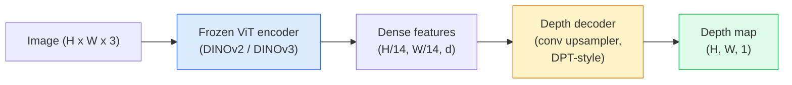

# 单目深度与几何估计（Monocular Depth & Geometry Estimation）

> 深度图是一张单通道图像，其中每个像素代表距离相机的距离。从单个 RGB 帧预测深度曾经必须依赖立体视觉或 LiDAR。2026 年，一个冻结的 ViT 编码器加上一个轻量级头部就能达到接近真实值的精度。

**Type:** Build + Use
**Languages:** Python
**Prerequisites:** Phase 4 Lesson 14 (ViT), Phase 4 Lesson 17 (Self-Supervised Vision), Phase 4 Lesson 07 (U-Net)
**Time:** ~60 minutes

## 学习目标（Learning Objectives）

- 区分相对深度与度量深度，并说明每个生产级模型（MiDaS、Marigold、Depth Anything V3、ZoeDepth）解决的是哪一种
- 使用 Depth Anything V3（DINOv2 骨干网络）为任意单张图像预测深度，无需校准
- 解释单目深度为何仅凭一张图像就能奏效（透视线索、纹理梯度、学习到的先验），以及它无法恢复什么（绝对尺度、被遮挡的几何结构）
- 使用深度图和针孔相机内参将二维检测提升为三维点

## 问题背景（The Problem）

深度是二维计算机视觉中缺失的一维。给定 RGB 图像，你知道物体在图像平面上的位置；但你不知道它们有多远。深度传感器（立体相机、LiDAR、飞行时间传感器）直接解决了这个问题，但成本高昂、易损坏，且作用距离有限。

单目深度估计——从单个 RGB 帧预测深度——曾经输出模糊且不可靠。到 2026 年，大型预训练编码器改变了这一状况：Depth Anything V3 使用冻结的 DINOv2 骨干网络，生成的深度图在室内、室外、医学和卫星领域都具有泛化能力。Marigold 将深度重新定义为条件扩散问题。ZoeDepth 回归真实的度量距离。

深度也是二维检测与三维理解之间的桥梁：将检测框的像素乘以深度，就能将二维物体提升到三维点云。这是每个 AR 遮挡系统、每个障碍物避让管道，以及每个"拿起杯子"的机器人的核心。

## 核心概念（The Concept）

### 相对深度与度量深度（Relative vs metric depth）

- **相对深度（Relative depth）** —— 有序的 `z` 值，没有真实世界单位。"像素 A 比像素 B 更近，但距离比率没有锚定到米。"
- **度量深度（Metric depth）** —— 距离相机的绝对距离，单位为米。需要模型学习图像线索与真实距离之间的统计关系。

MiDaS 和 Depth Anything V3 生成相对深度。Marigold 生成相对深度。ZoeDepth、UniDepth 和 Metric3D 生成度量深度。度量模型对内参敏感；相对模型则不是。

### 编码器-解码器模式（The encoder-decoder pattern）



Depth Anything V3 冻结编码器，仅训练 DPT 风格的解码器。编码器提供丰富的特征；解码器将它们插值回图像分辨率并回归深度。

### 单张图像为何能产生深度（Why a single image produces depth at all）

二维图像包含许多与深度相关的单目线索：

- **透视（Perspective）** —— 三维中的平行线在二维中汇聚。
- **纹理梯度（Texture gradient）** —— 远处的表面具有更小、更密集的纹理。
- **遮挡顺序（Occlusion order）** —— 较近的物体遮挡较远的物体。
- **大小恒常性（Size constancy）** —— 已知物体（汽车、人类）提供近似尺度。
- **大气透视（Atmospheric perspective）** —— 远处物体在户外场景中看起来更朦胧、更蓝。

在数十亿图像上训练的 ViT 将这些线索内在化了。有了足够的数据和强大的骨干网络，单目深度就能在没有显式三维监督的情况下达到合理的精度。

### 单目深度无法做什么（What monocular depth cannot do）

- **没有内参或场景中已知物体的绝对度量尺度**。网络可以预测"杯子比勺子远两倍"，而不知道杯子是 1 米还是 10 米远。
- **被遮挡的几何结构** —— 椅子的背面是不可见的，无法可靠推断。
- **完全没有纹理/反射的表面** —— 镜子、玻璃、均匀墙壁。网络报告的深度看似合理但实际上是错误的。

### 2026 年的 Depth Anything V3（Depth Anything V3 in 2026）

-  vanilla DINOv2 ViT-L/14 作为编码器（冻结）。
- DPT 解码器。
- 从多样化的来源在姿态图像对上进行训练（除了光度一致性之外不需要显式深度监督）。
- 预测**任意数量的视觉输入的空间一致几何结构，无论是否已知相机姿态**。
- 在单目深度、任意视角几何、视觉渲染、相机姿态估计方面达到 SOTA。

这是 2026 年需要深度时的默认选择。

### Marigold——用于深度的扩散模型（Marigold — diffusion for depth）

Marigold（Ke 等人，CVPR 2024）将深度估计重新定义为条件图像到图像扩散。条件：RGB。目标：深度图。使用预训练的 Stable Diffusion 2 U-Net 作为骨干。输出深度图在物体边界处异常清晰。权衡：比前馈模型推理更慢（10-50 个去噪步）。

### 内参与针孔相机（Intrinsics and the pinhole camera）

将深度为 `d` 的像素 `(u, v)` 提升到相机坐标系中的三维点 `(X, Y, Z)`：

```
fx, fy, cx, cy = camera intrinsics
X = (u - cx) * d / fx
Y = (v - cy) * d / fy
Z = d
```

内参来自 EXIF 元数据、校准图案，或单目内参估计器（Perspective Fields、UniDepth）。没有内参，你仍然可以通过假设 60-70° 视场角和中等分辨率的主点来渲染点云——适用于可视化，不适用于测量。

### 评估（Evaluation）

两个标准指标：

- **AbsRel**（绝对相对误差）：`mean(|d_pred - d_gt| / d_gt)`。越低越好。生产模型在 0.05-0.1 之间。
- **delta < 1.25**（阈值精度）：`max(d_pred/d_gt, d_gt/d_pred) < 1.25` 的像素所占比例。越高越好。SOTA 在 0.9+。

对于相对深度（Depth Anything V3、MiDaS），评估使用这两个指标的尺度-偏移不变版本。

```figure
depth-sweep
```

## 动手实现（Build It）

### 步骤 1：深度指标（Depth metrics）

```python
import torch

def abs_rel_error(pred, target, mask=None):
    if mask is not None:
        pred = pred[mask]
        target = target[mask]
    return (torch.abs(pred - target) / target.clamp(min=1e-6)).mean().item()


def delta_accuracy(pred, target, threshold=1.25, mask=None):
    if mask is not None:
        pred = pred[mask]
        target = target[mask]
    ratio = torch.maximum(pred / target.clamp(min=1e-6), target / pred.clamp(min=1e-6))
    return (ratio < threshold).float().mean().item()
```

评估前始终屏蔽无效深度像素（零、NaN、饱和）。

### 步骤 2：尺度-偏移对齐（Scale-and-shift alignment）

对于相对深度模型，在计算指标前将预测对齐到真实值。最小二乘拟合 `a * pred + b = target`：

```python
def align_scale_shift(pred, target, mask=None):
    if mask is not None:
        p = pred[mask]
        t = target[mask]
    else:
        p = pred.flatten()
        t = target.flatten()
    A = torch.stack([p, torch.ones_like(p)], dim=1)
    coeffs, *_ = torch.linalg.lstsq(A, t.unsqueeze(-1))
    a, b = coeffs[:2, 0]
    return a * pred + b
```

评估 MiDaS / Depth Anything 时，在 `abs_rel_error` 之前运行 `align_scale_shift`。

### 步骤 3：将深度提升为点云（Lift depth to a point cloud）

```python
import numpy as np

def depth_to_point_cloud(depth, intrinsics):
    H, W = depth.shape
    fx, fy, cx, cy = intrinsics
    v, u = np.meshgrid(np.arange(H), np.arange(W), indexing="ij")
    z = depth
    x = (u - cx) * z / fx
    y = (v - cy) * z / fy
    return np.stack([x, y, z], axis=-1)


depth = np.random.uniform(0.5, 4.0, (240, 320))
intr = (320.0, 320.0, 160.0, 120.0)
pc = depth_to_point_cloud(depth, intr)
print(f"point cloud shape: {pc.shape}  (H, W, 3)")
```

一个函数，适用于所有三维提升应用。将点云导出为 `.ply` 并在 MeshLab 或 CloudCompare 中打开。

### 步骤 4：使用合成深度场景进行冒烟测试（Smoke test with a synthetic depth scene）

```python
def synthetic_depth(size=96):
    yy, xx = np.meshgrid(np.arange(size), np.arange(size), indexing="ij")
    # Floor: linear gradient from near (top) to far (bottom)
    depth = 1.0 + (yy / size) * 4.0
    # Box in the middle: closer
    mask = (np.abs(xx - size / 2) < size / 6) & (np.abs(yy - size * 0.6) < size / 6)
    depth[mask] = 2.0
    return depth.astype(np.float32)


gt = torch.from_numpy(synthetic_depth(96))
pred = gt + 0.3 * torch.randn_like(gt)  # simulated prediction
aligned = align_scale_shift(pred, gt)
print(f"before align  absRel = {abs_rel_error(pred, gt):.3f}")
print(f"after align   absRel = {abs_rel_error(aligned, gt):.3f}")
```

### 步骤 5：Depth Anything V3 用法（参考）（Depth Anything V3 usage (reference)）

```python
import torch
from transformers import pipeline
from PIL import Image

pipe = pipeline(task="depth-estimation", model="LiheYoung/depth-anything-v2-large")

image = Image.open("street.jpg").convert("RGB")
out = pipe(image)
depth_np = np.array(out["depth"])
```

三行代码。`out["depth"]` 是 PIL 灰度图；转换为 numpy 以进行数学运算。对于 Depth Anything V3，一旦发布，只需更换模型 ID；API 不变。

## 应用实践（Use It）

- **Depth Anything V3**（Meta AI / ByteDance，2024-2026）—— 相对深度的默认选择。生产环境中 ViT-large 骨干模型最快。
- **Marigold**（ETH，2024）—— 视觉质量最高，推理速度慢。
- **UniDepth**（ETH，2024）—— 带相机内参估计的度量深度。
- **ZoeDepth**（Intel，2023）—— 度量深度；较旧，仍然可靠。
- **MiDaS v3.1** ——  legacy 但稳定；用于比较的好基线。

典型集成模式：

1. RGB 帧到达。
2. 深度模型生成深度图。
3. 检测器生成框。
4. 通过深度将框质心提升到三维；如有可用的点云则与之合并。
5. 下游应用：AR 遮挡、路径规划、物体尺寸估计、立体视觉替代。

对于实时应用，Depth Anything V2 Small（INT8 量化）在 518x518 分辨率下可在消费级 GPU 上达到约 30 fps。

## 交付清单（Ship It）

本课产出：

- `outputs/prompt-depth-model-picker.md` —— 根据延迟、度量/相对需求、场景类型在 Depth Anything V3、Marigold、UniDepth、MiDaS 之间做出选择。
- `outputs/skill-depth-to-pointcloud.md` —— 一个技能，使用正确的内参处理从深度图构建点云，并导出为 `.ply`。

## 练习（Exercises）

1. **(Easy)** 在你的桌面上任意 10 张图像上运行 Depth Anything V2。将深度保存为灰度 PNG 并检查。找出一个预测深度看起来错误的物体，并解释单目线索为何失效。
2. **(Medium)** 给定 Depth Anything V2 的 RGB + 深度，提升到点云并使用 `open3d` 渲染。比较两个场景（室内/室外），并指出哪一个看起来更可信。
3. **(Hard)** 取五对仅因某个已知物体的位置不同而不同的图像（例如，瓶子移近 30 cm）。使用 UniDepth 对两者预测度量深度。报告预测距离差值 vs 真实 30 cm。

## 关键术语（Key Terms）

| 术语 | 人们的说法 | 实际含义 |
|------|----------------|----------------------|
| Monocular depth | "单目深度" | 从单个 RGB 帧估计深度，无需立体视觉或 LiDAR |
| Relative depth | "有序深度" | 没有真实世界单位的有序 z 值 |
| Metric depth | "绝对距离" | 以米为单位的深度；需要校准或用度量监督训练的模型 |
| AbsRel | "绝对相对误差" | mean of \|d_pred - d_gt\| / d_gt 的平均值；标准深度指标 |
| Delta accuracy | "delta < 1.25" | 预测值在真实值 25% 以内的像素所占比例 |
| Pinhole camera | "fx, fy, cx, cy" | 用于将 (u, v, d) 提升到 (X, Y, Z) 的相机模型 |
| DPT | "密集预测 Transformer" | 用于深度估计的基于卷积的解码器，位于冻结的 ViT 编码器之上 |
| DINOv2 backbone | "它有效的理由" | 无需深度标签即可跨域泛化的自监督特征 |

## 延伸阅读（Further Reading）

- [Depth Anything V3 paper page](https://depth-anything.github.io/) — SOTA monocular depth with DINOv2 encoder
- [Marigold (Ke et al., CVPR 2024)](https://marigoldmonodepth.github.io/) — diffusion-based depth estimation
- [UniDepth (Piccinelli et al., 2024)](https://arxiv.org/abs/2403.18913) — metric depth with intrinsics
- [MiDaS v3.1 (Intel ISL)](https://github.com/isl-org/MiDaS) — the canonical relative-depth baseline
- [DINOv3 blog post (Meta)](https://ai.meta.com/blog/dinov3-self-supervised-vision-model/) — the encoder family that lifts depth accuracy
