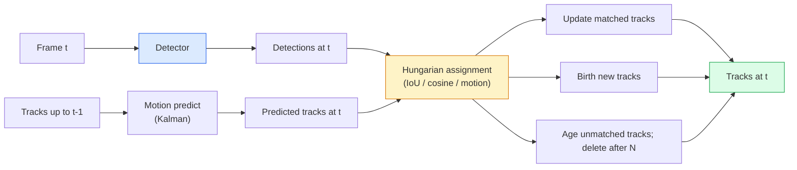

# 多目标跟踪与视频记忆（Multi-Object Tracking & Video Memory）

> 跟踪就是检测加上关联。每帧进行检测。将当前帧的检测与上一帧的轨迹按 ID 匹配。

**Type:** Build
**Languages:** Python
**Prerequisites:** Phase 4 Lesson 06 (YOLO Detection), Phase 4 Lesson 08 (Mask R-CNN), Phase 4 Lesson 24 (SAM 3)
**Time:** ~60 minutes

## 学习目标（Learning Objectives）

- 区分 tracking-by-detection 与 query-based tracking，并列举算法家族（SORT、DeepSORT、ByteTrack、BoT-SORT、SAM 2 memory tracker、SAM 3.1 Object Multiplex）
- 从零实现经典 tracking-by-detection 的 IoU + 匈牙利分配
- 解释 SAM 2 的记忆库以及它为何比基于 IoU 的关联更能处理遮挡
- 解读三个跟踪指标（MOTA、IDF1、HOTA），并为给定用例选择最相关的一个

## 问题背景（The Problem）

检测器告诉你单帧中物体的位置。跟踪器告诉你第 `t` 帧中的哪一个检测对应于第 `t-1` 帧中的同一个物体。没有跟踪，你就无法统计穿过线的物体数量，无法跟随一个球穿过遮挡，也无法知道"4 号车已经在车道里待了 8 秒"。

跟踪对每一个涉及视频的产品都至关重要：体育分析、监控、自动驾驶、医学视频分析、野生动物监测、标志计数。核心构建模块是共享的：逐帧检测器、运动模型（卡尔曼滤波器或更复杂的模型）、关联步骤（在 IoU/余弦/学习到的特征上使用匈牙利算法）以及轨迹生命周期（出生、更新、死亡）。

2026 年出现了两种新模式：**基于记忆的 SAM 2 跟踪**（用特征记忆替代运动模型关联）和 **SAM 3.1 Object Multiplex**（同一概念的多个实例共享记忆）。本课先讲解经典技术栈，然后是基于记忆的方法。

## 核心概念（The Concept）

### 通过检测进行跟踪（Tracking-by-detection）



2026 年你遇到的所有跟踪器都是这个循环的变体。区别在于：

- **SORT**（2016）：卡尔曼滤波器 + IoU 匈牙利。简单、快速，没有外观模型。
- **DeepSORT**（2017）：SORT + 基于 CNN 的轨迹外观特征（ReID 嵌入）。更好地处理交叉。
- **ByteTrack**（2021）：将低置信度检测作为第二阶段进行关联；不需要外观特征，但在 MOT17 上表现最佳。
- **BoT-SORT**（2022）：Byte + 相机运动补偿 + ReID。
- **StrongSORT / OC-SORT** —— ByteTrack 的后代，具有更好的运动和外观。

### 卡尔曼滤波一句话解释（Kalman filter in one paragraph）

卡尔曼滤波器维护每个轨迹的状态 `(x, y, w, h, dx, dy, dw, dh)` 以及协方差。在每一帧，使用恒定速度模型**预测**状态，然后**更新**匹配到的检测。当预测不确定性高时，更新更信任检测。这提供了平滑的轨迹，以及通过短时间遮挡（1-5 帧）继续轨迹的能力。

每个经典跟踪器在运动预测步骤中都使用卡尔曼滤波器。

### 匈牙利算法（The Hungarian algorithm）

给定 `M x N` 代价矩阵（轨迹 x 检测），找到最小化总代价的一对一分配。代价通常是 `1 - IoU(track_bbox, detection_bbox)` 或外观特征的负余弦相似度。运行时间是 O((M+N)^3)；对于最多约 1000 的 M、N，通过 `scipy.optimize.linear_sum_assignment` 在 Python 中足够快。

### ByteTrack 的核心思想（ByteTrack's key idea）

标准跟踪器丢弃低置信度检测（< 0.5）。ByteTrack 将它们保留为**第二阶段候选**：在将轨迹与高置信度检测匹配后，未匹配的轨迹尝试以稍宽松的 IoU 阈值匹配低置信度检测。恢复短暂遮挡、人群附近的 ID 切换。

### 基于记忆的 SAM 2 跟踪（SAM 2 memory-based tracking）

SAM 2 通过保留每个实例的时空特征**记忆库**来处理视频。给定一帧上的提示（点击、框、文本），它将实例编码到记忆中。在后续帧中，记忆与新帧的特征进行交叉注意力，解码器为新帧中的同一实例生成掩码。

没有卡尔曼滤波器，没有匈牙利分配。关联隐含在记忆-注意力操作中。

优点：
- 对大规模遮挡具有鲁棒性（记忆在多个帧中保持实例身份）。
- 结合 SAM 3 的文本提示时具有开放词汇能力。
- 不需要单独的运动模型。

缺点：
- 对于多目标跟踪，比 ByteTrack 慢。
- 记忆库增长；限制上下文窗口。

### SAM 3.1 Object Multiplex

之前的 SAM 2 / SAM 3 跟踪为每个实例保留一个独立的记忆库。对于 50 个物体，就是 50 个记忆库。Object Multiplex（2026 年 3 月）将它们合并为一个共享记忆，并带有**每个实例的查询词元**。成本随实例数量亚线性扩展。

Multiplex 是 2026 年人群跟踪的新默认选择：音乐会人群、仓库工人、交通路口。

### 需要了解的三个指标（Three metrics to know）

- **MOTA（多目标跟踪精度）** —— 1 - (FN + FP + ID 切换) / GT。按错误类型加权；一个同时混淆检测和关联失败的单一指标。
- **IDF1（ID F1）** —— ID 精确率和召回率的调和平均值。专门关注每个真实轨迹随时间保持其 ID 的程度。对于 ID 切换敏感的任务，比 MOTA 更好。
- **HOTA（高阶跟踪精度）** —— 分解为检测精度（DetA）和关联精度（AssA）。自 2020 年以来的社区标准；最全面。

对于监控（谁是谁）：报告 IDF1。对于体育分析（统计传球）：HOTA。对于通用学术比较：HOTA。

```figure
cv3-track-assoc
```

## 动手实现（Build It）

### 步骤 1：基于 IoU 的代价矩阵（IoU-based cost matrix）

```python
import numpy as np


def bbox_iou(a, b):
    """
    a, b: (N, 4) arrays of [x1, y1, x2, y2].
    Returns (N_a, N_b) IoU matrix.
    """
    ax1, ay1, ax2, ay2 = a[:, 0], a[:, 1], a[:, 2], a[:, 3]
    bx1, by1, bx2, by2 = b[:, 0], b[:, 1], b[:, 2], b[:, 3]
    inter_x1 = np.maximum(ax1[:, None], bx1[None, :])
    inter_y1 = np.maximum(ay1[:, None], by1[None, :])
    inter_x2 = np.minimum(ax2[:, None], bx2[None, :])
    inter_y2 = np.minimum(ay2[:, None], by2[None, :])
    inter = np.clip(inter_x2 - inter_x1, 0, None) * np.clip(inter_y2 - inter_y1, 0, None)
    area_a = (ax2 - ax1) * (ay2 - ay1)
    area_b = (bx2 - bx1) * (by2 - by1)
    union = area_a[:, None] + area_b[None, :] - inter
    return inter / np.clip(union, 1e-8, None)
```

### 步骤 2：极简 SORT 风格跟踪器（Minimal SORT-style tracker）

为了简洁，省略了固定恒定速度卡尔曼滤波器——我们这里使用简单的 IoU 关联；在生产环境中卡尔曼预测步骤是必不可少的。`sort` Python 包提供了完整版本。

```python
from scipy.optimize import linear_sum_assignment


class Track:
    def __init__(self, tid, bbox, frame):
        self.id = tid
        self.bbox = bbox
        self.last_frame = frame
        self.hits = 1

    def update(self, bbox, frame):
        self.bbox = bbox
        self.last_frame = frame
        self.hits += 1


class SimpleTracker:
    def __init__(self, iou_threshold=0.3, max_age=5):
        self.tracks = []
        self.next_id = 1
        self.iou_threshold = iou_threshold
        self.max_age = max_age

    def step(self, detections, frame):
        if not self.tracks:
            for d in detections:
                self.tracks.append(Track(self.next_id, d, frame))
                self.next_id += 1
            return [(t.id, t.bbox) for t in self.tracks]

        track_boxes = np.array([t.bbox for t in self.tracks])
        det_boxes = np.array(detections) if len(detections) else np.empty((0, 4))

        iou = bbox_iou(track_boxes, det_boxes) if len(det_boxes) else np.zeros((len(track_boxes), 0))
        cost = 1 - iou
        cost[iou < self.iou_threshold] = 1e6

        matched_track = set()
        matched_det = set()
        if cost.size > 0:
            row, col = linear_sum_assignment(cost)
            for r, c in zip(row, col):
                if cost[r, c] < 1.0:
                    self.tracks[r].update(det_boxes[c], frame)
                    matched_track.add(r); matched_det.add(c)

        for i, d in enumerate(det_boxes):
            if i not in matched_det:
                self.tracks.append(Track(self.next_id, d, frame))
                self.next_id += 1

        self.tracks = [t for t in self.tracks if frame - t.last_frame <= self.max_age]
        return [(t.id, t.bbox) for t in self.tracks]
```

60 行代码。接收逐帧检测，返回逐帧轨迹 ID。真实系统会增加卡尔曼预测、ByteTrack 的第二阶段重新匹配以及外观特征。

### 步骤 3：合成轨迹测试（Synthetic trajectory test）

```python
def synthetic_frames(num_frames=20, num_objects=3, H=240, W=320, seed=0):
    rng = np.random.default_rng(seed)
    starts = rng.uniform(20, 200, size=(num_objects, 2))
    velocities = rng.uniform(-5, 5, size=(num_objects, 2))
    frames = []
    for f in range(num_frames):
        dets = []
        for i in range(num_objects):
            cx, cy = starts[i] + f * velocities[i]
            dets.append([cx - 10, cy - 10, cx + 10, cy + 10])
        frames.append(dets)
    return frames


tracker = SimpleTracker()
for f, dets in enumerate(synthetic_frames()):
    tracks = tracker.step(dets, f)
```

三个沿直线运动的对象应在所有 20 帧中保持其 ID。

### 步骤 4：ID 切换指标（ID-switch metric）

```python
def count_id_switches(tracks_per_frame, gt_per_frame):
    """
    tracks_per_frame:  list of list of (track_id, bbox)
    gt_per_frame:      list of list of (gt_id, bbox)
    Returns number of ID switches.
    """
    prev_assignment = {}
    switches = 0
    for tracks, gts in zip(tracks_per_frame, gt_per_frame):
        if not tracks or not gts:
            continue
        t_boxes = np.array([b for _, b in tracks])
        g_boxes = np.array([b for _, b in gts])
        iou = bbox_iou(g_boxes, t_boxes)
        for g_idx, (gt_id, _) in enumerate(gts):
            j = iou[g_idx].argmax()
            if iou[g_idx, j] > 0.5:
                t_id = tracks[j][0]
                if gt_id in prev_assignment and prev_assignment[gt_id] != t_id:
                    switches += 1
                prev_assignment[gt_id] = t_id
    return switches
```

这是简化的 IDF1 相关指标：计算真实对象分配到的预测轨迹 ID 变化的次数。真实的 MOTA / IDF1 / HOTA 工具位于 `py-motmetrics` 和 `TrackEval` 中。

## 应用实践（Use It）

2026 年的生产级跟踪器：

- `ultralytics` —— YOLOv8 + ByteTrack / BoT-SORT 内置。`results = model.track(source, tracker="bytetrack.yaml")`。默认选择。
- `supervision`（Roboflow）—— ByteTrack 包装器以及标注工具。
- SAM 2 / SAM 3.1 —— 通过 `processor.track()` 进行基于记忆的跟踪。
- 自定义技术栈：检测器（YOLOv8 / RT-DETR）+ `sort-tracker` / `OC-SORT` / `StrongSORT`。

选择建议：

- 行人/汽车/框，30+ fps：**使用 ultralytics 的 ByteTrack**。
- 人群中同一类的许多实例：**SAM 3.1 Object Multiplex**。
- 具有可识别外观的严重遮挡：**DeepSORT / StrongSORT**（ReID 特征）。
- 体育/复杂交互：**BoT-SORT** 或学习的跟踪器（MOTRv3）。

## 交付清单（Ship It）

本课产出：

- `outputs/prompt-tracker-picker.md` —— 根据场景类型、遮挡模式和延迟预算在 SORT / ByteTrack / BoT-SORT / SAM 2 / SAM 3.1 之间做出选择。
- `outputs/skill-mot-evaluator.md` —— 编写完整的 MOTA / IDF1 / HOTA 评估工具，针对真实轨迹进行测试。

## 练习（Exercises）

1. **(Easy)** 使用上述合成跟踪器，分别运行 3、10 和 30 个对象。报告每种情况下的 ID 切换次数。找出仅使用 IoU 关联开始失效的位置。
2. **(Medium)** 在关联之前添加恒定速度卡尔曼预测步骤。证明短（2-3 帧）遮挡不再导致 ID 切换。
3. **(Hard)** 通过 `transformers` 集成 SAM 2 的基于记忆的跟踪器作为替代跟踪器后端。在 30 秒的人群片段上同时运行 SimpleTracker 和 SAM 2，并比较 ID 切换次数，手动标记 5 个显著人物的真实轨迹 ID。

## 关键术语（Key Terms）

| 术语 | 人们的说法 | 实际含义 |
|------|----------------|----------------------|
| Tracking-by-detection | "先检测再关联" | 逐帧检测器 + 在 IoU/外观上的匈牙利分配 |
| Kalman filter | "运动预测" | 用于平滑轨迹预测和遮挡处理的线性动力学 + 协方差 |
| Hungarian algorithm | "最优分配" | 解决最小代价二分匹配问题；`scipy.optimize.linear_sum_assignment` |
| ByteTrack | "低置信度第二遍" | 将未匹配轨迹重新匹配到低置信度检测以恢复短暂遮挡 |
| DeepSORT | "SORT + 外观" | 添加 ReID 特征以进行跨帧匹配；更好地保持 ID |
| Memory bank | "SAM 2 技巧" | 跨帧存储的每个实例时空特征；交叉注意力替代显式关联 |
| Object Multiplex | "SAM 3.1 共享记忆" | 具有每个实例查询的单一共享记忆，用于快速多目标跟踪 |
| HOTA | "现代跟踪指标" | 分解为检测和关联精度；社区标准 |

## 延伸阅读（Further Reading）

- [SORT (Bewley et al., 2016)](https://arxiv.org/abs/1602.00763) — the minimal tracking-by-detection paper
- [DeepSORT (Wojke et al., 2017)](https://arxiv.org/abs/1703.07402) — adds appearance feature
- [ByteTrack (Zhang et al., 2022)](https://arxiv.org/abs/2110.06864) — low-confidence second pass
- [BoT-SORT (Aharon et al., 2022)](https://arxiv.org/abs/2206.14651) — camera motion compensation
- [HOTA (Luiten et al., 2020)](https://arxiv.org/abs/2009.07736) — decomposed tracking metric
- [SAM 2 video segmentation (Meta, 2024)](https://ai.meta.com/sam2/) — memory-based tracker
- [SAM 3.1 Object Multiplex (Meta, March 2026)](https://ai.meta.com/blog/segment-anything-model-3/)
