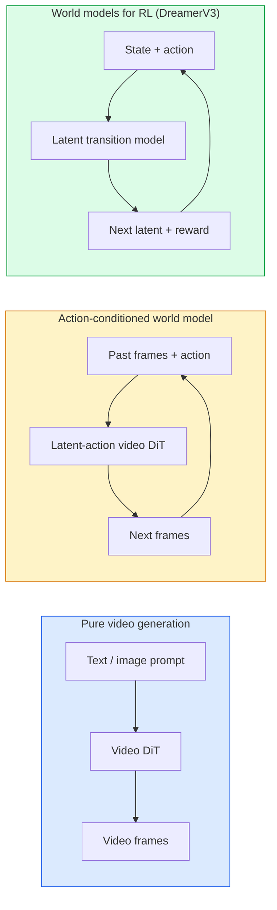

# 世界模型与视频扩散（World Models & Video Diffusion）

> 能够预测场景接下来几秒的视频模型就是世界模拟器。若以动作为条件进行该预测，你就拥有了一台可学习的游戏引擎。

**Type:** Learn + Build
**Languages:** Python
**Prerequisites:** Phase 4 Lesson 10 (Diffusion), Phase 4 Lesson 12 (Video Understanding), Phase 4 Lesson 23 (DiT + Rectified Flow)
**Time:** ~75 minutes

## 学习目标（Learning Objectives）

- 解释纯视频生成模型（Sora 2）与动作条件世界模型（Genie 3、DreamerV3）之间的区别
- 描述视频 DiT：时空词块、三维位置编码、跨 (T, H, W) 词元的联合注意力
- 追踪世界模型如何接入机器人技术栈：VLM 规划 → 视频模型模拟 → 逆动力学发出动作
- 为给定用例（创意视频、交互式模拟、自动驾驶合成）在 Sora 2、Genie 3、Runway GWM-1 Worlds、Wan-Video 和 HunyuanVideo 之间做出选择

## 问题背景（The Problem）

视频生成和世界模型在 2026 年汇聚。能够生成连贯一分钟视频的模型，在某种意义上已经学会了世界如何运动：物体持久性、重力、因果关系、风格。若以动作为条件进行该预测（向左走、打开门），视频模型就变成了可学习的模拟器，可以替代游戏引擎、驾驶模拟器或机器人环境。

这有着实实在在的影响。Genie 3 从单张图像生成可玩的环境。Runway GWM-1 Worlds 合成无限可探索的场景。Sora 2 生成带同步音频和物理建模的一分钟视频。NVIDIA Cosmos-Drive、Wayve Gaia-2 和 Tesla DrivingWorld 生成逼真的驾驶视频，用于自动驾驶训练数据。世界模型范式正在悄然接管机器人技术的 sim-to-real。

本课是第 4 阶段的"大局观"课程。它将图像生成、视频理解和智能体推理连接为当前主导研究的架构模式。

## 核心概念（The Concept）

### 世界模型的三大家族（Three families of world-modelling）



- **Sora 2** 是纯视频生成，以提示词为条件。没有动作接口。你无法在生成过程中操控它。
- **Genie 3**、**GWM-1 Worlds**、**Mirage / Magica** 是动作条件世界模型。从观测视频推断潜空间动作，然后根据动作条件未来帧预测。交互式——你按键或移动相机，场景会响应。
- **DreamerV3** 和经典 RL 世界模型家族在潜空间中预测，具有显式动作条件，在奖励信号上训练。视觉性较弱；对样本高效的 RL 更有用。

### 视频 DiT 架构（Video DiT architecture）

```
Video latent:          (C, T, H, W)
Patchify (spatial):    grid of P_h x P_w patches per frame
Patchify (temporal):   group P_t frames into a temporal patch
Resulting tokens:      (T / P_t) * (H / P_h) * (W / P_w) tokens
```

位置编码是三维的：每个 (t, h, w) 坐标的旋转或学习嵌入。注意力可以是：

- **Full joint** —— 所有词元都关注所有词元。O(N^2)，N 为词元数。对于长视频来说计算成本过高。
- **Divided** —— 交替时间注意力（相同空间位置，跨时间：`(H*W) * T^2`）和空间注意力（相同时间步，跨空间：`T * (H*W)^2`）。TimeSformer 和大多数视频 DiT 使用此方法。
- **Window** —— (t, h, w) 中的局部窗口。Video Swin 使用。

每个 2026 视频扩散模型都使用这三种模式之一，加上 AdaLN 条件（第 23 课）和 rectified flow。

### 基于动作的条件生成：潜空间动作模型（Conditioning on actions: latent action models）

Genie 通过对连续帧之间的动作进行判别预测来学习每帧的**潜空间动作**。模型的解码器随后以推断出的潜空间动作为条件——而非显式的键盘按键。在推理时，用户可以指定一个潜空间动作（或从新的先验中采样），模型生成与该动作一致的下一帧。

Sora 完全跳过了动作接口。它的解码器根据过去的时空词元预测下一个时空词元。提示词条件化开始；没有任何东西可以在生成过程中操控它。

### 物理合理性（Physical plausibility）

Sora 2 的 2026 版本明确宣传了**物理合理性**：重量、平衡、物体持久性、因果关系。团队通过人工评级的合理性分数进行测量；该模型在掉落物体、角色碰撞和有意的失败（一次失败的跳跃）方面明显优于 Sora 1。

合理性仍然是主要的故障模式。2024-2025 年人们吃意大利面或从杯子里喝水的视频揭示了模型缺乏持久对象表示。2026 年模型（Sora 2、Runway Gen-5、HunyuanVideo）减少了但并未消除这些问题。

### 自动驾驶世界模型（Autonomous driving world models）

驾驶世界模型根据轨迹、边界框或导航地图生成逼真的道路场景。用途：

- **Cosmos-Drive-Dreams**（NVIDIA）—— 生成数分钟驾驶视频用于 RL 训练。
- **Gaia-2**（Wayve）—— 用于策略评估的轨迹条件场景合成。
- **DrivingWorld**（Tesla）—— 模拟多样化的天气、一天中的时间、交通条件。
- **Vista**（ByteDance）—— 反应式驾驶场景合成。

它们替代了昂贵的真实世界数据收集，用于否则需要数百万英里驾驶的极端情况——夜间行人乱穿马路、结冰的交叉路口、不寻常的车辆类型。

### 机器人技术栈：VLM + 视频模型 + 逆动力学（Robotics stack: VLM + video model + inverse dynamics）

新兴的三组件机器人循环：

1. **VLM** 解析目标（"拿起红色杯子"），规划高级动作序列。
2. **视频生成模型** 模拟执行每个动作会是什么样子——预测 N 帧之后的观测结果。
3. **逆动力学模型** 提取产生这些观测结果的具体电机命令。

这替代了奖励塑形和样本密集的 RL。世界模型负责想象；逆动力学将执行闭环。Genie Envisioner 是一个实例；许多研究小组正在汇聚于这一结构。

### 评估（Evaluation）

- **视觉质量** —— FVD（Fréchet Video Distance）、用户研究。
- **提示词对齐** —— 每帧 CLIPScore、VQA 风格评估。
- **物理合理性** —— 在基准套件上进行人工评级（Sora 2 的内部基准、VBench）。
- **可控性**（对于交互式世界模型）—— 动作到观察的一致性；你能回到之前的状态吗？

### 2026 年模型格局（Model landscape in 2026）

| 模型 | 用途 | 参数量 | 输出 | 许可证 |
|-------|-----|------------|--------|---------|
| Sora 2 | text-to-video, audio | — | 1-min 1080p + audio | API only |
| Runway Gen-5 | text/image-to-video | — | 10s clips | API |
| Runway GWM-1 Worlds | interactive world | — | infinite 3D rollout | API |
| Genie 3 | interactive world from image | 11B+ | playable frames | research preview |
| Wan-Video 2.1 | open text-to-video | 14B | high-quality clips | non-commercial |
| HunyuanVideo | open text-to-video | 13B | 10s clips | permissive |
| Cosmos / Cosmos-Drive | autonomous driving sim | 7-14B | driving scenes | NVIDIA open |
| Magica / Mirage 2 | AI-native game engine | — | modifiable worlds | product |

```figure
v4-world-rollout
```

## 动手实现（Build It）

### 步骤 1：视频三维词块化（3D patchify for video）

```python
import torch
import torch.nn as nn


class VideoPatch3D(nn.Module):
    def __init__(self, in_channels=4, dim=64, patch_t=2, patch_h=2, patch_w=2):
        super().__init__()
        self.proj = nn.Conv3d(
            in_channels, dim,
            kernel_size=(patch_t, patch_h, patch_w),
            stride=(patch_t, patch_h, patch_w),
        )
        self.patch_t = patch_t
        self.patch_h = patch_h
        self.patch_w = patch_w

    def forward(self, x):
        # x: (N, C, T, H, W)
        x = self.proj(x)
        n, c, t, h, w = x.shape
        tokens = x.reshape(n, c, t * h * w).transpose(1, 2)
        return tokens, (t, h, w)
```

步长等于核大小的 3D 卷积充当时空词块化器。`(T, H, W) -> (T/2, H/2, W/2)` 词元网格。

### 步骤 2：三维旋转位置编码（3D rotary position encoding）

旋转位置嵌入（RoPE）分别应用于 `t`、`h`、`w` 轴：

```python
def rope_3d(tokens, t_dim, h_dim, w_dim, grid):
    """
    tokens: (N, T*H*W, D)
    grid: (T, H, W) sizes
    t_dim + h_dim + w_dim == D
    """
    T, H, W = grid
    n, seq, d = tokens.shape
    if t_dim + h_dim + w_dim != d:
        raise ValueError(f"t_dim+h_dim+w_dim ({t_dim}+{h_dim}+{w_dim}) must equal D={d}")
    assert seq == T * H * W
    t_idx = torch.arange(T, device=tokens.device).repeat_interleave(H * W)
    h_idx = torch.arange(H, device=tokens.device).repeat_interleave(W).repeat(T)
    w_idx = torch.arange(W, device=tokens.device).repeat(T * H)
    # Simplified: just scale channels by frequencies. Real RoPE rotates pairs.
    freqs_t = torch.exp(-torch.log(torch.tensor(10000.0)) * torch.arange(t_dim // 2, device=tokens.device) / (t_dim // 2))
    freqs_h = torch.exp(-torch.log(torch.tensor(10000.0)) * torch.arange(h_dim // 2, device=tokens.device) / (h_dim // 2))
    freqs_w = torch.exp(-torch.log(torch.tensor(10000.0)) * torch.arange(w_dim // 2, device=tokens.device) / (w_dim // 2))
    emb_t = torch.cat([torch.sin(t_idx[:, None] * freqs_t), torch.cos(t_idx[:, None] * freqs_t)], dim=-1)
    emb_h = torch.cat([torch.sin(h_idx[:, None] * freqs_h), torch.cos(h_idx[:, None] * freqs_h)], dim=-1)
    emb_w = torch.cat([torch.sin(w_idx[:, None] * freqs_w), torch.cos(w_idx[:, None] * freqs_w)], dim=-1)
    return tokens + torch.cat([emb_t, emb_h, emb_w], dim=-1)
```

简化的加法形式。真正的 RoPE 在频率下旋转配对通道；位置信息是相同的。

### 步骤 3：分块注意力模块（Divided attention block）

```python
class DividedAttentionBlock(nn.Module):
    def __init__(self, dim=64, heads=2):
        super().__init__()
        self.time_attn = nn.MultiheadAttention(dim, heads, batch_first=True)
        self.space_attn = nn.MultiheadAttention(dim, heads, batch_first=True)
        self.ln1 = nn.LayerNorm(dim)
        self.ln2 = nn.LayerNorm(dim)
        self.ln3 = nn.LayerNorm(dim)
        self.mlp = nn.Sequential(nn.Linear(dim, 4 * dim), nn.GELU(), nn.Linear(4 * dim, dim))

    def forward(self, x, grid):
        T, H, W = grid
        n, seq, d = x.shape
        # time attention: same (h, w), across t
        xt = x.view(n, T, H * W, d).permute(0, 2, 1, 3).reshape(n * H * W, T, d)
        a, _ = self.time_attn(self.ln1(xt), self.ln1(xt), self.ln1(xt), need_weights=False)
        xt = (xt + a).reshape(n, H * W, T, d).permute(0, 2, 1, 3).reshape(n, seq, d)
        # space attention: same t, across (h, w)
        xs = xt.view(n, T, H * W, d).reshape(n * T, H * W, d)
        a, _ = self.space_attn(self.ln2(xs), self.ln2(xs), self.ln2(xs), need_weights=False)
        xs = (xs + a).reshape(n, T, H * W, d).reshape(n, seq, d)
        xs = xs + self.mlp(self.ln3(xs))
        return xs
```

时间注意力在每个空间位置内跨时间进行；空间注意力在每个时间步内跨位置进行。两个 O(T^2 + (HW)^2) 操作代替一个 O((THW)^2)。这是 TimeSformer 和每个现代视频 DiT 的核心。

### 步骤 4：构建微型视频 DiT（Compose a tiny video DiT）

```python
class TinyVideoDiT(nn.Module):
    def __init__(self, in_channels=4, dim=64, depth=2, heads=2):
        super().__init__()
        self.patch = VideoPatch3D(in_channels=in_channels, dim=dim, patch_t=2, patch_h=2, patch_w=2)
        self.blocks = nn.ModuleList([DividedAttentionBlock(dim, heads) for _ in range(depth)])
        self.out = nn.Linear(dim, in_channels * 2 * 2 * 2)

    def forward(self, x):
        tokens, grid = self.patch(x)
        for blk in self.blocks:
            tokens = blk(tokens, grid)
        return self.out(tokens), grid
```

不是一个可工作的视频生成器；而是一个结构演示，每个部件都正确组合。

### 步骤 5：检查形状（Check shapes）

```python
vid = torch.randn(1, 4, 8, 16, 16)  # (N, C, T, H, W)
model = TinyVideoDiT()
out, grid = model(vid)
print(f"input  {tuple(vid.shape)}")
print(f"tokens grid {grid}")
print(f"output {tuple(out.shape)}")
```

期望 `grid = (4, 8, 8)` 和 `out = (1, 256, 32)` 词块化之后；头部然后投影到每个词元的时空词块，准备被反词块化回视频。

## 应用实践（Use It）

2026 年的生产访问模式：

- **Sora 2 API**（OpenAI）—— text-to-video，同步音频。高级定价。
- **Runway Gen-5 / GWM-1**（Runway）—— image-to-video，交互式世界。
- **Wan-Video 2.1 / HunyuanVideo** —— 开源自托管。
- **Cosmos / Cosmos-Drive**（NVIDIA）—— 驾驶模拟开源权重。
- **Genie 3** —— 研究预览，申请访问。

构建交互式世界模型演示：从 Wan-Video 开始以获得质量，叠加潜空间动作适配器以增加交互性。对于自动驾驶模拟：Cosmos-Drive 是 2026 年开放参考。

对于机器人技术，实际应用中的技术栈：

1. 语言目标 -> VLM（Qwen3-VL）-> 高级计划。
2. 计划 -> 潜空间动作视频模型 -> 想象的展开。
3. 展开 -> 逆动力学模型 -> 低级动作。
4. 执行动作 -> 观测结果反馈到步骤 1。

## 交付清单（Ship It）

本课产出：

- `outputs/prompt-video-model-picker.md` —— 根据任务、许可证和延迟在 Sora 2 / Runway / Wan / HunyuanVideo / Cosmos 之间做出选择。
- `outputs/skill-physical-plausibility-checks.md` —— 一个技能，定义在任何生成视频发布之前运行的自动检查（物体持久性、重力、连续性）。

## 练习（Exercises）

1. **(Easy)** 计算一个 5 秒 360p 视频在 patch-t=2、patch-h=8、patch-w=8 时的词元数。推理此尺寸下注意力的内存需求。
2. **(Medium)** 将上述分块注意力模块替换为完整联合注意力模块，并测量形状和参数量。解释为什么分块注意力对于真实视频模型是必要的。
3. **(Hard)** 构建一个极简潜空间动作视频模型：取一个 (frame_t, action_t, frame_{t+1}) 三元组数据集（任何简单的 2D 游戏），训练一个以动作嵌入为条件的微型视频 DiT，并证明不同的动作产生不同的下一帧。

## 关键术语（Key Terms）

| 术语 | 人们的说法 | 实际含义 |
|------|----------------|----------------------|
| World model | "学习的模拟器" | 给定状态和动作预测未来观测的模型 |
| Video DiT | "时空 transformer" | 具有三维词块化和分块注意力的扩散 transformer |
| Latent action | "推断的控制" | 从帧对推断的离散或连续动作潜空间；用于条件化下一帧生成 |
| Divided attention | "时间然后空间" | 每个模块中的两个注意力操作——先跨时间再跨空间——以保持 O(N^2) 可控 |
| Object permanence | "事物保持真实" | 视频模型必须学习的场景属性；食物、玻璃器皿的经典故障模式 |
| FVD | "Fréchet Video Distance" | 视频等效于 FID；主要视觉质量指标 |
| Inverse dynamics model | "观测到动作" | 给定（状态，下一状态），输出连接它们的动作；闭环机器人技术 |
| Cosmos-Drive | "NVIDIA 驾驶模拟器" | 用于 RL 和评估的开源权重自动驾驶世界模型 |

## 延伸阅读（Further Reading）

- [Sora technical report (OpenAI)](https://openai.com/index/video-generation-models-as-world-simulators/)
- [Genie: Generative Interactive Environments (Bruce et al., 2024)](https://arxiv.org/abs/2402.15391) — latent action world models
- [TimeSformer (Bertasius et al., 2021)](https://arxiv.org/abs/2102.05095) — divided attention for video transformers
- [DreamerV3 (Hafner et al., 2023)](https://arxiv.org/abs/2301.04104) — world models for RL
- [Cosmos-Drive-Dreams (NVIDIA, 2025)](https://research.nvidia.com/labs/toronto-ai/cosmos-drive-dreams/) — driving world model
- [Top 10 Video Generation Models 2026 (DataCamp)](https://www.datacamp.com/blog/top-video-generation-models)
- [From Video Generation to World Model — survey repo](https://github.com/ziqihuangg/Awesome-From-Video-Generation-to-World-Model/)
