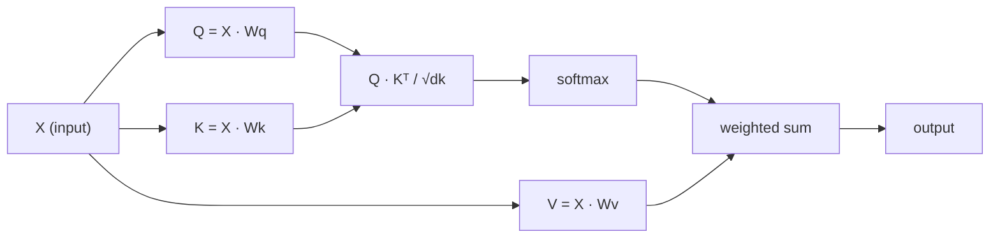

# Self-Attention from Scratch（从零实现自注意力）

> Attention is a lookup table where every word asks "who matters to me?" - and learns the answer.
> 注意力是一张查找表，每个词都在问"谁对我重要？"——并学会答案。

**Type:** Build
**Languages:** Python
**Prerequisites:** Phase 3 (Deep Learning Core), Phase 5 Lesson 10 (Sequence-to-Sequence)
**Time:** ~90 minutes

## Learning Objectives（学习目标）

- Implement scaled dot-product self-attention from scratch using only NumPy, including query/key/value projections and the softmax-weighted sum
  仅使用 NumPy 从零实现缩放点积自注意力，包括查询/键/值投影和 softmax 加权和
- Build a multi-head attention layer that splits heads, computes parallel attention, and concatenates results
  构建一个多头注意力层，它分割头、计算并行注意力、并连接结果
- Trace how the attention matrix captures token relationships and explain why scaling by sqrt(d_k) prevents softmax saturation
  追踪注意力矩阵如何捕获 token 关系，并解释为什么用 sqrt(d_k) 缩放能防止 softmax 饱和
- Apply causal masking to convert bidirectional attention into autoregressive (decoder-style) attention
  应用因果掩码，将双向注意力转换为自回归（解码器风格）注意力

## The Problem（问题）

RNNs process sequences one token at a time. By the time you reach token 50, the information from token 1 has been squeezed through 50 compression steps. Long-range dependencies get crushed into a fixed-size hidden state - a bottleneck that no amount of LSTM gating fully solves.
RNN 一次处理一个 token。当你到达 token 50 时，token 1 的信息已经被挤压通过 50 个压缩步骤。长程依赖被压碎进一个固定大小的隐藏状态——一个 LSTM 门控无论如何也无法完全解决的瓶颈。

The 2014 Bahdanau attention paper showed the fix: let the decoder look back at every encoder position and decide which ones matter for the current step. But it was still bolted onto an RNN. The 2017 "Attention Is All You Need" paper asked a sharper question: what if attention is the *only* mechanism? No recurrence. No convolution. Just attention.
2014 年的 Bahdanau 注意力论文展示了修复方法：让解码器回看每个编码器位置并决定哪些对当前步骤重要。但它仍然 bolt 到 RNN 上。2017 年的"Attention Is All You Need"论文问了一个更尖锐的问题：如果注意力是*唯一*机制会怎样？没有循环。没有卷积。只有注意力。

Self-attention lets every position in a sequence attend to every other position in a single parallel step. That is what makes transformers fast, scalable, and dominant.
自注意力让序列中的每个位置在一个并行步骤中关注每个其他位置。这就是使 transformer 快速、可扩展、主导的原因。

## The Concept（概念）

### The Database Lookup Analogy（数据库查找类比）

Think of attention as a soft database lookup:
把注意力想象成一个软数据库查找：

```
Traditional database:
  Query: "capital of France"  -->  exact match  -->  "Paris"

Attention:
  Query: "capital of France"  -->  similarity to ALL keys  -->  weighted blend of ALL values
```

Every token generates three vectors:
每个 token 生成三个向量：

- **Query (Q)（查询（Q）): ** "What am I looking for?"
  "我在找什么？"
- **Key (K)（键（K）): ** "What do I contain?"
  "我包含什么？"
- **Value (V)（值（V）): ** "What information do I provide if selected?"
  "如果我被选中，我提供什么信息？"

The dot product between a query and all keys produces attention scores. High score means "this key matches my query." Those scores weight the values. The output is a weighted sum of values.
查询和所有键之间的点积产生注意力分数。高分意味着"这个键匹配我的查询"。这些分数为值加权。输出是值的加权和。

### Q, K, V Computation（Q、K、V 计算）

Each token embedding gets projected through three learned weight matrices:
每个 token 嵌入通过三个学习的权重矩阵投影：

```
Input embeddings (sequence of n tokens, each d-dimensional):

  X = [x1, x2, x3, ..., xn]       shape: (n, d)

Three weight matrices:

  Wq  shape: (d, dk)
  Wk  shape: (d, dk)
  Wv  shape: (d, dv)

Projections:

  Q = X @ Wq    shape: (n, dk)      each token's query
  K = X @ Wk    shape: (n, dk)      each token's key
  V = X @ Wv    shape: (n, dv)      each token's value
```

Visually, for one token:
可视化，对于一个 token：

```
             Wq
  x_i ------[*]------> q_i    "What am I looking for?"
       |
       |     Wk
       +----[*]------> k_i    "What do I contain?"
       |
       |     Wv
       +----[*]------> v_i    "What do I offer?"
```

### The Attention Matrix（注意力矩阵）

Once you have Q, K, V for all tokens, attention scores form a matrix:
一旦你有了所有 token 的 Q、K、V，注意力分数形成一个矩阵：

```
Scores = Q @ K^T    shape: (n, n)

              k1    k2    k3    k4    k5
        +-----+-----+-----+-----+-----+
   q1   | 2.1 | 0.3 | 0.1 | 0.8 | 0.2 |   <- how much q1 attends to each key
        +-----+-----+-----+-----+-----+
   q2   | 0.4 | 1.9 | 0.7 | 0.1 | 0.3 |
        +-----+-----+-----+-----+-----+
   q3   | 0.2 | 0.6 | 2.3 | 0.5 | 0.1 |
        +-----+-----+-----+-----+-----+
   q4   | 0.9 | 0.1 | 0.4 | 1.7 | 0.6 |
        +-----+-----+-----+-----+-----+
   q5   | 0.1 | 0.3 | 0.2 | 0.5 | 2.0 |
        +-----+-----+-----+-----+-----+

Each row: one token's attention over the entire sequence
```

Watch one query at a time sweep the keys: each row scores every token, softmax turns the scores into weights, and the context vector is the weighted blend of values.
看一个查询一次扫过键：每一行给每个 token 打分，softmax 把分数变成权重，上下文向量是值的加权混合。

```figure
attention-matrix
```

### Why Scale?（为什么缩放？）

The dot products grow with dimension dk. If dk = 64, dot products can be in the range of tens, pushing softmax into regions where gradients vanish. The fix: divide by sqrt(dk).
点积随维度 dk 增长。如果 dk = 64，点积可以在 tens 的范围内，把 softmax 推到梯度消失的区域。修复方法：除以 sqrt(dk)。

```
Scaled scores = (Q @ K^T) / sqrt(dk)
```

This keeps values in a range where softmax produces useful gradients.
这使值保持在 softmax 产生有用梯度的范围内。

### Softmax Turns Scores into Weights（Softmax 把分数变成权重）

Softmax converts raw scores into a probability distribution across each row:
Softmax 把原始分数转换成每行的概率分布：

```
Raw scores for q1:   [2.1, 0.3, 0.1, 0.8, 0.2]
                            |
                         softmax
                            |
Attention weights:   [0.52, 0.09, 0.07, 0.14, 0.08]   (sums to ~1.0)
```

Now each token has a set of weights saying how much to attend to every other token.
现在每个 token 都有一组权重，表示它应该关注其他每个 token 多少。

### Weighted Sum of Values（值的加权和）

The final output for each token is a weighted sum of all value vectors:
每个 token 的最终输出是所有值向量的加权和：

```
output_i = sum( attention_weight[i][j] * v_j  for all j )

For token 1:
  output_1 = 0.52 * v1 + 0.09 * v2 + 0.07 * v3 + 0.14 * v4 + 0.08 * v5
```

### Full Pipeline（完整流水线）



Formula in one line:
一行公式：

```
Attention(Q, K, V) = softmax( Q @ K^T / sqrt(dk) ) @ V
```

```figure
softmax-attention-scaling
```

## Build It（动手实现）

### Step 1: Softmax from scratch（从零实现 Softmax）

Softmax converts raw logits into probabilities. Subtract the max for numerical stability.
Softmax 把原始 logits 转换成概率。减去最大值以保证数值稳定。

```python
import numpy as np

def softmax(x):
    shifted = x - np.max(x, axis=-1, keepdims=True)
    exp_x = np.exp(shifted)
    return exp_x / np.sum(exp_x, axis=-1, keepdims=True)

logits = np.array([2.0, 1.0, 0.1])
print(f"logits:  {logits}")
print(f"softmax: {softmax(logits)}")
print(f"sum:     {softmax(logits).sum():.4f}")
```

### Step 2: Scaled dot-product attention（缩放点积注意力）

The core function. Takes Q, K, V matrices and returns the attention output plus the weight matrix.
核心函数。接收 Q、K、V 矩阵，返回注意力输出和权重矩阵。

```python
def scaled_dot_product_attention(Q, K, V):
    dk = Q.shape[-1]
    scores = Q @ K.T / np.sqrt(dk)
    weights = softmax(scores)
    output = weights @ V
    return output, weights
```

### Step 3: Self-attention class with learned projections（带学习投影的自注意力类）

A full self-attention module with Wq, Wk, Wv weight matrices initialized with Xavier-like scaling.
一个完整的自注意力模块，带有用类 Xavier 缩放初始化的 Wq、Wk、Wv 权重矩阵。

```python
class SelfAttention:
    def __init__(self, d_model, dk, dv, seed=42):
        rng = np.random.default_rng(seed)
        scale = np.sqrt(2.0 / (d_model + dk))
        self.Wq = rng.normal(0, scale, (d_model, dk))
        self.Wk = rng.normal(0, scale, (d_model, dk))
        scale_v = np.sqrt(2.0 / (d_model + dv))
        self.Wv = rng.normal(0, scale_v, (d_model, dv))
        self.dk = dk

    def forward(self, X):
        Q = X @ self.Wq
        K = X @ self.Wk
        V = X @ self.Wv
        output, weights = scaled_dot_product_attention(Q, K, V)
        return output, weights
```

### Step 4: Run it on a sentence（在句子上运行）

Create fake embeddings for a sentence and watch the attention weights.
为一个句子创建假嵌入并观察注意力权重。

```python
sentence = ["The", "cat", "sat", "on", "the", "mat"]
n_tokens = len(sentence)
d_model = 8
dk = 4
dv = 4

rng = np.random.default_rng(42)
X = rng.normal(0, 1, (n_tokens, d_model))

attn = SelfAttention(d_model, dk, dv, seed=42)
output, weights = attn.forward(X)

print("Attention weights (each row: where that token looks):\n")
print(f"{'':>6}", end="")
for token in sentence:
    print(f"{token:>6}", end="")
print()

for i, token in enumerate(sentence):
    print(f"{token:>6}", end="")
    for j in range(n_tokens):
        w = weights[i][j]
        print(f"{w:6.3f}", end="")
    print()
```

### Step 5: Visualize attention with ASCII heatmap（用 ASCII 热力图可视化注意力）

Map attention weights to characters for a quick visual.
把注意力权重映射到字符以快速可视化。

```python
def ascii_heatmap(weights, tokens, chars=" ░▒▓█"):
    n = len(tokens)
    print(f"\n{'':>6}", end="")
    for t in tokens:
        print(f"{t:>6}", end="")
    print()

    for i in range(n):
        print(f"{tokens[i]:>6}", end="")
        for j in range(n):
            level = int(weights[i][j] * (len(chars) - 1) / weights.max())
            level = min(level, len(chars) - 1)
            print(f"{'  ' + chars[level] + '   '}", end="")
        print()

ascii_heatmap(weights, sentence)
```

## Use It（实际应用）

PyTorch's `nn.MultiheadAttention` does exactly what we built, plus multi-head splitting and output projection:
PyTorch 的 `nn.MultiheadAttention` 做我们构建的完全相同的事情，加上多头分割和输出投影：

```python
import torch
import torch.nn as nn

d_model = 8
n_heads = 2
seq_len = 6

mha = nn.MultiheadAttention(embed_dim=d_model, num_heads=n_heads, batch_first=True)

X_torch = torch.randn(1, seq_len, d_model)

output, attn_weights = mha(X_torch, X_torch, X_torch)

print(f"Input shape:            {X_torch.shape}")
print(f"Output shape:           {output.shape}")
print(f"Attention weight shape: {attn_weights.shape}")
print(f"\nAttn weights (averaged over heads):")
print(attn_weights[0].detach().numpy().round(3))
```

The key difference: multi-head attention runs multiple attention functions in parallel, each with its own Q, K, V projections of size dk = d_model / n_heads, then concatenates results. This lets the model attend to different relationship types simultaneously.
关键区别：多头注意力并行运行多个注意力函数，每个有自己的大小为 dk = d_model / n_heads 的 Q、K、V 投影，然后连接结果。这让模型能同时关注不同的关系类型。

## Ship It（交付成果）

This lesson produces:
这节课产生：

- `outputs/prompt-attention-explainer.md` - a prompt for explaining attention through the database lookup analogy
  `outputs/prompt-attention-explainer.md` - 一个通过数据库查找类比解释注意力的提示

## Exercises（练习）

1. Modify `scaled_dot_product_attention` to accept an optional mask matrix that sets certain positions to negative infinity before softmax (this is how causal/decoder masking works)
   修改 `scaled_dot_product_attention` 以接受一个可选的掩码矩阵，在 softmax 之前将某些位置设为负无穷（这就是因果/解码器掩码的工作方式）
2. Implement multi-head attention from scratch: split Q, K, V into `n_heads` chunks, run attention on each, concatenate, and project through a final weight matrix Wo
   从零实现多头注意力：把 Q、K、V 分成 `n_heads` 块，在每个上运行注意力，连接，并通过最终权重矩阵 Wo 投影
3. Take two different sentences of the same length, feed them through the same SelfAttention instance, and compare their attention patterns. What changes? What stays the same?
   取两个不同但相同长度的句子，把它们通过同一个 SelfAttention 实例，并比较它们的注意力模式。什么变了？什么保持不变？

## Key Terms（关键术语）

| Term | What people say | What it actually means |
|------|-----------------|-----------------------|
| Query (Q) | "The question vector" | A learned projection of the input that represents what information this token is looking for |
|            | "问题向量" | 输入的一个学习投影，表示这个 token 在寻找什么信息 |
| Key (K) | "The label vector" | A learned projection that represents what information this token contains, matched against queries |
|         | "标签向量" | 表示这个 token 包含什么信息的学习投影，与查询匹配 |
| Value (V) | "The content vector" | A learned projection carrying the actual information that gets aggregated based on attention scores |
|            | "内容向量" | 携带实际信息的学习投影，根据注意力分数聚合 |
| Scaled dot-product attention | "The attention formula" | softmax(QK^T / sqrt(dk)) @ V - scaling prevents softmax saturation in high dimensions |
|                               | "注意力公式" | softmax(QK^T / sqrt(dk)) @ V - 缩放防止高维 softmax 饱和 |
| Self-attention | "The token looks at itself and others" | Attention where Q, K, V all come from the same sequence, letting every position attend to every other position |
|                 | "Token 看自己和其他人" | Q、K、V 都来自同一个序列的注意力，让每个位置关注每个其他位置 |
| Attention weights | "How much focus" | A probability distribution over positions, produced by softmax over scaled dot products |
|                   | "多少焦点" | 位置上的概率分布，由缩放点积上的 softmax 产生 |
| Multi-head attention | "Parallel attention" | Running multiple attention functions with different projections, then concatenating results for richer representations |
|                       | "并行注意力" | 用不同投影运行多个注意力函数，然后连接结果以获得更丰富的表示 |

## Further Reading（延伸阅读）

- [Attention Is All You Need (Vaswani et al., 2017)](https://arxiv.org/abs/1706.03762) - the original transformer paper
  Vaswani 等 (2017).《Attention Is All You Need》——原始 transformer 论文
- [The Illustrated Transformer (Jay Alammar)](https://jalammar.github.io/illustrated-transformer/) - best visual walkthrough of the full architecture
  Jay Alammar——完整架构的最佳视觉演练
- [The Annotated Transformer (Harvard NLP)](https://nlp.seas.harvard.edu/annotated-transformer/) - line-by-line PyTorch implementation with explanations
  Harvard NLP——逐行 PyTorch 实现，带解释
