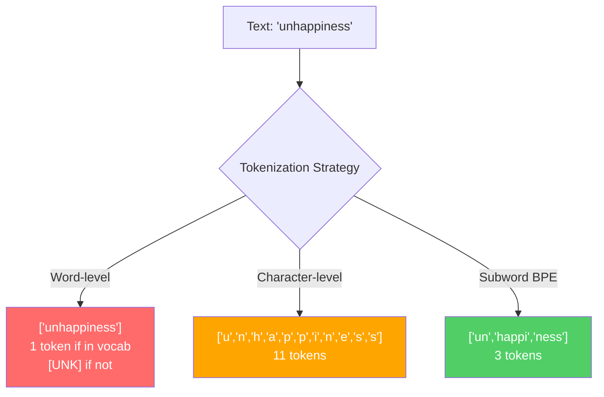
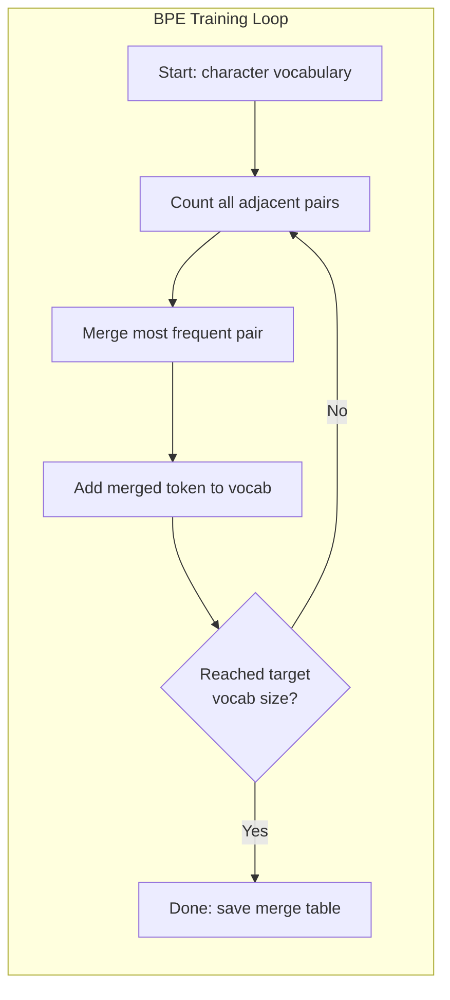
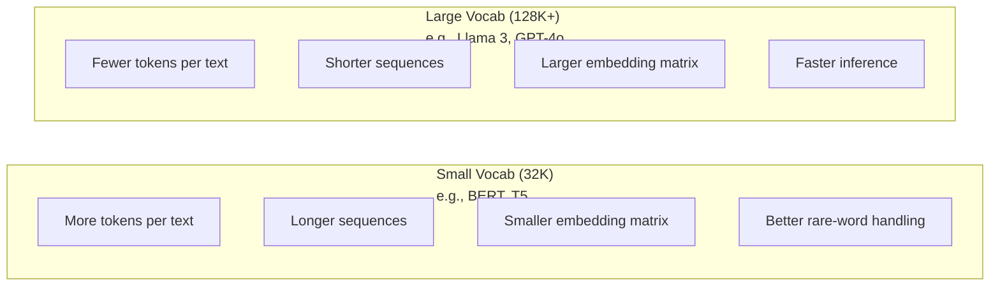

# 分词器：BPE、WordPiece、SentencePiece（Tokenizers: BPE, WordPiece, SentencePiece）

> 你的大语言模型（LLM）并不读英语。它读整数。分词器（tokenizer）决定这些整数是承载意义，还是把意义浪费掉。

**Type:** Build
**Languages:** Python
**Prerequisites:** Phase 05 (NLP Foundations)
**Time:** ~90 minutes

## 学习目标（Learning Objectives）

- 从零实现字节对编码（BPE）、WordPiece 和 Unigram 分词算法，并比较它们的合并策略
- 解释词表大小（vocabulary size）如何影响模型效率：太小会拉长序列，太大会浪费嵌入参数
- 分析跨语言和代码中的分词伪影（tokenization artifacts），找出特定分词器在何处失效
- 使用 tiktoken 和 sentencepiece 库对文本分词，并检查得到的 token ID

## 问题（The Problem）

你的 LLM 并不读英语。它不读任何语言。它读数字。

"Hello, world!" 与 [15496, 11, 995, 0] 之间的鸿沟，就是分词器。每个词、每个空格、每个标点，都必须先变成整数，模型才能处理。这种转换不是中性的。它把假设烤进模型，事后无法撤销。

搞错了，模型就会浪费容量，用多个 token 去编码常见词。"unfortunately" 变成四个 token 而不是一个。你的 128K 上下文窗口，面对多音节词密集的文本，一下子缩水 75%。做对了，同样的上下文窗口能装进两倍的意义。"这个模型很会写代码"和"这个模型被 Python 噎住"的差别，常常就取决于分词器是怎么训练的。

你对 GPT-4 或 Claude 的每一次 API 调用都按 token 计费。模型生成的每一个 token 都消耗算力。表示一段输出所需的 token 越少，端到端推理就越快。分词不是预处理。它是架构。

## 概念（The Concept）

### 三种失败的方法（和一个胜出的方法）（Three Approaches That Failed (and One That Won)）

把文本变成数字，有三种显而易见的做法。其中两种在规模上行不通。

**词级分词（Word-level tokenization）** 按空格和标点切开。"The cat sat" 变成 ["The", "cat", "sat"]。简单。可是 "tokenization" 怎么办？"GPT-4o" 呢？德语复合词 "Geschwindigkeitsbegrenzung" 呢？词级方案需要巨大词表，才能覆盖每种语言里的每个词。漏掉一个词，你就会得到可怕的 `[UNK]` token——模型在说"我完全不知道这是什么"。仅英语就有超过一百万种词形。再加上代码、URL、科学记数法和另外 100 种语言，你需要一张无穷大的词表。

**字符级分词（Character-level tokenization）** 走向另一个极端。"hello" 变成 ["h", "e", "l", "l", "o"]。词表很小（几百个字符）。永远不会出现未知 token。但序列会变得极长。原本 10 个词级 token 的句子，会变成 50 个字符级 token。模型必须学会 "t"、"h"、"e" 合在一起才是 "the"——把注意力容量浪费在人类三岁就会的事情上。

**子词分词（Subword tokenization）** 找到了甜点。常见词保持完整："the" 是一个 token。罕见词拆成有意义的片段："unhappiness" 变成 ["un", "happi", "ness"]。词表可控（3 万到 12.8 万个 token）。序列保持较短。未知 token 基本消失，因为任何词都能由子词拼出来。

每一款现代 LLM 都用子词分词。GPT-2、GPT-4、BERT、Llama 3、Claude——无一例外。问题只是用哪种算法。



### BPE：字节对编码（BPE: Byte Pair Encoding）

BPE 原本是一种贪心压缩算法，被改造成了分词方法。想法简单到能写在一张索引卡上。

从单个字符起步。统计训练语料里每一对相邻符号。把出现最频繁的一对合并成新 token。重复，直到达到目标词表大小。

```figure
tokenizer-bpe
```

下面是 BPE 在一个极小语料上的运行过程，词是 "lower"、"lowest" 和 "newest"：

```
Corpus (with word frequencies):
  "lower"  x5
  "lowest" x2
  "newest" x6

Step 0 -- Start with characters:
  l o w e r       (x5)
  l o w e s t     (x2)
  n e w e s t     (x6)

Step 1 -- Count adjacent pairs:
  (e,s): 8    (s,t): 8    (l,o): 7    (o,w): 7
  (w,e): 13   (e,r): 5    (n,e): 6    ...

Step 2 -- Merge most frequent pair (w,e) -> "we":
  l o we r        (x5)
  l o we s t      (x2)
  n e we s t      (x6)

Step 3 -- Recount and merge (e,s) -> "es":
  l o we r        (x5)
  l o we s t      (x2)    <- 'es' only forms from 'e'+'s', not 'we'+'s'
  n e we s t      (x6)    <- wait, the 'e' before 'we' and 's' after 'we'

Actually tracking this precisely:
  After "we" merge, remaining pairs:
  (l,o): 7   (o,we): 7   (we,r): 5   (we,s): 8
  (s,t): 8   (n,e): 6    (e,we): 6

Step 3 -- Merge (we,s) -> "wes" or (s,t) -> "st" (tied at 8, pick first):
  Merge (we,s) -> "wes":
  l o we r        (x5)
  l o wes t       (x2)
  n e wes t       (x6)

Step 4 -- Merge (wes,t) -> "west":
  l o we r        (x5)
  l o west        (x2)
  n e west        (x6)

...continue until target vocab size reached.
```

合并表（merge table）就是分词器。编码新文本时，按学习到的顺序应用合并。训练语料决定存在哪些合并，而这个选择会永久塑造模型看到的东西。



### 字节级 BPE（Byte-Level BPE）（GPT-2、GPT-3、GPT-4）

标准 BPE 在 Unicode 字符上操作。字节级 BPE 在原始字节（0-255）上操作。这样基础词表恰好是 256，能处理任何语言或编码，并且永远不会产生未知 token。

GPT-2 引入了这种方法。基础词表覆盖每一个可能的字节。BPE 合并叠在这之上。OpenAI 的 tiktoken 库实现了字节级 BPE，词表大小如下：

- GPT-2：50,257 个 token
- GPT-3.5/GPT-4：约 100,256 个 token（cl100k_base 编码）
- GPT-4o：200,019 个 token（o200k_base 编码）

### WordPiece（BERT）

WordPiece 看起来像 BPE，但挑选合并的方式不同。它不用原始频次，而是最大化训练数据的似然：

```
BPE merge criterion:      count(A, B)
WordPiece merge criterion: count(AB) / (count(A) * count(B))
```

BPE 问的是："哪一对出现得最多？" WordPiece 问的是："哪一对一起出现的频率，比你按机会预期的更高？" 这点细微差别会产出不同的词表。WordPiece 偏向共现出人意料的合并，而不只是频繁的合并。

WordPiece 还用 "##" 前缀标记续接子词：

```
"unhappiness" -> ["un", "##happi", "##ness"]
"embedding"   -> ["em", "##bed", "##ding"]
```

"##" 前缀告诉你这段是在延续前一个 token。BERT 使用 WordPiece，词表为 30,522 个 token。每个 BERT 变体——DistilBERT；RoBERTa 的分词器其实是 BPE，但 BERT 本身是 WordPiece。

### SentencePiece（Llama、T5）

SentencePiece 把输入当作 Unicode 字符的原始流，包括空白。没有预分词（pre-tokenization）步骤。没有关于词边界的语言特定规则。这让它真正与语言无关——能用于中文、日文、泰文以及其他不用空格分词的语言。

SentencePiece 支持两种算法：
- **BPE 模式**：与标准 BPE 相同的合并逻辑，应用到原始字符序列
- **Unigram 模式**：从一张大词表开始，迭代删除对整体似然影响最小的 token。这是 BPE 的反向——修剪而不是合并。

Llama 2 使用 SentencePiece BPE，词表 32,000 个 token。T5 使用 SentencePiece Unigram，词表 32,000 个 token。注意：Llama 3 改用了基于 tiktoken 的字节级 BPE 分词器，词表 128,256 个 token。

### 词表大小的权衡（Vocabulary Size Tradeoffs）

这是一个真实的工程决策，后果可以测量。



具体数字。对于 128K 词表、4,096 维嵌入，仅嵌入矩阵就是 128,000 x 4,096 = 5.24 亿参数。32K 词表则是 1.31 亿参数。仅分词器选择就差了 4 亿参数。

但更大的词表会更激进地压缩文本。同一段英语段落，32K 词表可能要 100 个 token，128K 词表可能只要 70 个。这意味着生成时少 30% 的前向传播。对服务数百万请求的模型来说，这是算力成本的直接下降。

趋势很清楚：词表在变大。GPT-2 用 50,257。GPT-4 用约 100K。Llama 3 用 128K。GPT-4o 用 200K。

| 模型 | 词表大小 | 分词器类型 | 英语每词平均 token 数 |
|-------|-----------|----------------|---------------------------|
| BERT | 30,522 | WordPiece | ~1.4 |
| GPT-2 | 50,257 | Byte-level BPE | ~1.3 |
| Llama 2 | 32,000 | SentencePiece BPE | ~1.4 |
| GPT-4 | ~100,256 | Byte-level BPE | ~1.2 |
| Llama 3 | 128,256 | Byte-level BPE (tiktoken) | ~1.1 |
| GPT-4o | 200,019 | Byte-level BPE | ~1.0 |

### 多语言税（The Multilingual Tax）

主要在英语上训练的分词器，对其它语言非常残酷。GPT-2 分词器处理韩语时，平均每个词 2–3 个 token。中文可能更糟。这意味着韩语用户的有效上下文窗口只有英语用户的一半——付同样的钱，信息密度却更低。

这就是 Llama 3 把词表从 32K 翻到 128K 的原因。把更多 token 分给非英语文字，跨语言的压缩才会更公平。

```figure
tokenizer-tradeoff
```

## 构建它（Build It）

### 步骤 1：字符级分词器（Step 1: Character-Level Tokenizer）

从地基开始。字符级分词器把每个字符映射到其 Unicode 码点。不需要训练。没有未知 token。只是直接映射。

```python
class CharTokenizer:
    def encode(self, text):
        return [ord(c) for c in text]

    def decode(self, tokens):
        return "".join(chr(t) for t in tokens)
```

"hello" 变成 [104, 101, 108, 108, 111]。每个字符都是自己的 token。这是我们要改进的基线。

### 步骤 2：从零实现 BPE 分词器（Step 2: BPE Tokenizer from Scratch）

真正的实现。我们在原始字节上训练（像 GPT-2），统计配对，合并最频繁的，并按顺序记录每一次合并。合并表就是分词器。

```python
from collections import Counter

class BPETokenizer:
    def __init__(self):
        self.merges = {}
        self.vocab = {}

    def _get_pairs(self, tokens):
        pairs = Counter()
        for i in range(len(tokens) - 1):
            pairs[(tokens[i], tokens[i + 1])] += 1
        return pairs

    def _merge_pair(self, tokens, pair, new_token):
        merged = []
        i = 0
        while i < len(tokens):
            if i < len(tokens) - 1 and tokens[i] == pair[0] and tokens[i + 1] == pair[1]:
                merged.append(new_token)
                i += 2
            else:
                merged.append(tokens[i])
                i += 1
        return merged

    def train(self, text, num_merges):
        tokens = list(text.encode("utf-8"))
        self.vocab = {i: bytes([i]) for i in range(256)}

        for i in range(num_merges):
            pairs = self._get_pairs(tokens)
            if not pairs:
                break
            best_pair = max(pairs, key=pairs.get)
            new_token = 256 + i
            tokens = self._merge_pair(tokens, best_pair, new_token)
            self.merges[best_pair] = new_token
            self.vocab[new_token] = self.vocab[best_pair[0]] + self.vocab[best_pair[1]]

        return self

    def encode(self, text):
        tokens = list(text.encode("utf-8"))
        for pair, new_token in self.merges.items():
            tokens = self._merge_pair(tokens, pair, new_token)
        return tokens

    def decode(self, tokens):
        byte_sequence = b"".join(self.vocab[t] for t in tokens)
        return byte_sequence.decode("utf-8", errors="replace")
```

训练循环是 BPE 的核心：统计配对，合并赢家，重复。每次合并都会减少总 token 数。经过 `num_merges` 轮后，词表从 256（基础字节）增长到 256 + num_merges。

编码按学习到的精确顺序应用合并。这一点很重要。如果合并 1 创造了 "th"，合并 5 创造了 "the"，编码必须先应用合并 1，这样 "the" 才能在合并 5 里由 "th" + "e" 形成。

解码是逆过程：在词表中查找每个 token ID，拼接字节，再解码成 UTF-8。

### 步骤 3：编码与解码往返（Step 3: Encode and Decode Roundtrip）

```python
corpus = (
    "The cat sat on the mat. The cat ate the rat. "
    "The dog sat on the log. The dog ate the frog. "
    "Natural language processing is the study of how computers "
    "understand and generate human language. "
    "Tokenization is the first step in any NLP pipeline."
)

tokenizer = BPETokenizer()
tokenizer.train(corpus, num_merges=40)

test_sentences = [
    "The cat sat on the mat.",
    "Natural language processing",
    "tokenization pipeline",
    "unhappiness",
]

for sentence in test_sentences:
    encoded = tokenizer.encode(sentence)
    decoded = tokenizer.decode(encoded)
    raw_bytes = len(sentence.encode("utf-8"))
    ratio = len(encoded) / raw_bytes
    print(f"'{sentence}'")
    print(f"  Tokens: {len(encoded)} (from {raw_bytes} bytes) -- ratio: {ratio:.2f}")
    print(f"  Roundtrip: {'PASS' if decoded == sentence else 'FAIL'}")
```

压缩比告诉你分词器有多有效。比率为 0.50 意味着文本被压到原始字节一半数量的 token。越低越好。在训练语料上，比率会不错。在分布外文本如 "unhappiness"（语料中没有出现）上，比率会变差——对未见过的模式，分词器会退回到字符级编码。

### 步骤 4：与 tiktoken 对比（Step 4: Compare with tiktoken）

```python
import tiktoken

enc = tiktoken.get_encoding("cl100k_base")

texts = [
    "The cat sat on the mat.",
    "unhappiness",
    "Hello, world!",
    "def fibonacci(n): return n if n < 2 else fibonacci(n-1) + fibonacci(n-2)",
    "Geschwindigkeitsbegrenzung",
]

for text in texts:
    our_tokens = tokenizer.encode(text)
    tiktoken_tokens = enc.encode(text)
    tiktoken_pieces = [enc.decode([t]) for t in tiktoken_tokens]
    print(f"'{text}'")
    print(f"  Our BPE:   {len(our_tokens)} tokens")
    print(f"  tiktoken:  {len(tiktoken_tokens)} tokens -> {tiktoken_pieces}")
```

tiktoken 用的是完全相同的算法，但在数百 GB 文本上训练，做了 100,000 次合并。算法相同。差别在于训练数据和合并次数。你在一段话上用 40 次合并训练的分词器，拼不过 tiktoken 在海量语料上的 100K 次合并。但机制是一样的。

### 步骤 5：词表分析（Step 5: Vocabulary Analysis）

```python
def analyze_vocabulary(tokenizer, test_texts):
    total_tokens = 0
    total_chars = 0
    token_usage = Counter()

    for text in test_texts:
        encoded = tokenizer.encode(text)
        total_tokens += len(encoded)
        total_chars += len(text)
        for t in encoded:
            token_usage[t] += 1

    print(f"Vocabulary size: {len(tokenizer.vocab)}")
    print(f"Total tokens across all texts: {total_tokens}")
    print(f"Total characters: {total_chars}")
    print(f"Avg tokens per character: {total_tokens / total_chars:.2f}")

    print(f"\nMost used tokens:")
    for token_id, count in token_usage.most_common(10):
        token_bytes = tokenizer.vocab[token_id]
        display = token_bytes.decode("utf-8", errors="replace")
        print(f"  Token {token_id:4d}: '{display}' (used {count} times)")

    unused = [t for t in tokenizer.vocab if t not in token_usage]
    print(f"\nUnused tokens: {len(unused)} out of {len(tokenizer.vocab)}")
```

这会揭示词表中的齐夫分布（Zipf distribution）。少数 token 占主导（空格、"the"、"e"）。大多数 token 很少被用到。生产级分词器针对这种分布做优化——常见模式拿到短的 token ID，罕见模式用更长的表示。

## 用起来（Use It）

你的手写 BPE 能跑了。现在看看生产工具长什么样。

### tiktoken（OpenAI）

```python
import tiktoken

enc = tiktoken.get_encoding("cl100k_base")

text = "Tokenizers convert text to integers"
tokens = enc.encode(text)
print(f"Tokens: {tokens}")
print(f"Pieces: {[enc.decode([t]) for t in tokens]}")
print(f"Roundtrip: {enc.decode(tokens)}")
```

tiktoken 用 Rust 写成，带 Python 绑定。每秒能编码数百万 token。同样的 BPE 算法，工业级实现。

### Hugging Face tokenizers

```python
from tokenizers import Tokenizer
from tokenizers.models import BPE
from tokenizers.trainers import BpeTrainer
from tokenizers.pre_tokenizers import ByteLevel

tokenizer = Tokenizer(BPE())
tokenizer.pre_tokenizer = ByteLevel()

trainer = BpeTrainer(vocab_size=1000, special_tokens=["<pad>", "<eos>", "<unk>"])
tokenizer.train(["corpus.txt"], trainer)

output = tokenizer.encode("The cat sat on the mat.")
print(f"Tokens: {output.tokens}")
print(f"IDs: {output.ids}")
```

Hugging Face tokenizers 库底层同样是 Rust。它能在几秒内对 GB 级语料训练 BPE。训练自己的模型时，你会用这个。

### 加载 Llama 的分词器（Loading Llama's Tokenizer）

```python
from transformers import AutoTokenizer

tokenizer = AutoTokenizer.from_pretrained("meta-llama/Llama-3.1-8B")

text = "Tokenizers are the unsung heroes of LLMs"
tokens = tokenizer.encode(text)
print(f"Token IDs: {tokens}")
print(f"Tokens: {tokenizer.convert_ids_to_tokens(tokens)}")
print(f"Vocab size: {tokenizer.vocab_size}")

multilingual = ["Hello world", "Hola mundo", "Bonjour le monde"]
for text in multilingual:
    ids = tokenizer.encode(text)
    print(f"'{text}' -> {len(ids)} tokens")
```

Llama 3 的 128K 词表对非英语文本的压缩，明显好过 GPT-2 的 50K 词表。你可以自己验证——用多种语言编码同一句话，然后数 token。

## 交付（Ship It）

本课产出 `outputs/prompt-tokenizer-analyzer.md`——一个可复用的提示，用于分析任意文本与模型组合的分词效率。给它一段样本文本，它会告诉你哪款模型的分词器处理得最好。

## 练习（Exercises）

1. 修改 BPE 分词器，让它在每一步合并时打印词表。观察 "t" + "h" 如何变成 "th"，然后 "th" + "e" 如何变成 "the"。跟踪常见英语词是如何一块块拼出来的。

2. 给 BPE 分词器添加特殊 token（`<pad>`、`<eos>`、`<unk>`）。把它们的 ID 设为 0、1、2，并相应平移其它 token。实现一个预分词步骤，在运行 BPE 之前按空白切开。

3. 实现 WordPiece 的合并准则（似然比而不是频次）。在同一语料、同样合并次数下同时训练 BPE 和 WordPiece。比较得到的词表——哪一个产出的子词更有语言学意义？

4. 做一个多语言分词效率基准。各取 10 句英语、西班牙语、中文、韩语和阿拉伯语。用 tiktoken（cl100k_base）分词，测量每字符平均 token 数。量化每种语言的"多语言税"。

5. 在更大语料上训练你的 BPE 分词器（下载一篇维基百科文章）。调节合并次数，使压缩比与 tiktoken 在同一文本上相差不超过 10%。这会逼你理解语料规模、合并次数和压缩质量之间的关系。

## 关键术语（Key Terms）

| 术语 | 人们怎么说 | 实际含义 |
|------|----------------|----------------------|
| Token | "一个词" | 模型词表中的一个单位——可以是字符、子词、词，或多词块 |
| BPE | "某种压缩东西" | 字节对编码——迭代合并最频繁的相邻 token 对，直到达到目标词表大小 |
| WordPiece | "BERT 的分词器" | 类似 BPE，但合并最大化似然比 count(AB)/(count(A)*count(B))，而不是原始频次 |
| SentencePiece | "一个分词库" | 语言无关的分词器，在原始 Unicode 上操作、不做预分词，支持 BPE 和 Unigram 算法 |
| Vocabulary size | "它认识多少词" | 唯一 token 的总数：GPT-2 有 50,257，BERT 有 30,522，Llama 3 有 128,256 |
| Fertility | "不是分词术语" | 每个词的平均 token 数——衡量跨语言的分词效率（1.0 完美，3.0 意味着模型要多干三倍活） |
| Byte-level BPE | "GPT 的分词器" | 在原始字节（0-255）而不是 Unicode 字符上运行的 BPE，保证任意输入都没有未知 token |
| Merge table | "分词器文件" | 训练时学到的成对合并的有序列表——这就是分词器本身，顺序很重要 |
| Pre-tokenization | "按空格切开" | 子词分词之前应用的规则：空白切分、数字分离、标点处理 |
| Compression ratio | "分词器有多高效" | 产出的 token 数除以输入字节数——越低意味着压缩越好、推理越快 |

## 延伸阅读（Further Reading）

- [Sennrich et al., 2016 -- "Neural Machine Translation of Rare Words with Subword Units"](https://arxiv.org/abs/1508.07909) —— 把 BPE 引入 NLP 的论文，把 1994 年的压缩算法变成了现代分词的基础
- [Kudo & Richardson, 2018 -- "SentencePiece: A simple and language independent subword tokenizer"](https://arxiv.org/abs/1808.06226) —— 语言无关分词，让多语言模型变得可行
- [OpenAI tiktoken repository](https://github.com/openai/tiktoken) —— 用 Rust 实现、带 Python 绑定的生产级 BPE，GPT-3.5/4/4o 在用
- [Hugging Face Tokenizers documentation](https://huggingface.co/docs/tokenizers) —— 具备 Rust 性能的生产级分词器训练
