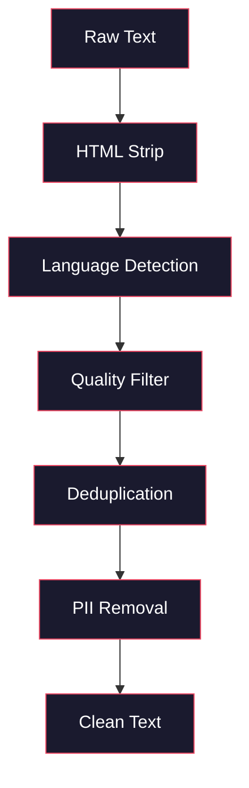
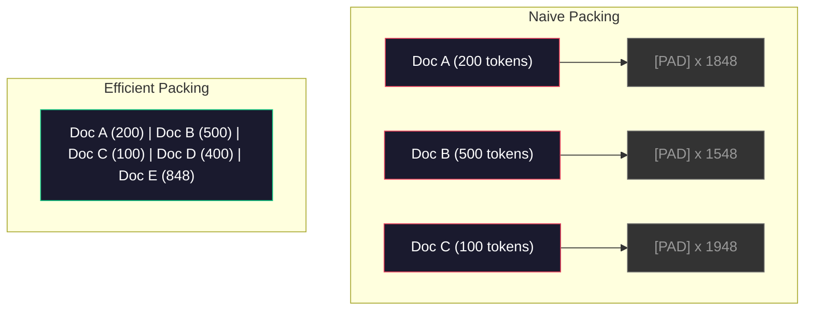

# 预训练数据流水线（Data Pipelines for Pre-Training）

> 模型是一面镜子。你喂什么数据，它就反射什么。喂垃圾，它就会用完美的流畅度反射垃圾。

**Type:** Build
**Languages:** Python
**Prerequisites:** Phase 10, Lessons 01-02 (Tokenizers, Building a Tokenizer)
**Time:** ~90 minutes

## 学习目标（Learning Objectives）

- 构建流式数据流水线：对 TB 级文本做分词、切块、打乱和组批，而不把全部数据装进内存
- 实现真实预训练流水线里使用的数据质量过滤器（去重、语言检测、内容过滤）
- 创建定长训练序列，正确处理注意力掩码（attention mask）和文档边界
- 剖析流水线吞吐，确保数据加载器跟得上 GPU 训练速度

## 问题（The Problem）

你有了分词器。现在你需要数据。

不是一个数据集。不是一个 CSV 文件。是数 TB 的文本——清洗、去重、按质量过滤、分词成定长序列，并以随机批次的速度送出，快到你的 8 GPU 集群永远不必等下一批。

大多数人以为训练 LLM 靠的是模型架构。不是。Llama 3 用了 15.6 万亿 token。GPT-3 用了 3000 亿。DeepSeek-V2 用了 8.1 万亿。三者的架构大致相同：堆叠的 Transformer 块，带注意力和前馈层。输出质量的差异，绝大多数来自数据。

DeepMind 的 Chinchilla 论文把这一点说精确了。给定算力预算，模型参数与训练 token 之间存在最优比例。Chinchilla 表明 2022 年的大多数模型都被严重训练不足——相对它们见过的数据量，参数太多了。一个在 1.4 万亿 token 上训练的 70B 参数模型（Chinchilla 最优）胜过一个在 3000 亿 token 上训练的 280B 模型（Gopher）。

你的数据流水线决定模型学的是语言，还是噪声。

## 概念（The Concept）

### 数据从哪里来（Where the Data Comes From）

每一个大语言模型都在多种来源的混合上训练。对大多数实验室来说，精确配比是严守的秘密，但我们知道的已经足够理解类别。

| 来源 | 规模 | 质量 | 使用者 |
|--------|------|---------|---------|
| Common Crawl | ~250 TB 原始数据 | 低（需要重度过滤） | GPT-3、Llama、大多数开源模型 |
| Wikipedia | ~20 GB | 高 | 每一款主流 LLM |
| GitHub 代码 | ~1 TB+ | 中（大量重复、死代码） | StarCoder、CodeLlama、DeepSeek-Coder |
| 书籍（BookCorpus、Pile） | ~100 GB | 高 | GPT-2、GPT-3、早期模型 |
| 学术论文（arXiv、S2ORC） | ~100 GB | 对 STEM 高 | Llama、Galactica |
| StackOverflow、Reddit | ~100 GB | 中 | Llama、Falcon |
| 精选网页（C4、RefinedWeb） | ~5 TB | 中高（预先过滤） | T5、Falcon |

Llama 3 披露了它的数据配比：大约 50% 网页数据、25% 代码、13% 书籍与学术论文、8% 数学数据、4% 多语言网页数据。总量是 15.6 万亿 token，来自超过 5 TB 的原始文本。

比例和总量一样重要。网页数据太多，模型就变成 Reddit 鹦鹉。代码太少，它就不会编程。数学太少，它就不会推理。把这个配比做对，是训练 LLM 最难的部分之一，而且没有公式——需要实验和评估。

### 数据清洗（Data Cleaning）

原始网页数据很脏。一次典型的 Common Crawl 转储包含：

- HTML 标签和 JavaScript
- 样板页眉、页脚、导航菜单
- 重复页面（精确重复和近重复）
- 机器生成的垃圾
- 个人身份信息（PII）
- 低质量文本（关键词列表、SEO 垃圾）
- 被编码成文本的非文本内容

清洗不是可选项。它决定模型是生成连贯段落，还是输出混着商品列表的 HTML 标签。



每一步消除一类噪声：

**HTML 剥离：** 去掉所有标记。只保留可见文本。像 `trafilatura` 或 `readability` 这样的库会抽取文章内容，丢掉导航、广告和样板。

**语言检测：** 用 fastText 的语言识别模型（lid.176.bin）给每篇文档分类。过滤到你的目标语言。一篇被标成英语但置信度低于 0.8 的文档，多半不是干净英语。

**质量过滤：** 这里开始有意思。RefinedWeb（Falcon 背后的数据集）使用基于困惑度（perplexity）的过滤器：在维基百科上训练一个小语言模型，然后给每篇文档打分。高困惑度意味着文档不像维基百科——很可能是垃圾、关键词列表或机器生成内容。困惑度超过阈值的文档会被去掉。

**去重（Deduplication）：** 影响最大的清洗步骤。Common Crawl 包含海量重复页面——法律免责声明、cookie 提示、服务条款。在重复上训练会浪费算力，还可能导致模型逐字记忆并复读特定段落。

**PII 去除：** 姓名、电子邮件、电话号码、社保号。对结构化 PII 用基于正则的检测，对上下文中的姓名用 NER 模型。

### 用 MinHash 去重（Deduplication with MinHash）

精确去重很容易：给每篇文档做哈希，去掉重复。但真正的问题是近重复。同一篇新闻文章的两份拷贝，周围广告略有不同，就是近重复。内容 95% 相同，但按字节并不相同。

MinHash + 局部敏感哈希（LSH, Locality-Sensitive Hashing）能高效解决这个问题。


思路：

1. **Shingling（切片）：** 把每篇文档转成 n-gram 集合（例如 5-gram 的词或字符）。"the quick brown fox" 用 3 词切片变成 {"the quick brown", "quick brown fox"}。

2. **MinHash：** 对每篇文档的切片集合计算 k 个哈希值。每个哈希值是在不同哈希函数下所有切片的最小哈希。这会生成固定大小的"签名"，用来近似任意两篇文档之间的 Jaccard 相似度。

3. **LSH：** 根据 MinHash 签名的带（band）把文档分到桶里。同一桶里的文档是近重复候选。这样就不用比较每一对——你只比较候选。

4. **验证：** 对每个候选对计算精确 Jaccard 相似度。如果相似度超过阈值（通常 0.8），去掉其中一份。

Llama 团队报告通过去重去掉了大约 38% 的网页数据。这不是小数目。Common Crawl 超过三分之一是重复或近重复内容。

### 序列打包（Sequence Packing）

你的模型期望定长输入序列。你的文档长度可变。有的 50 个 token。有的 50,000 个 token。

朴素做法：把每篇文档填充到最大序列长度。这会在对学习毫无贡献的填充 token 上浪费巨量算力。

更好的做法：把多篇文档打包进一条序列，用序列结束 token 隔开。一条 2048 token 的序列可能包含三篇短文档，中间用 [EOS] token 连接。



注意力掩码必须设对。文档 A 的 token 不应关注同一条打包序列里文档 B 的 token。这需要块对角注意力掩码。

长文档在序列边界处被截断或切成块。切分点很重要：在句子中间切开会迫使模型看到不完整的想法。有些流水线在可能时把切分对齐到段落或句子边界。

### Chinchilla 缩放定律（The Chinchilla Scaling Law）

对于固定算力预算 C（以 FLOPs 衡量），最优模型规模 N 和数据集规模 D 遵循：

```
N_opt ~ C^0.5
D_opt ~ C^0.5
```

实践中，这意味着你应该大致同比例地扩大模型规模和数据集规模。参数多 10 倍的模型，需要大约 10 倍的训练 token 才能达到同样的损失。

| 模型 | 参数量 | 训练 token | 是否 Chinchilla 最优？ |
|-------|-----------|----------------|-------------------|
| GPT-3 | 175B | 300B | 否（训练不足 3–4 倍） |
| Chinchilla | 70B | 1.4T | 是（按设计） |
| Llama 2 | 70B | 2T | 过训练（有意为之） |
| Llama 3 | 70B | 15T | 重度过训练 |

Llama 3 故意违反 Chinchilla 定律。Meta 发现在更多数据上过训练——远远超过算力最优比例——会产出更好的推理模型。额外训练成本只付一次，但更小的模型永远更便宜地提供服务。这有时被称为"推理最优"缩放方法，自 2024 年起已成为行业标准。

```figure
l5-data-pipeline
```

## 构建它（Build It）

### 步骤 1：文本清洗（Step 1: Text Cleaning）

剥离 HTML，归一化空白，去掉非文本内容。我们将用公有领域文本（Project Gutenberg）作为小语料。

```python
import re

def clean_text(text):
    text = re.sub(r"<[^>]+>", "", text)
    text = re.sub(r"http\S+", "", text)
    text = re.sub(r"[^\x20-\x7E\n]", "", text)
    text = re.sub(r"\n{3,}", "\n\n", text)
    text = re.sub(r" {2,}", " ", text)
    return text.strip()

def quality_filter(text, min_words=50, max_ratio_caps=0.3, max_ratio_special=0.1):
    words = text.split()
    if len(words) < min_words:
        return False
    caps_ratio = sum(1 for w in words if w.isupper()) / len(words)
    if caps_ratio > max_ratio_caps:
        return False
    special_chars = sum(1 for c in text if not c.isalnum() and not c.isspace())
    if special_chars / max(len(text), 1) > max_ratio_special:
        return False
    return True
```

质量过滤器能抓住 SEO 垃圾（全大写）、机器生成噪声（特殊字符比例高）和残缺页面（太短）。仅这三项检查就能从网页抓取中去掉惊人数量的垃圾。

### 步骤 2：MinHash 去重（Step 2: MinHash Deduplication）

从零实现 MinHash。不需要外部库——只要 `hashlib`。

```python
import hashlib
from collections import defaultdict

def get_shingles(text, k=5):
    words = text.lower().split()
    if len(words) < k:
        return set()
    return {" ".join(words[i:i+k]) for i in range(len(words) - k + 1)}

def minhash_signature(shingles, num_hashes=128):
    signature = []
    for i in range(num_hashes):
        min_hash = float("inf")
        for shingle in shingles:
            h = int(hashlib.sha256(f"{i}:{shingle}".encode()).hexdigest(), 16)
            min_hash = min(min_hash, h)
        signature.append(min_hash)
    return signature

def lsh_buckets(signature, bands=16):
    rows_per_band = len(signature) // bands
    buckets = []
    for b in range(bands):
        start = b * rows_per_band
        band_data = tuple(signature[start:start + rows_per_band])
        bucket_hash = hashlib.md5(str(band_data).encode()).hexdigest()
        buckets.append((b, bucket_hash))
    return buckets

def deduplicate(documents, threshold=0.8, num_hashes=128, bands=16):
    signatures = []
    shingle_sets = []
    for doc in documents:
        shingles = get_shingles(doc)
        shingle_sets.append(shingles)
        signatures.append(minhash_signature(shingles, num_hashes))

    bucket_map = defaultdict(list)
    for doc_idx, sig in enumerate(signatures):
        for band_id, bucket_hash in lsh_buckets(sig, bands):
            bucket_map[(band_id, bucket_hash)].append(doc_idx)

    duplicate_pairs = set()
    for bucket_docs in bucket_map.values():
        if len(bucket_docs) < 2:
            continue
        for i in range(len(bucket_docs)):
            for j in range(i + 1, len(bucket_docs)):
                duplicate_pairs.add((bucket_docs[i], bucket_docs[j]))

    removed = set()
    for i, j in duplicate_pairs:
        if i in removed or j in removed:
            continue
        s1, s2 = shingle_sets[i], shingle_sets[j]
        if not s1 or not s2:
            continue
        jaccard = len(s1 & s2) / len(s1 | s2)
        if jaccard >= threshold:
            removed.add(j)

    return [doc for idx, doc in enumerate(documents) if idx not in removed], len(removed)
```

`num_hashes=128` 和 `bands=16` 参数控制精确率-召回率权衡。更多哈希给出更准确的相似度估计。更多带提高召回（抓住更多重复），代价是更多假阳性。这些值对典型网页文本效果不错。

### 步骤 3：分词并打包序列（Step 3: Tokenize and Pack Sequences）

取清洗、去重后的文本，分词，并打包成定长训练序列。

```python
def tokenize_corpus(documents, tokenizer):
    all_tokens = []
    for doc in documents:
        tokens = tokenizer.encode(doc)
        all_tokens.extend(tokens)
        all_tokens.append(tokenizer.eos_id)
    return all_tokens

def pack_sequences(token_ids, seq_length, pad_id=0):
    sequences = []
    attention_masks = []
    for i in range(0, len(token_ids), seq_length):
        seq = token_ids[i:i + seq_length]
        mask = [1] * len(seq)
        if len(seq) < seq_length:
            pad_count = seq_length - len(seq)
            seq = seq + [pad_id] * pad_count
            mask = mask + [0] * pad_count
        sequences.append(seq)
        attention_masks.append(mask)
    return sequences, attention_masks
```

### 步骤 4：用于训练的 DataLoader（Step 4: DataLoader for Training）

产出打包序列的随机批次。这就是训练循环消费的东西。

```python
import random

class PreTrainingDataLoader:
    def __init__(self, sequences, attention_masks, batch_size, shuffle=True):
        self.sequences = sequences
        self.attention_masks = attention_masks
        self.batch_size = batch_size
        self.shuffle = shuffle

    def __len__(self):
        return (len(self.sequences) + self.batch_size - 1) // self.batch_size

    def __iter__(self):
        indices = list(range(len(self.sequences)))
        if self.shuffle:
            random.shuffle(indices)
        for start in range(0, len(indices), self.batch_size):
            batch_idx = indices[start:start + self.batch_size]
            batch_seqs = [self.sequences[i] for i in batch_idx]
            batch_masks = [self.attention_masks[i] for i in batch_idx]
            yield batch_seqs, batch_masks
```

### 步骤 5：数据集统计（Step 5: Dataset Statistics）

计算真正重要的数字：总 token 数、唯一 token 数、压缩比、文档长度分布。

```python
from collections import Counter

def compute_statistics(documents, token_ids, sequences, tokenizer_vocab_size):
    total_chars = sum(len(d) for d in documents)
    total_tokens = len(token_ids)
    unique_tokens = len(set(token_ids))
    compression_ratio = total_chars / total_tokens

    doc_lengths = [len(d.split()) for d in documents]
    avg_doc_length = sum(doc_lengths) / max(len(doc_lengths), 1)
    max_doc_length = max(doc_lengths) if doc_lengths else 0
    min_doc_length = min(doc_lengths) if doc_lengths else 0

    token_counts = Counter(token_ids)
    top_tokens = token_counts.most_common(10)

    non_pad_tokens = sum(sum(1 for t in seq if t != 0) for seq in sequences)
    total_positions = sum(len(seq) for seq in sequences)
    utilization = non_pad_tokens / max(total_positions, 1)

    stats = {
        "total_documents": len(documents),
        "total_characters": total_chars,
        "total_tokens": total_tokens,
        "unique_tokens": unique_tokens,
        "vocab_utilization": unique_tokens / tokenizer_vocab_size,
        "compression_ratio": compression_ratio,
        "avg_doc_length_words": avg_doc_length,
        "max_doc_length_words": max_doc_length,
        "min_doc_length_words": min_doc_length,
        "num_sequences": len(sequences),
        "sequence_utilization": utilization,
        "top_10_tokens": top_tokens,
    }
    return stats
```

压缩比告诉你分词器在这份语料上有多高效。英语文本通常压到大约每个 token 3–4 个字符。如果你看到每个 token 1.5 个字符，分词器切得太狠。如果你看到 8+，它学到了非常领域特定的合并。

序列利用率告诉你打包序列里有多少是真实数据、多少是填充。低于 90% 意味着打包低效——你在填充 token 上浪费算力。

## 用起来（Use It）

### 与 HuggingFace Datasets 对比（Compare With HuggingFace Datasets）

通过 HuggingFace 的 datasets 库加载同一语料，对比流水线速度。

```python
from datasets import load_dataset
from transformers import AutoTokenizer

ds = load_dataset("wikitext", "wikitext-2-raw-v1", split="train")
tokenizer = AutoTokenizer.from_pretrained("meta-llama/Meta-Llama-3-8B")

import time

start = time.time()
tokenized = ds.map(
    lambda x: tokenizer(x["text"], truncation=True, max_length=2048),
    batched=True,
    num_proc=4,
)
hf_time = time.time() - start
total_tokens = sum(len(t) for t in tokenized["input_ids"])
print(f"HuggingFace: {total_tokens:,} tokens in {hf_time:.2f}s ({total_tokens/hf_time:,.0f} tokens/sec)")
```

HuggingFace 流水线底层使用 Rust 分词器，并在 4 核上并行处理。你的纯 Python 流水线会慢 10–50 倍。这就是生产团队使用编译分词器的原因。算法相同。实现语言是差别所在。

## 交付（Ship It）

本课产出一个用于校验和调试 LLM 训练流水线数据质量的提示。见 `outputs/prompt-data-quality-checker.md`。

## 练习（Exercises）

1. **简单：** 用简单启发式（字符集分析）给清洗流水线加上语言检测。只保留英语文档，并测量去掉了多少文档。
2. **中等：** 在 MinHash 近去重之外，用 SHA-256 哈希实现精确去重。在网页抓取语料上比较两种方法抓住的重复数量。
3. **困难：** 构建基于困惑度的质量过滤器。在维基百科文本上训练一个小的二元语言模型，按困惑度给每篇文档打分，去掉最差的 20%。比较在过滤与未过滤数据上训练时的模型输出质量。

## 关键术语（Key Terms）

| 术语 | 人们怎么说 | 实际含义 |
|------|----------------|----------------------|
| Common Crawl | "互联网" | 每月抓取网页的非营利组织——约 250TB 原始数据，大多数 LLM 训练数据的起点 |
| MinHash | "某种哈希技巧" | 用固定大小签名估计集合间 Jaccard 相似度的技术——使大规模近重复检测成为可能 |
| LSH | "局部敏感哈希" | 把相似项分到同一桶的方法——把成对比较从 O(n^2) 降到近线性 |
| Sequence packing | "把文档拼起来" | 用正确的注意力掩码把多篇文档装进定长序列——消除填充浪费 |
| Chinchilla scaling | "用更多数据训练" | 给定固定算力预算，最优性能要求大致同比例扩大模型规模和训练 token |
| Fertility | "每个词多少 token" | 每个词的平均 token 数——GPT-4 英语约 1.3，非拉丁文字更高 |
| Data mixing | "选择训练数据" | 代码 vs 文本 vs 数学 vs 多语言数据的比例——没有公式，需要实验 |
| Perplexity filter | "质量打分" | 用小语言模型给文档打分——高困惑度意味着文本不像干净的参考数据 |
| Deduplication | "去掉拷贝" | 消除精确和近重复文档——通常去掉 30–40% 的原始网页数据 |
| Attention mask | "该看哪些 token" | 阻止打包序列中跨文档边界注意力的二元掩码 |

## 延伸阅读（Further Reading）

- [Hoffmann et al., 2022 -- Training Compute-Optimal Large Language Models (Chinchilla)](https://arxiv.org/abs/2203.15556) —— 改变我们如何思考数据规模的论文
- [Penedo et al., 2023 -- The RefinedWeb Dataset for Falcon LLM](https://arxiv.org/abs/2306.01116) —— 如何把 Common Crawl 过滤成高质量
- [Touvron et al., 2023 -- Llama 2: Open Foundation and Fine-Tuned Chat Models](https://arxiv.org/abs/2307.09288) —— Llama 2 的数据流水线细节
- [Lee et al., 2022 -- Deduplicating Training Data Makes Language Models Better](https://arxiv.org/abs/2107.06499) —— 为什么去重比你以为的更重要
- [Broder, 1997 -- On the Resemblance and Containment of Documents](https://ieeexplore.ieee.org/document/666900) —— 原始 MinHash 论文
- [Meta, 2024 -- Llama 3 Technical Report](https://arxiv.org/abs/2407.21783) —— 15.6T token、数据配比、过滤流水线
