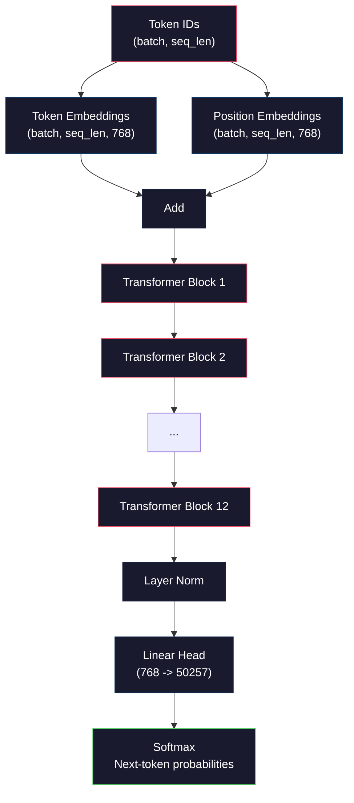
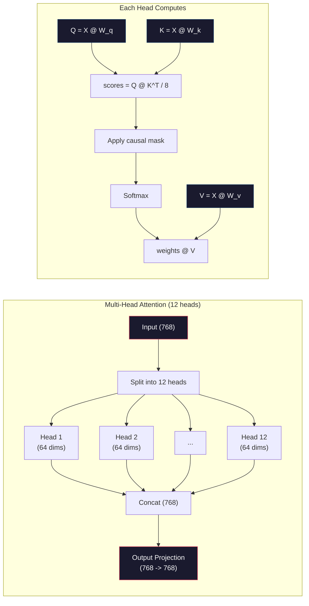
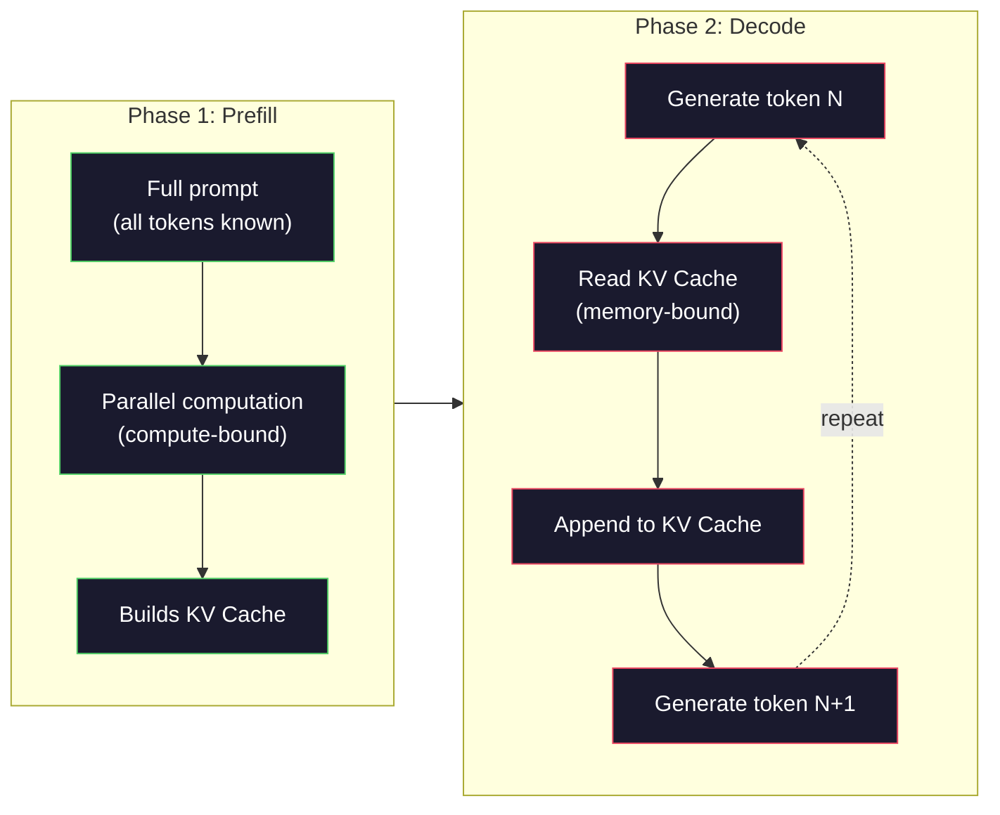

# 预训练迷你 GPT（124M 参数）（Pre-Training a Mini GPT (124M Parameters)）

> GPT-2 Small 有 1.24 亿参数。那是 12 层 Transformer、12 个注意力头、768 维嵌入。你可以在单块 GPU 上从零训练几个小时。大多数人从不这样做。他们用预训练检查点。但如果你不自己训练一个，你就并不真正理解自己在其上构建产品的模型内部发生了什么。

**Type:** Build
**Languages:** Python (with numpy)
**Prerequisites:** Phase 10, Lessons 01-03 (Tokenizers, Building a Tokenizer, Data Pipelines)
**Time:** ~120 minutes

## 学习目标（Learning Objectives）

- 从零实现完整的 GPT-2 架构（124M 参数）：token 嵌入、位置嵌入、Transformer 块和语言模型头
- 用下一 token 预测与交叉熵损失，在文本语料上训练 GPT 模型
- 实现带温度采样和 top-k/top-p 过滤的自回归文本生成
- 监控训练损失曲线，验证模型学到了连贯的语言模式

## 问题（The Problem）

你知道 Transformer 是什么。你读过那些图。你可以背诵 "attention is all you need"，并在白板上画出标着 "Multi-Head Attention" 的方框。

这些都不意味着你理解模型生成文本时发生了什么。

GPT-2 Small 有 124,438,272 个参数（带权重共享）。每一个都是通过训练循环设定的：前向传播、计算损失、反向传播、更新权重。十二个 Transformer 块。每块十二个注意力头。768 维嵌入空间。50,257 个 token 的词表。模型每生成一个 token，全部 1.24 亿参数都参与一条矩阵乘法链：把 token ID 序列变成下一个 token 的概率分布。

如果你从未自己构建过这个，你就是在和一个黑盒共事。你可以用 API。你可以微调。但当事情出错——模型幻觉、自我重复、拒绝遵循指令——你没有关于*为什么*的心智模型。

这一课从零构建 GPT-2 Small。不是用 PyTorch。是用 numpy。每一次矩阵乘法都可见。每一个梯度都由你的代码计算。你会看到 1.24 亿个数字如何合谋预测下一个词。

## 概念（The Concept）

### GPT 架构（The GPT Architecture）

GPT 是自回归（autoregressive）语言模型。"自回归"意味着它一次生成一个 token，每一个都以之前所有 token 为条件。架构是一叠 Transformer 解码器块。

这是从 token ID 到下一 token 概率的完整计算图：

1. Token ID 进入。形状：(batch_size, seq_len)。
2. Token 嵌入查找。每个 ID 映射到一个 768 维向量。形状：(batch_size, seq_len, 768)。
3. 位置嵌入查找。每个位置（0, 1, 2, ...）映射到一个 768 维向量。形状相同。
4. 把 token 嵌入与位置嵌入相加。
5. 穿过 12 个 Transformer 块。
6. 最终层归一化。
7. 线性投影到词表大小。形状：(batch_size, seq_len, vocab_size)。
8. Softmax 得到概率。

这就是整个模型。没有卷积。没有循环。只有嵌入、注意力、前馈网络和层归一化，堆了 12 次。



### Transformer 块（The Transformer Block）

12 个块中的每一个都遵循同一模式。预归一化架构（GPT-2 用 pre-norm，而不是原始 Transformer 的 post-norm）：

1. LayerNorm
2. 多头自注意力（Multi-Head Self-Attention）
3. 残差连接（把输入加回去）
4. LayerNorm
5. 前馈网络（MLP）
6. 残差连接（把输入加回去）

残差连接至关重要。没有它们，反向传播时梯度到达第 1 块就已经消失。有了它们，梯度可以通过"跳过"路径从损失直接流到任意层。这就是你能堆 12、32、甚至 96 块的原因（据说 GPT-4 用了 120）。

### 注意力：核心机制（Attention: The Core Mechanism）

自注意力让每个 token 查看之前的每一个 token，并决定对每一个关注多少。下面是数学。

对每个 token 位置，从输入计算三个向量：
- **查询（Query, Q）**："我在找什么？"
- **键（Key, K）**："我包含什么？"
- **值（Value, V）**："我携带什么信息？"

```
Q = input @ W_q    (768 -> 768)
K = input @ W_k    (768 -> 768)
V = input @ W_v    (768 -> 768)

attention_scores = Q @ K^T / sqrt(d_k)
attention_scores = mask(attention_scores)   # causal mask: -inf for future positions
attention_weights = softmax(attention_scores)
output = attention_weights @ V
```

因果掩码（causal mask）让 GPT 成为自回归。位置 5 可以关注位置 0–5，但不能关注 6、7、8，以此类推。这阻止模型在训练时通过看未来 token 来"作弊"。

**多头注意力（Multi-head attention）** 把 768 维空间拆成 12 个各 64 维的头。每个头学习不同的注意力模式。一个头可能跟踪句法关系（主谓一致）。另一个可能跟踪语义相似（同义词）。再一个可能跟踪位置邻近（附近的词）。12 个头的输出被拼接，再投影回 768 维。



除以 sqrt(d_k)——sqrt(64) = 8——是缩放。没有它，高维向量的点积会变大，把 softmax 推到梯度几乎为零的区域。这是原始 "Attention Is All You Need" 论文中的关键洞见之一。

### KV 缓存：为什么推理很快（KV Cache: Why Inference Is Fast）

训练时，你一次处理整条序列。推理时，你一次生成一个 token。没有优化的话，生成 token N 需要为之前全部 N-1 个 token 重新计算注意力。每个生成的 token 是 O(N^2)，长度为 N 的序列总共是 O(N^3)。

KV 缓存（KV Cache）解决了这个问题。为每个 token 计算完 K 和 V 之后，把它们存下来。生成 token N+1 时，你只需为新 token 计算 Q，并查找之前所有 token 缓存的 K 和 V。这把每个 token 的 K 和 V 计算从 O(N) 降到 O(1)。注意力分数计算仍是 O(N)，因为你要关注所有先前位置，但你避免了对输入做冗余矩阵乘法。

对 12 层、12 头的 GPT-2，KV 缓存每个 token 存储 2（K + V）x 12 层 x 12 头 x 64 维 = 18,432 个值。对 1024 token 的序列，FP32 大约 75MB。对 128 层的 Llama 3 405B，单条序列的 KV 缓存可以超过 10GB。这就是长上下文推理受内存束缚的原因。

### Prefill 与 Decode：推理的两个阶段（Prefill vs Decode: Two Phases of Inference）

当你向 LLM 发送提示时，推理发生在两个截然不同的阶段。

**Prefill（预填充）** 并行处理整个提示。所有 token 已知，所以模型可以同时计算所有位置的注意力。这个阶段受计算束缚——GPU 以满吞吐做矩阵乘法。在 A100 上，1000 token 的提示，prefill 大约需要 20–50ms。

**Decode（解码）** 一次生成一个 token。每个新 token 都依赖之前所有 token。这个阶段受内存束缚——瓶颈是从 GPU 内存读取模型权重和 KV 缓存，而不是矩阵运算本身。GPU 的计算核心大多闲着等内存读取。对 GPT-2，每一步 decode 耗时大致相同，与 matmul 需要多少 FLOPs 无关，因为约束是内存带宽。

这个区分对生产系统很重要。Prefill 吞吐随 GPU 算力扩展（更多 FLOPS = 更快 prefill）。Decode 吞吐随内存带宽扩展（更快内存 = 更快 decode）。这就是 NVIDIA 的 H100 相对 A100 更关注内存带宽改进的原因——它直接加速 token 生成。



### 训练循环（The Training Loop）

训练 LLM 就是下一 token 预测。给定 token [0, 1, 2, ..., N-1]，预测 token [1, 2, 3, ..., N]。损失函数是模型预测的概率分布与实际下一 token 之间的交叉熵。

一步训练：

1. **前向传播：** 把批次跑过全部 12 个块。得到每个位置的 logits（softmax 前的分数）。
2. **计算损失：** logits 与目标 token（输入右移一位）之间的交叉熵。
3. **反向传播：** 用反向传播计算全部 1.24 亿参数的梯度。
4. **优化器步进：** 更新权重。GPT-2 使用带学习率预热和余弦衰减的 Adam。

学习率日程比你可能预期的更重要。GPT-2 在前 2,000 步从 0 预热到峰值学习率，然后沿余弦曲线衰减。一开始用高学习率会导致模型发散。一直保持高学习率会在训练后期振荡。先预热再衰减的模式被每一款主流 LLM 使用。

### GPT-2 Small：数字（GPT-2 Small: The Numbers）

| 组件 | 形状 | 参数量 |
|-----------|-------|------------|
| Token embeddings | (50257, 768) | 38,597,376 |
| Position embeddings | (1024, 768) | 786,432 |
| Per-block attention (W_q, W_k, W_v, W_out) | 4 x (768, 768) | 2,359,296 |
| Per-block FFN (up + down) | (768, 3072) + (3072, 768) | 4,718,592 |
| Per-block LayerNorms (2x) | 2 x 768 x 2 | 3,072 |
| Final LayerNorm | 768 x 2 | 1,536 |
| **Total per block** | | **7,080,960** |
| **Total (12 blocks)** | | **85,054,464 + 39,383,808 = 124,438,272** |

输出投影（logits 头）与 token 嵌入矩阵共享权重。这叫做权重共享（weight tying）——它减少 3800 万参数，并提升性能，因为它迫使模型对输入和输出使用同一表示空间。

## 构建它（Build It）

### 步骤 1：嵌入层（Step 1: Embedding Layer）

Token 嵌入把 50,257 个可能 token 中的每一个映射到 768 维向量。位置嵌入加入每个 token 在序列中位置的信息。两者相加。

```python
import numpy as np

class Embedding:
    def __init__(self, vocab_size, embed_dim, max_seq_len):
        self.token_embed = np.random.randn(vocab_size, embed_dim) * 0.02
        self.pos_embed = np.random.randn(max_seq_len, embed_dim) * 0.02

    def forward(self, token_ids):
        seq_len = token_ids.shape[-1]
        tok_emb = self.token_embed[token_ids]
        pos_emb = self.pos_embed[:seq_len]
        return tok_emb + pos_emb
```

初始化用的 0.02 标准差来自 GPT-2 论文。太大，最初的前向传播会产生极端值，破坏训练稳定。太小，最初的输出对所有输入几乎相同，早期梯度信号毫无用处。

### 步骤 2：带因果掩码的自注意力（Step 2: Self-Attention with Causal Mask）

先做单头注意力。因果掩码在 softmax 之前把未来位置设为负无穷，确保每个位置只能关注自己和更早的位置。

```python
def attention(Q, K, V, mask=None):
    d_k = Q.shape[-1]
    scores = Q @ K.transpose(0, -1, -2 if Q.ndim == 4 else 1) / np.sqrt(d_k)
    if mask is not None:
        scores = scores + mask
    weights = np.exp(scores - scores.max(axis=-1, keepdims=True))
    weights = weights / weights.sum(axis=-1, keepdims=True)
    return weights @ V
```

Softmax 实现在取指数之前减去最大值。没有这一步，exp(很大的数) 会溢出成无穷。这是数值稳定性技巧，不改变输出，因为对任意常数 c，softmax(x - c) = softmax(x)。

### 步骤 3：多头注意力（Step 3: Multi-Head Attention）

把 768 维输入拆成 12 个各 64 维的头。每个头独立计算注意力。拼接结果再投影回 768 维。

```python
class MultiHeadAttention:
    def __init__(self, embed_dim, num_heads):
        self.num_heads = num_heads
        self.head_dim = embed_dim // num_heads
        self.W_q = np.random.randn(embed_dim, embed_dim) * 0.02
        self.W_k = np.random.randn(embed_dim, embed_dim) * 0.02
        self.W_v = np.random.randn(embed_dim, embed_dim) * 0.02
        self.W_out = np.random.randn(embed_dim, embed_dim) * 0.02

    def forward(self, x, mask=None):
        batch, seq_len, d = x.shape
        Q = (x @ self.W_q).reshape(batch, seq_len, self.num_heads, self.head_dim).transpose(0, 2, 1, 3)
        K = (x @ self.W_k).reshape(batch, seq_len, self.num_heads, self.head_dim).transpose(0, 2, 1, 3)
        V = (x @ self.W_v).reshape(batch, seq_len, self.num_heads, self.head_dim).transpose(0, 2, 1, 3)

        scores = Q @ K.transpose(0, 1, 3, 2) / np.sqrt(self.head_dim)
        if mask is not None:
            scores = scores + mask
        weights = np.exp(scores - scores.max(axis=-1, keepdims=True))
        weights = weights / weights.sum(axis=-1, keepdims=True)
        attn_out = weights @ V

        attn_out = attn_out.transpose(0, 2, 1, 3).reshape(batch, seq_len, d)
        return attn_out @ self.W_out
```

reshape-transpose-reshape 的舞蹈是多头注意力最令人困惑的部分。发生的是：(batch, seq_len, 768) 张量变成 (batch, seq_len, 12, 64)，再变成 (batch, 12, seq_len, 64)。现在 12 个头各自有一个 (seq_len, 64) 矩阵来跑注意力。注意力之后，我们反向这个过程：(batch, 12, seq_len, 64) 变成 (batch, seq_len, 12, 64)，再变成 (batch, seq_len, 768)。

### 步骤 4：Transformer 块（Step 4: Transformer Block）

一个完整的 Transformer 块：LayerNorm、带残差的多头注意力、LayerNorm、带残差的前馈。

```python
class LayerNorm:
    def __init__(self, dim, eps=1e-5):
        self.gamma = np.ones(dim)
        self.beta = np.zeros(dim)
        self.eps = eps

    def forward(self, x):
        mean = x.mean(axis=-1, keepdims=True)
        var = x.var(axis=-1, keepdims=True)
        return self.gamma * (x - mean) / np.sqrt(var + self.eps) + self.beta


class FeedForward:
    def __init__(self, embed_dim, ff_dim):
        self.W1 = np.random.randn(embed_dim, ff_dim) * 0.02
        self.b1 = np.zeros(ff_dim)
        self.W2 = np.random.randn(ff_dim, embed_dim) * 0.02
        self.b2 = np.zeros(embed_dim)

    def forward(self, x):
        h = x @ self.W1 + self.b1
        h = np.maximum(0, h)  # GELU approximation: ReLU for simplicity
        return h @ self.W2 + self.b2


class TransformerBlock:
    def __init__(self, embed_dim, num_heads, ff_dim):
        self.ln1 = LayerNorm(embed_dim)
        self.attn = MultiHeadAttention(embed_dim, num_heads)
        self.ln2 = LayerNorm(embed_dim)
        self.ffn = FeedForward(embed_dim, ff_dim)

    def forward(self, x, mask=None):
        x = x + self.attn.forward(self.ln1.forward(x), mask)
        x = x + self.ffn.forward(self.ln2.forward(x))
        return x
```

前馈网络把 768 维输入扩展到 3,072 维（4 倍），施加非线性，再投影回 768。这种扩张-收缩模式给模型在每个位置一个"更宽"的内部表示。GPT-2 使用 GELU 激活，但我们这里为简单起见用 ReLU——对理解架构来说差别很小。

### 步骤 5：完整 GPT 模型（Step 5: Full GPT Model）

堆 12 个 Transformer 块。前面加嵌入层，后面加输出投影。

```python
class MiniGPT:
    def __init__(self, vocab_size=50257, embed_dim=768, num_heads=12,
                 num_layers=12, max_seq_len=1024, ff_dim=3072):
        self.embedding = Embedding(vocab_size, embed_dim, max_seq_len)
        self.blocks = [
            TransformerBlock(embed_dim, num_heads, ff_dim)
            for _ in range(num_layers)
        ]
        self.ln_f = LayerNorm(embed_dim)
        self.vocab_size = vocab_size
        self.embed_dim = embed_dim

    def forward(self, token_ids):
        seq_len = token_ids.shape[-1]
        mask = np.triu(np.full((seq_len, seq_len), -1e9), k=1)

        x = self.embedding.forward(token_ids)
        for block in self.blocks:
            x = block.forward(x, mask)
        x = self.ln_f.forward(x)

        logits = x @ self.embedding.token_embed.T
        return logits

    def count_parameters(self):
        total = 0
        total += self.embedding.token_embed.size
        total += self.embedding.pos_embed.size
        for block in self.blocks:
            total += block.attn.W_q.size + block.attn.W_k.size
            total += block.attn.W_v.size + block.attn.W_out.size
            total += block.ffn.W1.size + block.ffn.b1.size
            total += block.ffn.W2.size + block.ffn.b2.size
            total += block.ln1.gamma.size + block.ln1.beta.size
            total += block.ln2.gamma.size + block.ln2.beta.size
        total += self.ln_f.gamma.size + self.ln_f.beta.size
        return total
```

注意权重共享：`logits = x @ self.embedding.token_embed.T`。输出投影复用 token 嵌入矩阵（转置）。这不仅是省参数的技巧。它意味着模型用同一向量空间来理解 token（嵌入）和预测 token（输出）。

### 步骤 6：训练循环（Step 6: Training Loop）

在 124M 参数上做真正的训练运行，你需要 GPU 和 PyTorch。这个训练循环在纯 numpy 可跑的小模型上演示机制。我们用极小模型（4 层、4 头、128 维）让它可处理。

```python
def cross_entropy_loss(logits, targets):
    batch, seq_len, vocab_size = logits.shape
    logits_flat = logits.reshape(-1, vocab_size)
    targets_flat = targets.reshape(-1)

    max_logits = logits_flat.max(axis=-1, keepdims=True)
    log_softmax = logits_flat - max_logits - np.log(
        np.exp(logits_flat - max_logits).sum(axis=-1, keepdims=True)
    )

    loss = -log_softmax[np.arange(len(targets_flat)), targets_flat].mean()
    return loss


def train_mini_gpt(text, vocab_size=256, embed_dim=128, num_heads=4,
                   num_layers=4, seq_len=64, num_steps=200, lr=3e-4):
    tokens = np.array(list(text.encode("utf-8")[:2048]))
    model = MiniGPT(
        vocab_size=vocab_size, embed_dim=embed_dim, num_heads=num_heads,
        num_layers=num_layers, max_seq_len=seq_len, ff_dim=embed_dim * 4
    )

    print(f"Model parameters: {model.count_parameters():,}")
    print(f"Training tokens: {len(tokens):,}")
    print(f"Config: {num_layers} layers, {num_heads} heads, {embed_dim} dims")
    print()

    for step in range(num_steps):
        start_idx = np.random.randint(0, max(1, len(tokens) - seq_len - 1))
        batch_tokens = tokens[start_idx:start_idx + seq_len + 1]

        input_ids = batch_tokens[:-1].reshape(1, -1)
        target_ids = batch_tokens[1:].reshape(1, -1)

        logits = model.forward(input_ids)
        loss = cross_entropy_loss(logits, target_ids)

        if step % 20 == 0:
            print(f"Step {step:4d} | Loss: {loss:.4f}")

    return model
```

损失一开始接近 ln(vocab_size)——对 256 token 的字节级词表，那是 ln(256) = 5.55。随机模型给每个 token 分配相等概率。随着训练进行，损失下降，因为模型学会预测常见模式："t" 之后的 "th"、句号之后的空格，等等。

在生产中，你会用带梯度累积、学习率预热和梯度裁剪的 Adam 优化器。前向-损失-反向-更新循环是相同的。优化器更精巧。

### 步骤 7：文本生成（Step 7: Text Generation）

生成用训练好的模型一次预测一个 token。每次预测从输出分布采样（或贪心地取 argmax）。

```python
def generate(model, prompt_tokens, max_new_tokens=100, temperature=0.8):
    tokens = list(prompt_tokens)
    seq_len = model.embedding.pos_embed.shape[0]

    for _ in range(max_new_tokens):
        context = np.array(tokens[-seq_len:]).reshape(1, -1)
        logits = model.forward(context)
        next_logits = logits[0, -1, :]

        next_logits = next_logits / temperature
        probs = np.exp(next_logits - next_logits.max())
        probs = probs / probs.sum()

        next_token = np.random.choice(len(probs), p=probs)
        tokens.append(next_token)

    return tokens
```

温度（temperature）控制随机性。温度 1.0 使用原始分布。温度 0.5 把它变锐（更确定——模型更常选顶部选择）。温度 1.5 把它变平（更随机——低概率 token 得到更大机会）。温度 0.0 是贪心解码（总是选概率最高的 token）。

`tokens[-seq_len:]` 窗口是必要的，因为模型有最大上下文长度（GPT-2 是 1024）。一旦超过，你必须丢掉最旧的 token。这就是大家都在谈的"上下文窗口"。

```figure
sampling-decoder
```

## 用起来（Use It）

### 完整训练与生成演示（Full Training and Generation Demo）

```python
corpus = """The transformer architecture has revolutionized natural language processing.
Attention mechanisms allow the model to focus on relevant parts of the input.
Self-attention computes relationships between all pairs of positions in a sequence.
Multi-head attention splits the representation into multiple subspaces.
Each attention head can learn different types of relationships.
The feedforward network provides nonlinear transformations at each position.
Residual connections enable gradient flow through deep networks.
Layer normalization stabilizes training by normalizing activations.
Position embeddings give the model information about token ordering.
The causal mask ensures autoregressive generation during training.
Pre-training on large text corpora teaches the model general language understanding.
Fine-tuning adapts the pre-trained model to specific downstream tasks."""

model = train_mini_gpt(corpus, num_steps=200)

prompt = list("The transformer".encode("utf-8"))
output_tokens = generate(model, prompt, max_new_tokens=100, temperature=0.8)
generated_text = bytes(output_tokens).decode("utf-8", errors="replace")
print(f"\nGenerated: {generated_text}")
```

在小语料、小模型上，生成文本充其量半连贯。它会从训练文本学到一些字节级模式，但不能像 GPT-2 用 40GB 训练数据和完整 124M 参数架构那样泛化。重点不是输出质量。重点是你可以追踪每一步：嵌入查找、注意力计算、前馈变换、logit 投影、softmax 和采样。每一个操作都可见。

## 交付（Ship It）

本课产出 `outputs/prompt-gpt-architecture-analyzer.md`——一个分析任意 GPT 风格模型架构选择的提示。给它一份模型卡或技术报告，它会拆解参数分配、注意力设计和缩放决策。

## 练习（Exercises）

1. 把模型改成 24 层、16 头，而不是 12/12。数参数。把深度翻倍与把宽度（嵌入维度）翻倍相比如何？

2. 实现 GELU 激活函数（GELU(x) = x * 0.5 * (1 + erf(x / sqrt(2)))），替换前馈网络里的 ReLU。用每种激活训练 500 步，比较最终损失。

3. 给生成函数加上 KV 缓存。第一次前向传播后为每层存储 K 和 V 张量，后续 token 复用它们。测量加速：有缓存和无缓存各生成 200 个 token，比较墙钟时间。

4. 实现 top-k 采样（只考虑概率最高的 k 个 token）和 top-p 采样（核采样：考虑累积概率超过 p 的最小 token 集合）。在温度 0.8 下比较 top-k=50 与 top-p=0.95 的输出质量。

5. 做一个训练损失曲线绘图器。训练模型 1000 步，画出损失对步数。识别三个阶段：快速初始下降（学习常见字节）、较慢的中期（学习字节模式）、平台期（在小语料上过拟合）。无论你训练的是 128 维模型还是 GPT-4，这条曲线的形状都一样。

## 关键术语（Key Terms）

| 术语 | 人们怎么说 | 实际含义 |
|------|----------------|----------------------|
| Autoregressive | "一次生成一个词" | 每个输出 token 都以之前所有 token 为条件——模型预测 P(token_n \| token_0, ..., token_{n-1}) |
| Causal mask | "它看不见未来" | 由负无穷构成的上三角矩阵，训练时阻止对未来位置的注意力 |
| Multi-head attention | "多种注意力模式" | 把 Q、K、V 拆成并行头（例如 GPT-2 的 12 个 64 维头），让每个头学习不同类型的关系 |
| KV Cache | "为了速度而缓存" | 存储先前 token 已计算的 Key 和 Value 张量，避免自回归生成中的冗余计算 |
| Prefill | "处理提示" | 推理第一阶段，所有提示 token 并行处理——受 GPU FLOPS 计算束缚 |
| Decode | "生成 token" | 推理第二阶段，一次生成一个 token——受 GPU 带宽内存束缚 |
| Weight tying | "共享嵌入" | 输入 token 嵌入和输出投影头使用同一矩阵——在 GPT-2 中节省 3800 万参数 |
| Residual connection | "跳跃连接" | 把输入直接加到子层输出（x + sublayer(x)）——使深度网络中的梯度流动成为可能 |
| Layer normalization | "归一化激活" | 在特征维上归一化到均值 0、方差 1，带可学习的缩放和偏置参数 |
| Cross-entropy loss | "预测有多错" | -log(赋给正确下一 token 的概率)，对所有位置取平均——标准 LLM 训练目标 |

## 延伸阅读（Further Reading）

- [Radford et al., 2019 -- "Language Models are Unsupervised Multitask Learners" (GPT-2)](https://cdn.openai.com/better-language-models/language_models_are_unsupervised_multitask_learners.pdf) —— 引入 124M 到 1.5B 参数家族的 GPT-2 论文
- [Vaswani et al., 2017 -- "Attention Is All You Need"](https://arxiv.org/abs/1706.03762) —— 带缩放点积注意力和多头注意力的原始 Transformer 论文
- [Llama 3 Technical Report](https://arxiv.org/abs/2407.21783) —— Meta 如何用 16K GPU 把 GPT 架构扩到 405B 参数
- [Pope et al., 2022 -- "Efficiently Scaling Transformer Inference"](https://arxiv.org/abs/2211.05102) —— 形式化 prefill vs decode 以及 KV 缓存分析的论文
