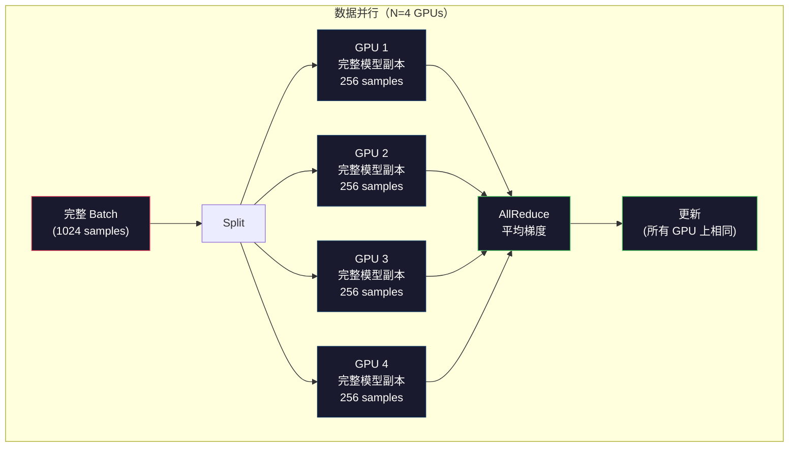
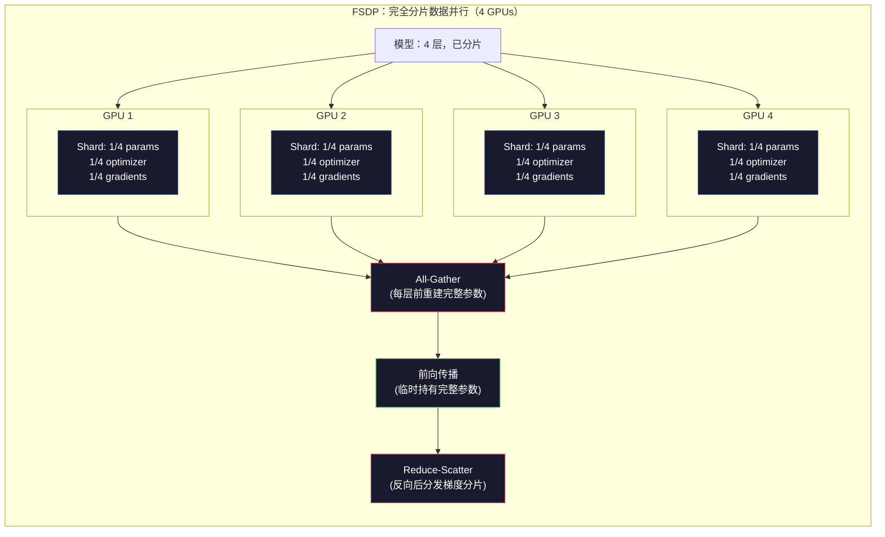
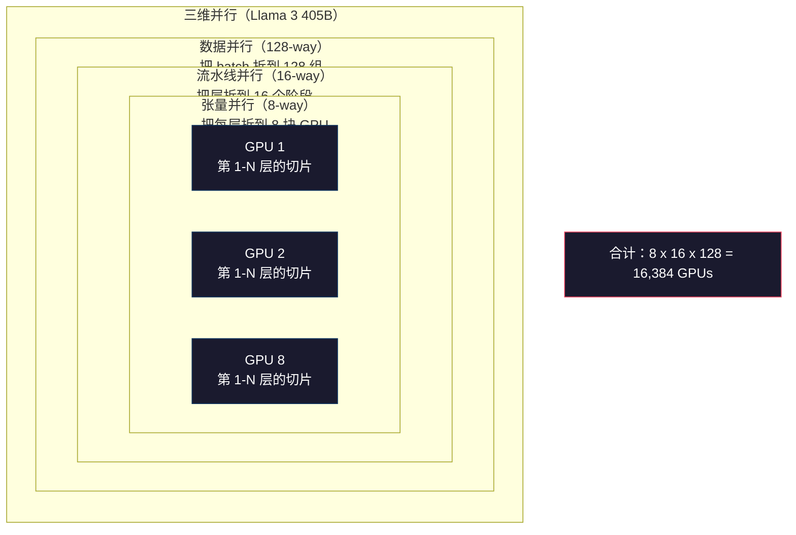

# 规模化：分布式训练、FSDP 与 DeepSpeed（Scaling: Distributed Training, FSDP, DeepSpeed）

> 你的 1.24 亿参数模型在一块 GPU 上就能训完。现在试试 70 亿参数。模型塞不进显存。数据在单机上要跑好几周。到了这个规模，分布式训练（distributed training）不是可选项，而是唯一的出路。

**Type:** Build
**Languages:** Python
**Prerequisites:** Phase 10, Lesson 04 (Pre-Training a Mini GPT)
**Time:** ~120 minutes

## 学习目标（Learning Objectives）

- 解释三种并行（parallelism）：数据并行（data）、张量并行（tensor）、流水线并行（pipeline），以及何时根据模型和集群规模必须启用哪一种
- 使用 PyTorch DDP 实现数据并行训练，并在多块 GPU 之间同步梯度
- 计算给定模型规模的显存预算（权重 + 优化器状态 + 梯度 + 激活），以确定最低硬件需求
- 配置 FSDP 或 DeepSpeed ZeRO 阶段，把模型状态分片到多块 GPU 上，从而训练超出单卡显存的模型

## 问题（The Problem）

一个 70 亿参数模型在 FP16 下，光权重就要 14GB。Adam 优化器还要为每个参数额外存两份副本（一阶矩和二阶矩估计）。那又是 28GB。反向传播时的梯度再加 14GB。还没存任何激活值，你已经占用了 56GB。

一块 NVIDIA A100 有 80GB 显存。

80GB 里已经吃掉 56GB，只剩 24GB 给激活值（activations）——前向传播算出、必须留到反向传播再用的中间结果。对 2048 token 的序列、4096 维的模型，单层激活大约 64MB。32 层时，每个样本就要 2GB。batch size 为 8 需要 16GB。你只剩 24GB。batch size 到 12 就会爆掉。

再试试 700 亿参数。仅权重：FP16 下 140GB。一块 GPU 装不下。光放权重至少需要 2 块 A100（2 x 80GB = 160GB）。再加上优化器状态和梯度，需求会大得多：最少 3 块以上，按分片策略实际通常要 8–16 块。

Llama 3 405B 是在 16,384 块 NVIDIA H100 上训练的。这次训练的算力成本估计约 1 亿美元。DeepSeek V3 用大约 560 万美元训出了相当规模的模型，靠的是架构上的巧思（混合专家 Mixture of Experts 意味着每个 token 只激活一部分参数）以及训练效率。

本课覆盖让大规模训练成为可能的四种策略：数据并行、张量并行、流水线并行，以及完全分片数据并行（fully sharded data parallelism）。你会先用纯 Python 模拟每一种，搞懂机制，再去碰分布式训练框架。

## 概念（The Concept）

### 为什么必须做分布式（Why Distribution is Required）

下面是真实模型的显存算术。每个数字都是算出来的，不是估的。

| Model | Params | Weights (FP16) | Adam States | Gradients (FP16) | Total (no activations) |
|-------|--------|----------------|-------------|------------------|----------------------|
| GPT-2 Small | 124M | 248 MB | 992 MB | 248 MB | 1.5 GB |
| Llama 3 8B | 8B | 16 GB | 64 GB | 16 GB | 96 GB |
| Llama 3 70B | 70B | 140 GB | 560 GB | 140 GB | 840 GB |
| Llama 3 405B | 405B | 810 GB | 3,240 GB | 810 GB | 4,860 GB |

真正的杀手是 “Adam States” 这一列。Adam 为每个参数存一份滑动均值（m）和一份滑动方差（v），而且都是 FP32。对 70B 模型，那是 70B x 4 bytes x 2 = 560GB。光优化器就要七块 A100。

一块 H100 有 80GB。Llama 3 405B 至少需要 61 块 H100 才能放下权重、优化器和梯度。再加上激活，数量还会涨。Meta 用了 16,384 块 GPU，不是因为他们想炫，而是因为必须这么干。

### 数据并行（Data Parallelism）

最简单的分布式策略。把完整模型复制到 N 块 GPU 上。把每个训练 batch 均分成 N 份。每块 GPU 在自己的数据分片上做前向和反向。反向结束后，把所有 GPU 的梯度求平均。每块 GPU 用同一份平均梯度更新自己的权重副本，从而保持所有副本同步。

**优点：** 吞吐近似线性扩展。N 块 GPU 每步处理 N 倍数据。通信仅限于梯度平均，而且可以和计算重叠。

**缺点：** 每块 GPU 都要持有完整的模型、优化器状态和梯度。对 70B 模型，每块 GPU 需要 840GB。数据并行完全不降低单卡显存，它只缩短训练时间。

**算术：** 有效 batch size = per_gpu_batch_size x N。N=64 块 GPU、每卡 batch 为 16 时，有效 batch 是 1,024。Llama 3 每步的有效 batch 是 1600 万 tokens。



### 张量并行（Tensor Parallelism）

把单个层拆到多块 GPU 上。一次矩阵乘法被分给多卡，每卡只算结果的一部分。

考虑前馈层里形状为 (8192, 8192) 的权重矩阵。4 路张量并行时，每块 GPU 持有 (8192, 2048) 的分片。每卡用输入乘自己的分片，得到部分结果。再通过 all-reduce 或 all-gather 把部分结果合并成完整输出。

**优点：** 降低单卡上的模型权重显存。70B 模型拆到 8 块 GPU，每卡大约只放 87.5 亿参数的权重。

**缺点：** 每一层之后都需要高速 GPU 间通信。每次 matmul 后的 all-reduce 都会增加延迟。同一节点上用 NVLink（节点内约 900 GB/s）效果很好，跨节点走 InfiniBand（400 Gb/s，大约 50 GB/s）就很差。张量并行几乎总是限制在单节点内（8 块 GPU）。

**实际用法：** Megatron-LM 开创了张量并行。Llama 3 405B 在每个节点内使用 8 路张量并行。

### 流水线并行（Pipeline Parallelism）

按层拆分模型。GPU 1 跑第 1–8 层。GPU 2 跑第 9–16 层。GPU 3 跑第 17–24 层。GPU 4 跑第 25–32 层。数据沿流水线流动：GPU 1 算完自己的层，把激活发给 GPU 2，GPU 2 再算完发给 GPU 3，依此类推。

**优点：** GPU 之间通信量很小——只传层边界上的激活，体积远小于梯度或权重。带宽需求低，因此可以跨节点使用。

**缺点：** 流水线气泡（pipeline bubbles）。当 GPU 4 正在对 micro-batch 1 做前向时，GPU 1、2、3 已经算完自己那一段，只能空转。反向时模式反过来。朴素流水线下，N 个流水线阶段的 GPU 利用率只有 1/N。

**GPipe 和 PipeDream** 通过把 batch 再切成 micro-batch 来解决气泡。GPU 1 一做完 micro-batch 1 的前向，立刻开始 micro-batch 2。这样计算可以在流水线阶段之间重叠。M 个 micro-batch、N 个阶段时，气泡占比降到 (N-1)/M。用 M=16 个 micro-batch、N=4 个阶段，气泡是 3/16 = 18.75% 空闲时间。

### FSDP：完全分片数据并行（Fully Sharded Data Parallel）

FSDP 把数据并行的可扩展性和分片的显存效率合在一起。每块 GPU 不再持有完整模型，而只持有 1/N 的参数、梯度和优化器状态。

某层前向之前，FSDP 先做一次 **all-gather**，把完整参数从所有 GPU 收集到每块 GPU 的显存里。前向结束后，每块 GPU 丢掉非本地参数。反向时再跑一次 all-gather，重建参数以计算梯度。反向结束后，一次 **reduce-scatter** 把梯度分片发回去，于是每块 GPU 只存 1/N 的梯度。

**70B 模型在 8 块 GPU 上的算术：**

| Component | Without FSDP | With FSDP |
|-----------|-------------|-----------|
| Weights (FP16) | 140 GB per GPU | 17.5 GB per GPU |
| Adam States (FP32) | 560 GB per GPU | 70 GB per GPU |
| Gradients (FP16) | 140 GB per GPU | 17.5 GB per GPU |
| **Total** | **840 GB per GPU** | **105 GB per GPU** |

没有 FSDP，你无法把 70B 模型塞进单块 80GB GPU。8 卡 FSDP 时每卡 105GB——等等，还是装不下。你至少需要 16 块 GPU 才能把每卡压到 80GB 以下，或者把 FSDP 和激活检查点（activation checkpointing，反向时重算激活而不是存下来）结合起来。

通信成本比朴素数据并行更高，因为每层前都要 all-gather。但省下来的显存让以前不可能的训练跑得起来。



### DeepSpeed ZeRO

DeepSpeed 的 ZeRO（Zero Redundancy Optimizer，零冗余优化器）在概念上与 FSDP 相同，但是微软独立开发的。它定义了三个阶段，分片越来越激进：

| Stage | Shards | Memory Savings | Communication |
|-------|--------|---------------|---------------|
| ZeRO-1 | Optimizer states only | ~4x reduction | Same as data parallel |
| ZeRO-2 | + Gradients | ~8x reduction | Slightly more |
| ZeRO-3 | + Parameters | ~Nx reduction (N GPUs) | All-gather per layer |

ZeRO-3 等价于 FSDP。名字不同，机制一样。DeepSpeed 验证了这个思路之后，PyTorch 才加入了原生 FSDP。

DeepSpeed 还引入了 ZeRO-Offload（把优化器状态卸载到更便宜、更大的 CPU RAM）和 ZeRO-Infinity（卸载到 NVMe SSD）。它们用计算速度换显存容量——卸载后的操作更慢，但能腾出 GPU 显存。

### 混合精度训练（Mixed Precision Training）

现代训练会同时使用多种浮点格式：

- **前向传播**：FP16 或 BF16（16 位）。显存是 FP32 的一半。在 tensor cores 上 matmul 大约快 2 倍。
- **主权重（master weights）**：FP32（32 位）。由优化器维护，保证权重更新时的数值精度。
- **损失缩放（loss scaling）**：反向前把 loss 乘一个大常数，防止 FP16 梯度下溢成零。优化器步进前再除以同一个常数。

BF16（Brain Float 16）的指数范围与 FP32 相同（8 位指数），但精度更低（7 位尾数，对比 FP32 的 23 位）。它很少需要损失缩放，因为它能表示同样的数值范围。FP16 有 5 位指数和 10 位尾数——能表示更细的数值，但在极端量级会溢出/下溢。

Google 的 TPU 原生使用 BF16。NVIDIA 的 A100 和 H100 同时支持 FP16 和 BF16。业界大体已转向 BF16，因为它省掉了损失缩放的麻烦。

**7B 模型的显存对比：**

| Precision | Weights | Optimizer | Gradients | Total |
|-----------|---------|-----------|-----------|-------|
| FP32 everywhere | 28 GB | 56 GB | 28 GB | 112 GB |
| Mixed (BF16 + FP32 master) | 14 GB | 56 GB | 14 GB | 84 GB |

混合精度在这个模型上省了 28GB。优化器状态无论怎样都留在 FP32——显存大头就在这里。

### Megatron-LM 与三维并行（3D Parallelism）

真正的大规模训练会把三种并行叠在一起：

- **数据并行** 跨节点组（扩大 batch size）
- **张量并行** 在节点内（把层拆到 8 块 GPU）
- **流水线并行** 跨节点（把层组拆到不同机器）

Llama 3 405B 在 16,384 块 H100 上：
- 节点内 8 路张量并行（每节点 8 块 GPU）
- 跨节点 16 路流水线并行（16 个流水线阶段）
- 剩余维度上 128 路数据并行（16,384 / 8 / 16 = 128）

这种三维分解（8 x 16 x 128 = 16,384）就是扩展到数千块 GPU 的方法。每块 GPU 看到不同的数据分片（数据并行），持有每层的一片切片（张量并行），并计算不同的层集合（流水线并行）。

DeepSeek V3 走了另一条路。他们的混合专家架构每个 token 只激活 671B 参数中的 37B。这意味着每块 GPU 只需计算（并存储激活）那些被激活的参数。他们在 2,048 块 H800 上训练——不到 Meta GPU 数量的 1/8——成本 560 万美元，对比 Meta 估计的 1 亿美元。



```figure
paged-kv-cache
```

## 动手构建（Build It）

### 第 1 步：模拟数据并行（Simulate Data Parallelism）

把一个 batch 拆到模拟 GPU 上。每块 GPU 在自己的分片上做前向。把“梯度”求平均（我们用 loss 值来模拟它们）。

```python
import numpy as np

def simulate_data_parallelism(data, num_gpus, model_fn):
    batch_size = len(data)
    shard_size = batch_size // num_gpus
    remainder = batch_size % num_gpus

    gpu_losses = []
    gpu_gradients = []

    offset = 0
    for gpu_id in range(num_gpus):
        extra = 1 if gpu_id < remainder else 0
        shard = data[offset:offset + shard_size + extra]
        offset += shard_size + extra

        loss, grad = model_fn(shard)
        gpu_losses.append(loss)
        gpu_gradients.append(grad)

    avg_loss = np.mean(gpu_losses)
    avg_gradient = np.mean(gpu_gradients, axis=0)

    return avg_loss, avg_gradient
```

all-reduce 操作（平均梯度）是数据并行里唯一的通信。实践中这会用 NVIDIA GPU 上的 NCCL 库，它实现环形 all-reduce：每块 GPU 把自己 1/N 的梯度发给邻居，从另一侧邻居收 1/N，经过 N-1 步后每块 GPU 都有完整平均值。总通信体积：2 x gradient_size x (N-1)/N，N 很大时接近梯度大小的 2 倍。

### 第 2 步：模拟张量并行（Simulate Tensor Parallelism）

把权重矩阵拆到多块 GPU。每卡做部分矩阵乘法。再把结果拼起来。

```python
def simulate_tensor_parallelism(input_data, weight_matrix, num_gpus):
    d_in, d_out = weight_matrix.shape
    assert d_out % num_gpus == 0, f"d_out {d_out} not divisible by num_gpus {num_gpus}"
    shard_size = d_out // num_gpus

    partial_results = []
    for gpu_id in range(num_gpus):
        start = gpu_id * shard_size
        end = start + shard_size
        weight_shard = weight_matrix[:, start:end]

        partial = input_data @ weight_shard
        partial_results.append(partial)

    full_output = np.concatenate(partial_results, axis=-1)

    direct_output = input_data @ weight_matrix
    error = np.abs(full_output - direct_output).max()

    return full_output, error
```

误差应当恰好为零（或机器精度）。张量并行在数学上是精确的——结果与在一块 GPU 上做完整 matmul 相同。拆分沿输出维度进行，所以每块 GPU 产出不同的列块，拼接后还原完整结果。

对列并行线性层（拆输出维度），你做拼接。对行并行（拆输入维度），你做求和。在 transformer 的 FFN 里，第一个线性层（扩展）用列并行，第二个线性层（收缩）用行并行。这样两层之间就不必 all-reduce。

### 第 3 步：模拟流水线并行（Simulate Pipeline Parallelism）

把模型的层拆到虚拟 GPU 上。展示气泡问题：前面的阶段空转，等后面的阶段计算。

```python
def simulate_pipeline_parallelism(num_layers, num_stages, num_microbatches):
    layers_per_stage = num_layers // num_stages

    timeline = {}
    clock = 0

    for mb in range(num_microbatches):
        for stage in range(num_stages):
            start_time = max(
                timeline.get((stage, mb - 1, "fwd"), (0, 0))[1] if mb > 0 else 0,
                timeline.get((stage - 1, mb, "fwd"), (0, 0))[1] if stage > 0 else 0,
            )
            end_time = start_time + layers_per_stage
            timeline[(stage, mb, "fwd")] = (start_time, end_time)

    last_fwd_end = max(v[1] for v in timeline.values())

    for mb in range(num_microbatches - 1, -1, -1):
        for stage in range(num_stages - 1, -1, -1):
            deps = [last_fwd_end]
            if mb < num_microbatches - 1 and (stage, mb + 1, "bwd") in timeline:
                deps.append(timeline[(stage, mb + 1, "bwd")][1])
            if stage < num_stages - 1 and (stage + 1, mb, "bwd") in timeline:
                deps.append(timeline[(stage + 1, mb, "bwd")][1])
            start_time = max(deps)
            end_time = start_time + layers_per_stage
            timeline[(stage, mb, "bwd")] = (start_time, end_time)

    total_time = max(v[1] for v in timeline.values())
    compute_time = num_microbatches * num_stages * layers_per_stage * 2
    bubble_fraction = 1.0 - compute_time / (total_time * num_stages)

    return timeline, total_time, bubble_fraction
```

4 个阶段、1 个 micro-batch 时，气泡占比是 75%——任意时刻四块 GPU 里有三块在空转。16 个 micro-batch 时大约降到 19%。消除气泡的代价是显存：你必须同时保存所有在途 micro-batch 的激活。

### 第 4 步：显存计算器（Memory Calculator）

计算任意模型规模训练时的精确显存需求。

```python
def memory_calculator(
    params_billions,
    precision_bytes=2,
    optimizer="adam",
    num_gpus=1,
    sharding="none",
    sequence_length=2048,
    batch_size_per_gpu=1,
    hidden_dim=None,
    num_layers=None,
):
    params = params_billions * 1e9

    weight_memory = params * precision_bytes

    if optimizer == "adam":
        optimizer_memory = params * 4 * 2
    elif optimizer == "sgd":
        optimizer_memory = params * 4
    else:
        optimizer_memory = 0

    gradient_memory = params * precision_bytes

    total_no_activation = weight_memory + optimizer_memory + gradient_memory

    if hidden_dim and num_layers:
        activation_per_layer = (
            sequence_length * batch_size_per_gpu * hidden_dim * precision_bytes * 4
        )
        activation_memory = activation_per_layer * num_layers
    else:
        activation_memory = params * precision_bytes * 0.5

    if sharding == "fsdp" or sharding == "zero3":
        weight_memory /= num_gpus
        optimizer_memory /= num_gpus
        gradient_memory /= num_gpus
    elif sharding == "zero2":
        optimizer_memory /= num_gpus
        gradient_memory /= num_gpus
    elif sharding == "zero1":
        optimizer_memory /= num_gpus

    per_gpu_total = weight_memory + optimizer_memory + gradient_memory + activation_memory

    return {
        "params_billions": params_billions,
        "weights_gb": weight_memory / 1e9,
        "optimizer_gb": optimizer_memory / 1e9,
        "gradients_gb": gradient_memory / 1e9,
        "activations_gb": activation_memory / 1e9,
        "per_gpu_total_gb": per_gpu_total / 1e9,
        "total_across_gpus_gb": per_gpu_total * num_gpus / 1e9,
        "fits_on_80gb": per_gpu_total / 1e9 <= 80,
        "num_gpus": num_gpus,
        "sharding": sharding,
    }
```

这个计算器回答每个机器学习工程师都会问的问题：“我需要多少块 GPU？”把模型规模喂进去，看它能不能放下。调整分片策略，直到单卡总量掉到 80GB 以下。

### 第 5 步：混合精度模拟（Mixed Precision Simulation）

比较 FP32、FP16 和混合精度训练的显存占用。

```python
def mixed_precision_comparison(params_billions):
    params = params_billions * 1e9

    fp32_weights = params * 4
    fp32_optimizer = params * 4 * 2
    fp32_gradients = params * 4
    fp32_total = fp32_weights + fp32_optimizer + fp32_gradients

    fp16_weights = params * 2
    fp16_master = params * 4
    fp16_optimizer = params * 4 * 2
    fp16_gradients = params * 2
    fp16_total = fp16_weights + fp16_master + fp16_optimizer + fp16_gradients

    mixed_weights = params * 2
    mixed_optimizer = params * 4 * 2
    mixed_gradients = params * 2
    mixed_total = mixed_weights + mixed_optimizer + mixed_gradients

    return {
        "fp32_total_gb": fp32_total / 1e9,
        "fp16_with_master_gb": fp16_total / 1e9,
        "mixed_bf16_gb": mixed_total / 1e9,
        "savings_vs_fp32": 1 - mixed_total / fp32_total,
    }
```

对大多数人最大的意外是：混合精度并不会把显存砍半。优化器状态（Adam 的 m 和 v）无论精度如何都留在 FP32。对 7B 模型，FP32 训练用 112GB。混合精度用 84GB。那是 25% 的节省，不是 50%。优化器才是大头。

## 用起来（Use It）

### 运行全部模拟（Run All Simulations）

```python
def run_all_demos():
    print("=" * 70)
    print("DATA PARALLELISM SIMULATION")
    print("=" * 70)

    np.random.seed(42)
    data = np.random.randn(64, 32)
    weight = np.random.randn(32, 16)

    def model_fn(batch):
        output = batch @ weight
        loss = np.mean(output ** 2)
        grad = 2 * batch.T @ (batch @ weight) / len(batch)
        return loss, grad

    for n_gpus in [1, 2, 4, 8]:
        loss, grad = simulate_data_parallelism(data, n_gpus, model_fn)
        print(f"  {n_gpus} GPUs: loss={loss:.4f}, grad_norm={np.linalg.norm(grad):.4f}")

    print()
    print("=" * 70)
    print("TENSOR PARALLELISM SIMULATION")
    print("=" * 70)

    x = np.random.randn(4, 8192)
    W = np.random.randn(8192, 8192)

    for n_gpus in [1, 2, 4, 8]:
        output, error = simulate_tensor_parallelism(x, W, n_gpus)
        print(f"  {n_gpus} GPUs: output_shape={output.shape}, max_error={error:.2e}")

    print()
    print("=" * 70)
    print("PIPELINE PARALLELISM SIMULATION")
    print("=" * 70)

    for n_mb in [1, 4, 8, 16, 32]:
        _, total_t, bubble = simulate_pipeline_parallelism(32, 4, n_mb)
        print(f"  {n_mb:2d} micro-batches: total_time={total_t:4d}, bubble={bubble:.1%}")

    print()
    print("=" * 70)
    print("MEMORY CALCULATOR")
    print("=" * 70)

    configs = [
        (7, "none", 1),
        (7, "fsdp", 8),
        (70, "none", 1),
        (70, "fsdp", 8),
        (70, "fsdp", 16),
        (405, "fsdp", 64),
        (405, "fsdp", 128),
    ]

    print(f"  {'Model':>8} {'Sharding':>8} {'GPUs':>5} {'Per-GPU':>10} {'Fits 80GB':>10}")
    print("  " + "-" * 50)
    for params, shard, gpus in configs:
        result = memory_calculator(params, num_gpus=gpus, sharding=shard)
        fits = "Yes" if result["fits_on_80gb"] else "No"
        print(f"  {params:>6}B {shard:>8} {gpus:>5} {result['per_gpu_total_gb']:>8.1f}GB {fits:>10}")

    print()
    print("=" * 70)
    print("MIXED PRECISION COMPARISON")
    print("=" * 70)

    for params_b in [7, 13, 70, 405]:
        result = mixed_precision_comparison(params_b)
        print(f"  {params_b}B: FP32={result['fp32_total_gb']:.0f}GB, "
              f"Mixed BF16={result['mixed_bf16_gb']:.0f}GB, "
              f"Savings={result['savings_vs_fp32']:.0%}")
```

## 交付（Ship It）

本课产出 `outputs/prompt-distributed-training-planner.md`——一份提示词：给定模型规模和可用硬件，生成完整的分布式训练方案：并行策略、显存预算、通信开销，以及预期吞吐。

## 练习（Exercises）

1. 修改显存计算器，加入激活检查点。启用检查点时，只在每第 K 层存储激活（典型 K=1，表示全部重算）。展示显存–计算权衡：检查点能省多少显存，又会让训练慢多少（完整检查点大约多 33% 计算）？

2. 扩展流水线并行模拟，实现 PipeDream 使用的 1F1B（one forward, one backward）调度。对 4 个阶段和 8 个 micro-batch，比较气泡占比与朴素调度的差异。1F1B 应有更小的峰值显存，因为它更早开始反向。

3. 实现梯度累积模拟器。不要每个 micro-batch 都 all-reduce，而是本地累积 K 步再 all-reduce。展示这如何把通信降到 1/K，但最终梯度完全相同（因此训练也相同）。

4. 做一个成本估算器。给定模型规模、目标 token 数、GPU 类型（A100 每小时 $2，H100 每小时 $3.50）和并行策略，估算总训练成本（美元）。用已知成本校验：Llama 3 405B 据称约 1 亿美元，DeepSeek V3 约 560 万美元。

5. 给显存计算器加上 ZeRO-Offload。假设每节点 CPU RAM 512GB、NVMe 2TB。展示把优化器状态卸载到 CPU 如何让 70B 模型在 4 块 GPU 而不是 16 块上训练，代价是优化器步进慢 30–50%。

## 关键术语（Key Terms）

| Term | What people say | What it actually means |
|------|----------------|----------------------|
| Data parallelism | “把模型复制到每块 GPU” | 每块 GPU 处理不同的数据分片；每步之后通过 all-reduce 平均梯度 |
| Tensor parallelism | “把一层拆到多块 GPU” | 切分权重矩阵，让每块 GPU 只算 matmul 的一部分；需要高速 NVLink 互连 |
| Pipeline parallelism | “把层拆到多块 GPU” | 每块 GPU 跑不同的层组；数据带着 micro-batch 流过流水线以减少气泡 |
| FSDP | “什么都分片” | Fully Sharded Data Parallel——每块 GPU 只持有 1/N 的权重、梯度和优化器状态；计算前 all-gather |
| ZeRO | “DeepSpeed 版的 FSDP” | Zero Redundancy Optimizer，分 3 个阶段：分片优化器（Stage 1）、再加梯度（Stage 2）、再加参数（Stage 3） |
| All-reduce | “跨 GPU 求平均” | 集合通信：每块 GPU 最终都得到所有 GPU 输入的和（或平均）——通常实现为环形 all-reduce |
| All-gather | “从所有 GPU 收集” | 集合通信：每块 GPU 最终得到所有 GPU 数据的拼接——FSDP 用它重建完整参数 |
| Reduce-scatter | “求和再分发” | 集合通信：先规约（求和）再把不同块散到不同 GPU——FSDP 用它做梯度分片 |
| Mixed precision | “半精度训练” | 前向/反向用 FP16/BF16，优化器状态用 FP32——大约省 25% 显存，不是 50%，因为优化器占主导 |
| Pipeline bubble | “流水线空转时间” | GPU 等前一阶段数据而空闲的时间占比——用更多 micro-batch 来降低 |

## 延伸阅读（Going Deeper）

- [Rajbhandari et al., 2020 -- "ZeRO: Memory Optimizations Toward Training Trillion Parameter Models"](https://arxiv.org/abs/1910.02054) -- 定义了三个分片阶段的 DeepSpeed ZeRO 论文
- [Shoeybi et al., 2020 -- "Megatron-LM: Training Multi-Billion Parameter Language Models Using Model Parallelism"](https://arxiv.org/abs/1909.08053) -- NVIDIA 面向 transformer 的张量并行
- [Narayanan et al., 2021 -- "Efficient Large-Scale Language Model Training on GPU Clusters Using Megatron-LM"](https://arxiv.org/abs/2104.04473) -- 把数据、张量和流水线合在一起的三维并行
- [Zhao et al., 2023 -- "PyTorch FSDP: Experiences on Scaling Fully Sharded Data Parallel"](https://arxiv.org/abs/2304.11277) -- PyTorch 原生 FSDP 实现
- [Llama 3 Technical Report](https://arxiv.org/abs/2407.21783) -- 16,384 GPU 训练与三维并行细节
- [DeepSeek-V3 Technical Report](https://arxiv.org/abs/2412.19437) -- MoE 架构如何把训练成本降低一个数量级
