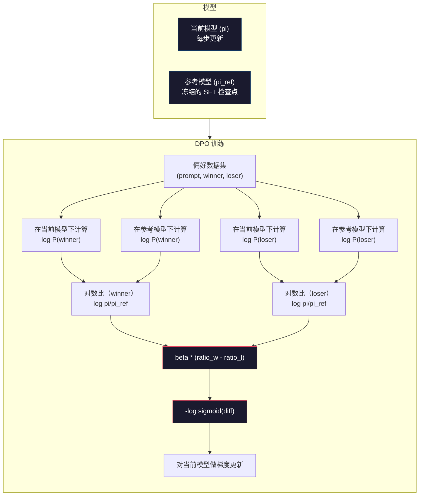

# DPO：直接偏好优化（Direct Preference Optimization）

> RLHF 有效。它也要求训练三个模型（SFT、奖励模型、策略），管理 PPO 的不稳定性，还要调 KL 惩罚。DPO 问：能不能把这些都跳过？DPO 直接在偏好对上优化语言模型。没有奖励模型。没有 PPO。一次训练循环。同样的结果。

**Type:** Build
**Languages:** Python (with numpy)
**Prerequisites:** Phase 10, Lesson 07 (RLHF)
**Time:** ~90 minutes

## 学习目标（Learning Objectives）

- 实现 DPO 训练：无需单独的奖励模型，直接在偏好对上优化语言模型
- 推导 DPO 损失函数，并解释它如何通过策略的对数概率隐式表示奖励模型
- 从训练稳定性、计算成本和所需模型数量上比较 DPO 与 RLHF
- 调节 beta 参数，控制训练后的策略偏离参考模型多远

## 问题（The Problem）

你在第 07 课构建了 RLHF 流水线。三个阶段。三个模型。SFT 模型、奖励模型，以及用 PPO 优化的策略模型。光奖励模型就需要数千条人类偏好对和单独的训练循环。PPO 需要仔细调节 KL 系数、学习率、裁剪比和 epoch 数。

实践中，PPO 训练以不稳定著称。超参数稍有变化就会导致训练发散。奖励模型是人类偏好的不完美代理，策略会找到利用其弱点的方法。KL 惩罚有帮助，但本身也需要调节——太低会奖励黑客，太高模型几乎学不到。

这种复杂性解释了为什么 InstructGPT 发表后多年，大多数开源模型都在 RLHF 上挣扎。三阶段流水线很脆弱。每个阶段都有自己的失败模式，错误会叠加。

2023 年 5 月，Rafael Rafailov、Archit Sharma 以及 Stanford 的同事发表了 “Direct Preference Optimization: Your Language Model is Secretly a Reward Model”。关键洞察：你不需要单独的奖励模型。最优奖励函数由语言模型自身的 token 概率在数学上决定。你可以完全跳过奖励模型，直接在偏好对上优化语言模型。

DPO 把 RLHF 简化成一步监督学习。一个模型。一个损失函数。一次训练循环。没有强化学习。Zephyr-7B 是最早大规模使用 DPO 的模型之一，在若干基准上匹配或超过了完整 RLHF 训练的模型。Meta 把 DPO 作为 Llama 3 对齐流水线的一部分。Anthropic 在对齐研究中引用过 DPO 风格的方法。

## 概念（The Concept）

### 关键洞察（The Key Insight）

RLHF 优化这个目标：

```
maximize: E[R(x, y)] - beta * KL(pi || pi_ref)
```

其中 R 是奖励模型，pi 是策略，pi_ref 是参考模型，beta 是 KL 系数。

DPO 论文表明这个目标有闭式最优解。对任意奖励函数 R，最优策略是：

```
pi*(y | x) = pi_ref(y | x) * exp(R(x, y) / beta) / Z(x)
```

其中 Z(x) 是归一化常数。重排：

```
R(x, y) = beta * log(pi*(y | x) / pi_ref(y | x)) + beta * log Z(x)
```

这就是突破点。奖励完全用策略模型的概率和参考模型的概率来表达。你不需要训练单独的奖励模型。奖励*隐式*存在于概率比之中。

把它代入 Bradley-Terry 偏好模型：

```
P(y_w > y_l | x) = sigmoid(R(x, y_w) - R(x, y_l))
                  = sigmoid(beta * (log pi(y_w|x)/pi_ref(y_w|x) - log pi(y_l|x)/pi_ref(y_l|x)))
```

Z(x) 项会抵消，因为两份回复都以同一个提示 x 为条件。剩下的只是策略模型对数概率和参考模型对数概率在偏好回复与被拒绝回复上的函数。

### DPO 损失（The DPO Loss）

```
L_DPO = -log(sigmoid(beta * (log pi(y_w|x)/pi_ref(y_w|x) - log pi(y_l|x)/pi_ref(y_l|x))))
```

拆开每一块：

- **y_w** = 偏好（获胜）回复
- **y_l** = 被拒绝（失败）回复
- **x** = 提示
- **pi** = 当前模型（正在训练）
- **pi_ref** = 参考模型（冻结的 SFT 检查点）
- **beta** = 控制偏离参考程度的温度参数（通常 0.1 到 0.5）

比值 `log pi(y|x) / pi_ref(y|x)` 是对数概率比。当这个比为正，当前模型给回复 y 的概率高于参考；为负时，当前模型给的概率更低。

DPO 损失推动模型提高偏好回复的对数概率比，降低被拒绝回复的对数概率比。beta 参数控制模型能多激进地偏离参考——小 beta 允许大偏离，大 beta 让模型贴近参考。



### 为什么 DPO 更简单（Why DPO is Simpler）

| Aspect | RLHF (PPO) | DPO |
|--------|-----------|-----|
| Models to train | 3 (SFT + reward + policy) | 1 (policy only) |
| Training loops | 3 (SFT, RM training, PPO) | 2 (SFT, DPO) |
| Hyperparameters | lr, KL coeff, clip ratio, RM lr, epochs x3 | lr, beta, epochs |
| Reward model | Required (separate training) | Implicit in model probabilities |
| RL algorithm | PPO (complex, unstable) | Supervised learning (stable) |
| GPU memory | 3-4 models in memory during PPO | 2 models (current + reference) |
| Training stability | Sensitive to hyperparameters | Robust, similar to SFT |

DPO 训练时内存里需要两个模型——当前模型和冻结参考。RLHF 需要三到四个：策略、参考、奖励模型，以及可选的价值函数基线。对 70B 模型，FP16 下每份副本占 140GB。去掉奖励模型省下的显存相当可观。

### 何时 DPO 胜过 RLHF（When DPO Beats RLHF）

**小数据集。** 有 5,000–20,000 条偏好对时，DPO 常常匹配或超过 RLHF。RLHF 里的奖励模型需要足够数据才能泛化——数据有限时会过拟合，产出不可靠的奖励信号。DPO 根本不需要奖励模型，从而绕过这个问题。

**有限算力。** DPO 大约只需完整 RLHF 三分之一的计算（一次训练循环而不是三次）。对没有大型 GPU 集群的团队，这是务实选择。

**快速迭代。** 想试 10 个不同的偏好数据集，看哪个产出最好的模型？DPO 让每个实验几小时就能跑完。RLHF 每个数据集都要重新训练奖励模型。

### 何时 RLHF 胜过 DPO（When RLHF Beats DPO）

**大规模训练。** 在 GPT-4 或 Claude 的规模上，RLHF 单独的奖励模型能抓住更细腻的偏好信号。奖励模型充当学会适应复杂质量标准的损失函数。

**复杂奖励信号。** 当“更好”涉及多个维度（有用性、无害性、诚实），奖励模型可以学习这种多目标权衡。DPO 把每条偏好对当成二元信号——一个更好，一个更差——并不建模为什么。

**迭代对齐。** RLHF 流水线可以用当前策略生成新回复，让人类评分，再在在线循环中重训奖励模型。DPO 在固定的偏好对数据集上工作。Constitutional AI（Anthropic 的方法）大量利用 RLHF 的这种迭代性质。

### DPO 之后：KTO、ORPO、SimPO（Beyond DPO）

DPO 催生了一族简化的对齐方法。

**KTO（Kahneman-Tversky Optimization，2024）：** 你甚至不需要成对数据。KTO 用非成对反馈——只需把每条回复标成 “good” 或 “bad”，不必和备选比较。这大幅简化数据采集。不再给标注者看两份回复再问“哪个更好？”，而是看一份回复问“这好不好？”损失函数应用前景理论中的损失厌恶：对坏回复的惩罚重于对好回复的奖励。

**ORPO（Odds Ratio Preference Optimization，2024）：** 把 SFT 和对齐合到同一次训练。不再先 SFT 再 DPO，ORPO 修改 SFT 损失以纳入偏好信号。损失有两项：偏好回复上的标准下一 token 预测损失，再加上一项提高偏好与被拒绝回复概率间隔的 odds ratio 项。一次训练循环而不是两次。

**SimPO（Simple Preference Optimization，2024）：** 彻底去掉参考模型。不再相对冻结参考计算对数概率比，SimPO 用回复的平均对数概率（按长度归一化）作为隐式奖励。这节省显存（不需要参考模型）并简化训练。长度归一化防止模型偏好更短的回复。

| Method | Year | Models in Memory | Needs Pairs? | Needs Reference? | Training Loops |
|--------|------|-----------------|-------------|-----------------|----------------|
| RLHF | 2022 | 3-4 | Yes (for RM) | Yes | 3 |
| DPO | 2023 | 2 | Yes | Yes | 2 |
| KTO | 2024 | 2 | No (unpaired) | Yes | 2 |
| ORPO | 2024 | 1 | Yes | No | 1 |
| SimPO | 2024 | 1 | Yes | No | 1 |

趋势很清楚：每种方法再砍掉一块复杂性。RLHF 需要奖励模型和 PPO。DPO 两者都去掉了。KTO 去掉了成对数据。ORPO 去掉了单独的 SFT 阶段。SimPO 去掉了参考模型。对齐税（alignment tax）——从基座模型走到对齐模型的计算与复杂度成本——持续下降。

### 真实的 DPO 部署（Real DPO Deployments）

**Zephyr-7B（HuggingFace，2023 年 10 月）：** Mistral 7B 基座，在 UltraChat（20 万条样本）上做 SFT，再在 UltraFeedback（6 万条偏好对）上做 DPO。MT-Bench 得分 6.47——当时最高的 7B 模型。对比之下，Llama 2 Chat 70B 得 6.86，意味着 Zephyr 仅用 DPO 对齐就达到了 10 倍规模模型的 6% 以内。

**Llama 3（Meta，2024 年 4 月）：** 在初始 RLHF 阶段之后使用 DPO。这种组合表明 DPO 和 RLHF 可以互补——RLHF 做广泛对齐，DPO 做定向精修。

**Neural Magic / nm-chat（2024）：** 把 DPO 应用到多个开源模型，相对纯 SFT 基线，对齐基准上持续显示 5–15% 的提升。

```figure
dpo-loss
```

## 动手构建（Build It）

### 第 1 步：偏好数据集（Preference Dataset）

格式与 RLHF 相同——（prompt, preferred, rejected）三元组。DPO 直接消费这些数据，没有中间奖励模型。

```python
import numpy as np
import sys
import os
sys.path.insert(0, os.path.join(os.path.dirname(__file__), "..", "..", "04-pre-training-mini-gpt", "code"))
from main import MiniGPT, LayerNorm, Embedding, TransformerBlock

PREFERENCE_DATA = [
    {
        "prompt": "What is the capital of France?",
        "preferred": "The capital of France is Paris.",
        "rejected": "France is a country in Europe. It has many cities. The capital is Paris. Paris is known for the Eiffel Tower.",
    },
    {
        "prompt": "Explain gravity in one sentence.",
        "preferred": "Gravity is the force that attracts objects with mass toward each other.",
        "rejected": "Gravity is something that makes things fall down when you drop them.",
    },
    {
        "prompt": "What is 15 times 7?",
        "preferred": "15 times 7 is 105.",
        "rejected": "Let me think about this. 15 times 7. Well, 10 times 7 is 70, and 5 times 7 is 35, so the answer might be around 105.",
    },
    {
        "prompt": "Name three programming languages.",
        "preferred": "Python, Rust, and TypeScript.",
        "rejected": "There are many programming languages. Some popular ones include various languages like Python and others.",
    },
    {
        "prompt": "What year did World War II end?",
        "preferred": "World War II ended in 1945.",
        "rejected": "World War II was a major global conflict. It involved many countries. The war ended in the mid-1940s, specifically in 1945.",
    },
    {
        "prompt": "Define machine learning.",
        "preferred": "Machine learning is a field where algorithms learn patterns from data to make predictions without being explicitly programmed.",
        "rejected": "Machine learning is a type of AI. AI stands for artificial intelligence. Machine learning uses data to learn.",
    },
]
```

### 第 2 步：序列对数概率（Sequence Log-Probability）

DPO 损失需要计算给定提示下整条回复的总对数概率。这意味着在完整（prompt + response）序列上跑模型，并对每个回复 token 的对数概率求和。

```python
def tokenize_sequence(text, vocab_size=256):
    return [min(t, vocab_size - 1) for t in list(text.encode("utf-8"))]


def compute_sequence_log_prob(model, prompt_tokens, response_tokens, max_seq_len=128):
    full_sequence = prompt_tokens + response_tokens
    if len(full_sequence) > max_seq_len:
        full_sequence = full_sequence[:max_seq_len]

    if len(full_sequence) < 2:
        return 0.0

    input_ids = np.array(full_sequence[:-1]).reshape(1, -1)
    target_ids = np.array(full_sequence[1:])

    logits = model.forward(input_ids)
    logits = logits[0]

    max_logits = logits.max(axis=-1, keepdims=True)
    log_probs = logits - max_logits - np.log(
        np.exp(logits - max_logits).sum(axis=-1, keepdims=True)
    )

    prompt_len = len(prompt_tokens)
    response_start = max(0, prompt_len - 1)
    response_end = len(target_ids)

    if response_start >= response_end:
        return 0.0

    response_log_probs = log_probs[response_start:response_end, :]
    response_targets = target_ids[response_start:response_end]

    total_log_prob = 0.0
    for i, target in enumerate(response_targets):
        total_log_prob += response_log_probs[i, target]

    return total_log_prob
```

这个函数是 DPO 的主力。对每条偏好对，它跑四次：模型在偏好回复上、模型在被拒绝回复上、参考在偏好回复上、参考在被拒绝回复上。每个训练样本 4 次前向，对比 RLHF 的生成 + 奖励打分 + 价值估计 + PPO 更新。更简单、更快、更稳定。

### 第 3 步：DPO 损失（The DPO Loss）

论文核心变成代码。一个函数。一个损失。没有奖励模型。

```python
def sigmoid(x):
    return np.where(
        x >= 0,
        1.0 / (1.0 + np.exp(-x)),
        np.exp(x) / (1.0 + np.exp(x))
    )


def dpo_loss(policy_logprob_preferred, policy_logprob_rejected,
             ref_logprob_preferred, ref_logprob_rejected, beta=0.1):
    preferred_ratio = policy_logprob_preferred - ref_logprob_preferred
    rejected_ratio = policy_logprob_rejected - ref_logprob_rejected

    logit = beta * (preferred_ratio - rejected_ratio)

    loss = -np.log(sigmoid(logit) + 1e-8)

    preferred_reward = beta * preferred_ratio
    rejected_reward = beta * rejected_ratio

    return loss, {
        "preferred_ratio": float(preferred_ratio),
        "rejected_ratio": float(rejected_ratio),
        "logit": float(logit),
        "implicit_preferred_reward": float(preferred_reward),
        "implicit_rejected_reward": float(rejected_reward),
        "reward_margin": float(preferred_reward - rejected_reward),
    }
```

`preferred_ratio` 和 `rejected_ratio` 就是 DPO 推导里的对数概率比。当当前模型给偏好回复的概率（相对参考）更高、给被拒绝回复的概率更低时，logit 为正，损失很低。训练信号正好把模型推向这个方向。

`implicit_preferred_reward` 和 `implicit_rejected_reward` 是 DPO 损失隐式赋予的奖励。你可以提取它们来验证训练是否在工作——偏好与被拒绝奖励之间的间隔应随训练增大。

### 第 4 步：DPO 训练循环（DPO Training Loop）

标准的监督训练循环。没有 PPO。没有奖励模型。只有前向和梯度更新。

```python
def copy_model_weights(source, target):
    target.embedding.token_embed = source.embedding.token_embed.copy()
    target.embedding.pos_embed = source.embedding.pos_embed.copy()
    target.ln_f.gamma = source.ln_f.gamma.copy()
    target.ln_f.beta = source.ln_f.beta.copy()
    for s_block, t_block in zip(source.blocks, target.blocks):
        t_block.attn.W_q = s_block.attn.W_q.copy()
        t_block.attn.W_k = s_block.attn.W_k.copy()
        t_block.attn.W_v = s_block.attn.W_v.copy()
        t_block.attn.W_out = s_block.attn.W_out.copy()
        t_block.ffn.W1 = s_block.ffn.W1.copy()
        t_block.ffn.W2 = s_block.ffn.W2.copy()
        t_block.ffn.b1 = s_block.ffn.b1.copy()
        t_block.ffn.b2 = s_block.ffn.b2.copy()
        t_block.ln1.gamma = s_block.ln1.gamma.copy()
        t_block.ln1.beta = s_block.ln1.beta.copy()
        t_block.ln2.gamma = s_block.ln2.gamma.copy()
        t_block.ln2.beta = s_block.ln2.beta.copy()


def dpo_train(policy_model, reference_model, preference_data,
              num_epochs=5, lr=5e-6, beta=0.1, max_seq_len=128):
    print(f"DPO Training: {len(preference_data)} pairs, {num_epochs} epochs, "
          f"lr={lr}, beta={beta}")
    print()

    losses = []
    margins = []

    for epoch in range(num_epochs):
        epoch_loss = 0.0
        epoch_margin = 0.0
        num_examples = 0

        indices = np.random.permutation(len(preference_data))

        for idx in indices:
            pair = preference_data[idx]

            prompt_tokens = tokenize_sequence(pair["prompt"])
            preferred_tokens = tokenize_sequence(pair["preferred"])
            rejected_tokens = tokenize_sequence(pair["rejected"])

            pi_logprob_w = compute_sequence_log_prob(
                policy_model, prompt_tokens, preferred_tokens, max_seq_len
            )
            pi_logprob_l = compute_sequence_log_prob(
                policy_model, prompt_tokens, rejected_tokens, max_seq_len
            )
            ref_logprob_w = compute_sequence_log_prob(
                reference_model, prompt_tokens, preferred_tokens, max_seq_len
            )
            ref_logprob_l = compute_sequence_log_prob(
                reference_model, prompt_tokens, rejected_tokens, max_seq_len
            )

            loss, metrics = dpo_loss(
                pi_logprob_w, pi_logprob_l,
                ref_logprob_w, ref_logprob_l, beta
            )

            update_direction = 1.0 if metrics["logit"] < 0 else -0.1
            for block in policy_model.blocks:
                block.ffn.W1 += lr * update_direction * np.random.randn(*block.ffn.W1.shape) * 0.01
                block.ffn.W2 += lr * update_direction * np.random.randn(*block.ffn.W2.shape) * 0.01

            epoch_loss += loss
            epoch_margin += metrics["reward_margin"]
            num_examples += 1
            losses.append(float(loss))
            margins.append(metrics["reward_margin"])

        avg_loss = epoch_loss / max(num_examples, 1)
        avg_margin = epoch_margin / max(num_examples, 1)

        print(f"  Epoch {epoch + 1}/{num_epochs} | Loss: {avg_loss:.4f} | "
              f"Avg Margin: {avg_margin:.4f}")

    return policy_model, losses, margins
```

训练循环相比 RLHF 清爽得多。对每条偏好对：计算四个对数概率（两个模型、两份回复），代入 DPO 损失，算梯度，更新策略。没有生成步骤。没有奖励模型推理。没有优势估计。没有裁剪。

### 第 5 步：比较 DPO 与 RLHF（Compare DPO vs RLHF）

测量隐式奖励间隔和对数概率偏移，与第 07 课的 RLHF 模型对比。

```python
def evaluate_preference_accuracy(model, reference_model, preference_data, beta=0.1, max_seq_len=128):
    correct = 0
    total = 0

    for pair in preference_data:
        prompt_tokens = tokenize_sequence(pair["prompt"])
        preferred_tokens = tokenize_sequence(pair["preferred"])
        rejected_tokens = tokenize_sequence(pair["rejected"])

        pi_w = compute_sequence_log_prob(model, prompt_tokens, preferred_tokens, max_seq_len)
        pi_l = compute_sequence_log_prob(model, prompt_tokens, rejected_tokens, max_seq_len)
        ref_w = compute_sequence_log_prob(reference_model, prompt_tokens, preferred_tokens, max_seq_len)
        ref_l = compute_sequence_log_prob(reference_model, prompt_tokens, rejected_tokens, max_seq_len)

        preferred_reward = beta * (pi_w - ref_w)
        rejected_reward = beta * (pi_l - ref_l)

        if preferred_reward > rejected_reward:
            correct += 1
        total += 1

    return correct / max(total, 1)


def analyze_implicit_rewards(model, reference_model, preference_data, beta=0.1, max_seq_len=128):
    print("Implicit Reward Analysis:")
    print("-" * 65)
    print(f"  {'Prompt':<30} {'Pref Reward':>12} {'Rej Reward':>12} {'Margin':>10}")
    print("  " + "-" * 60)

    for pair in preference_data:
        prompt_tokens = tokenize_sequence(pair["prompt"])
        preferred_tokens = tokenize_sequence(pair["preferred"])
        rejected_tokens = tokenize_sequence(pair["rejected"])

        pi_w = compute_sequence_log_prob(model, prompt_tokens, preferred_tokens, max_seq_len)
        pi_l = compute_sequence_log_prob(model, prompt_tokens, rejected_tokens, max_seq_len)
        ref_w = compute_sequence_log_prob(reference_model, prompt_tokens, preferred_tokens, max_seq_len)
        ref_l = compute_sequence_log_prob(reference_model, prompt_tokens, rejected_tokens, max_seq_len)

        pref_reward = beta * (pi_w - ref_w)
        rej_reward = beta * (pi_l - ref_l)
        margin = pref_reward - rej_reward

        truncated = pair["prompt"][:28] + ".." if len(pair["prompt"]) > 30 else pair["prompt"]
        print(f"  {truncated:<30} {pref_reward:>12.4f} {rej_reward:>12.4f} {margin:>10.4f}")

    print()
```

### 第 6 步：Beta 敏感性分析（Beta Sensitivity Analysis）

beta 参数是 DPO 里相当于 RLHF 中 KL 系数的东西。它控制模型能偏离参考多少。这个实验展示它的效果。

```python
def beta_sensitivity_analysis(sft_model, preference_data, betas, max_seq_len=128):
    print("Beta Sensitivity Analysis")
    print("-" * 60)
    print(f"  {'Beta':>8} {'Final Loss':>12} {'Final Margin':>14} {'Accuracy':>10}")
    print("  " + "-" * 55)

    results = []

    for beta in betas:
        policy = MiniGPT(
            vocab_size=256, embed_dim=128, num_heads=4,
            num_layers=4, max_seq_len=max_seq_len, ff_dim=512
        )
        reference = MiniGPT(
            vocab_size=256, embed_dim=128, num_heads=4,
            num_layers=4, max_seq_len=max_seq_len, ff_dim=512
        )
        copy_model_weights(sft_model, policy)
        copy_model_weights(sft_model, reference)

        policy, losses, margins_list = dpo_train(
            policy, reference, preference_data,
            num_epochs=3, lr=5e-6, beta=beta, max_seq_len=max_seq_len
        )

        accuracy = evaluate_preference_accuracy(
            policy, reference, preference_data, beta, max_seq_len
        )

        final_loss = losses[-1] if losses else 0
        final_margin = margins_list[-1] if margins_list else 0

        print(f"  {beta:>8.3f} {final_loss:>12.4f} {final_margin:>14.4f} {accuracy:>10.1%}")
        results.append({
            "beta": beta,
            "final_loss": final_loss,
            "final_margin": final_margin,
            "accuracy": accuracy,
        })

        print()

    return results
```

小 beta（0.01）让模型可以自由偏离参考——学得快，但有退化解的风险。大 beta（1.0）让模型贴近参考——稳定但学得慢。大多数应用的甜点是 0.1 到 0.3。

## 用起来（Use It）

### 完整 DPO 流水线演示（Full DPO Pipeline Demo）

```python
if __name__ == "__main__":
    np.random.seed(42)

    print("=" * 70)
    print("DPO: DIRECT PREFERENCE OPTIMIZATION")
    print("=" * 70)
    print()

    print("STEP 1: Initialize SFT Model (from Lesson 06)")
    print("-" * 50)
    sft_model = MiniGPT(
        vocab_size=256, embed_dim=128, num_heads=4,
        num_layers=4, max_seq_len=128, ff_dim=512
    )
    print(f"  Parameters: {sft_model.count_parameters():,}")
    print()

    print("STEP 2: DPO Training")
    print("-" * 50)

    policy_model = MiniGPT(
        vocab_size=256, embed_dim=128, num_heads=4,
        num_layers=4, max_seq_len=128, ff_dim=512
    )
    reference_model = MiniGPT(
        vocab_size=256, embed_dim=128, num_heads=4,
        num_layers=4, max_seq_len=128, ff_dim=512
    )
    copy_model_weights(sft_model, policy_model)
    copy_model_weights(sft_model, reference_model)

    policy_model, losses, margins = dpo_train(
        policy_model, reference_model, PREFERENCE_DATA,
        num_epochs=5, lr=5e-6, beta=0.1
    )
    print()

    print("=" * 70)
    print("STEP 3: Evaluate")
    print("=" * 70)
    print()

    pre_accuracy = evaluate_preference_accuracy(
        sft_model, reference_model, PREFERENCE_DATA, beta=0.1
    )
    post_accuracy = evaluate_preference_accuracy(
        policy_model, reference_model, PREFERENCE_DATA, beta=0.1
    )

    print(f"  Preference accuracy (pre-DPO):  {pre_accuracy:.1%}")
    print(f"  Preference accuracy (post-DPO): {post_accuracy:.1%}")
    print()

    analyze_implicit_rewards(policy_model, reference_model, PREFERENCE_DATA, beta=0.1)

    print("=" * 70)
    print("STEP 4: Training Dynamics")
    print("=" * 70)
    print()

    if losses:
        print("  Loss curve:")
        window = max(1, len(losses) // 5)
        for i in range(0, len(losses), window):
            chunk = losses[i:i + window]
            avg = sum(chunk) / len(chunk)
            print(f"    Steps {i:3d}-{i + len(chunk) - 1:3d}: loss = {avg:.4f}")
        print()

    if margins:
        print("  Reward margin curve:")
        window = max(1, len(margins) // 5)
        for i in range(0, len(margins), window):
            chunk = margins[i:i + window]
            avg = sum(chunk) / len(chunk)
            print(f"    Steps {i:3d}-{i + len(chunk) - 1:3d}: margin = {avg:.4f}")
        print()

    print("=" * 70)
    print("STEP 5: Beta Sensitivity")
    print("=" * 70)
    print()

    beta_results = beta_sensitivity_analysis(
        sft_model, PREFERENCE_DATA, betas=[0.01, 0.1, 0.3, 1.0]
    )

    print("=" * 70)
    print("DPO vs RLHF COMPARISON")
    print("=" * 70)
    print()
    print("  DPO advantages:")
    print("    - 1 training loop (vs 3 for RLHF)")
    print("    - 2 models in memory (vs 3-4 for RLHF)")
    print("    - Supervised learning (vs RL, more stable)")
    print("    - No reward model to train or maintain")
    print()
    print("  RLHF advantages:")
    print("    - Separate reward model captures complex preferences")
    print("    - Online learning: generate, rate, retrain")
    print("    - Better for multi-objective alignment")
    print("    - Proven at largest scales (GPT-4, Claude)")
    print()
    print("  Practical guidance:")
    print("    - Start with DPO. It's simpler and often sufficient.")
    print("    - Switch to RLHF if DPO plateaus on your eval metrics.")
    print("    - Many production systems use both: RLHF first, DPO to refine.")
```

## 交付（Ship It）

本课产出 `outputs/prompt-alignment-method-selector.md`——一份帮助你为用例选择正确对齐方法（SFT、RLHF、DPO、KTO、ORPO、SimPO）的提示词。给定数据可得性、计算预算和对齐目标，它会推荐一种方法和训练计划。

## 练习（Exercises）

1. 实现 KTO（Kahneman-Tversky Optimization）。KTO 不需要成对数据——只需把每条回复标成 “good” 或 “bad”。好回复的损失是 `-log(sigmoid(beta * log_ratio))`，坏回复是 `-log(1 - sigmoid(beta * log_ratio))`，并对坏回复损失乘以损失厌恶倍数（通常 1.5x）。在同一数据上训练（把 preferred 独立当作 “good”、rejected 当作 “bad”），把准确率与 DPO 对比。

2. 实现长度归一化 DPO。不用原始对数概率，而是除以回复 token 数：`normalized_logprob = total_logprob / num_tokens`。这防止模型偏好更短的回复（它们有更高的总对数概率）。比较有无归一化时的隐式奖励间隔。

3. 构建 ORPO 风格的组合损失。把偏好回复上的标准下一 token 预测损失加到 DPO 损失上：`L = L_sft(preferred) + alpha * L_dpo`。尝试 alpha 为 0.1、0.5 和 1.0。组合损失应产出既会遵循指令（来自 SFT 项）又偏好更好回复（来自 DPO 项）的模型，从而去掉单独的 SFT 阶段。

4. 实现迭代 DPO。跑 3 个 epoch 的 DPO，然后从训练后的模型生成新回复，把它们与原始偏好回复配成新偏好对，再跑一遍 DPO。这种“自我对弈”做两轮。比较第 1 轮和第 2 轮之后的偏好准确率，看迭代精修是否有帮助。

5. 用不同参考模型比较 DPO。不用 SFT 检查点作参考，试试：(a) 基座模型（SFT 之前），(b) DPO 第 1 个 epoch 的检查点，(c) 策略模型的指数滑动平均。报告哪种参考产出最高的偏好准确率和最稳定的训练曲线。

## 关键术语（Key Terms）

| Term | What people say | What it actually means |
|------|----------------|----------------------|
| DPO | “没有强化学习的 RLHF” | Direct Preference Optimization：在偏好对上直接优化语言模型的监督学习算法，绕过奖励模型和 PPO |
| Implicit reward | “奖励就在模型里” | 奖励函数由策略与参考模型之间的对数概率比决定——不需要单独的奖励模型 |
| Beta (DPO) | “温度” | 控制策略能偏离参考模型多远——小 beta 允许大偏离，大 beta 让模型贴近 |
| Log-probability ratio | “模型变了多少” | log pi(y\|x) - log pi_ref(y\|x)——为正意味着当前模型给出的概率高于参考 |
| Reference model | “冻结检查点” | 权重永不改变的 SFT 模型副本——用作计算概率比的锚点 |
| KTO | “不成对的 DPO” | Kahneman-Tversky Optimization：用不配对的 “good” 或 “bad” 标签，而不要求偏好对 |
| ORPO | “一步对齐” | Odds Ratio Preference Optimization：把 SFT 和对齐合到同一次训练循环，在 SFT 损失上加偏好项 |
| SimPO | “不需要参考” | Simple Preference Optimization：用长度归一化的平均对数概率作为隐式奖励，去掉参考模型 |
| Alignment tax | “让模型变安全的成本” | 从基座模型走到对齐模型所需的额外计算、数据和复杂度——DPO 显著降低了它 |

## 延伸阅读（Going Deeper）

- [Rafailov et al., 2023 -- "Direct Preference Optimization: Your Language Model is Secretly a Reward Model"](https://arxiv.org/abs/2305.18290) -- 把对齐从 RLHF 简化成监督学习的 DPO 论文
- [Tunstall et al., 2023 -- "Zephyr: Direct Distillation of LM Alignment"](https://arxiv.org/abs/2310.16944) -- Zephyr-7B，展示 UltraFeedback 上的 DPO 在基准上匹配 RLHF
- [Ethayarajh et al., 2024 -- "KTO: Model Alignment as Prospect Theoretic Optimization"](https://arxiv.org/abs/2402.01306) -- 去掉对成对偏好的需求
- [Hong et al., 2024 -- "ORPO: Monolithic Preference Optimization without Reference Model"](https://arxiv.org/abs/2403.07691) -- 把 SFT 和对齐合到一步
- [Meng et al., 2024 -- "SimPO: Simple Preference Optimization with a Reference-Free Reward"](https://arxiv.org/abs/2405.14734) -- 彻底去掉参考模型
- [Llama 3 Technical Report](https://arxiv.org/abs/2407.21783) -- Meta 结合 RLHF 与 DPO 的对齐流水线
