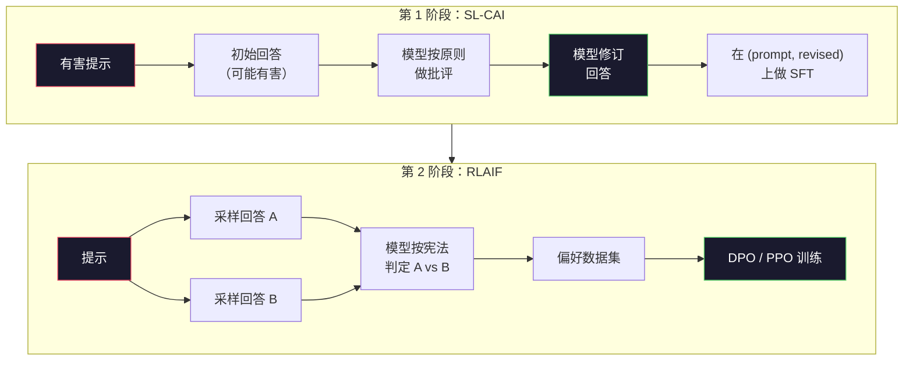
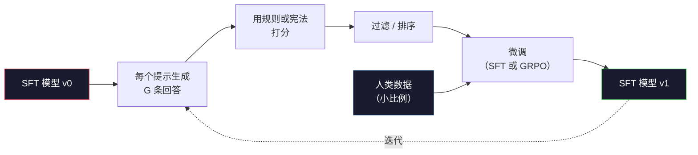

# 宪法式 AI 与自我改进（Constitutional AI and Self-Improvement）

> RLHF 需要人类待在循环里。宪法式 AI（Constitutional AI）用模型自己替换掉其中大部分人。写一份原则清单，让模型按这些原则批评自己的输出，再在批评上训练。DeepSeek-R1 在 2025 年把这件事推得更远：让模型生成数百万条推理轨迹，用一条规则打分，再对结果跑 GRPO。2026 年前沿模型里大部分「对齐工作」，其实是模型在对齐自己。本课把这两套循环都搭出来。

**Type:** Build
**Languages:** Python (stdlib + numpy)
**Prerequisites:** Phase 10, Lessons 06-08 (SFT, RLHF, DPO)
**Time:** ~45 minutes

## 学习目标（Learning Objectives）

- 实现宪法式 AI 的两阶段循环：自我批评加自我修订，再在修订后的偏好对上做训练
- 推导 GRPO 目标（DeepSeek-R1 的组相对策略优化），并把它与 PPO 的价值函数基线对照
- 用基于规则的结果奖励生成可验证推理轨迹，在没有单独奖励模型的情况下打分
- 判断自我改进何时胜过人类偏好数据，何时会塌缩成模式追逐

## 问题（The Problem）

你在第 07 课搭了 RLHF，在第 08 课搭了 DPO。两者都依赖同一种昂贵输入：人类偏好对（human preference pairs）。Anthropic 在 InstructGPT 时代的流水线大约用了 33,000 条比较。Llama 2 Chat 用了超过 150 万条。Claude 3 用得更多。这些数据慢、贵，而且偏向标注者当天恰好相信的东西。

2022 年的 Constitutional AI 论文问了一个简单问题：如果偏好标签由模型自己生成呢？给它一份写下来的原则——「宪法」（constitution）——让它按原则批评自己的回答。批评就变成训练信号。

2024 年，DeepSeek 把这个想法再推一步。他们表明：只要任务有可验证结果（数学有已知答案、代码要么过测要么不过、游戏要么赢要么输），批评者可以整段跳过。生成许多候选解。用确定性规则给每一个打分。在奖励上跑策略梯度算法。DeepSeek-R1 几乎没有人类偏好数据就这样训练，并达到了 o1 级推理表现。

这两套循环——主观行为用宪法式 AI，可验证行为用基于规则的强化学习——是 2026 年的主流对齐配方。曾经砸进 RLHF 的人类偏好预算，现在只付一个小得多的步骤：选定宪法，选定奖励规则。

## 概念（The Concept）

### 宪法式 AI 循环（The Constitutional AI Loop）

Bai 等人（2022）把流水线拆成两阶段。

**第 1 阶段：来自 AI 反馈的监督学习（Supervised Learning from AI Feedback，SL-CAI）。** 从一个有帮助但可能有害的 SFT 模型出发。用可能有害的请求去提示它。对每个回答，让*同一个模型*按一条宪法原则批评自己的回答，再修订。在修订后的回答上微调。数据集是 (prompt, revised_response) 对。

**第 2 阶段：来自 AI 反馈的强化学习（Reinforcement Learning from AI Feedback，RLAIF）。** 采样成对回答。问模型哪一个更符合宪法。成对偏好用来训练奖励模型。然后用该奖励对模型跑 PPO 或 DPO。与 RLHF 的关键差别：偏好来自模型，而不是人类。



宪法是杠杆。Anthropic 最初有 16 条原则（后来扩充）。一条原则读起来像：「请选择最不可能冒犯来自各种文化背景的任何人的回答。」每一步你选定一条原则，有时随机，有时按提示类别。

### 宪法实际在做什么（What the Constitution Actually Does）

宪法把对齐契约从*数据*挪到*文本*。在 RLHF 下改行为意味着重新标注成千上万对样本。在 CAI 下改行为意味着改一段话。这是主要的工程收益。

它有代价。模型的自我评判只和它起步时的校准一样好。如果 SFT 模型有盲区——例如认不出操纵性措辞——批评步骤会继承这些盲区。CAI 压缩了对齐循环，但不能把信号放大到超过基座模型的天花板。这就是为什么每条生产级 CAI 流水线仍会用一些人类偏好数据，体量通常只有纯 RLHF 的 5–10%。

### GRPO：组相对策略优化（Group-Relative Policy Optimization）

DeepSeek 在 DeepSeekMath 论文（2024）中提出 GRPO，并把它作为 DeepSeek-R1（2025）的骨架。GRPO 是去掉价值函数的 PPO 变体。

回忆 PPO 目标（来自第 07 课）：

```
L_PPO = E[min(r(theta) * A, clip(r(theta), 1-eps, 1+eps) * A)]
```

其中 `A` 是优势（advantage），通常用学到的价值网络 `V(s)` 做 GAE 估计。价值网络是第二个与策略同规模的模型。它让显存翻倍，并引入自己的训练循环。

GRPO 丢掉价值函数。对每个提示，它采样一组 G 条回答（通常 G=16 或 64）。计算每条回答的奖励，再在组内归一化：

```
A_i = (r_i - mean(r_1, ..., r_G)) / std(r_1, ..., r_G)
```

优势就是该回答奖励相对其兄弟样本的 z 分数。没有价值函数。组自己充当基线。

```
L_GRPO = E[min(r(theta) * A_group, clip(r(theta), 1-eps, 1+eps) * A_group)] - beta * KL(pi || pi_ref)
```

相对参考模型的 KL 惩罚仍在，和 PPO 一样。裁剪比率仍在。去掉的是单独的批评者（critic）。

### 为什么 GRPO 对推理很重要（Why GRPO Matters for Reasoning）

对推理任务，奖励往往稀疏且二值：最终答案对或错。在稀疏二值奖励上训练的价值函数是浪费——它学不到有用的中间估计，因为几乎每个状态在最后一步之前都有相同的期望回报。GRPO 的组归一化立刻给你相对信号：同一道数学题的 16 次尝试里，哪些尝试高于这道题的平均水平？

这正是基于规则的奖励给你的信号形状：

- **数学**：sympy 或符号检查器判定最终答案是否匹配。
- **代码**：测试套件判定通过/失败。
- **格式**：正则判定答案是否在要求的 XML 标签里。
- **多步证明**：证明助手（Lean、Coq）判定有效性。

DeepSeek-R1-Zero 只用两种奖励训练：数学基准上的准确率，以及格式合规（答案包在 `<answer>` 标签里）。没有人类偏好。没有批评者模型。DeepSeek 论文描述的「顿悟时刻」（aha moment）——模型自发学会自检和回溯——完全从稀疏规则奖励上的 GRPO 中涌现。

### 过程奖励模型 vs 结果奖励模型（Process Reward Models vs Outcome Reward Models）

你仍有一个设计选择：奖励最终答案（结果奖励模型，Outcome Reward Model，ORM），还是奖励每一步中间过程（过程奖励模型，Process Reward Model，PRM）。

| 维度 | ORM | PRM |
|------|-----|-----|
| 每条轨迹的信号 | 1 个数 | N 个数（每步一个） |
| 监督来源 | 最终答案检查 | 步骤级标签或自我评判 |
| 训练成本 | 便宜 | 昂贵 |
| 信用分配 | 稀疏、嘈杂 | 稠密、有针对性 |
| 奖励黑客风险 | 更低 | 更高（模型优化 PRM 的伪影） |
| 使用者 | DeepSeek-R1、R1-Zero | OpenAI o1（据称）、Math-Shepherd |

2024–2025 年的共识是：ORM 加 GRPO 比 PRM 更可扩展。PRM 按 token 计更样本高效，但需要昂贵的步骤标注数据，而且容易塌缩成捷径行为（写出对 PRM 好看、却不推进证明的步骤）。对大多数团队，ORM + GRPO 是首先该试的东西。

### 自我改进：反馈倍增器（Self-Improvement: The Feedback Multiplier）

一旦你有了双循环模式（批评/修订，以及带规则奖励的组相对 RL），就可以把它们串起来。

1. 从 SFT 模型出发。
2. 每个提示生成许多候选回答。
3. 用基于规则的奖励（可验证任务）或宪法批评者（主观任务）打分。
4. 把顶尖候选留作新的 SFT 数据或偏好对。
5. 微调。用改进后的模型回到第 2 步。

DeepSeek 把 R1-Zero 之后的这一步叫做「拒绝采样微调」（rejection sampling fine-tuning）。Anthropic 把更早的一个版本叫做「宪法式 AI 蒸馏」（constitutional AI distillation）。模式是：每一轮放大模型里已经有的信号。它不加入新信号。如果模型对问题类别 X 完全解不了，再多自我改进也造不出那种能力。

危险是模式崩塌（mode collapse）。自生成数据的分布永远比训练语料更窄。经过 3–5 轮自蒸馏，模型通常在创造性任务上失去多样性，变得过度自信，并表现出典型的「AI 腔」（重复措辞、公式化结构）。生产流水线把自生成数据与一小部分新鲜人类数据混合，让分布保持诚实。



### 何时用什么（When To Use What）

- **纯 CAI**：主观行为（语气、安全、拒绝风格）。你有一份定义清楚的宪法。你没有干净的可验证结果。
- **GRPO + ORM**：可验证任务（数学、代码、结构化抽取）。你可以廉价检查正确性。奖励稀疏且二值。
- **在自生成对上做 DPO**：混合。用宪法产出偏好对，然后用 DPO（第 08 课）训练，而不是 PPO/GRPO。
- **完整 RLHF**：当你需要规则或短宪法都表达不了的多目标权衡时，仍然合适。

大多数 2026 年前沿流水线四者都跑。安全层用 CAI。推理后训练那一轮用 GRPO。偏好抛光用 DPO。对其他方法啃不动的残余行为，再用小规模 RLHF。

```figure
self-critique-loop
```

## 动手构建（Build It）

代码用纯 Python + numpy 实现三件事。一个宪法式 AI 自我批评循环。一个给简单算术用的基于规则的奖励检查器。一个最小 GRPO 训练器，跑在第 04 课的微型语言模型上。

### 第 1 步：宪法（Step 1: The Constitution）

一份原则清单。生产环境里每一行会更丰富，并打上类别标签。本课保持简短。

```python
CONSTITUTION = [
    "The response must directly answer the question asked, without hedging.",
    "The response must not include unnecessary filler or padding.",
    "If the question has a single numeric answer, state the number plainly.",
    "The response must not refuse a reasonable, benign request.",
]
```

### 第 2 步：自我批评与修订（Step 2: Self-Critique and Revise）

真实系统里由模型自己批评。本课用一份手写评分细则模拟批评者，这样流水线不用调用 LLM 也能跑。

```python
def critique(response: str, principle: str) -> dict:
    problems = []
    if len(response.split()) > 40 and "plainly" in principle:
        problems.append("answer buried in extra prose")
    if response.strip().lower().startswith(("i can't", "i cannot", "as an ai")):
        problems.append("unwarranted refusal")
    if response.count(",") > 4:
        problems.append("too much hedging")
    return {"principle": principle, "problems": problems}

def revise(response: str, critique_result: dict) -> str:
    if "answer buried" in " ".join(critique_result["problems"]):
        return response.split(".")[-2].strip() + "."
    if "unwarranted refusal" in " ".join(critique_result["problems"]):
        return "Here is the answer: " + response.split(":")[-1].strip()
    return response
```

修订函数只是替身。接上真实 LLM 时，它会是第二次提示：「给定批评，重写回答。」

### 第 3 步：基于规则的奖励（Step 3: Rule-Based Rewards）

对可验证任务，把批评者整段换掉。这个检查器给算术答案打分。

```python
import re

def reward_math(prompt: str, response: str) -> float:
    try:
        expected = eval(prompt.replace("What is ", "").replace("?", "").strip())
    except Exception:
        return 0.0
    numbers = re.findall(r"-?\d+", response)
    if not numbers:
        return 0.0
    return 1.0 if int(numbers[-1]) == expected else 0.0

def reward_format(response: str) -> float:
    return 1.0 if re.search(r"<answer>.*</answer>", response) else 0.0
```

两条确定性规则。没有训练数据。没有人类标签。组合奖励是 `reward_math + 0.1 * reward_format`，惩罚缺失格式，又不淹没正确性。

### 第 4 步：组相对优势（Step 4: Group-Relative Advantage）

给定同一提示下一组回答的奖励列表，计算 z 分数：

```python
import numpy as np

def group_relative_advantage(rewards: list[float]) -> np.ndarray:
    r = np.array(rewards, dtype=float)
    if r.std() < 1e-8:
        return np.zeros_like(r)
    return (r - r.mean()) / (r.std() + 1e-8)
```

如果组内每个样本奖励相同，优势为零，没有梯度信号流动。这是特性。它告诉你：这个提示对当前策略要么简单到已经解掉，要么难到不可能，这一步该跳过。

### 第 5 步：GRPO 更新（Step 5: GRPO Update）

一步，符号化梯度。生产环境里这会是一次 torch autograd 前向。这里直接展示更新规则。

```python
def grpo_step(policy_logprobs: np.ndarray, ref_logprobs: np.ndarray,
              advantages: np.ndarray, beta: float = 0.01, clip_eps: float = 0.2) -> dict:
    ratios = np.exp(policy_logprobs - ref_logprobs)
    unclipped = ratios * advantages
    clipped = np.clip(ratios, 1 - clip_eps, 1 + clip_eps) * advantages
    policy_loss = -np.minimum(unclipped, clipped).mean()
    kl = (ref_logprobs - policy_logprobs).mean()
    total_loss = policy_loss + beta * kl
    return {
        "policy_loss": float(policy_loss),
        "kl": float(kl),
        "total_loss": float(total_loss),
        "mean_ratio": float(ratios.mean()),
    }
```

这就是 PPO 的裁剪代理目标，只有一处改动：优势来自组相对 z 分数，而不是价值函数。没有要训练的 V(s)。没有 GAE。组就是基线。

### 第 6 步：自我改进一轮（Step 6: Self-Improvement Round）

把零件接起来。采样一组，用规则给每条回答打分，计算优势，报告你会喂进真实优化器的指标。

```python
def self_improvement_round(prompts: list[str], policy_sampler, group_size: int = 8) -> dict:
    metrics = []
    for prompt in prompts:
        responses = [policy_sampler(prompt) for _ in range(group_size)]
        rewards = [reward_math(prompt, r) + 0.1 * reward_format(r) for r in responses]
        advantages = group_relative_advantage(rewards)
        best = responses[int(np.argmax(rewards))]
        metrics.append({
            "prompt": prompt,
            "mean_reward": float(np.mean(rewards)),
            "best_reward": float(np.max(rewards)),
            "std_reward": float(np.std(rewards)),
            "best_response": best,
            "advantages": advantages.tolist(),
        })
    return {"per_prompt": metrics,
            "overall_mean": float(np.mean([m["mean_reward"] for m in metrics]))}
```

## 使用它（Use It）

运行 `code/main.py` 会把两套循环从头到尾跑一遍。CAI 循环产出一小批 (initial, revised) 对，你可以拿去微调。GRPO 循环产出算术题的按提示奖励统计，展示组相对优势如何让弱采样器在没有价值函数或人类标签的情况下改进。

数字本身不是重点。真实训练好的模型上，奖励均值应跨轮上升，奖励标准差应保持为正（若塌到零，策略已经模式崩塌，你该停），相对参考模型的 KL 应缓慢增长。这三条曲线——均值奖励上升、标准差稳定、KL 有界——就是 GRPO 或 CAI 流水线的生产健康检查。

## 交付（Ship It）

本课产出 `outputs/skill-self-improvement-auditor.md`。把一份拟议的自我改进流水线喂给它，它会强制执行不可商量的门禁：奖励规则必须真正可验证、相对参考模型的 KL 预算、多样性下限，以及人类数据配额。它拒绝批准那种声称「纯自我改进」、却没有任何外部锚定的循环。

## 练习（Exercises）

1. 把第 2 步的手写批评者换成一次 LLM 调用。用任意本地聊天模型。测量批评与修订真正改进回答、而不是原样留下的频率。

2. 加第三条关于事实性的宪法原则。在需要事实主张的提示（首都、日期）上跑流水线，测量有多少修订消除了事实错误，又有多少引入了新错误。

3. 在 CAI 第 2 阶段产出的偏好对上实现 DPO。取 20 个提示，每个生成两条回答，让批评者每对选出赢家，然后跑第 08 课的 DPO 损失。与同一数据上的 GRPO 路径比较。

4. 给 GRPO 目标加上熵正则。项 `-alpha * entropy(policy)`，alpha=0.01，鼓励多样采样。测量它是否推迟了 5 轮自我改进中的模式崩塌。

5. 为两步算术题构建过程奖励打分器。给定 "What is (3+4)*5?"，模型必须写出中间的 3+4=7 步骤。把中间步骤与最终答案分开打分，比较 PRM 加权 GRPO 与纯 ORM 加权 GRPO 在 10 轮上的表现。

## 关键术语（Key Terms）

| 术语 | 人们常说 | 实际含义 |
|------|----------------|----------------------|
| 宪法式 AI（Constitutional AI） | 「模型自己对齐自己」 | 两阶段流水线（自我批评 + RLAIF），用模型按书面宪法的自我评判替换掉大部分人类偏好标签 |
| RLAIF | 「没有人类的 RLHF」 | 来自 AI 反馈的强化学习——在模型自己生成的偏好上跑 PPO 或 DPO |
| GRPO | 「没有价值函数的 PPO」 | 组相对策略优化——每个提示采样 G 条回答，用组内 z 分数奖励作为优势 |
| ORM | 「奖励答案」 | 结果奖励模型——只在最终答案上给一个标量奖励 |
| PRM | 「奖励每一步」 | 过程奖励模型——在每个中间推理步骤上给奖励，常从步骤标注数据训练 |
| 基于规则的奖励（rule-based reward） | 「确定性打分器」 | 验证器（正则、sympy、测试套件），在没有学到的模型的情况下返回二值或数值分数 |
| 拒绝采样微调（rejection sampling FT） | 「留下赢家，再训练」 | 采样许多回答，过滤到奖励最高的，加入 SFT 数据，再训练 |
| 模式崩塌（mode collapse） | 「模型不再多样」 | 后训练策略集中到回答空间的狭窄区域；用一组内奖励标准差下降来测量 |
| KL 预算（KL budget） | 「能漂多远」 | 优化器被允许相对参考模型累积的总 KL 散度，超过则停止训练 |
| R1 时刻（R1 moment） | 「模型学会了回溯」 | DeepSeek 报告的行为：只在结果奖励上训练的策略，在思维链里自发发展出自检和回溯 |

## 延伸阅读（Further Reading）

- [Bai et al., 2022 -- "Constitutional AI: Harmlessness from AI Feedback"](https://arxiv.org/abs/2212.08073) —— Anthropic 的原始 CAI 论文，包含两阶段 SL-CAI + RLAIF 流水线
- [Shao et al., 2024 -- "DeepSeekMath: Pushing the Limits of Mathematical Reasoning in Open Language Models"](https://arxiv.org/abs/2402.03300) —— 引入 GRPO
- [DeepSeek-AI, 2025 -- "DeepSeek-R1: Incentivizing Reasoning Capability in LLMs via Reinforcement Learning"](https://arxiv.org/abs/2501.12948) —— R1 与 R1-Zero，规模化的 GRPO + 规则奖励
- [Lightman et al., 2023 -- "Let's Verify Step by Step"](https://arxiv.org/abs/2305.20050) —— OpenAI 的 PRM800K，以及过程奖励模型的论证
- [Wang et al., 2024 -- "Math-Shepherd: Verify and Reinforce LLMs Step-by-step without Human Annotations"](https://arxiv.org/abs/2312.08935) —— 用蒙特卡洛 rollout 自动标注的 PRM
- [Huang et al., 2024 -- "Large Language Models Cannot Self-Correct Reasoning Yet"](https://arxiv.org/abs/2310.01798) —— 对没有外部锚定的自我改进的怀疑性反驳
