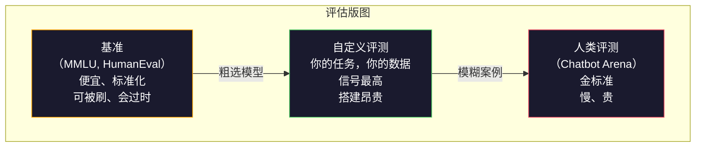
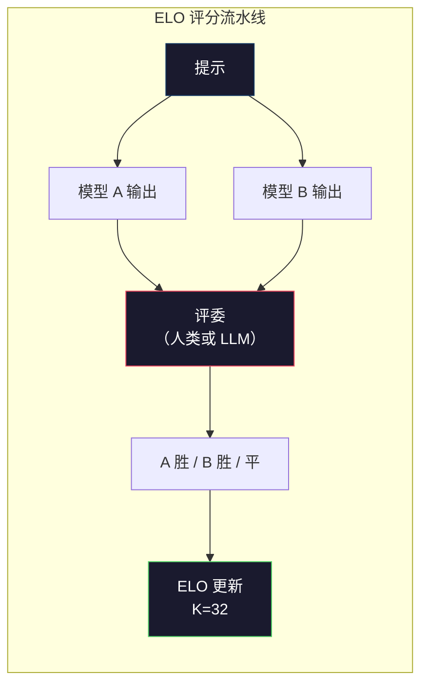

# 评估：基准、评测与 LM Harness（Evaluation: Benchmarks, Evals, LM Harness）

> 古德哈特定律（Goodhart's Law）：当一个度量成为目标，它就不再是好度量。每个前沿实验室都在刷基准。MMLU 分数往上走，模型却仍不能可靠地数出 "strawberry" 里有几个 R。唯一要紧的评测是你的评测——在你的任务上，用你的数据。

**Type:** Build
**Languages:** Python
**Prerequisites:** Phase 10, Lessons 01-05 (LLMs from Scratch)
**Time:** ~90 minutes

## 学习目标（Learning Objectives）

- 搭建一套自定义评估框架（evaluation harness），对语言模型跑多选题与开放式基准
- 解释为什么标准基准（MMLU、HumanEval）会饱和，无法再区分前沿模型
- 用合适的指标实现任务特定评测：精确匹配（exact match）、F1、BLEU，以及 LLM 作评委（LLM-as-judge）打分
- 设计针对你具体用例的自定义评测套件，而不是只依赖公开排行榜

## 问题（The Problem）

MMLU 于 2020 年发布，含 57 个学科、15,908 道题。三年内，前沿模型就把它刷饱和了。GPT-4 得 86.4%。Claude 3 Opus 得 86.8%。Llama 3 405B 得 88.6%。排行榜被压进 3 分的区间，差异是统计噪声，不是真实能力差距。

与此同时，这些模型会在 10 岁小孩不假思索就能完成的任务上失败。Claude 3.5 Sonnet 在 MMLU 上得 88.7%，起初却数不清 "strawberry" 里的字母——这任务不需要世界知识，不需要推理，只要按字符迭代。HumanEval 用 164 道题测代码生成。模型能拿到 90%+，却仍写出任何初级开发者都会抓住的边界情况崩溃代码。

基准表现与真实世界可靠性之间的鸿沟，是 LLM 评估的核心问题。基准告诉你模型在基准上表现如何。它们几乎不告诉你：那个模型在你的具体任务、你的具体数据、你的具体失败模式下会怎样。如果你在做客服机器人，MMLU 无关。如果你在做代码助手，HumanEval 只覆盖函数级生成——它不谈调试、重构，或跨文件解释代码。

你需要自定义评测。不是因为基准没用——它们对粗选模型有用——而是因为最终评估必须精确匹配你的部署条件。

## 概念（The Concept）

### 评测版图（The Eval Landscape）

评估分三类，成本和信号质量各不相同。

**基准（benchmarks）** 是标准化测试套件。MMLU、HumanEval、SWE-bench、MATH、ARC、HellaSwag。你把模型对着基准跑，得到一个分数。优点：大家都用同一套测试，所以能比模型。缺点：模型和训练数据越来越多地污染这些基准。实验室在包含基准题目的数据上训练。分数上去。能力未必上去。

**自定义评测（custom evals）** 是你为具体用例搭建的测试套件。你定义输入、期望输出和打分函数。法律文档摘要器在法律文档上评。SQL 生成器在你的数据库模式上评。它们创建昂贵，却是唯一能预测生产表现的评估。

**人类评测（human evals）** 用付费标注者按有用性、正确性、流畅性、安全性等标准评判模型输出。对自动打分失败的开放式任务，这是金标准。Chatbot Arena 已在 100+ 个模型上收集超过 200 万次人类偏好投票。缺点：成本（每次评判 $0.10–$2.00）和速度（数小时到数天）。



### 基准为何失效（Why Benchmarks Break）

三种机制让基准分数不再反映真实能力。

**数据污染（data contamination）。** 训练语料抓取互联网。基准题目活在互联网上。模型在训练中见过答案。这不是传统意义上的作弊——实验室并非故意塞入基准数据。但网络规模抓取几乎不可能排除干净。

**应试教学（teaching to the test）。** 实验室为基准表现优化训练配比。如果训练混合物的 5% 是 MMLU 风格的多选题，模型就学会格式和答案分布。MMLU 是 4 选 1。模型学会答案分布在 A/B/C/D 上大致均匀，即使不知道答案也有帮助。

**饱和（saturation）。** 当前沿模型在某个基准上都得 85–90%，基准就不再区分。剩下的 10–15% 题目可能含糊、标错，或需要冷门领域知识。MMLU 从 87% 提到 89%，可能只是模型多背了两道冷门题，不是变聪明了。

### 困惑度：快速健康检查（Perplexity: A Quick Health Check）

困惑度（perplexity）衡量模型对一段 token 序列有多惊讶。形式上，它是指数化的平均负对数似然：

```
PPL = exp(-1/N * sum(log P(token_i | context)))
```

困惑度为 10 意味着：平均而言，模型在每个 token 位置上的不确定程度，相当于在 10 个选项里均匀选择。越低越好。GPT-2 在 WikiText-103 上困惑度约 30。GPT-3 约 20。Llama 3 8B 约 7。

困惑度适合在同一测试集上比较模型，但有盲区。模型可以靠擅长预测常见模式拿到低困惑度，同时在罕见但重要的模式上很差。它也不谈指令遵循、推理或事实准确性。把它当健全性检查，不要当最终裁决。

### LLM 作评委（LLM-as-Judge）

用强模型评估弱模型的输出。想法简单：让 GPT-4o 或 Claude Sonnet 按正确性、有用性、安全性在 1–5 分上给回答打分。用 GPT-4o-mini 大约每次评判 $0.01，并且与人类评判相关得惊人地好——大多数任务上约 80% 一致。

打分提示比模型更重要。含糊提示（「给这个回答打分」）产生嘈杂分数。带评分细则的结构化提示（「若答案事实正确并引用了来源打 5，正确但无来源打 4，部分正确打 3……」）产生一致、可复现的分数。

失败模式：评委模型表现出位置偏见（成对比较里偏好第一条回答）、冗长偏见（偏好更长的回答），以及自我偏好（GPT-4 给 GPT-4 输出的分高于等价的 Claude 输出）。缓解：随机化顺序、按长度归一化、用与被评模型不同的评委。

### 来自成对比较的 ELO 评分（ELO Ratings from Pairwise Comparisons）

Chatbot Arena 的做法。把同一提示下两个不同模型的回答展示出来。人类（或 LLM 评委）挑更好的那个。从成千上万次这种比较中，给每个模型算一个 ELO 评分——和国际象棋用的同一套系统。

ELO 的优点：相对排名比绝对打分更可靠，能优雅处理平局，并且比给每个输出独立打分用更少比较就能收敛。截至 2026 年初，Chatbot Arena 排名显示 GPT-4o、Claude 3.5 Sonnet 和 Gemini 1.5 Pro 在顶端彼此相差不到 20 个 ELO 点。



### 评测框架（Eval Frameworks）

**lm-evaluation-harness**（EleutherAI）：标准开源评测框架。支持 200+ 个基准。一条命令就能把任意 Hugging Face 模型对着 MMLU、HellaSwag、ARC 等跑。Open LLM Leaderboard 在用它。

**RAGAS**：专为 RAG 流水线的评估框架。衡量忠实度（答案是否匹配检索到的上下文？）、相关性（检索到的上下文是否与问题相关？）以及答案正确性。

**promptfoo**：面向提示工程的配置驱动评测。在 YAML 里定义测试用例，对着多个模型跑，得到通过/失败报告。适合对提示做回归测试——确保提示改动没有弄坏已有测试用例。

### 构建自定义评测（Building Custom Evals）

对生产唯一要紧的评测。流程：

1. **定义任务。** 模型到底该做什么？要精确。「回答问题」太含糊。「给定一封客户投诉邮件，抽取产品名、问题类别和情感」才是你可以评估的任务。

2. **创建测试用例。** 原型评测至少 50 条，生产 200+ 条。每个测试用例是 (input, expected_output) 对。包含边界情况：空输入、对抗输入、含糊输入、其他语言输入。

3. **定义打分。** 结构化输出用精确匹配。文本相似度用 BLEU/ROUGE。开放式质量用 LLM 作评委。抽取任务用 F1。用权重组合多个指标。

4. **自动化。** 每次评测一条命令跑完。没有手工步骤。把结果存成能随时间比较的格式。

5. **随时间追踪。** 孤立的评测分数没有意义。你需要趋势线。上次改提示后分数升了吗？换模型后回退了吗？把评测和提示一起做版本管理。

| 评测类型 | 每次评判成本 | 与人类一致率 | 最适合 |
|-----------|------------------|----------------------|----------|
| 精确匹配 | ~$0 | 100%（适用时） | 结构化输出、分类 |
| BLEU/ROUGE | ~$0 | ~60% | 翻译、摘要 |
| LLM 作评委 | ~$0.01 | ~80% | 开放式生成 |
| 人类评测 | $0.10–$2.00 | 不适用（就是真值） | 含糊、高风险任务 |

```figure
perplexity-loss
```

## 动手构建（Build It）

### 第 1 步：最小评测框架（Step 1: A Minimal Eval Framework）

定义核心抽象。一条评测用例有输入、期望输出，以及可选的元数据字典。打分器接收预测和参考，返回 0 到 1 之间的分数。

```python
import json
from collections import Counter

class EvalCase:
    def __init__(self, input_text, expected, metadata=None):
        self.input_text = input_text
        self.expected = expected
        self.metadata = metadata or {}

class EvalSuite:
    def __init__(self, name, cases, scorers):
        self.name = name
        self.cases = cases
        self.scorers = scorers

    def run(self, model_fn):
        results = []
        for case in self.cases:
            prediction = model_fn(case.input_text)
            scores = {}
            for scorer_name, scorer_fn in self.scorers.items():
                scores[scorer_name] = scorer_fn(prediction, case.expected)
            results.append({
                "input": case.input_text,
                "expected": case.expected,
                "prediction": prediction,
                "scores": scores,
            })
        return results
```

### 第 2 步：打分函数（Step 2: Scoring Functions）

实现精确匹配、token F1，以及一个模拟的 LLM 作评委打分器。

```python
def exact_match(prediction, expected):
    return 1.0 if prediction.strip().lower() == expected.strip().lower() else 0.0

def token_f1(prediction, expected):
    pred_tokens = set(prediction.lower().split())
    exp_tokens = set(expected.lower().split())
    if not pred_tokens or not exp_tokens:
        return 0.0
    common = pred_tokens & exp_tokens
    precision = len(common) / len(pred_tokens)
    recall = len(common) / len(exp_tokens)
    if precision + recall == 0:
        return 0.0
    return 2 * (precision * recall) / (precision + recall)

def llm_judge_simulated(prediction, expected):
    pred_words = set(prediction.lower().split())
    exp_words = set(expected.lower().split())
    if not exp_words:
        return 0.0
    overlap = len(pred_words & exp_words) / len(exp_words)
    length_penalty = min(1.0, len(prediction) / max(len(expected), 1))
    return round(overlap * 0.7 + length_penalty * 0.3, 3)
```

### 第 3 步：ELO 评分系统（Step 3: ELO Rating System）

实现带 ELO 更新的成对比较。这正是 Chatbot Arena 用来给模型排名的系统。

```python
class ELOTracker:
    def __init__(self, k=32, initial_rating=1500):
        self.ratings = {}
        self.k = k
        self.initial_rating = initial_rating
        self.history = []

    def _ensure_player(self, name):
        if name not in self.ratings:
            self.ratings[name] = self.initial_rating

    def expected_score(self, rating_a, rating_b):
        return 1 / (1 + 10 ** ((rating_b - rating_a) / 400))

    def record_match(self, player_a, player_b, outcome):
        self._ensure_player(player_a)
        self._ensure_player(player_b)

        ea = self.expected_score(self.ratings[player_a], self.ratings[player_b])
        eb = 1 - ea

        if outcome == "a":
            sa, sb = 1.0, 0.0
        elif outcome == "b":
            sa, sb = 0.0, 1.0
        else:
            sa, sb = 0.5, 0.5

        self.ratings[player_a] += self.k * (sa - ea)
        self.ratings[player_b] += self.k * (sb - eb)

        self.history.append({
            "a": player_a, "b": player_b,
            "outcome": outcome,
            "rating_a": round(self.ratings[player_a], 1),
            "rating_b": round(self.ratings[player_b], 1),
        })

    def leaderboard(self):
        return sorted(self.ratings.items(), key=lambda x: -x[1])
```

### 第 4 步：困惑度计算（Step 4: Perplexity Calculation）

用 token 概率计算困惑度。实践中你会从模型的 logits 拿到这些。这里用一个概率分布来模拟。

```python
import numpy as np

def perplexity(log_probs):
    if not log_probs:
        return float("inf")
    avg_neg_log_prob = -np.mean(log_probs)
    return float(np.exp(avg_neg_log_prob))

def token_log_probs_simulated(text, model_quality=0.8):
    np.random.seed(hash(text) % 2**31)
    tokens = text.split()
    log_probs = []
    for i, token in enumerate(tokens):
        base_prob = model_quality
        if len(token) > 8:
            base_prob *= 0.6
        if i == 0:
            base_prob *= 0.7
        prob = np.clip(base_prob + np.random.normal(0, 0.1), 0.01, 0.99)
        log_probs.append(float(np.log(prob)))
    return log_probs
```

### 第 5 步：汇总结果（Step 5: Aggregate Results）

计算一次评测运行的摘要统计：均值、中位数、某阈值下的通过率，以及按指标的分解。

```python
def summarize_results(results, threshold=0.8):
    all_scores = {}
    for r in results:
        for metric, score in r["scores"].items():
            all_scores.setdefault(metric, []).append(score)

    summary = {}
    for metric, scores in all_scores.items():
        arr = np.array(scores)
        summary[metric] = {
            "mean": round(float(np.mean(arr)), 3),
            "median": round(float(np.median(arr)), 3),
            "std": round(float(np.std(arr)), 3),
            "min": round(float(np.min(arr)), 3),
            "max": round(float(np.max(arr)), 3),
            "pass_rate": round(float(np.mean(arr >= threshold)), 3),
            "n": len(scores),
        }
    return summary

def print_summary(summary, suite_name="Eval"):
    print(f"\n{'=' * 60}")
    print(f"  {suite_name} Summary")
    print(f"{'=' * 60}")
    for metric, stats in summary.items():
        print(f"\n  {metric}:")
        print(f"    Mean:      {stats['mean']:.3f}")
        print(f"    Median:    {stats['median']:.3f}")
        print(f"    Std:       {stats['std']:.3f}")
        print(f"    Range:     [{stats['min']:.3f}, {stats['max']:.3f}]")
        print(f"    Pass rate: {stats['pass_rate']:.1%} (threshold >= 0.8)")
        print(f"    N:         {stats['n']}")
```

### 第 6 步：跑完整流水线（Step 6: Run the Full Pipeline）

把所有东西接起来。定义任务，创建测试用例，模拟两个模型，跑评测，从成对比较算 ELO，打印排行榜。

```python
def demo_model_good(prompt):
    responses = {
        "What is the capital of France?": "Paris",
        "What is 2 + 2?": "4",
        "Who wrote Hamlet?": "William Shakespeare",
        "What language is PyTorch written in?": "Python and C++",
        "What is the boiling point of water?": "100 degrees Celsius",
    }
    return responses.get(prompt, "I don't know")

def demo_model_bad(prompt):
    responses = {
        "What is the capital of France?": "Paris is the capital city of France",
        "What is 2 + 2?": "The answer is four",
        "Who wrote Hamlet?": "Shakespeare",
        "What language is PyTorch written in?": "Python",
        "What is the boiling point of water?": "212 Fahrenheit",
    }
    return responses.get(prompt, "Unknown")

cases = [
    EvalCase("What is the capital of France?", "Paris"),
    EvalCase("What is 2 + 2?", "4"),
    EvalCase("Who wrote Hamlet?", "William Shakespeare"),
    EvalCase("What language is PyTorch written in?", "Python and C++"),
    EvalCase("What is the boiling point of water?", "100 degrees Celsius"),
]

suite = EvalSuite(
    name="General Knowledge",
    cases=cases,
    scorers={
        "exact_match": exact_match,
        "token_f1": token_f1,
        "llm_judge": llm_judge_simulated,
    },
)

results_good = suite.run(demo_model_good)
results_bad = suite.run(demo_model_bad)

print_summary(summarize_results(results_good), "Model A (concise)")
print_summary(summarize_results(results_bad), "Model B (verbose)")
```

「好」模型给出精确答案。「差」模型给出冗长改写。精确匹配狠狠惩罚冗长模型。Token F1 和 LLM 作评委更宽容。这说明指标选择为什么重要：同一个模型看起来很棒还是很糟，取决于你怎么打分。

### 第 7 步：ELO 锦标赛（Step 7: ELO Tournament）

在多轮中对模型做成对比较。

```python
elo = ELOTracker(k=32)

for case in cases:
    pred_a = demo_model_good(case.input_text)
    pred_b = demo_model_bad(case.input_text)

    score_a = token_f1(pred_a, case.expected)
    score_b = token_f1(pred_b, case.expected)

    if score_a > score_b:
        outcome = "a"
    elif score_b > score_a:
        outcome = "b"
    else:
        outcome = "tie"

    elo.record_match("model_a_concise", "model_b_verbose", outcome)

print("\nELO Leaderboard:")
for name, rating in elo.leaderboard():
    print(f"  {name}: {rating:.0f}")
```

### 第 8 步：困惑度比较（Step 8: Perplexity Comparison）

比较不同质量水平「模型」的困惑度。

```python
test_text = "The quick brown fox jumps over the lazy dog in the garden"

for quality, label in [(0.9, "Strong model"), (0.7, "Medium model"), (0.4, "Weak model")]:
    log_probs = token_log_probs_simulated(test_text, model_quality=quality)
    ppl = perplexity(log_probs)
    print(f"  {label} (quality={quality}): perplexity = {ppl:.2f}")
```

## 使用它（Use It）

### lm-evaluation-harness（EleutherAI）

在任意模型上跑基准的标准工具。

```python
# pip install lm-eval
# Command line:
# lm_eval --model hf --model_args pretrained=meta-llama/Llama-3.1-8B --tasks mmlu --batch_size 8

# Python API:
# import lm_eval
# results = lm_eval.simple_evaluate(
#     model="hf",
#     model_args="pretrained=meta-llama/Llama-3.1-8B",
#     tasks=["mmlu", "hellaswag", "arc_easy"],
#     batch_size=8,
# )
# print(results["results"])
```

### promptfoo

面向提示工程的配置驱动评测。在 YAML 里定义测试，对着多个提供商跑。

```yaml
# promptfoo.yaml
providers:
  - openai:gpt-4o-mini
  - anthropic:claude-3-haiku

prompts:
  - "Answer in one word: {{question}}"

tests:
  - vars:
      question: "What is the capital of France?"
    assert:
      - type: contains
        value: "Paris"
  - vars:
      question: "What is 2 + 2?"
    assert:
      - type: equals
        value: "4"
```

### 用 RAGAS 做 RAG 评估（RAGAS for RAG evaluation）

```python
# pip install ragas
# from ragas import evaluate
# from ragas.metrics import faithfulness, answer_relevancy, context_precision
#
# result = evaluate(
#     dataset,
#     metrics=[faithfulness, answer_relevancy, context_precision],
# )
# print(result)
```

RAGAS 衡量通用评测错过的东西：模型的答案是否锚定在检索到的上下文里，而不只是抽象意义上「正确」。

## 交付（Ship It）

本课产出 `outputs/prompt-eval-designer.md`——一份可复用提示，能为任意任务设计自定义评测套件。给它任务描述，它会生成测试用例、打分函数，以及通过/失败阈值建议。

它还产出 `outputs/skill-llm-evaluation.md`——一套决策框架，按你的任务类型、预算和延迟要求选择正确的评估策略。

## 练习（Exercises）

1. 加一个「一致性」打分器：把同一输入送进模型 5 次，测量输出匹配的频率。确定性输入上不一致的答案，暴露脆弱提示或过高的温度设置。

2. 扩展 ELO 追踪器，支持多个评委函数（精确匹配、F1、LLM 作评委）并加权。比较你重权精确匹配 vs 重权 F1 时排行榜如何变化。

3. 为具体任务搭一套评测：把邮件分到 5 个类别。创建 100 条多样测试用例，包含边界情况（可能属于多个类别的邮件、空邮件、其他语言邮件）。测量不同「模型」（基于规则、关键词匹配、模拟 LLM）的表现。

4. 实现污染检测：给定一组评测题目和一份训练语料，检查有百分之多少评测题目（或接近的改写）出现在训练数据里。研究者就是这样审计基准有效性的。

5. 构建「模型 diff」工具。给定两个模型版本的评测结果，标出哪些具体测试用例改进了、哪些回退了、哪些没变。这是评测版的代码 diff——弄清一次改动是帮了还是害了，必不可少。

## 关键术语（Key Terms）

| 术语 | 人们常说 | 实际含义 |
|------|----------------|----------------------|
| MMLU | 「那个基准」 | Massive Multitask Language Understanding——57 个学科上 15,908 道多选题，到 2025 年已饱和在 88% 以上 |
| HumanEval | 「代码评测」 | OpenAI 的 164 道 Python 函数补全题，只测孤立函数生成 |
| SWE-bench | 「真实编码评测」 | 来自 12 个 Python 仓库的 2,294 个 GitHub issue，衡量含测试生成的端到端修 bug |
| 困惑度（perplexity） | 「模型有多困惑」 | exp(-avg(log P(token_i given context)))——越低意味着模型给实际 token 分配更高概率 |
| ELO 评分 | 「模型的象棋排名」 | 从成对胜负记录算出的相对技能分，Chatbot Arena 用它给 100+ 个模型排名 |
| LLM 作评委（LLM-as-judge） | 「用 AI 给 AI 打分」 | 强模型按评分细则给弱模型输出打分，与人类评委约 80% 一致，约 $0.01/次 |
| 数据污染（data contamination） | 「模型见过考题」 | 训练数据包含基准题目，抬高分数却不提升真实能力 |
| 评测套件（eval suite） | 「一堆测试」 | 一组版本化的 (input, expected_output, scorer) 三元组，衡量某项具体能力 |
| 通过率（pass rate） | 「它对了百分之多少」 | 分数高于阈值的评测用例比例——比均值分数更可操作，因为它衡量可靠性 |
| Chatbot Arena | 「模型排名网站」 | LMSYS 平台，有 200 万+ 人类偏好投票，用 ELO 评分产出最受信任的 LLM 排行榜 |

## 延伸阅读（Further Reading）

- [Hendrycks et al., 2021 -- "Measuring Massive Multitask Language Understanding"](https://arxiv.org/abs/2009.03300) —— MMLU 论文，尽管已饱和，仍是被引用最多的 LLM 基准
- [Chen et al., 2021 -- "Evaluating Large Language Models Trained on Code"](https://arxiv.org/abs/2107.03374) —— OpenAI 的 HumanEval 论文，确立了代码生成评估方法
- [Zheng et al., 2023 -- "Judging LLM-as-a-Judge"](https://arxiv.org/abs/2306.05685) —— 系统分析用 LLM 评估 LLM，包括位置偏见和冗长偏见的发现
- [LMSYS Chatbot Arena](https://chat.lmsys.org/) —— 众包模型比较平台，200 万+ 投票，最受信任的真实世界 LLM 排名
