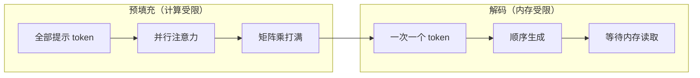
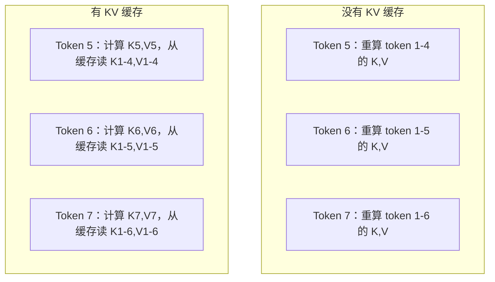
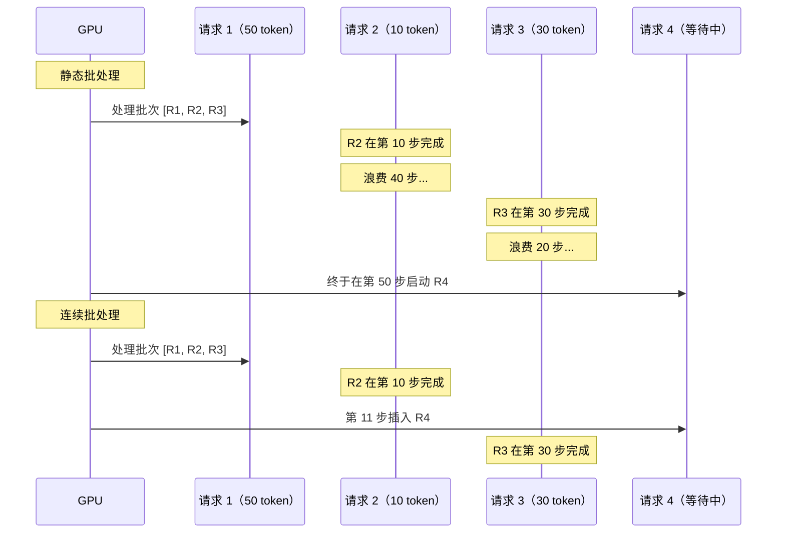
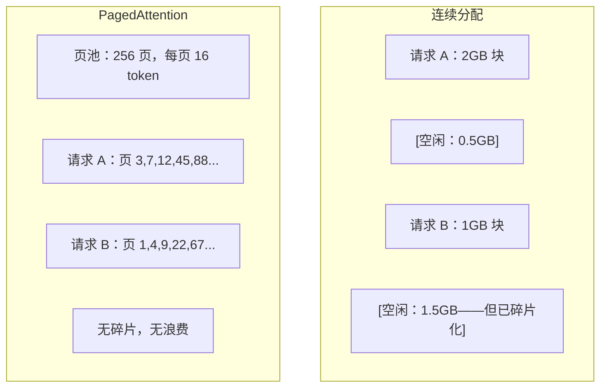
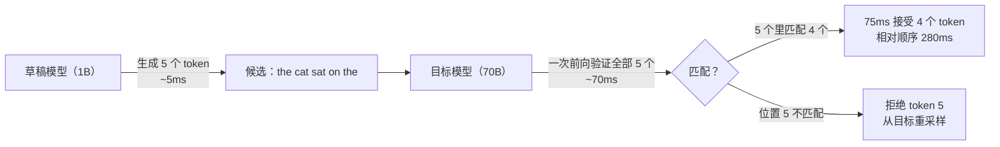

# 推理优化（Inference Optimization）

> LLM 推理由两个阶段定义。预填充（Prefill）并行处理你的提示——计算受限（compute-bound）。解码（Decode）一次生成一个 token——内存受限（memory-bound）。每一项优化都瞄准其中一个或两个。

**Type:** Build
**Languages:** Python
**Prerequisites:** Phase 10, Lessons 01-08 (Transformer architecture, attention)
**Time:** ~120 minutes

## 学习目标（Learning Objectives）

- 实现 KV 缓存（KV-cache），在自回归 token 生成期间消除冗余计算
- 解释 LLM 推理的预填充与解码阶段，以及为何各自有不同瓶颈（计算受限 vs 内存受限）
- 实现连续批处理（continuous batching）与分页注意力（PagedAttention）的概念，以在并发请求下最大化 GPU 利用率
- 比较推理优化技术（KV 缓存、投机解码、flash attention）及其吞吐/延迟权衡

## 问题（The Problem）

你在 4×A100 GPU 上部署 Llama 3 70B。单个用户大约每秒 50 个 token。感觉很快。然后 100 个用户同时打到端点。吞吐掉到每用户每秒 3 个 token。每月 25,000 美元的 GPU 账单，响应比人打字还慢。

模型本身在 1 个用户和 100 个用户之间没有变。同样的权重、同样的架构、同样的数学。变的是你如何调度工作。朴素推理浪费 90% 以上的可用 GPU 计算。一个用户在等第 47 个 token 时占着整个批次槽位，而 GPU 内存总线在矩阵乘之间闲着。与此同时，一个新用户的 2,000 token 提示本可以用有用计算填满那段死时间。

这不是扩展问题。这是调度问题。本课中的技术——KV 缓存、连续批处理、PagedAttention、投机解码（speculative decoding）、前缀缓存（prefix caching）——把每月 2.5 万美元的推理账单，和同样流量下每月 5 千美元的账单区分开来。

vLLM 在 4×A100-80GB 上服务 Llama 3 70B，低并发时达到每用户约 50 token/秒，并靠连续批处理和 PagedAttention 在 100 个并发请求下维持每用户 15–25 TPS。没有这些优化，同样硬件在该并发下只服务每用户 5 TPS。同样的 GPU，同样的模型，4 倍吞吐。

## 概念（The Concept）

### 预填充 vs 解码（Prefill vs Decode）

每一次 LLM 推理请求都有两个截然不同的阶段。

**预填充（Prefill）**处理整段输入提示。所有 token 已知，因此注意力可以在完整序列上并行计算。这是一次大型矩阵乘——GPU 核心保持忙碌。瓶颈是计算：硬件每秒能交付多少 FLOPS。一张 A100 做 312 TFLOPS（BF16）。70B 模型上 4,096 token 提示的预填充在单张 A100 上大约要 ~400ms。

**解码（Decode）**一次生成一个输出 token。每个新 token 对所有先前 token 做注意力，但每次前向只产出一个 token。权重矩阵与预填充时一样大，但你是在用单个向量去乘它们，而不是矩阵。GPU 核心在微秒内算完，然后等下一批权重从内存到达。瓶颈是内存带宽：你能多快把模型权重从 HBM 流到计算单元。一张 A100 有 2 TB/s 带宽。FP16 的 70B 模型是 140 GB。把完整模型读一遍要 70ms——那就是单步解码的下限。



**ops:byte 比**（也叫算术强度，arithmetic intensity）抓住了这种权衡。它衡量每从内存加载一字节你做多少运算。

```
ops:byte ratio = FLOPs per token / bytes read from memory
```

预填充时若批次有 4,096 个 token，每加载一个权重你大约做 ~4,096 次乘加。比率高——你是计算受限。解码时批次大小为 1，每加载一个权重大约做 ~1 次运算。比率低——你是内存受限。

根本洞察：*解码之所以内存受限，是因为你读完整模型只为产出一个 token*。下面每一项优化要么减少你读的东西，要么增加每次读取处理的 token 批次，要么彻底避免读取。

### KV 缓存（KV Cache）

注意力中，每个 token 的查询对先前每个 token 的键和值向量做注意力。没有缓存时，生成第 N 个 token 需要为前面全部 N-1 个 token 重新计算键和值投影。生成 token 2 时投影 token 1，生成 token 3 时再投影一次，生成 token 4 时再一次。到 token 1,000 时，你已经把 token 1 投影了总共 999 次。

KV 缓存存储所有先前 token 的键和值投影。生成 token N 时，你只计算 token N 的键和值，再把它们与缓存中 token 1 到 N-1 的 K/V 拼接。



**KV 缓存的内存公式：**

```
KV cache size = 2 * num_layers * num_kv_heads * head_dim * seq_len * bytes_per_param
```

对 Llama 3 70B（80 层，GQA 下 8 个 KV 头，head_dim=128，BF16）：

```
per token: 2 * 80 * 8 * 128 * 2 bytes = 327,680 bytes = 320 KB
at 4,096 tokens: 320 KB * 4,096 = 1.28 GB
at 128K tokens: 320 KB * 131,072 = 40 GB
```

Llama 3 70B 的单次 128K 上下文对话消耗 40 GB KV 缓存——半张 A100 的内存。100 个并发用户各 4K token 时，仅 KV 缓存就需要 128 GB。这就是为何 KV 缓存管理是推理优化的中心挑战。

### 连续批处理（Continuous Batching）

静态批处理等到 N 个请求到齐，一起处理，并等到*全部*完成才接受新请求。若一个请求需要 500 个 token、另一个需要 10 个，短请求在结束后还要空转 490 个解码步。

连续批处理（也叫迭代级批处理，iteration-level batching）一旦任何请求完成，就把新请求插入批次。批次在每一个解码步重新评估。一个 10 个 token 后结束的请求立刻被等待中的请求替换。



吞吐提升取决于输出长度有多参差。长度均匀时，连续批处理与静态批处理相当。长度可变时（常见情况），连续批处理可以给出 2–5 倍更高吞吐，因为 GPU 槽位从不空着。

### 分页注意力（PagedAttention）

每个请求的 KV 缓存是一块连续内存。请求到达和离开时，内存碎片化——正像操作系统里的 RAM 碎片。一个 4K token 请求需要 1.28 GB 连续空间。即便你总共有 2 GB 空闲，也可能没有 1.28 GB *连续*空间。你要么浪费内存，要么拒绝请求。

PagedAttention（来自 vLLM）把操作系统风格的虚拟内存应用到 KV 缓存。不是为每个请求分配一块连续区域，而是分配固定大小的“页”（通常每页 16 个 token）。页可以在物理 GPU 内存的任何位置。页表把每个请求的逻辑序列位置映射到物理页位置。



PagedAttention 还为共享前缀启用**写时复制（copy-on-write）**。若 50 个请求共享同一系统提示，该系统提示的 KV 缓存页只存一份，被全部 50 个请求引用。只有当请求分叉（不同的用户消息）时，它才拿到自己的页。这对带共享系统提示的应用大幅削减内存用量。

vLLM 报告通过 PagedAttention 实现接近零的内存浪费（约 4%，相对朴素分配的约 60–80%）。

### 投机解码（Speculative Decoding）

解码慢是因为它是顺序的——你生成一个 token，喂回去，再生成下一个。但如果你能廉价地猜接下来 5 个 token，再一次性验证它们呢？

投机解码用一个小而快的**草稿模型（draft model）**生成 K 个候选 token。大的**目标模型（target model）**再在单次前向中处理全部 K 个候选（这看起来像预填充——并行、计算受限、高效）。若目标模型同意草稿模型的预测，你用一次目标前向的时间接受全部 K 个 token。若它在位置 j 不同意，你接受 token 1 到 j-1 并丢掉其余。



加速取决于**接受率（acceptance rate）**——草稿模型的预测多常与目标匹配。Llama 3 8B 为 Llama 3 70B 做草稿时，自然语言上典型接受率 70–85%。这转化为 2–3 倍解码加速。

投机解码的三种路径：

| 方法 | 草稿来源 | 接受率 | 开销 |
|--------|-------------|-----------------|----------|
| Draft-target（Leviathan et al.） | 独立小模型 | 70-85% | 草稿模型内存 |
| EAGLE（Li et al.） | 目标上的轻量头 | 75-90% | ~1% 额外参数 |
| N-gram lookup | Token n-gram 表 | 40-60% | 可忽略 |

**EAGLE** 在目标模型隐状态之上训练一个小型自回归头。它用目标模型倒数第二层特征预测下一 token 的嵌入。因为它作用在目标模型自己的表示上（不是另一个模型的），所以以极少额外内存达到更高接受率。EAGLE-2 加入一棵动态草稿树，按上下文调整候选数量。

**N-gram 投机解码**维护一张来自当前上下文或预构建语料的 n-gram 续写表。若草稿匹配同一对话里先前出现过的内容（重复模式、代码、结构化输出），它以零神经网络开销开火。平均接受率更低，但每次投机的成本基本免费。

投机解码在*数学上精确*——输出分布与目标模型分布相同。它不是近似。验证步骤确保每一个被接受的 token 都恰好具有目标模型会赋予的概率。

### 前缀缓存（Prefix Caching）

许多请求共享同一前缀。聊天机器人系统提示。RAG 上下文块。少样本示例集。没有前缀缓存时，每个请求都从零重算这些共享 token 的 KV 缓存。

前缀缓存为常见前缀存储 KV 缓存并跨请求复用。当新请求带着已知前缀到达时，系统复制（或引用）缓存的 KV 条目，只为独特后缀计算 KV。

对所有请求共享的 2,000 token 系统提示，前缀缓存消除每个请求约 ~400ms 的预填充。在每秒 100 个请求时，那每秒节省 40 秒 GPU 计算——超过一张 GPU 的工作量。

SGLang 的 RadixAttention 用按 token 内容索引前缀的基数树（radix tree，即 trie）实现前缀缓存。任何匹配已存前缀的请求免费拿到其 KV 缓存。这棵树支持部分前缀匹配——若你与一条缓存条目共享 2,000 个前缀 token 中的 1,500 个，你复用那 1,500 个，只重算 500 个。

### 推理引擎（Inference Engines）

三套引擎主导生产 LLM 服务：

| 引擎 | 关键创新 | 最适合 |
|--------|---------------|----------|
| vLLM | PagedAttention、连续批处理 | 通用服务，最高兼容性 |
| SGLang | RadixAttention（前缀缓存）、结构化生成 | 多轮聊天机器人、约束解码 |
| TensorRT-LLM | NVIDIA 内核融合、FP8 量化 | NVIDIA 硬件上最大单 GPU 吞吐 |

**vLLM** 是默认起点。它支持最广的模型范围，跑在任何 GPU 厂商上（NVIDIA、AMD、Intel），并通过 PagedAttention + 连续批处理达到强吞吐。兼容 OpenAI 的 API 意味着你可以把它当作任何 OpenAI API 调用的替换。

**SGLang** 建立在与 vLLM 相同的基础上，但加入用于前缀缓存的 RadixAttention，以及用于结构化 LLM 程序的领域特定语言。若你的负载涉及多轮对话、工具使用或约束解码（JSON 输出、正则引导生成），SGLang 常常通过前缀复用比 vLLM 快 2–5 倍。

**TensorRT-LLM** 把模型编译成优化的 NVIDIA GPU 内核。它融合运算（注意力 + 线性 + 激活在一个内核里），在 H100 GPU 上使用 FP8，并与 NVIDIA Triton Inference Server 集成以做生产部署。它在 NVIDIA 硬件上达到最高单 GPU 吞吐，但需要更多设置，且只在 NVIDIA GPU 上工作。

Llama 3 70B 的真实数字（4×A100-80GB，BF16）：

| 指标 | vLLM | SGLang | TensorRT-LLM |
|--------|------|--------|---------------|
| 吞吐（1 用户） | ~50 TPS | ~55 TPS | ~65 TPS |
| 吞吐（100 用户） | ~2,500 总 TPS | ~3,200 总 TPS | ~3,000 总 TPS |
| 首 token 时间 | ~400ms | ~300ms（前缀命中） | ~350ms |
| 最大上下文 | 128K | 128K | 128K |

### Ops:Byte 框架（The Ops:Byte Framework）

你无法优化你不测量的东西。ops:byte 比告诉你是计算受限还是内存受限，从而决定哪些优化有用。

```
Compute roof: peak FLOPS of the GPU
Memory roof:  peak bandwidth * ops:byte ratio
```

当 ops:byte 低时（解码、小批次），你撞上内存带宽屋顶。加更多计算（更高时钟、更多核心）帮不上忙。你需要减少内存读取（量化、KV 缓存压缩），或增大批次大小，把读取摊到更多有用工作上。

当 ops:byte 高时（预填充、大批次），你撞上计算屋顶。内存带宽优化帮不上忙。你需要更快的 GPU、内核融合，或降低精度来挤出更多 FLOPS。

| 场景 | ops:byte | 受限类型 | 用什么优化 |
|----------|----------|-------|---------------|
| 预填充，batch=1 | ~4,096 | 计算 | 内核融合、FP8 |
| 解码，batch=1 | ~1 | 内存 | 量化、KV 压缩 |
| 解码，batch=32 | ~32 | 内存 | 更大批次、连续批处理 |
| 解码，batch=256 | ~256 | 过渡中 | 两者都重要 |
| 解码，batch=1024 | ~1,024 | 计算 | 内核融合、张量并行 |

A100 上的交叉点大约是 ops:byte = 156（312 TFLOPS / 2 TB/s）。低于 156，你是内存受限。高于 156，你是计算受限。连续批处理通过每次迭代塞进更多 token，把解码推向这个交叉点。

```figure
context-window-slide
```

## 动手实现（Build It）

### 步骤 1：从零实现 KV 缓存（Step 1: KV Cache from Scratch）

我们构建一个按层、按头存储键和值投影的多头 KV 缓存，并展示内存增长模式。

```python
import numpy as np

class KVCache:
    def __init__(self, num_layers, num_heads, head_dim, max_seq_len, dtype=np.float16):
        self.num_layers = num_layers
        self.num_heads = num_heads
        self.head_dim = head_dim
        self.max_seq_len = max_seq_len
        self.dtype = dtype

        self.k_cache = np.zeros(
            (num_layers, num_heads, max_seq_len, head_dim), dtype=dtype
        )
        self.v_cache = np.zeros(
            (num_layers, num_heads, max_seq_len, head_dim), dtype=dtype
        )
        self.seq_len = 0

    def update(self, layer_idx, new_keys, new_values):
        num_new = new_keys.shape[1]
        end = self.seq_len + num_new
        self.k_cache[layer_idx, :, self.seq_len:end, :] = new_keys
        self.v_cache[layer_idx, :, self.seq_len:end, :] = new_values
        return (
            self.k_cache[layer_idx, :, :end, :],
            self.v_cache[layer_idx, :, :end, :]
        )

    def advance(self, num_tokens):
        self.seq_len += num_tokens

    def memory_bytes(self):
        return self.k_cache.nbytes + self.v_cache.nbytes

    def used_bytes(self):
        per_token = 2 * self.num_layers * self.num_heads * self.head_dim * np.dtype(self.dtype).itemsize
        return per_token * self.seq_len
```

### 步骤 2：带 KV 缓存的注意力（Step 2: Attention with KV Cache）

一个在解码步使用 KV 缓存的简化多头注意力。

```python
def scaled_dot_product_attention(query, keys, values):
    head_dim = query.shape[-1]
    scores = np.matmul(query, keys.transpose(0, 1, 3, 2)) / np.sqrt(head_dim)
    seq_len_q = scores.shape[-2]
    seq_len_k = scores.shape[-1]
    if seq_len_q > 1:
        mask = np.triu(np.ones((seq_len_q, seq_len_k), dtype=np.float32), k=seq_len_k - seq_len_q + 1)
        scores = scores + mask * (-1e9)
    max_scores = np.max(scores, axis=-1, keepdims=True)
    exp_scores = np.exp(scores - max_scores)
    attn_weights = exp_scores / np.sum(exp_scores, axis=-1, keepdims=True)
    return np.matmul(attn_weights, values)


class MultiHeadAttention:
    def __init__(self, d_model, num_heads):
        self.num_heads = num_heads
        self.head_dim = d_model // num_heads
        scale = np.sqrt(2.0 / d_model)
        self.W_q = np.random.randn(d_model, d_model).astype(np.float32) * scale
        self.W_k = np.random.randn(d_model, d_model).astype(np.float32) * scale
        self.W_v = np.random.randn(d_model, d_model).astype(np.float32) * scale
        self.W_o = np.random.randn(d_model, d_model).astype(np.float32) * scale

    def forward(self, x, kv_cache=None, layer_idx=0):
        batch, seq_len, d_model = x.shape
        Q = np.matmul(x, self.W_q).reshape(batch, seq_len, self.num_heads, self.head_dim).transpose(0, 2, 1, 3)
        K = np.matmul(x, self.W_k).reshape(batch, seq_len, self.num_heads, self.head_dim).transpose(0, 2, 1, 3)
        V = np.matmul(x, self.W_v).reshape(batch, seq_len, self.num_heads, self.head_dim).transpose(0, 2, 1, 3)

        if kv_cache is not None:
            K_full, V_full = kv_cache.update(layer_idx, K[0], V[0])
            K = K_full[np.newaxis, :, :, :]
            V = V_full[np.newaxis, :, :, :]
            if seq_len == 1:
                kv_cache.advance(1)

        attn_out = scaled_dot_product_attention(Q, K, V)
        attn_out = attn_out.transpose(0, 2, 1, 3).reshape(batch, -1, d_model)
        return np.matmul(attn_out, self.W_o)
```

### 步骤 3：连续批处理模拟器（Step 3: Continuous Batching Simulator）

这模拟静态批处理与连续批处理之间的调度差异。

```python
import heapq

class Request:
    def __init__(self, request_id, prompt_tokens, output_tokens, arrival_step):
        self.request_id = request_id
        self.prompt_tokens = prompt_tokens
        self.output_tokens = output_tokens
        self.arrival_step = arrival_step
        self.tokens_generated = 0
        self.start_step = None
        self.end_step = None

    def is_done(self):
        return self.tokens_generated >= self.output_tokens


def simulate_static_batching(requests, batch_size):
    step = 0
    completed = []
    queue = list(requests)
    queue.sort(key=lambda r: r.arrival_step)

    while queue:
        batch = []
        while queue and len(batch) < batch_size:
            r = queue.pop(0)
            r.start_step = max(step, r.arrival_step)
            batch.append(r)

        if batch:
            step = max(step, max(r.start_step for r in batch))
            max_output = max(r.output_tokens for r in batch)
            for r in batch:
                r.tokens_generated = r.output_tokens
                r.end_step = step + max_output
            step += max_output
            completed.extend(batch)

    return completed


def simulate_continuous_batching(requests, batch_size):
    step = 0
    completed = []
    queue = sorted(requests, key=lambda r: r.arrival_step)
    queue_idx = 0
    active = []
    waiting = []

    while queue_idx < len(queue) or active or waiting:
        while queue_idx < len(queue) and queue[queue_idx].arrival_step <= step:
            waiting.append(queue[queue_idx])
            queue_idx += 1

        while waiting and len(active) < batch_size:
            r = waiting.pop(0)
            r.start_step = step
            active.append(r)

        if not active:
            if waiting:
                step += 1
                continue
            elif queue_idx < len(queue):
                step = queue[queue_idx].arrival_step
                continue
            else:
                break

        for r in active:
            r.tokens_generated += 1

        done = [r for r in active if r.is_done()]
        for r in done:
            r.end_step = step + 1
            completed.append(r)
        active = [r for r in active if not r.is_done()]

        step += 1

    return completed


def batching_stats(completed):
    latencies = [r.end_step - r.arrival_step for r in completed]
    total_time = max(r.end_step for r in completed) - min(r.arrival_step for r in completed)
    total_tokens = sum(r.output_tokens for r in completed)
    return {
        "avg_latency": np.mean(latencies),
        "p50_latency": np.median(latencies),
        "p99_latency": np.percentile(latencies, 99),
        "total_time": total_time,
        "throughput": total_tokens / total_time if total_time > 0 else 0,
    }
```

### 步骤 4：前缀缓存（Step 4: Prefix Cache）

一个为共享前缀存储 KV 条目的基于 trie 的前缀缓存。

```python
class TrieNode:
    def __init__(self):
        self.children = {}
        self.kv_data = None
        self.hit_count = 0


class PrefixCache:
    def __init__(self, max_entries=1000):
        self.root = TrieNode()
        self.max_entries = max_entries
        self.total_entries = 0
        self.hits = 0
        self.misses = 0

    def _walk(self, token_ids):
        node = self.root
        depth = 0
        for tid in token_ids:
            if tid not in node.children:
                break
            node = node.children[tid]
            depth += 1
        return node, depth

    def lookup(self, token_ids):
        node, depth = self._walk(token_ids)
        if depth > 0:
            self.hits += 1
            current = self.root
            for tid in token_ids[:depth]:
                current = current.children[tid]
                current.hit_count += 1
            kv_entries = []
            current = self.root
            for tid in token_ids[:depth]:
                current = current.children[tid]
                if current.kv_data is not None:
                    kv_entries.append(current.kv_data)
            return depth, kv_entries
        self.misses += 1
        return 0, []

    def insert(self, token_ids, kv_per_token):
        node = self.root
        for i, tid in enumerate(token_ids):
            if tid not in node.children:
                if self.total_entries >= self.max_entries:
                    return i
                node.children[tid] = TrieNode()
                self.total_entries += 1
            node = node.children[tid]
            if i < len(kv_per_token):
                node.kv_data = kv_per_token[i]
        return len(token_ids)

    def hit_rate(self):
        total = self.hits + self.misses
        return self.hits / total if total > 0 else 0.0
```

### 步骤 5：投机解码模拟器（Step 5: Speculative Decoding Simulator）

我们用可配置接受率模拟草稿-目标投机解码。

```python
class DraftModel:
    def __init__(self, vocab_size, acceptance_rate=0.8):
        self.vocab_size = vocab_size
        self.acceptance_rate = acceptance_rate

    def generate(self, context, num_tokens):
        tokens = np.random.randint(0, self.vocab_size, size=num_tokens)
        return tokens

    def get_probs(self, context, token):
        probs = np.random.dirichlet(np.ones(self.vocab_size))
        return probs


class TargetModel:
    def __init__(self, vocab_size):
        self.vocab_size = vocab_size

    def get_probs(self, context, tokens=None):
        if tokens is not None:
            return [np.random.dirichlet(np.ones(self.vocab_size)) for _ in tokens]
        return np.random.dirichlet(np.ones(self.vocab_size))


def speculative_decode(draft_model, target_model, context, num_speculative=5,
                       draft_cost=1.0, target_cost=10.0, verify_cost=12.0):
    total_tokens = 0
    total_cost = 0.0
    accepted_counts = []
    context = list(context)

    max_tokens = 100

    while total_tokens < max_tokens:
        draft_tokens = draft_model.generate(context, num_speculative)
        total_cost += draft_cost * num_speculative

        target_probs = target_model.get_probs(context, draft_tokens)
        total_cost += verify_cost

        accepted = 0
        for i, token in enumerate(draft_tokens):
            draft_p = draft_model.get_probs(context + list(draft_tokens[:i]), token)
            target_p = target_probs[i]

            r = np.random.random()
            acceptance_prob = min(1.0, target_p[token] / (draft_p[token] + 1e-10))

            if r < draft_model.acceptance_rate:
                accepted += 1
                context.append(token)
                total_tokens += 1
            else:
                new_token = np.random.choice(draft_model.vocab_size, p=target_p)
                context.append(new_token)
                total_tokens += 1
                break

        accepted_counts.append(accepted)

        if accepted == num_speculative:
            bonus_probs = target_model.get_probs(context)
            bonus_token = np.random.choice(draft_model.vocab_size, p=bonus_probs)
            context.append(bonus_token)
            total_tokens += 1

    sequential_cost = total_tokens * target_cost
    return {
        "total_tokens": total_tokens,
        "speculative_cost": total_cost,
        "sequential_cost": sequential_cost,
        "speedup": sequential_cost / total_cost if total_cost > 0 else 1.0,
        "avg_accepted": np.mean(accepted_counts),
        "acceptance_rate": np.mean(accepted_counts) / num_speculative,
    }


def compare_speculation_strategies(vocab_size=1000, num_trials=20):
    results = {}

    for name, acceptance_rate, spec_tokens in [
        ("Draft-target (8B->70B)", 0.78, 5),
        ("EAGLE", 0.85, 6),
        ("N-gram", 0.50, 4),
        ("No speculation", 0.0, 0),
    ]:
        if spec_tokens == 0:
            results[name] = {
                "speedup": 1.0,
                "acceptance_rate": 0.0,
                "avg_accepted": 0.0,
            }
            continue

        trial_results = []
        for _ in range(num_trials):
            draft = DraftModel(vocab_size, acceptance_rate=acceptance_rate)
            target = TargetModel(vocab_size)
            context = list(np.random.randint(0, vocab_size, size=10))
            result = speculative_decode(draft, target, context, num_speculative=spec_tokens)
            trial_results.append(result)

        results[name] = {
            "speedup": np.mean([r["speedup"] for r in trial_results]),
            "acceptance_rate": np.mean([r["acceptance_rate"] for r in trial_results]),
            "avg_accepted": np.mean([r["avg_accepted"] for r in trial_results]),
        }

    return results
```

### 步骤 6：KV 缓存内存剖析器（Step 6: KV Cache Memory Profiler）

为真实模型配置计算 KV 缓存内存需求。

```python
MODEL_CONFIGS = {
    "Llama-3-8B": {
        "num_layers": 32, "num_kv_heads": 8, "head_dim": 128,
        "model_params_b": 8, "gqa": True,
    },
    "Llama-3-70B": {
        "num_layers": 80, "num_kv_heads": 8, "head_dim": 128,
        "model_params_b": 70, "gqa": True,
    },
    "Llama-3-405B": {
        "num_layers": 126, "num_kv_heads": 8, "head_dim": 128,
        "model_params_b": 405, "gqa": True,
    },
    "Mistral-7B": {
        "num_layers": 32, "num_kv_heads": 8, "head_dim": 128,
        "model_params_b": 7, "gqa": True,
    },
    "GPT-4-est": {
        "num_layers": 120, "num_kv_heads": 96, "head_dim": 128,
        "model_params_b": 1800, "gqa": False,
    },
}


def kv_cache_memory(config, seq_len, dtype_bytes=2):
    per_token = 2 * config["num_layers"] * config["num_kv_heads"] * config["head_dim"] * dtype_bytes
    total = per_token * seq_len
    return {
        "per_token_bytes": per_token,
        "per_token_kb": per_token / 1024,
        "total_bytes": total,
        "total_mb": total / (1024 ** 2),
        "total_gb": total / (1024 ** 3),
    }


def memory_budget(config, gpu_memory_gb, model_dtype_bytes=2, kv_dtype_bytes=2):
    model_memory_gb = config["model_params_b"] * 1e9 * model_dtype_bytes / (1024 ** 3)
    overhead_gb = gpu_memory_gb * 0.1
    available_for_kv = gpu_memory_gb - model_memory_gb - overhead_gb

    if available_for_kv <= 0:
        return {"error": "Model does not fit in GPU memory", "model_memory_gb": model_memory_gb}

    per_token = 2 * config["num_layers"] * config["num_kv_heads"] * config["head_dim"] * kv_dtype_bytes
    max_tokens = int(available_for_kv * (1024 ** 3) / per_token)

    return {
        "gpu_memory_gb": gpu_memory_gb,
        "model_memory_gb": round(model_memory_gb, 1),
        "overhead_gb": round(overhead_gb, 1),
        "available_for_kv_gb": round(available_for_kv, 1),
        "max_total_tokens": max_tokens,
        "max_users_at_2k": max_tokens // 2048,
        "max_users_at_4k": max_tokens // 4096,
        "max_users_at_32k": max_tokens // 32768,
    }
```

## 实际应用（Use It）

使用 vLLM：

```python
from vllm import LLM, SamplingParams

llm = LLM(
    model="meta-llama/Llama-3-70B-Instruct",
    tensor_parallel_size=4,
    enable_prefix_caching=True,
    max_model_len=8192,
    gpu_memory_utilization=0.9,
)

params = SamplingParams(temperature=0.7, max_tokens=256)
outputs = llm.generate(["Explain inference optimization in one paragraph."], params)
```

使用 SGLang 做前缀缓存 + 结构化输出：

```python
import sglang as sgl

@sgl.function
def classify(s, text):
    s += sgl.system("You are a classifier. Output JSON only.")
    s += sgl.user(f"Classify this text: {text}")
    s += sgl.assistant(sgl.gen("result", regex=r'\{"label": "(positive|negative|neutral)"\}'))

runtime = sgl.Runtime(model_path="meta-llama/Llama-3-70B-Instruct", tp_size=4)
sgl.set_default_backend(runtime)

results = classify.run_batch([
    {"text": "This product is amazing!"},
    {"text": "Terrible experience."},
    {"text": "It was okay I guess."},
])
```

使用 TensorRT-LLM：

```python
import tensorrt_llm
from tensorrt_llm.runtime import ModelRunner

runner = ModelRunner.from_dir("./llama-70b-trt-engine/", rank=0)

outputs = runner.generate(
    batch_input_ids=[tokenizer.encode("Explain KV caching.")],
    max_new_tokens=256,
    temperature=0.7,
)
```

## 交付产物（Ship It）

本课产出：
- `outputs/skill-inference-optimization.md` -- 一份用于诊断和优化 LLM 推理服务的技能

## 练习（Exercises）

1. 修改 KV 缓存剖析器，比较 FP16、FP8 与 INT4 KV 缓存量化。对 Llama 3 70B 在 4K 上下文下，计算 4×A100-80GB 上每种精度的最大并发用户数。KV 量化到 INT4 应大约把用户容量提高 4 倍。

2. 扩展连续批处理模拟器以跟踪 GPU 利用率（每步被填满的批次槽位比例）。对 50 个输出长度服从帕累托分布（shape=1.5，scale=20）的请求，画出静态与连续批处理随时间的利用率。连续批处理应维持 >80% 利用率。

3. 实现分组查询注意力（GQA）版本的 KV 缓存，其中 `num_kv_heads < num_query_heads`。Llama 3 70B 使用 64 个查询头但只有 8 个 KV 头。计算相对完整多头注意力的内存节省（KV 缓存大小缩小 8 倍）。

4. 构建使用 LRU 驱逐的前缀缓存。把 max_entries 设为 500，生成 1,000 个请求，其中 60% 共享 5 个常见前缀之一。测量命中率并与无限缓存比较。驱逐做得好时，命中率应保持在 55% 以上。

5. 扩展投机解码模拟器以实现基于树的投机（EAGLE-2 风格）。不是单条 K 个草稿 token 的链，而是生成一棵候选树（例如 3 层每层 2 个分支 = 8 个叶候选）。比较每轮验证接受的总 token 数相对线性投机。

## 关键术语（Key Terms）

| 术语 | 人们怎么说 | 实际含义 |
|------|----------------|----------------------|
| Prefill | “处理提示” | 并行计算全部输入 token 上的注意力——计算受限，因为完整矩阵乘让 GPU 核心保持忙碌 |
| Decode | “生成 token” | 每次前向产出一个 token，每次都读完整模型权重——内存受限，因为计算在下一批权重到达之前就结束 |
| KV cache | “缓存注意力状态” | 存储所有先前 token 的键和值投影，以免每个解码步重算——用内存换计算 |
| Continuous batching | “动态批处理” | 一旦任何请求结束就把新请求插入正在运行的批次，在每一个解码迭代评估，而不是等整批结束 |
| PagedAttention | “KV 缓存的虚拟内存” | 用固定大小页而不是连续块分配 KV 缓存，消除内存碎片，并为共享前缀启用写时复制 |
| Speculative decoding | “草稿再验证” | 用快速草稿模型提出多个 token，再在一次目标模型前向中全部验证——数学上精确，2–3 倍加速 |
| EAGLE | “自投机解码” | 一种投机解码变体，在目标模型自身隐状态上训练轻量头，接受率高于独立草稿模型 |
| Prefix caching | “复用系统提示 KV” | 为常见前缀（系统提示、少样本示例）存储已算好的 KV 缓存条目，并跨请求复用以跳过冗余预填充 |
| Ops:byte ratio | “算术强度” | 计算运算与读取内存字节之比——决定负载是计算受限（高比率）还是内存受限（低比率） |
| Time to first token | “TTFT” | 从收到请求到产出第一个输出 token 的延迟——对长提示由预填充时间主导 |

## 延伸阅读（Further Reading）

- Kwon et al., "Efficient Memory Management for Large Language Model Serving with PagedAttention" (2023) -- 引入分页 KV 缓存管理的 vLLM 论文，现为推理服务的行业标准
- Leviathan et al., "Fast Inference from Transformers via Speculative Decoding" (2023) -- 证明草稿-验证投机产出精确目标模型分布同时达到 2–3 倍加速的奠基论文
- Li et al., "EAGLE: Speculative Sampling Requires Rethinking Feature Uncertainty" (2024) -- 通过在目标模型自身特征上训练一个头而非使用独立草稿模型，达到更高接受率
- Zheng et al., "SGLang: Efficient Execution of Structured Language Model Programs" (2024) -- 引入用于前缀缓存的 RadixAttention，以及多调用 LLM 程序的编程模型
- Williams et al., "Roofline: An Insightful Visual Performance Model for Multicore Architectures" (2009) -- 形式化 ops:byte 框架以推理计算 vs 内存瓶颈的原始屋顶线论文
