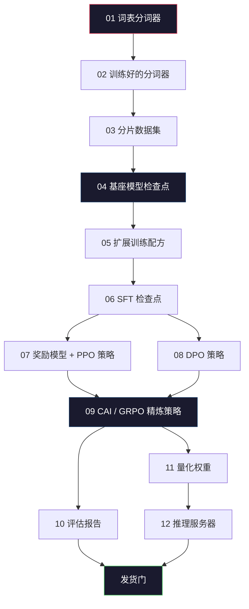
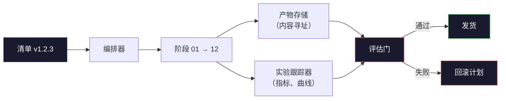

# 构建完整的 LLM 流水线（Building a Complete LLM Pipeline）

> 第 01 到 12 课的全部内容，只是某条流水线中的一个阶段。本课是把那些阶段变成一次端到端运行的脚手架：分词、预训练、扩展、SFT、对齐、评估、量化、服务。你不会在笔记本上训练 70B 模型。你会产出编排层、清单（manifest）、评估门（eval gate）和回滚计划——2026 年前沿团队用它们决定什么能发货。这是顶点课。

**Type:** Build
**Languages:** Python (stdlib)
**Prerequisites:** All Phase 10 lessons 01-12
**Time:** ~120 minutes

## 学习目标（Learning Objectives）

- 把前面十一课（分词器、数据、预训练、扩展、SFT、RLHF、DPO、CAI、评估、量化、推理）编排成一份单一可复现的流水线规格
- 定义阶段之间的产物契约：每个阶段消费什么、产出什么，以及下一阶段如何验证输入
- 构建一个编排器（orchestrator），跟踪实验、对产物做哈希，并用评估阈值门控发货决策
- 设计回滚计划：哪些产物重跑便宜、哪些昂贵，以及损坏的检查点要付出什么代价

## 问题（The Problem）

前面每一课各自都能跑。分词器训练好了。微型 GPT 预训练好了。SFT 数据集组装好了。奖励模型训练好了。DPO 跑完了。评估测完了。量化权重导出了。推理服务器转起来了。每一课都是一份 notebook。每一课都有自己的约定、自己的输出路径、自己的种子。

前沿训练运行不是 notebook。Llama 3 405B 大约用了 3000 万 H100 小时、约 54 天。DeepSeek-V3 用了大约 280 万 H800 小时。这段时间里，一个损坏的检查点、一次数据污染、一次评估回退，就能让团队损失一周墙钟时间和一个月的 GPU 预算。团队活下来的方式是流水线卫生：每个阶段都有确定性输入、确定性输出、一份清单、一个哈希，以及一扇门。

这是顶点课。你不会在笔记本上端到端跑这条流水线。你会写协调各阶段的编排器、描述这次运行的清单、门控发货决策的校验器，以及让第三方从单个文件重跑你工作的回放计划。代码很小；纪律很大。

这个模式从 1 亿到 1 万亿参数形状不变。同样四个组件——清单、编排器、评估门、产物存储——既跑 Llama 3，也跑你的爱好 GPT。差别是每个阶段配置里数字的大小，不是流水线的形状。

## 概念（The Concept）

### 十二个阶段（The Twelve Stages）

第 10 阶段的每一课都是一个阶段。下面是完整依赖图。



阶段 07 和 08 可以并行。其余都是硬依赖。阶段 02（分词器）的改动会使下游每一个产物失效。阶段 10（评估）的改动只会使发货决策失效。

### 清单（The Manifest）

清单是单个文件，把一次运行描述到足以回放。流水线产出的任何东西都不应依赖清单之外的状态。字段乏味且强制。

```
pipeline_version: 1.2.3
seed: 42
git_commit: a1b2c3d4
stages:
  01_tokenizer:
    recipe: bpe_32k
    input_hash: sha256:...
    output_hash: sha256:...
    wall_clock_sec: 3600
    cost_usd: 12
```

阶段 N 的输出哈希就是阶段 N+1 的输入哈希。任何偏差，流水线就停。这就是你尽早抓住数据损坏的方式。也是另一个大洲的同事验证他们的回放产出了与你相同产物的方式。

实践中团队用一份小 YAML schema，外加一个对照上一次成功运行做 diff 的清单检查器。任何落在预期字段（成本、墙钟时间）之外的差值都是红旗。

### 产物分型（Artifact Typing）

每个阶段的输出都是有类型的产物。不是目录大杂烩，不是 pickle，而是带已知 schema 的命名类型。

| 阶段 | 产物类型 | 关键字段 |
|-------|--------------|-----------|
| 01-02 | Tokenizer | vocab.json、merges.txt、config.json、hash |
| 03 | Dataset | shards[]、行数、token 数、去重统计 |
| 04-05 | Checkpoint | weights.safetensors、config.json、优化器状态、步数 |
| 06 | SFT Model | 检查点 + SFT 配方 + 数据配比 |
| 07 | Reward Model | RM 检查点 + 偏好数据哈希 |
| 08-09 | Policy | 检查点 + 参考哈希 + beta + 已消耗的 KL 预算 |
| 10 | Eval Report | 基准分数 + 回退差值 + 评估数据哈希 |
| 11 | Quantized Model | 量化权重 + 校准数据 + 相对 FP16 的精度差值 |
| 12 | Server Spec | 端点 + 模型哈希 + 配置 + 可观测性钩子 |

分型挡住最常见的失败模式：把阶段 08 的输出当阶段 06 的输入，把 DPO 训练过的模型沿 SFT 路径发出去。有类型的产物和有类型的阶段签名，让这些错误变成编译期失败，而不是第五天的失败。

### 评估门（The Eval Gate）

发货不是“训练结束”。发货是“训练结束并且评估门通过”。门在运行开始之前就定义好。

```
gates:
  mmlu:      >= baseline + 0.5   # no regression
  humaneval: >= baseline + 1.0
  truthfulqa: >= baseline         # no drop
  safety_refusal_rate: <= 0.05
  kl_from_reference: <= 25.0
  cost_total_usd: <= 50000
```

每一扇门都是数值阈值。没有“看起来不错”的门。没有主观签字。若每扇门都通过，产物被标记为可发货。若任何一扇失败，运行被挂起，等待具名审阅者的显式覆盖，覆盖本身也记入清单。

两扇门抓住大多数灾难。*回退*门（新模型在核心基准上必须至少不差于上一版）抓住训练 bug。*KL 预算*门（对齐后的策略相对参考的漂移不得超过 X）抓住对齐过火。每一条生产流水线都有这两扇。

### 编排器（The Orchestrator）

一小段代码读取清单、调度阶段、跟踪产物，并在任何契约违反时停下。这不是 Airflow。这不是 Kubeflow。为了流水线卫生，你要的是你自己写的、乏味的东西。

编排器的职责很窄：

1. 从清单解析 DAG。
2. 对每个阶段，检查期望输出是否已以正确哈希存在（若是则跳过）。
3. 运行该阶段，捕获 stdout/stderr，测量墙钟时间和成本。
4. 用下游阶段期望的输入哈希校验输出哈希。
5. 失败时写出带精确失败阶段的部分清单，并以非零退出码退出。

那是 200 行 Python。它看起来会像本课的 `code/main.py`。底层，真正的流水线用 `torchrun` 或 `ray` 在集群上执行各个阶段，但编排器本身跑在单机上。

### 实验跟踪与产物存储（Experiment Tracking and Artifact Storage）

两套外部系统锚定流水线。

**实验跟踪器（wandb、neptune、mlflow）。** 按阶段记录损失曲线、评估指标、系统遥测。三周后你要比较运行 A 和运行 B 时，就去跟踪器。团队几乎总是为此用托管跟踪器——自己写会把本该花在训练上的时间输掉。

**产物存储（S3、R2、GCS）。** 用于检查点、数据集、分词器、评估报告的不可变对象存储。产物按哈希寻址，不按文件名。像 `latest.pt` 这样的文件名是踩雷器；`ckpt-7b-step-20000-sha256:abc123.safetensors` 才是契约。

编排器同时写两边。跟踪器给看图表的人。产物存储给查找输入的下一阶段。

### 成本核算（Costing）

一次前沿运行挂着一个美元数字。预算纪律发生在两处。

**运行前估计。** 从清单计算期望 FLOPs（预训练：6 × 参数 × token）、期望 GPU 小时（FLOPs / 峰值吞吐 / 利用率），以及按当前租用费率的美元成本。若估计超过预算门，流水线拒绝启动。

**运行中跟踪。** 逐阶段墙钟时间和成本记入清单。每个阶段之后检查剩余预算。若某阶段超支，下一阶段的门用新的剩余预算评估。你不会在 VC 打电话时才发现没钱了。

Llama 3 报告成本 6100 万美元。DeepSeek-V3 报告主预训练运行 560 万美元。比例主要来自硬件效率加上混合专家——但具体成本可见，是因为两个团队按阶段而不是按整次运行跟踪。

### 可复现 vs 确定性（Reproducibility vs Determinism）

这两件事不是一回事。*可复现（Reproducible）* 意味着同一份清单加上同一份代码加上同一套基础设施，产出下游指标等价的检查点。*确定性（Deterministic）* 意味着比特级相同的输出。

现代 LLM 训练可复现但不确定。分布式训练的 reduce 顺序、GPU 内核非确定性（cuBLAS、flash-attn），以及混合精度舍入，合在一起让两次运行的浮点在 1e-5 级别不同。这对最终指标没问题，指标不会动。但若你想用比特级 diff 调试，这就致命。解药是记录每个阶段的输入哈希、输出哈希和头条指标——若这些匹配，这次运行就算“被复现”，即便权重不是比特相同。



### 回滚计划（Rollback Plan）

运行开始之前，写下每个阶段失败时会发生什么。三类。

- **重跑便宜**（小时级）：分词器、评估、量化、推理服务器。直接重跑。
- **中等**（天级）：SFT、DPO、CAI。保留基座模型；只重跑对齐阶段。
- **昂贵**（数周和数百万美元）：预训练。这里的回滚计划不是“重跑”。而是“用最后一个好检查点，用修订后的数据重跑更便宜的下游阶段。”

因为阶段依赖有类型且有哈希，编排器可以自动计算回滚集合：使失败阶段及其每一个后代失效。阶段 06（SFT）失败会使 06、07、08、09、10、11、12 失效。阶段 11（量化）失败只会使 11 和 12 失效。事先命名这些，避免团队凌晨四点精疲力尽时即兴发挥。

### 2026 年观察到的生产配方（Production Recipes Observed in 2026）

大多数前沿团队收敛到同一骨架。

- 分词器：128k BPE，带字节回退。在一小份均衡的多语言切片上训练。
- 预训练：10–20T token，主要是网页加代码加合成。Muon 或 AdamW 优化器。FSDP2 或 DeepSpeed ZeRO-3。梯度检查点。BF16 权重，FP32 master。
- SFT：50 万到 200 万指令对，人类与合成混合，相对评估集严格去重。
- 对齐：DPO 或 CAI + GRPO。只有偏好信号对 DPO 来说维度太多时才用 RLHF。
- 评估：MMLU-Pro、MATH、HumanEval+、GPQA、SWE-Bench Verified、LiveBench，外加一份公众永远看不到的私有留出集。
- 量化：服务用 4-bit GPTQ 或 AWQ；精度差值要紧的安全评估用 8-bit。
- 服务：vLLM、TensorRT-LLM，或自研。连续批处理。投机解码。KV 缓存驱逐。

数字每六个月变一次。骨架不变。

```figure
beam-search
```

## 动手实现（Build It）

本课代码是编排器和清单检查器，不是十二份训练脚本。每个阶段用占位符模拟，产出形状和哈希正确的输出产物。端到端跑编排器，证明流水线管道在你把 GPU 钱烧到真实阶段之前是通的。

完整实现见 `code/main.py`。关键零件：

- `Manifest` 数据类：流水线版本、种子、git commit、阶段、门。
- `Stage` 数据类：名称、类型、输入（哈希）、输出（哈希）、墙钟时间、成本。
- `Orchestrator.run()`：解析 DAG、调度阶段、校验哈希、更新清单。
- `EvalGate.check()`：读取阈值，与最新评估报告比较，返回通过/失败。
- `ArtifactStore`（内存桩）：按哈希 put/get，模拟 S3。
- `CostTracker`：按阶段和累计，超过上限时停下。

`main.py` 中的流水线跑十二个占位阶段，产出一份清单，并演练一次失败的评估门，展示被挂起的运行长什么样。把每个占位符换成对应课程的真实训练脚本，你就有了真正前沿流水线使用的骨架。

## 实际应用（Use It）

典范工作流有三条命令。

```
python code/main.py plan    # validate manifest, compute cost estimate, print DAG
python code/main.py run     # execute stages, writing to manifest.out.yaml
python code/main.py gate    # read manifest.out.yaml, apply eval gates, ship-or-hold
```

每次都先跑 `plan`。大多数流水线 bug 在 plan 时就现身——缺失的门阈值、过期哈希、预算超支。跑 `plan` 免费。跑 `run` 昂贵。在便宜的一侧抓住 bug 来省钱。

`gate` 的输出要么是 `SHIP`，要么是 `HOLD: <reason>`。被挂起的运行不是失败；它是一个决策点。具名审阅者要么覆盖（覆盖被记录），要么批准回滚。

## 交付产物（Ship It）

本课产出 `outputs/skill-llm-pipeline-reviewer.md`。喂给它一份拟议的流水线清单，它检查全部契约：阶段分型、哈希链、门、回滚计划、成本估计。对缺失评估门、无界 KL 预算，或把评估数据与训练数据混在一起的运行，它拒绝批准。

## 练习（Exercises）

1. 扩展编排器以支持阶段 07 和 08 的并行执行。使用 stdlib `concurrent.futures` 模块。确认最终清单记录两个阶段的输出，并且阶段 09 的输入哈希是两者的确定性组合。

2. 加一扇“污染检查”门。给定评估数据集哈希和训练数据分片，计算重叠（精确字符串匹配或 13-gram 匹配）。重叠超过 0.1% 则门失败。喂一份被污染的训练集，确认门会挂起这次运行。

3. 从第一性原理实现成本估计器。对阶段 04（预训练），把 FLOPs 估计为 6 × 参数 × token，假设 H100 上 BF16 峰值 989 TFLOPs、40% MFU（模型 FLOPs 利用率），每 GPU 小时 2.50 美元。报告在 2T token 上训练 7B 模型的估计。与已发表的 Llama 2 数字比较。

4. 构建部分回滚。模拟阶段 09（CAI）失败，然后重跑阶段 09 到 12，同时让 01–08 保持缓存。编排器应按哈希检测到缓存产物并跳过它们。测量相对完整重跑节省的墙钟时间。

5. 加入可观测性。为每个阶段发出 OpenTelemetry span，属性包括参数、见到的 token、损失和成本。把 span 接到本地收集器。重点不是仪表盘；重点是每个阶段的健康都能从单个 trace ID 追溯。

## 关键术语（Key Terms）

| 术语 | 人们怎么说 | 实际含义 |
|------|----------------|----------------------|
| Manifest | “配方文件” | 描述流水线版本、种子、逐阶段配置和门阈值的 YAML 或 JSON——足以回放一次运行 |
| Content-addressed | “按哈希不按名字” | 产物按内容的 SHA-256 存储，因此你永远不会把版本 A 和版本 B 搞混 |
| Eval gate | “发货标准” | 基准指标和安全分数上的数值阈值，必须通过才能把产物标为可发货 |
| KL budget | “对齐漂了多远” | 对齐阶段累计 KL(policy || reference) 的上限，作为一扇门强制执行 |
| MFU | “GPU 你用了多少” | 模型 FLOPs 利用率——实际达成的 FLOPs 除以理论峰值。70B 规模上 40% 典型，7B 上 55% |
| Rollback plan | “坏了我们怎么办” | 每个阶段失败时预先写好的动作集：重跑、回退、用修订输入再训 |
| Orchestrator | “指挥” | 读取清单、调度阶段、校验哈希、在任何契约违反时停下的进程 |
| Artifact store | “权重用的版本化 S3” | 不可变的内容寻址对象存储——检查点、数据集、评估报告的单一事实来源 |
| Reproducible | “回放时指标相同” | 比特级权重不同但下游指标等价——分布式 LLM 训练的现实目标 |
| Cost gate | “你不能超过 X” | 运行前成本估计加上运行中跟踪器——估计超过预算则流水线拒绝启动 |

## 延伸阅读（Further Reading）

- [Dubey et al., 2024 -- "The Llama 3 Herd of Models"](https://arxiv.org/abs/2407.21783) -- 最详细的公开前沿流水线描述，包括数据、训练、对齐、评估
- [DeepSeek-AI, 2024 -- "DeepSeek-V3 Technical Report"](https://arxiv.org/abs/2412.19437) -- 效率优先的流水线，成本大约是 Llama 3 级训练的 1/10
- [Kaplan et al., 2020 -- "Scaling Laws for Neural Language Models"](https://arxiv.org/abs/2001.08361) -- 原始的计算-数据-参数扩展关系
- [Hoffmann et al., 2022 -- "Training Compute-Optimal Large Language Models (Chinchilla)"](https://arxiv.org/abs/2203.15556) -- 对 Kaplan 的修正，重新标定了现代数据预算
- [PyTorch FSDP2 documentation](https://pytorch.org/docs/stable/fsdp.html) -- 在 PyTorch 2.4+ 中替代 FSDP1 的分布式训练原语
- [Weights & Biases LLM Reports](https://wandb.ai/site/llms) -- 开源 LLM 运行的真实清单和实验跟踪器输出，可用作可借鉴模板
