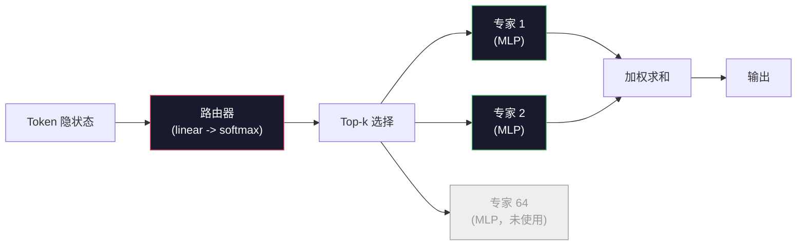

# 开放模型：架构逐项对照（Open Models: Architecture Walkthroughs）

> 你在第 04 课从零搭出了 GPT-2 Small。2026 年的前沿开放模型仍是同一家族，只是改了五六处具体设计。RMSNorm 取代 LayerNorm。SwiGLU 取代 GELU。RoPE 取代可学习位置编码。GQA 或 MLA 取代完整 MHA。大规模时再上混合专家（Mixture-of-Experts）。你已经掌握的数学覆盖了其中 95%。本课把 Llama 3、DeepSeek-V3、Mixtral、Qwen 和 Gemma 并排放在一起读，并标出每个架构真正分叉的那一行。

**Type:** Learn
**Languages:** Python (stdlib)
**Prerequisites:** Phase 10, Lessons 04, 05, 12 (Pre-training, Scaling, Inference)
**Time:** ~45 minutes

## 学习目标（Learning Objectives）

- 读懂 Llama 3、Mistral、Mixtral、Gemma 2、Qwen 2.5 和 DeepSeek-V3 的 config.json，并能解释每一个字段
- 指出每个模型相对 GPT-2 Small 做了哪一项具体架构改动，并从第一性原理说明理由
- 仅凭一份配置，计算任意开放模型的参数量、KV 缓存（KV cache）大小和激活内存
- 在延迟、内存和能力约束下，为部署目标选出合适的开放模型

## 问题（The Problem）

第 04 课里你写了 350 行 numpy，就得到了一个 GPT-2 形状的模型。Llama 3 405B 有一份 200 页的技术报告。直觉会告诉你：这是完全不同的物种。其实不是。那 200 页描述的是同一个对象，外加五六处动机充分的修改，以及一千条关于扩展规模的实现细节。骨架——嵌入（embedding）、Transformer 块、注意力（attention）、MLP、归一化（norm）、输出头（head）——没有变。

本课是一份 diff。对每个主要开放模型家族，我们精确列出相对 GPT-2 改了什么、为什么改、代价是什么。读完之后，你拿到一份新的模型卡片，就能在脑子里把它翻译回 GPT-2 基线。

实际收益是：当 Meta 发布 Llama 5，或 DeepSeek 发布 V4 时，你不需要重建一套心智模型。你会看配置、看出哪些众所周知的旋钮动了，并知道下游意味着什么。2026 年的架构是一个有限工具箱。每个新模型只是挑了不同的子集。

## 概念（The Concept）

### 不变的核心（The Invariant Core）

所有自回归开放模型都共享：

- Token 嵌入矩阵（vocab_size × hidden_dim）。
- N 个解码器块的堆叠：归一化、自注意力、残差、归一化、MLP、残差。
- 最终归一化，以及投影到 vocab_size 的线性头（常常与嵌入权重绑定）。
- 因果掩码（causal mask），以及下一 token 的交叉熵损失。

这就是形状。其余都是旋钮。

### 真正会动的六只旋钮（The Six Knobs That Actually Move）

纵观 2024–2026 每一个前沿开放模型，同样的六项设计选择被反复挑选：

1. **归一化（Normalization）。** LayerNorm → RMSNorm。
2. **位置编码（Positional encoding）。** 可学习绝对位置 → RoPE（以及变体：YaRN、NTK）。
3. **激活函数（Activation）。** GELU → SwiGLU（或 GeGLU）。
4. **注意力头共享（Attention head sharing）。** MHA → GQA → MQA → MLA。
5. **稠密 vs 稀疏 MLP（Dense vs sparse MLP）。** 稠密 → 混合专家（Mixture-of-Experts）。
6. **预归一化放置（Pre-norm placement）。** 预归一化留下。后归一化消失。

其余一切（学习率日程、数据配比、批次大小、上下文长度）属于训练配置，不属于架构。六只旋钮。

### 旋钮 1：RMSNorm（Knob 1: RMSNorm）

LayerNorm 减均值、除标准差、再缩放、再平移。RMSNorm 只保留缩放：

```
RMSNorm(x) = x / sqrt(mean(x^2) + eps) * gamma
```

没有减均值。没有偏置。每个 token 少一次矩阵乘。Zhang 与 Sennrich（2019）论证它在机器翻译上与 LayerNorm 相当，同时快约 10%。每一个现代开放模型都在用它。

代价：无。收益：小幅吞吐提升，代码更简单。

### 旋钮 2：RoPE（Knob 2: RoPE）

可学习位置嵌入在 GPT-2 里是一张 1024 槽的查找表。上下文到 1025 就越出表外。模型无法外推到训练长度之外。

旋转位置编码（Rotary Position Embedding, RoPE，Su et al. 2021）在注意力点积之前，成对旋转每个 Q 和 K 向量来注入位置。旋转角是位置的确定性函数，因此没有可学习参数，也没有“用完”的问题。配合缩放技巧（NTK-aware interpolation、YaRN），在 8k 上下文上训练的模型可以在推理时拉伸到 128k，精度损失可控。

```
q_rotated = rotate(q, angle(pos))
k_rotated = rotate(k, angle(pos))
score = q_rotated . k_rotated
```

每一个 Llama、Mistral、Qwen、DeepSeek 和 Gemma 都使用 RoPE。Gemma 2 使用混合方案（多数层用 RoPE，其余层用局部滑动窗口注意力）。

### 旋钮 3：SwiGLU（Knob 3: SwiGLU）

GPT-2 的 MLP 是 `x -> gelu(xW1 + b1) -> (...)W2 + b2`。SwiGLU（Shazeer 2020）把激活换成门控乘积：

```
SwiGLU(x) = (xW1) * sigmoid(xW1) * xV
```

两条并行投影代替一条，由 Swish 激活门控。经验上，单位参数的困惑度更强。Llama 2 采用后，所有人跟上。MLP 隐层尺寸通常设成让总参数量与原来的稠密 MLP 相当：若 GPT-2 用 `ff_dim = 4 * hidden`，SwiGLU 则用 `ff_dim = (2/3) * 4 * hidden = 8/3 * hidden`。

### 旋钮 4：注意力头共享（Knob 4: Attention Head Sharing）

GPT-2 使用**多头注意力（Multi-Head Attention, MHA）**：每个头都有自己的 Q、K、V 投影。

**多查询注意力（Multi-Query Attention, MQA，Shazeer 2019）**在所有头之间共享一组 K 和一组 V。KV 缓存按 num_heads 倍削减，典型模型上是 12× 到 32×。困难基准上精度略降。

**分组查询注意力（Grouped-Query Attention, GQA，Ainslie et al. 2023）**是中间方案：G 组 Q 头共享一组 K 和一组 V。Llama 3 8B 使用 GQA，32 个 Q 头、8 个 KV 头（G=8），因此相对完整 MHA，KV 缓存缩小 4×。

**多头潜在注意力（Multi-Head Latent Attention, MLA，DeepSeek 2024）**把 K 和 V 压缩进共享的低秩潜在表示，再按头上投影回去。进一步缩小 KV 缓存，同时保留每头表达力。DeepSeek-V2 和 V3 靠它支撑长上下文表现。

| 方案 | KV 头数 | KV 缓存 | 精度 |
|--------|----------|----------|----------|
| MHA    | num_heads | 完整 | 最好 |
| GQA    | num_groups（G < num_heads） | 缩小 num_heads / G | 接近 MHA |
| MQA    | 1 | 缩小 num_heads 倍 | 小幅损失 |
| MLA    | 潜在，按头解压 | 比 MQA 更小 | 接近 MHA |

对任何大约 13B 以上的模型，GQA 或 MLA 实际上是强制项。大规模完整 MHA 是 KV 缓存灾难。

### 旋钮 5：混合专家（Knob 5: Mixture of Experts）

稠密 MLP 对每个 token 激活全部参数。MoE MLP 每个块有 K 个专家，路由器为每个 token 选出 top-k 个专家（通常 top-2）。只有这些专家的权重对该 token 做前向。

```
router_logits = xW_r
indices, weights = top_k(router_logits, k=2)
output = sum_i weights[i] * expert[indices[i]](x)
```

吸引力在于：你可以有 64 个各 7B 的专家（总参数量巨大），但每个 token 只跑其中 2 个（因此每 token 计算量相当于稠密 7B 模型）。Mixtral 8x7B 总参数 47B，但每 token 只激活 13B。DeepSeek-V3 总参数 671B，但每 token 只激活 37B。



优点：同样的计算量、更多参数、更大容量。缺点：专家内存仍然得住在某处（所以服务所需 VRAM 比同等稠密模型更多）、路由器负载均衡很难，对齐阶段微调路由器本身就是一块研究领域。

### 旋钮 6：预归一化留下（Knob 6: Pre-norm stays）

原始 Transformer 在每个子层之后做层归一化。自 GPT-2 以来的每个开放模型都把它放在每个子层*之前*。预归一化在深度上严格更容易训练。没什么可争的。

### 逐模型对照（Model-by-Model Diff）

下面这张表把上述全部落到具体数字上。

| 模型 | 年份 | 总参数 | 激活参数 | 归一化 | 激活 | 位置 | 注意力 | MoE | 上下文 |
|-------|------|-------------|---------------|------|-----------|----------|-----------|-----|---------|
| GPT-2 Small | 2019 | 124M | 124M | LayerNorm | GELU | Learned | MHA（12 heads） | 否 | 1k |
| Llama 3 8B | 2024 | 8B | 8B | RMSNorm | SwiGLU | RoPE | GQA（32/8） | 否 | 128k |
| Llama 3 70B | 2024 | 70B | 70B | RMSNorm | SwiGLU | RoPE | GQA（64/8） | 否 | 128k |
| Llama 3 405B | 2024 | 405B | 405B | RMSNorm | SwiGLU | RoPE | GQA（128/16） | 否 | 128k |
| Mistral 7B | 2023 | 7.2B | 7.2B | RMSNorm | SwiGLU | RoPE | GQA | 否 | 32k |
| Mixtral 8x7B | 2023 | 47B | 13B | RMSNorm | SwiGLU | RoPE | GQA | 是（8 专家，top-2） | 32k |
| Gemma 2 9B | 2024 | 9B | 9B | RMSNorm（pre+post） | GeGLU | RoPE + sliding | GQA | 否 | 8k |
| Qwen 2.5 72B | 2024 | 72B | 72B | RMSNorm | SwiGLU | RoPE（YaRN） | GQA（64/8） | 否 | 128k |
| DeepSeek V2 236B | 2024 | 236B | 21B | RMSNorm | SwiGLU | RoPE | MLA | 是（160 专家，top-6） | 128k |
| DeepSeek V3 | 2024 | 671B | 37B | RMSNorm | SwiGLU | RoPE | MLA | 是（256 专家，top-8） | 128k |

扫一遍各列。RMSNorm 是普遍的。SwiGLU 或其表亲 GeGLU 是普遍的。RoPE 是普遍的。7B 以上 GQA 是普遍的，除非被 MLA 替换。MoE 是顶端的差异化因素。

### 读一份 config.json（Reading a config.json）

Llama 3 8B 配置：

```
{
  "hidden_size": 4096,
  "intermediate_size": 14336,
  "num_hidden_layers": 32,
  "num_attention_heads": 32,
  "num_key_value_heads": 8,
  "max_position_embeddings": 131072,
  "rope_theta": 500000.0,
  "rms_norm_eps": 1e-5,
  "vocab_size": 128256
}
```

每个字段都对应你已经实现过的东西。

- `hidden_size`：嵌入维度。
- `intermediate_size`：MLP 隐层尺寸（3.5× hidden——SwiGLU 的算术）。
- `num_hidden_layers`：堆叠深度。
- `num_attention_heads`：Q 头数。
- `num_key_value_heads`：KV 头数（GQA）。
- `max_position_embeddings`：训练上下文长度。
- `rope_theta`：RoPE 基频。Meta 把它从默认的 10k 放大到 500k，以便长上下文外推。
- `rms_norm_eps`：数值稳定性。
- `vocab_size`：词表大小。

仅凭这些，你就能计算总参数量、KV 缓存和峰值激活内存。精确公式见 `code/main.py`。

### 激活内存预算（Activation memory budget）

在几十亿参数以上，激活主导训练内存。预训练的经验法则（带梯度检查点）：

```
activation_mem ~ batch_size * seq_len * hidden_size * num_layers * bytes_per_element
```

Llama 3 8B，batch 1、seq 8192、BF16、32 层、hidden 4096：带检查点大约只要 8 GB 激活，不带则 40 GB。这就是 flash-attention 和 ring-attention 重要的原因——它们改写注意力计算，好让激活装得下。

### KV 缓存预算（KV Cache budget）

推理时在最大上下文下：

```
kv_cache = 2 * num_layers * num_kv_heads * head_dim * max_seq_len * bytes_per_element
```

Llama 3 8B 在 128k 上下文、BF16、head_dim = hidden / num_heads = 128：
`2 * 32 * 8 * 128 * 131072 * 2 = 17.2 GB` 每个序列。

8B 权重在 BF16 下是 16 GB。单条 128k 序列的 KV 缓存比权重大。这就是驱动 GQA、MLA 和 KV 缓存量化研究的内存压力。

### 每个模型何时胜出（When Each Model Wins）

- **单张 80GB GPU，不要 MoE**：Llama 3 8B、Mistral 7B、Gemma 2 9B。容易服务，工具链广。
- **单节点（8×80GB），大容量**：Llama 3 70B、Qwen 2.5 72B。最高的稠密开放能力。
- **最大开放能力，接受 MoE 复杂度**：DeepSeek V3、Mixtral 8x22B。单位激活 FLOP 能力最好。
- **长上下文需求**：Llama 3（带 RoPE 缩放的 128k）、DeepSeek（MLA 优势）。
- **低延迟服务**：Gemma 2 9B（滑动窗口削减长上下文计算）。

```figure
rmsnorm-vs-layernorm
```

## 动手实现（Build It）

本课代码是一台计算器。给定任意 config.json，它按组件打印参数量、最大上下文下的 KV 缓存、SwiGLU MLP 比例，以及一段简短的架构结论（dense / GQA / MLA / MoE）。

```python
config = {
    "hidden_size": 4096, "intermediate_size": 14336,
    "num_hidden_layers": 32, "num_attention_heads": 32,
    "num_key_value_heads": 8, "vocab_size": 128256,
    "max_position_embeddings": 131072,
}
```

脚本逐字段走一遍架构，计算嵌入、注意力（含 GQA 缩减）、MLP（含 SwiGLU 扩展）、层归一化和输出头的参数量。然后在给定上下文长度下计算 KV 缓存并打印摘要。

实现见 `code/main.py`。

## 实际应用（Use It）

对脚本中打包的 Llama 3 8B、Mistral 7B、Mixtral 8x7B 和 DeepSeek V3 配置运行计算器。比较参数分解。注意 MoE 模型的总参数量远超稠密模型，但激活参数量往往更小。注意 DeepSeek V3 的 KV 缓存比 Llama 3 405B 更小，尽管总参数更多——那就是 MLA 在起作用。

然后把你本地任意模型的配置塞进去，读摘要，判断它是否装得进你的 GPU。

## 交付产物（Ship It）

本课产出 `outputs/skill-open-model-picker.md`。给定部署目标（GPU 类型、VRAM、上下文长度、延迟预算）和任务画像（对话、代码、推理、长上下文），它会推荐一个开放模型、第 11 课的一种量化方案，以及第 12 课的一套推理栈，并就六只架构旋钮给出明确推理。

## 练习（Exercises）

1. 从 HuggingFace 读取 Qwen 2.5 72B 配置。从零计算总参数量。与 HF 报告值比较，并指出任何差值来自何处（头维取整、KV 共享因子等）。

2. DeepSeek V3 使用 256 个专家、top-8 路由。计算激活专家与总专家的比例，并与 Mixtral 8x7B 的 8 选 top-2 比较。从稀疏（25%）转向更稀的稀疏（3%）对单位 FLOP 容量意味着什么？

3. 计算 Llama 3 405B 在 128k 上下文下 FP8 与 BF16 的 KV 缓存。FP8 是 BF16 数字的一半。在单台 8×H100 节点上（每卡 80GB = 共 640GB，减去权重内存）你能并行服务多少条序列？

4. Gemma 2 交替使用全注意力层和滑动窗口注意力层。写出一半层使用 4096 token 滑动窗口而非全上下文时的 KV 缓存公式。在 8k 总上下文下能省多少内存？

5. 找一个本课写成之后发布的近期前沿开放模型。指出它选了六只旋钮中的哪些，以及是否引入了第七只。新架构一出，课程就会显得过时——目标是更新你的表格，而不是重建心智模型。

## 关键术语（Key Terms）

| 术语 | 人们怎么说 | 实际含义 |
|------|----------------|----------------------|
| RMSNorm | “没有均值的 LayerNorm” | 只按均方根归一化，再乘可学习缩放——更便宜，且与 LayerNorm 相当 |
| RoPE | “旋转位置” | 按依赖于位置的角度，把每个 Q、K 向量在二维对中旋转——配合缩放技巧可外推到训练长度之外 |
| SwiGLU | “新的 MLP 激活” | 带 Swish 的门控线性单元：`(xW1) * sigmoid(xW1) * xV`——2024 年后每个开放模型的标准 |
| GQA | “中间地带注意力” | 分组查询注意力：G 组 Q 头共享一组 K 和一组 V——缩小 KV 缓存，又没有 MQA 的精度损失 |
| MLA | “DeepSeek 的注意力” | 多头潜在注意力：把 K/V 压进共享低秩潜在，再按头解压——大模型上最小的 KV 缓存 |
| MoE | “稀疏专家” | 混合专家：每块 N 个 MLP，路由器为每个 token 选 top-k——总参数巨大，激活参数很小 |
| Top-k routing | “每个 token 选 k 个专家” | 路由器为每个专家打分并激活最高的 k 个——典型 k 是 2（Mixtral）到 8（DeepSeek） |
| YaRN | “拉伸 RoPE” | Yet another RoPE extension——插值旋转角，在推理时把上下文从 8k 扩到 128k+ |
| Sliding-window attention | “不要对所有东西做注意力” | 每个 token 只对最近 W 个 token 做注意力——把注意力代价封顶在每 token O(W)，用于 Gemma 2 和早期 Mistral |
| Active params | “每个 token 真正跑起来的” | 对 MoE 模型，每个 token 前向真正看到的参数量（远小于总参数）——决定每 token FLOPs |

## 延伸阅读（Further Reading）

- [Dubey et al., 2024 -- "The Llama 3 Herd of Models"](https://arxiv.org/abs/2407.21783) -- 稠密 Llama 3 家族的架构与训练参考
- [DeepSeek-AI, 2024 -- "DeepSeek-V3 Technical Report"](https://arxiv.org/abs/2412.19437) -- MLA 加上无辅助损失负载均衡，再加上 671B MoE
- [Jiang et al., 2024 -- "Mixtral of Experts"](https://arxiv.org/abs/2401.04088) -- 典范的 MoE 开放模型论文
- [Su et al., 2021 -- "RoFormer: Enhanced Transformer with Rotary Position Embedding"](https://arxiv.org/abs/2104.09864) -- RoPE 论文
- [Shazeer, 2020 -- "GLU Variants Improve Transformer"](https://arxiv.org/abs/2002.05202) -- SwiGLU、GeGLU 及其亲族
- [Ainslie et al., 2023 -- "GQA: Training Generalized Multi-Query Transformer Models"](https://arxiv.org/abs/2305.13245) -- GQA 论文
- [Gemma 2 Team, 2024 -- "Gemma 2: Improving Open Language Models at a Practical Size"](https://arxiv.org/abs/2408.00118) -- 混合全注意力+滑动注意力，预归一化+后归一化
- [Qwen Team, 2024 -- "Qwen 2.5 Technical Report"](https://arxiv.org/abs/2412.15115) -- YaRN 上下文扩展与长上下文训练配方
